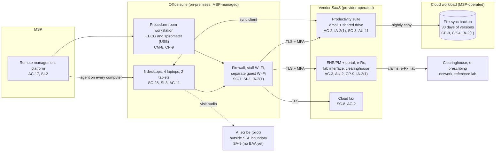

# Cloud Architecture and Control Placement: Cris Santos Company | Health Care | Micro

**Organization:** Cris Santos Company, LLC (primary care office, two physicians) | **Tier:** Micro | **Provider:** Vendor-agnostic SaaS (see section 3)
**System:** Office Clinical Platform (OCP), as defined in the SSP (P02) | **Prepared:** 2026-07-31 by the Office Manager with the MSP lead technician | **Approved:** owner physician, 2026-08-31

## 1. Diagram
The practice runs no servers and no IaaS tenant. Its "cloud" is a set of SaaS services plus one cloud workload that the MSP operates for it: the file-sync backup of the shared drive (SYS-05). The components come from the intake [asset inventory](../step-00_P00_intake/asset-inventory.csv) and [vendor register](../step-00_P00_intake/vendor-register.csv); the `evidence_source` column in `cloud-control-map.csv` cites the evidence ID behind each placement.

## 2. Layers and who is responsible
| Layer | Components | Key controls | Customer (practice) | MSP (on the practice's behalf) | Provider (SaaS vendor) |
|---|---|---|---|---|---|
| Identity | EHR, suite, fax, and backup accounts; firewall login | AC-2, IA-2(1), IA-5 | Decides who gets access; requests removal; enforces MFA settings | Creates and disables suite and device accounts; holds backup and firewall admin logins | Runs the sign-in and MFA service |
| Network | Firewall, Wi-Fi, internet line | SC-7, SI-2, AC-18 | Approves changes | Configures, patches, and monitors | Not applicable |
| Endpoints | 10 computers, 2 tablets, procedure-room workstation | SC-28, SI-3, SI-2, AC-11, CM-8 | Approves patch exclusions; keeps the inventory | Encryption, antivirus, patching, screen lock | Not applicable |
| SaaS applications | EHR/PM, suite, fax | AC-3, AC-12, AU-2, SC-8 | Users, roles, sharing settings, email encryption rule | Suite administration on request | Application, platform, data centers |
| Data | Chart data, shared drive, backup copies, local ECG results | CP-9, CP-4, SC-28 | Decides retention and restore testing; imports local results | Operates the backup and runs restore tests | Encrypts and backs up its own platform |
| Logging | EHR audit trail, suite logs, firewall logs | AU-2, AU-6, AU-11 | **Reviews logs monthly (gap today)** | Keeps firewall logs; forwards alerts | Generates and stores logs |
| Vendor governance | BAAs, SOC 2 review, MSP review | SA-9 | Signs BAAs; reviews SOC 2 and MSP evidence | Holds subcontractor BAAs (backup vendor) | Provides SOC 2 reports and BAAs |

**The MSP is not a cloud provider in the shared responsibility sense.** It performs customer-side duties for the practice. Anything marked "Customer (performed by MSP)" in `cloud-control-map.csv` remains the practice's responsibility under HIPAA. The practice must direct the work, receive evidence, and check it (164.308(b); SA-9).

## 3. Service categories and provider equivalents
The design is vendor-agnostic. The shared responsibility split for SaaS is the same in all three major cloud providers' models: the provider runs the application, platform, and infrastructure; the customer keeps identities, access, data, and devices (SRC-AWS-SRM, SRC-AZURE-SRM, SRC-GCP-SRM in `00_universal-framework/sources/source-register.csv`). For the practice's vendors, the SOC 2 report or vendor security documentation is the evidence of the provider side.

| Service category used | What it is here | Equivalent category in the large cloud providers (for reading their documentation) |
|---|---|---|
| Line-of-business SaaS | EHR/PM | Industry SaaS built on any provider |
| Productivity suite | Email, calendar, file storage, sync client | Productivity and collaboration SaaS |
| SaaS-to-SaaS backup | File-sync backup of the shared drive | Backup service or third-party SaaS backup |
| Cloud fax | Fax over the internet | Communications SaaS |
| Remote monitoring and management | MSP device management | Device management SaaS |

## 4. Findings from the mapping
1. **Sync is not backup (CP-9, CP-4).** The desktops sync the shared drive through the suite's client, and SYS-05 copies the shared drive every night. If ransomware encrypts a desktop's synced folder, the encrypted files sync to the suite and then to the backup. Only the 30 days of versions protect the practice, and nobody has tried a restore. Fix: 90-day versioning with immutable (write-once) retention, a restore test by 2026-09-30, and quarterly tests. Tracked as P01 R-005 and P07 POAM-003 and POAM-004.
2. **MSP-held administrator logins have no MFA (IA-2(1)).** The backup console and the firewall management login use passwords only. An attacker with one MSP password could delete the backups. Fix: MFA on both by 2026-09-30 (POAM-002).
3. **The MSP's reach is total (AC-17).** The remote management platform can run commands on every computer. The practice has no evidence of how the MSP protects it. Fix: annual MSP security review and contract terms (P01 R-013).
4. **Customer-side controls are the weak layer.** The SaaS vendors' side is strong and evidenced (SOC 2 for the EHR). The gaps are on the practice's side: account removal, log review, local data on desktops, and the email encryption habit.
5. **The AI scribe sits outside the boundary on purpose.** It is a pilot with no BAA yet. It is mapped here only to show the SA-9 gap. It enters the SSP boundary only after the P10 conditions are met.
