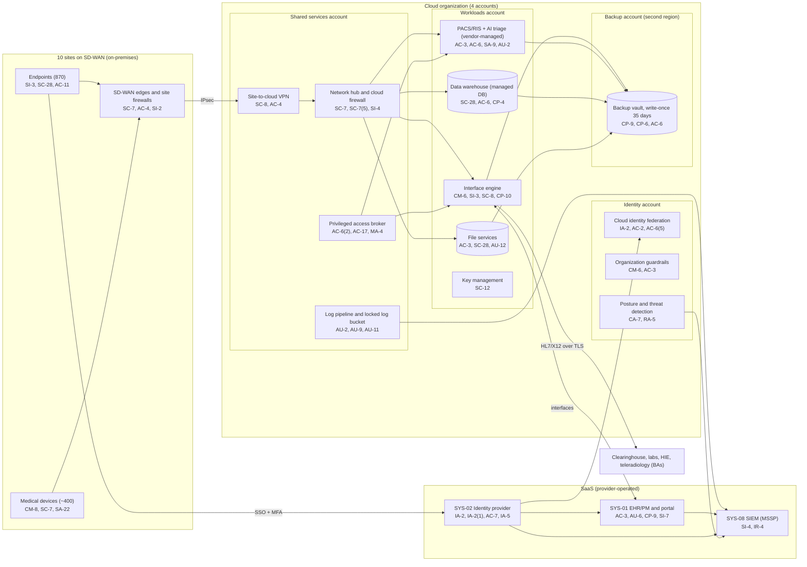

# Cloud Architecture and Control Placement: Cris Santos Company | Health Care | Mid-Market

**Organization:** Cris Santos Company, Inc. | **Tier:** Mid-Market | **Provider:** Vendor-agnostic public cloud (see section 4), plus SaaS
**System:** Enterprise Clinical Platform (ECP), as defined in the SSP (P02) | **Prepared:** 2026-07-31 by the Security Manager; updated 2026-09-15 with P07 results
**Control map:** `cloud-control-map.csv` (55 rows, 22 components)

## 1. Diagram

## 2. Landing zone design
The landing zone separates duties across 4 accounts (subscriptions or projects, depending on the provider) under one cloud organization. Each account limits the damage an attacker can do from any other.

| Account | Purpose | Who administers | Key design decisions |
|---|---|---|---|
| **Identity** | Organization root, cloud identity federation to SYS-02, organization guardrails, security tooling (posture management, threat detection) | Security Manager (2 people) | No workloads. Root credentials sealed. Guardrails apply to every other account and cannot be disabled from them |
| **Shared services** | Network hub, cloud firewall, site-to-cloud VPN, DNS, privileged access broker, patch service, log pipeline and locked log bucket | IT Director's infrastructure team | All traffic between sites, workloads, and the internet passes the hub. Logs from all accounts land in a write-once bucket here |
| **Workloads** | Interface engine, PACS/RIS with the AI triage module, data warehouse, file services, key management | Infrastructure team; PACS vendor for the PACS application | Separate subnets per workload. No internet ingress. Company-managed keys |
| **Backup** | Backup vault with 35-day write-once retention in a second region | 2 named backup administrators | Separate administrator credentials, not federated to everyday accounts. Backups are pulled by a cross-account role that can write but not delete |

## 3. Layers and shared responsibility per service
| Layer | Components | Key controls | Service model | Responsibility |
|---|---|---|---|---|
| Identity | Cloud federation, break-glass accounts, privileged access broker, SYS-02 | IA-2, IA-2(1), AC-2, AC-6(2), AC-6(5), AC-7, IA-5 | PaaS / SaaS | Customer configures identities, roles, MFA, and reviews; provider runs the identity services |
| Network | Hub, cloud firewall, VPN, DNS, SD-WAN edges | SC-7, SC-7(5), SC-8, AC-4, SC-20 | IaaS / PaaS | Customer designs routes, rules, and segmentation; provider runs the gateway and DNS services |
| Compute | Interface engine, PACS/RIS, AI triage module | CM-6, SI-2, SI-3, AU-12, CP-10 | IaaS | Customer (guest OS, applications, EDR); PACS vendor for the PACS application under contract; provider for hosts and hypervisor |
| Data | Object storage, managed database, file shares, keys, backups | SC-28, SC-12, CP-9, CP-6, CP-4, AC-3, AC-6 | IaaS / PaaS | Shared: provider encrypts and operates storage and the database engine; customer controls keys, access, retention, isolation, and restore testing |
| Logging and monitoring | Log pipeline, posture service, SIEM | AU-2, AU-9, AU-11, CA-7, RA-5, SI-4, IR-4 | PaaS / SaaS | Shared: provider generates logs and detections; customer enables, retains, forwards, and acts on them; MSSP monitors |
| SaaS applications | EHR/PM, identity provider, SIEM | AC-3, AU-6, CP-9, SI-7, AC-7, IA-5 | SaaS | Provider runs the application and infrastructure; customer keeps users, roles, audit review, and data |
| Physical | Provider data centers | PE-3, PE-13 | All | Provider (inherited, evidenced by SOC 2 reports) |

**Responsibility counts in `cloud-control-map.csv`:** 33 Customer, 16 Shared, 6 Provider. By service model: 25 IaaS, 22 PaaS, 8 SaaS rows. The customer side is always identity, data protection, and logging, as the three providers' shared responsibility models agree.

## 4. Service categories and provider equivalents
The design is independent of the provider. This table gives each provider's name for the service category, for reading its shared responsibility documentation (SRC-AWS-SRM, SRC-AZURE-SRM, SRC-GCP-SRM in `00_universal-framework/sources/source-register.csv`).

| Service category | AWS | Microsoft Azure | Google Cloud |
|---|---|---|---|
| Multi-account organization and guardrails | AWS Organizations, service control policies | Management groups, Azure Policy | Resource Manager folders, organization policies |
| Account, subscription, or project | Account | Subscription | Project |
| Cloud identity federation | IAM Identity Center | Microsoft Entra ID with Azure RBAC | Cloud Identity with IAM |
| Network hub | Transit Gateway | Virtual WAN hub or hub virtual network | Network Connectivity Center or shared VPC |
| Cloud firewall | AWS Network Firewall | Azure Firewall | Cloud NGFW |
| Site-to-cloud VPN | Site-to-Site VPN | VPN Gateway | Cloud VPN |
| Virtual machines | EC2 | Virtual Machines | Compute Engine |
| Object storage with write-once retention | S3 with Object Lock | Blob Storage with immutability policies | Cloud Storage with bucket lock |
| Managed database (warehouse) | Amazon Redshift or RDS | Azure Synapse or Azure SQL | BigQuery or Cloud SQL |
| Managed file shares | Amazon FSx | Azure Files | Filestore |
| Backup service | AWS Backup (vault lock) | Azure Backup (immutable vault) | Backup and DR Service |
| Key management | AWS KMS | Azure Key Vault | Cloud KMS |
| Audit logging | CloudTrail | Azure Monitor activity log | Cloud Audit Logs |
| Posture and threat detection | Security Hub, GuardDuty | Microsoft Defender for Cloud | Security Command Center |

**Service model split used here (all three providers agree):**
- **IaaS** (virtual machines, networks): the provider owns facilities, hosts, and virtualization. The customer owns the guest OS, applications, network configuration, identities, and data.
- **PaaS** (managed database, file shares, backup, key service): the provider also owns the platform software and its patching. The customer owns access, keys, data, and configuration.
- **SaaS** (EHR, identity provider, SIEM): the provider also owns the application. The customer keeps identities, roles, audit review, and data.

## 5. Findings from the mapping
1. **PACS is a hybrid island.** The PACS vendor manages the application inside the company's workloads account. The company owns the network, backups, and access, but the vendor held domain administrator service accounts (P07; P01 R-050) and uses its own remote tool (P01 R-038). Fix: move vendor support to the privileged access broker, and write the division of duties into the service agreement.
2. **Logging gaps sit in the workloads account.** The interface engine and PACS do not forward logs to the SIEM, and egress volume alerting is not configured (P01 R-002, R-036). Fix: onboard both, and add egress alerts on the cloud firewall by 2027-01-31.
3. **Recovery is designed but unproven.** Backups are isolated (separate account, second region, write-once, separate credentials), which is the strongest control in the environment. No restore has been tested for the interface engine, PACS, or data warehouse (EV-018, EV-024). Fix: quarterly restore tests into an isolated recovery network, starting with the interface engine on 2026-10-20.
4. **Configuration standards are missing** for guest operating systems (EV-023). Guardrails prevent the worst misconfigurations (public storage, unencrypted volumes), but hardening is undocumented.
5. **Boundary check.** Every in-scope component in the SSP (P02 section 9) appears in the diagram. Every cloud component has at least one row in the control map, and each account has controls from at least 2 of the AC, AU, CM, IA, SC, and SI families or inherits them.
6. **Inherited controls rely on SOC 2 reports.** Controls marked Provider or Shared for the EHR, identity provider, cloud provider, and MSSP depend on their SOC 2 Type 2 reports and complementary user entity controls, which are reviewed each year in P09 `vendor-soc2-review.csv`.
