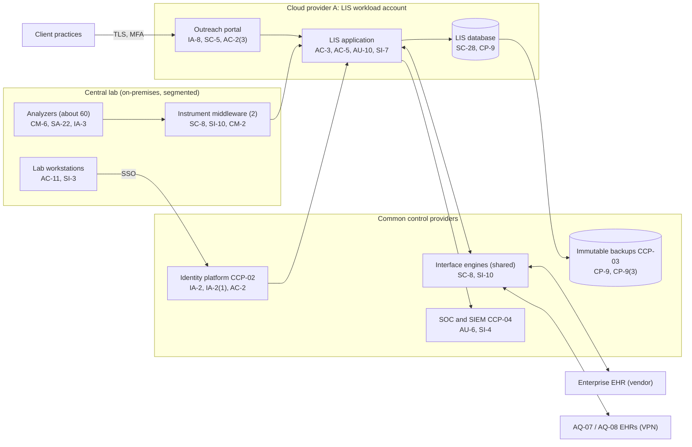

# System Security Plan: Laboratory Information System (LIS)

**Organization:** Cris Santos Company, Inc. (publicly traded multi-specialty medical group) | **Tier:** Enterprise | **Vertical:** Health Care and Social Assistance
**Outline:** NIST SP 800-18 Rev. 2, System Security Plan Outline Example (June 2026) | **Version:** 2.0, 2026-09-14

## 1. System Name and Identifier
Laboratory Information System (**LIS**), identifier CSC-SYS-LIS-001. Tier-1 system in the enterprise application inventory.

## 2. System Overview
The LIS supports the central CLIA-certified laboratory and the lab reference testing service line (SL-2). It receives orders from the enterprise EHR, the two acquired-practice EHRs (AQ-07 and AQ-08), and about 260 external client practices; manages specimen accessioning and tracking; receives results from about 60 analyzers through instrument middleware; applies autoverification, delta checks, and critical-value rules; and sends verified results to the EHRs, the outreach portal, and client interfaces. Volume is about 26,000 results per day.

**Why integrity matters most.** A wrong result, a result filed to the wrong patient, or a result silently changed after verification can cause direct patient harm. CLIA requires systems that ensure test results are accurately and reliably sent from the point of data entry to the final report destination (42 CFR 493.1291(a)) and prompt corrected reports when errors are found (493.1291(k)).

**Major components:**
- LIS application servers (commercial LIS software, customer-managed) on Cloud provider A virtual machines
- LIS database on the provider's managed relational database service
- Interface engines (enterprise integration platform, shared service) for HL7 v2 orders and results
- Lab outreach portal for client practices (web application behind the landing zone web application firewall)
- Instrument middleware servers (2) and about 60 analyzers on segmented VLANs at the central lab
- Lab workstations, label printers, and specimen scanners at the central lab and patient service centers

Users: about 520 workforce LIS accounts (lab staff, pathologists, client services) and about 3,100 client user accounts on the outreach portal. Providers view results in the EHR, not in the LIS.

## 3. Laws, Regulations, and Policies Affecting the System
| ID | Requirement | Citation | How it affects the LIS |
|---|---|---|---|
| N62-R01 | HIPAA Security Rule | 45 CFR Part 164, Subpart C | ePHI safeguards; integrity (164.312(c)(1)) is central |
| N62-R02 | HIPAA Privacy Rule | 45 CFR Part 164, Subpart E | Minimum necessary for client users; disclosures to ordering providers |
| N62-R03 | HIPAA Breach Notification Rule | 45 CFR 164.400-164.414 | Breach response for LIS and outreach portal data (P08) |
| N62-R04 | HIPAA Security Rule NPRM (proposed, not in force) | 90 FR 898 (2025-01-06) | Tracked only (P03 section 6) |
| N62-R05 | 42 CFR Part 2 | 42 CFR 2.16 | Lab results may be part of records received from Part 2 programs; handled under lawful-holder policies |
| CLIA | Clinical laboratory requirements | 42 CFR 493.1291 (test report); 493.1105 (retention) | Accurate and reliable result transmission; corrected reports; record retention |
| SEC | Cybersecurity disclosure | Form 8-K Item 1.05; 17 CFR 229.106 | A material LIS incident would go through the P08 materiality step |
| State | State breach notification laws | Each state where affected individuals reside (Florida worked example: Fla. Stat. 501.171) | Notification (P08) |
| Contract | Client agreements (SL-2); SOC 2 readiness | P09 | Client commitments on availability, confidentiality, processing integrity |
| Internal | POL-01 to POL-05 and standards | P06 | Enterprise policy hierarchy |

Not applicable: N62-R06 (FTC Health Breach Notification Rule; the group acts as a HIPAA covered entity for the LIS), N62-R07 (45 CFR 92.210 applies to patient care decision support tools; the LIS autoverification pilot AI-010 is tracked in P10), N62-R08 (CMS emergency preparedness applies to the ASCs, not the lab; the lab contingency plan coordinates with it), N62-R09 (social assistance).

## 4. System Status
### 4.1 System Security Plan Approval
Prepared by the LIS Application Manager and the GRC team. Reviewed by the CISO, the Laboratory Director, and the Vice President, Laboratory Services. Approved by the Chief Operating Officer on 2026-09-14.
### 4.2 System Authorization Decision
The group is not a federal agency, so there is no formal ATO. The equivalent internal decision:
- **Authorizing official equivalent:** Chief Operating Officer, with the CISO's recommendation.
- **Decision (2026-09-14):** continue operation with conditions, based on the Internal Audit assessment (P07) and the risk register (P01).
- **Conditions:** close the High POA&M items that affect result integrity (POAM-003 by 2026-12-15, POAM-006 by 2027-03-31); segment the acquired-practice networks that reach the interface engine (POAM-016 by 2027-01-31); rerun the DR test to prove the 4-hour RTO (POAM-011 by 2027-01-31).
- **Reauthorization:** annually, or after a major change (for example, the LIS version upgrade planned for 2027).
### 4.3 System Operational Status
Operational. Planned major modifications: autoverification change workflow (CM-3(1)) and LIS-to-EHR result reconciliation (SI-7(1)).

## 5. Role Identification and Responsible Personnel
| Role | Title | Responsibility |
|---|---|---|
| System owner | Vice President, Laboratory Services | Accountable for the LIS and SL-2; approves access roles |
| Authorizing official (equivalent) | Chief Operating Officer | Accepts residual risk to operate |
| CLIA laboratory director | Laboratory Director | Test validity, autoverification approval, corrected reports |
| System administrator | LIS Application Manager | Day-to-day administration, test build, change control |
| Information security | CISO; Director of Security Operations (HIPAA Security Officer) | Program oversight; SOC monitoring; incident response |
| Privacy | Chief Privacy Officer (HIPAA Privacy Officer) | Privacy Rule, breach determinations |
| Common control providers | See section 10.3 | Operate inherited controls |
| Independent assessor | Chief Audit Executive (Internal Audit) | Annual assessment (P07) |

## 6. System Information Types and System Categorization
Information types come from NIST SP 800-60 Vol. 2 Rev. 1. Impact levels follow FIPS 199.

| Information type | Confidentiality | Integrity | Availability | Rationale |
|---|---|---|---|---|
| Health care delivery services (lab orders, results, patient identifiers) | Moderate | **High (treated)** | Moderate | Disclosure harms patients and triggers breach duties. A wrong or altered result can cause direct patient harm, so integrity is treated at High. Manual downtime procedures keep critical work going, so availability stays Moderate (P05 BP-04: MTD 8 h, RTO 4 h) |
| Health care administration (billing codes, client accounts) | Moderate | Moderate | Low | Financial and client data; claims can queue (P05 BP-08) |
| Information security (audit logs, rule sets, credentials) | Moderate | Moderate | Moderate | Protects the evidence for result integrity |
| **LIS category** | **Moderate** | **Moderate baseline, integrity supplemented** | **Moderate** | See the decision below |

**Categorization decision.** Under a strict FIPS 199 high-water mark, a High integrity rating would make the whole system High. The group is not a federal agency and uses FIPS 199 as a model. The risk committee approved this tailoring on 2026-09-10:
- The LIS uses the **SP 800-53B Moderate baseline**.
- It adds **10 High-baseline controls** that protect result integrity: AU-9(3), AU-10, CM-3(1), CM-4(1), CM-5(1), CP-9(3), SI-6, SI-7(2), SI-7(5), SI-7(15).
- The decision is reviewed annually. If the result-integrity POA&M items (POAM-003, POAM-006, POAM-007) are not closed by 2027-06-30, the CISO will recommend full High categorization.

**Documented controls.** `control-implementation.csv` documents **138 controls**: 128 from the Moderate baseline and 10 High-baseline integrity supplements. The remaining Moderate-baseline enhancements (mostly control enhancements for AC, AU, CM, CP, IA, SC, and SI) are fully inherited from the common control catalog (section 10.3) and are listed there rather than repeated here. Privacy-baseline controls are documented in the enterprise privacy program.

## 7. Authorization Boundary Description
The boundary was drawn from the intake [asset inventory](../step-00_P00_intake/asset-inventory.csv) (SYS-03-LIS, SYS-03-OP, SYS-03-IE and SYS-05-MD) and the prior SSP version 1.1 (EV-074).

**Inside the boundary:** the LIS application servers and database in the LIS workload account (Cloud provider A), the outreach portal application, the LIS interfaces configured on the shared interface engines, the instrument middleware servers, the analyzer VLANs at the central lab, and lab workstations and printers.

**Outside the boundary (common control providers and interconnected systems):**
- Landing zone services (network hub, key management, log archive, backup accounts, standby region): CCP-03
- Identity platform (SYS-02): CCP-02
- SOC, SIEM, EDR, scanners: CCP-04
- Enterprise EHR (SYS-01), AQ-07 and AQ-08 EHRs, client EHRs, reference lab, courier tracking service

The enterprise multi-cloud diagram is in P04 `cloud-architecture.md`.

## 8. Information Exchanges Summary
| Connected system / party | Direction | Data | Agreement |
|---|---|---|---|
| Enterprise EHR (SYS-01) | Bidirectional (HL7 over TLS through interface engines) | Orders, results, patient demographics | EHR vendor BAA and interface specification |
| AQ-07 and AQ-08 EHRs | Bidirectional (HL7 over site VPN) | Orders, results | Legacy interface agreements (replaced at EHR migration) |
| External client practices (about 260) | Bidirectional (portal and HL7 interfaces) | Orders, results | Client agreements with interface and security terms |
| Reference laboratory (send-outs) | Bidirectional | Send-out orders and results | BAA and interface agreement |
| Courier and specimen tracking service | Inbound | Specimen manifests and tracking events | Contract; **no SOC report reviewed (POAM-015)** |
| LIS software vendor | Remote support (through PAM) | Troubleshooting access | BAA and support agreement |
| Analyzer vendors | Remote support | Instrument diagnostics | Service agreements; **remote tools outside PAM (POAM-004)** |
| Data warehouse (Cloud provider B) | Outbound nightly | De-identified and limited data sets for quality reporting | Internal data sharing agreement |

## 9. System Component Inventory
| Component | Type | Location / provider | Owner |
|---|---|---|---|
| LIS application servers (4) | IaaS virtual machines | Cloud provider A, primary region; standby in second region | LIS Application Manager |
| LIS database | Managed relational database (PaaS) | Cloud provider A | LIS Application Manager |
| Outreach portal | Web application on managed containers | Cloud provider A | Vice President, Laboratory Services |
| LIS interface channels | Configuration on shared interface engines | Cloud provider A (shared services account) | Integration team (CIO) |
| Instrument middleware servers (2) | On-premises servers | Central lab | LIS Application Manager |
| Analyzers (about 60 on 9 platforms) | Medical devices | Central lab | Director of Clinical Engineering |
| Analyzer workstations (14 on unsupported OS) | Vendor-supplied workstations | Central lab | Director of Clinical Engineering |
| Lab workstations (about 180), label printers, scanners | Endpoints | Central lab and patient service centers | Director of Endpoint Engineering |

## 10. Control Implementation Details
### 10.1 Control implementation status
See `control-implementation.csv` (138 controls).

| Status | Count |
|---|---|
| Implemented | 107 |
| Partially implemented | 27 |
| Planned | 4 |
| **Total** | **138** |

| Inheritance | Count |
|---|---|
| Common (fully inherited from a common control provider) | 75 |
| Hybrid (shared between a provider and the LIS team) | 31 |
| System-specific | 32 |

The Planned controls are High-baseline integrity supplements: CM-3(1), SI-6, SI-7(2), SI-7(5). Partially implemented controls: AC-2, AC-2(3), AC-5, AC-17, AU-6, CM-2, CM-3, CM-6, CM-8, CP-2, CP-10, IA-5, IA-8, IR-4, IR-8, MA-4, PS-4, RA-5, SA-9, SA-22, SC-7, SC-8, SI-2, SI-4, SI-7, SI-7(1), AU-10.

### 10.2 Control assessment status
Internal Audit assessed 44 of these controls from 2026-07-13 to 2026-08-28 using SP 800-53A Rev. 5 procedures and statistical sampling (P07 `assessment-plan.md`, `assessment-results.csv`). Weaknesses are in P07 `poam.csv`.

### 10.3 Common control providers and inheritance
Common and hybrid controls are inherited from the enterprise platform. Each provider publishes its controls in the enterprise **common control catalog** (maintained by the GRC team in the GRC platform) and is assessed on its own cycle; the LIS inherits the results.

| Provider | Name | Accountable role | Controls provided | Rows in this plan | Evidence of operation |
|---|---|---|---|---|---|
| CCP-01 | Enterprise GRC program | CISO (with the Chief Risk Officer and Chief Audit Executive for assessment) | Policies and standards (P06), risk methodology, assessment, POA&M, continuous monitoring | 25 | Annual Internal Audit assessment (P07); GRC platform |
| CCP-02 | Identity platform (SYS-02) | Director of Identity and Access Management | SSO, MFA, PAM, identity governance, account lifecycle | 18 | SOX IT general control testing; P07 AC-2, IA-2, IA-5 results |
| CCP-03 | Cloud landing zone (Cloud provider A) | Director of Cloud Platform Engineering | Account guardrails, network policies, key management, encryption, backups, log archive, standby region | 19 | Posture management reports; provider SOC 2 Type 2 (physical and hypervisor) |
| CCP-04 | Security operations | Director of Security Operations (HIPAA Security Officer) | 24x7 SOC, SIEM, EDR, vulnerability management, incident response, threat intelligence | 16 | SOC metrics; P07 SI-4, RA-5, IR results |
| CCP-05 | Enterprise network (SYS-04) | Director of Network Engineering | SD-WAN, site and data center segmentation, NAC, wireless, transport encryption | 5 | Network configuration reviews |
| CCP-06 | Endpoint engineering (SYS-05) | Director of Endpoint Engineering (with the Director of Clinical Engineering for devices) | Workstation baselines, EDR agents, patching, device control, unsupported component tracking | 5 | Configuration compliance and patch reports |
| CCP-07 | Facilities and physical security; colocation providers | Vice President, Facilities | Central lab physical access and environmental protection; colocation physical controls | 5 | Badge reviews; colocation SOC 2 reports |
| CCP-08 | Human resources and workforce training | Chief Human Resources Officer | Personnel screening, terminations, sanctions, training, acknowledgments | 8 | HR and learning system reports |
| CCP-09 | Third-party risk management | Director of Third-Party Risk Management | Vendor tiering, BAAs, SOC report reviews, supply chain risk management | 5 | Vendor register; SOC report reviews |

**Inheritance rules:**
- A Common control is fully inherited; the LIS team verifies only that the LIS is onboarded (for example, SSO integration and log forwarding).
- A Hybrid control names both parts in the implementation statement: the provider's part and the LIS team's part.
- If a provider's assessment finds a weakness, the finding is linked to every inheriting system's POA&M. Example: POAM-001 (acquired-practice terminations) is a CCP-02/CCP-08 weakness that affects the LIS because AQ staff hold order-entry access.

## 11. Digital Identity Acceptance Statement
- **Workforce users:** SSO with MFA (authenticator app with number matching, or a FIDO2 security key). Privileged users use phishing-resistant FIDO2 keys through PAM. This matches an authentication assurance level comparable to NIST SP 800-63 AAL2 for users and AAL3-like protection for privileged users.
- **Client users (outreach portal):** identity is vouched for by the client administrator under the client agreement. MFA (authenticator app) is required by policy; enforcement for all accounts is due with POAM-002 by 2026-12-31. Shared client logins are prohibited.
- **Patients** do not use the LIS directly. They see results through the patient-app platform (SL-1), which has its own identity controls (P09).

## 12. Referenced Artifacts
Scenario facts (`../00_company-facts.md`), intake evidence, inventories and obligations register ([step-00](../step-00_P00_intake/intake-report.md)), BIA (P05), multi-cloud architecture and control map (P04), enterprise risk register (P01), regulatory gap analysis (P03), policy hierarchy and policies (P06), Internal Audit assessment and POA&M (P07), ransomware runbook (P08), SOC 2 readiness for SL-2 (P09), AI portfolio including AI-010 autoverification pilot (P10), LIS contingency plan v4 (EV-054), LIS validation plan (EV-074), enterprise common control catalog (EV-069). The `evidence` column in `control-implementation.csv` cites the [evidence register](../step-00_P00_intake/evidence-register.csv) ID behind each statement.

## 13. Acronym List and Glossary
- **AO:** authorizing official
- **Autoverification:** rule-based release of results without technologist review when all rules pass
- **CCP:** common control provider
- **CLIA:** Clinical Laboratory Improvement Amendments (42 CFR Part 493)
- **HL7:** Health Level Seven messaging standard
- **LIS:** laboratory information system
- **MLLP:** minimal lower layer protocol (HL7 transport)
- **PAM:** privileged access management
- **POA&M:** plan of action and milestones
- **SL-2:** lab reference testing service line

## 14. System Security Plan Review and Change Records
| Version | Date | Change | Author |
|---|---|---|---|
| 1.0 | 2025-09-12 | Initial plan (Moderate baseline) | LIS Application Manager |
| 1.1 | 2026-02-20 | Added acquired-practice interfaces (AQ-07, AQ-08) | LIS Application Manager |
| 2.0 | 2026-09-14 | Integrity supplementation; common control provider mapping; 2026 assessment results | LIS Application Manager with GRC team |
