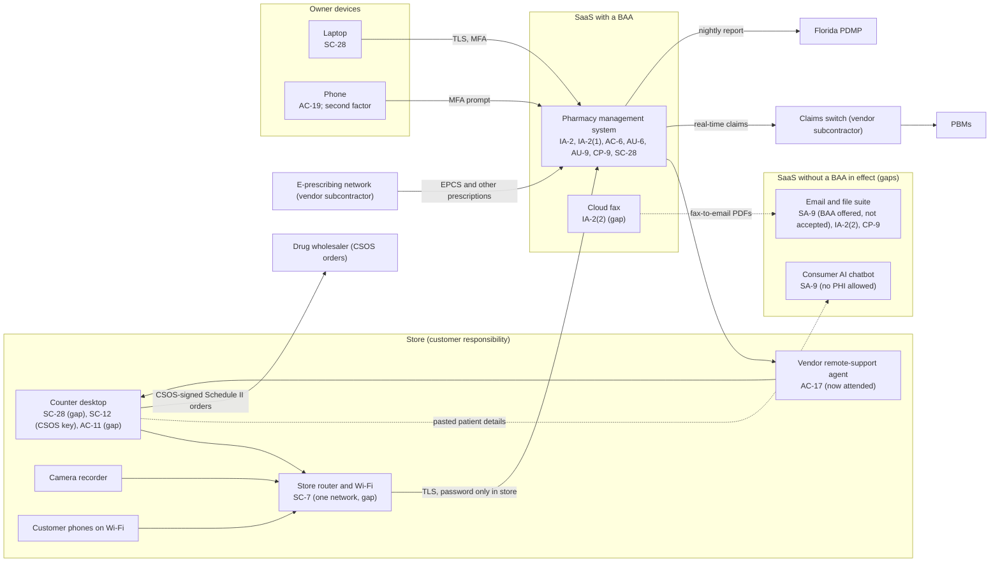

# SaaS Architecture and Control Placement: Cris Santos Company | Healthcare and Public Health | Sole Proprietorship

**Organization:** Cris Santos Company (independent community pharmacy) | **Tier:** Sole Proprietorship | **Provider:** SaaS only (no IaaS or PaaS)
**System:** Pharmacy Core SaaS Stack (PCSS), as defined in the system profile (P02) | **Prepared:** 2026-08-05 by the pharmacist-owner with the IT consultant | **Adopted:** 2026-09-04

## 1. Diagram
Control IDs on each node are the ones in `cloud-control-map.csv`. Dashed lines are flows without a BAA in effect.

## 2. Layers
| Layer | Components | Key controls | Responsibility |
|---|---|---|---|
| Identity | PMS accounts and roles, email account, fax portal account, vendor remote-support access | IA-2, IA-2(1), IA-2(2), AC-6, AC-17 | Customer configures; vendors provide MFA and roles |
| Data | PMS records, EPCS records, compounding records in the file suite, fax archive, desktop files | CP-9, SC-28, SA-9 | Vendor protects data inside its service; the customer decides where PHI goes and whether a BAA covers it |
| Endpoints | Counter desktop, laptop, phone, CSOS certificate | SC-28, SC-12, AC-11, AC-19 | Customer |
| Network | Store router and Wi-Fi | SC-7 | Customer (router supplied by the ISP) |
| Logging | PMS audit trail and daily EPCS audit report; email sign-in history | AU-9 (vendor), AU-6 (customer) | Shared: vendor records and analyzes daily, the pharmacy reads and decides |
| SaaS applications and hosting | PMS platform, e-prescribing network, claims switch, fax platform | Inherited (AC-3, AU-2, AU-9) | Provider |

## 3. Shared responsibility for SaaS
All three major cloud providers' shared responsibility models (SRC-AWS-SRM, SRC-AZURE-SRM, SRC-GCP-SRM) agree on the SaaS split: the provider runs the application, the platform, and the facilities; **the customer always keeps its identities and accounts, its data, and its devices.** That is why 14 of the 19 rows in the control map are the pharmacy's alone and 2 more are shared. A SOC 2 report or a BAA from a vendor never covers these layers. No IaaS provider equivalents table is needed, because the pharmacy runs no infrastructure.

The DEA EPCS rule draws the same line. The pharmacy application provider must have the application audited or certified (21 CFR 1311.300) and the application must analyze its audit trail every day (1311.215(b)). The **pharmacy** must check that finding before first use (1311.200(a)), set logical access so only authorized people can dispense and annotate controlled substance prescriptions (1311.200(e)), and decide whether each flagged event is a security incident that must be reported within one business day (1311.215(c)). Those three duties are customer rows in this map (IA-2, AC-6, AU-6).

## 4. Findings from the mapping
1. **The PMS treats the store as trusted.** MFA applies only outside the store, and inside the store one account is shared (EV-001, EV-002, EV-021). The control most needed for controlled substance records (one person, one account) is the customer's, not the vendor's. Tracked as P01 R-003 and R-007.
2. **The vendor's support channel is an inbound path into the store.** The remote-support agent allowed unattended access to the desktop that holds the CSOS key (EV-004, EV-014). Switched to attended mode on 2026-08-06; tracked with R-002.
3. **One email suite holds PHI without a BAA in effect.** Fax-to-email puts prescriptions in the inbox (EV-012, EV-013). Accepting the vendor's BAA is a few clicks (R-006).
4. **The cloud fax portal has MFA available but off.** Found during this mapping, from the fax portal settings collected at intake (EV-013); turn on by 2026-09-15.
5. **The vendor's RTO (12 hours) is longer than the BIA's RTO for dispensing (4 hours)** (EV-037). The pharmacy cannot buy a faster recovery from a SaaS vendor at this size; it bridges the gap with paper downtime procedures (P05, P08, R-001).
6. **The store network is flat.** Customers on Wi-Fi share a network with the desktop and the camera recorder (EV-016; R-004).
