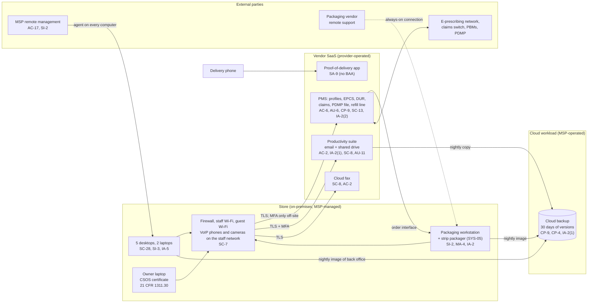

# Cloud Architecture and Control Placement: Cris Santos Company | Healthcare and Public Health | Micro

**Organization:** Cris Santos Company, LLC (independent community pharmacy) | **Tier:** Micro | **Provider:** Vendor-agnostic SaaS (see section 3)
**System:** Pharmacy Core SaaS Stack (PCSS), as defined in the SSP (P02) | **Prepared:** 2026-07-24 by the Store Manager with the MSP lead technician | **Approved:** pharmacist-owner, 2026-08-28

## 1. Diagram
The pharmacy runs no servers and no IaaS tenant. Its "cloud" is a set of SaaS services plus one cloud workload that the MSP operates for it: the cloud backup service (SYS-07).

## 2. Layers and who is responsible
| Layer | Components | Key controls | Customer (pharmacy) | MSP (on the pharmacy's behalf) | Provider (SaaS vendor) |
|---|---|---|---|---|---|
| Identity | PMS, suite, fax, delivery app, and backup accounts; local administrator accounts; the CSOS certificate | AC-2, AC-6, IA-2(1), IA-2(2), IA-5 | Decides who gets access and who may alter controlled substance records; requests removal; sets MFA; protects the CSOS key | Creates and disables suite and device accounts; holds the backup console and local administrator logins | Runs the sign-in and MFA service |
| Network | Firewall, Wi-Fi, internet line, VoIP, cameras | SC-7, AC-18 | Approves changes and segmentation | Configures, patches, and monitors | Not applicable |
| Endpoints | 5 desktops, 2 laptops, delivery phone, packaging workstation | SC-28, SI-3, SI-2, MA-4 | Approves patch exclusions and vendor access; keeps the inventory | Encryption, antivirus, patching, screen lock | Not applicable |
| SaaS applications | PMS, suite, fax, delivery app | AC-3, AC-12, AU-2, SC-8, SC-13 | Users, roles, timeouts, sharing and encryption settings | Suite administration on request | Application, platform, data centers; EPCS signing and audit trail |
| Data | PMS data, shared drive, backup copies, local pack history | CP-9, CP-4, SC-28 | Decides retention and restore testing | Operates the backup and runs restore tests | Encrypts and backs up its own platform |
| Logging | PMS audit trail and daily EPCS report, suite logs | AU-2, AU-6, AU-11 | **Reviews the EPCS report each business day and access reports monthly (gap today)** | Forwards alerts | Generates and stores logs |
| Vendor governance | BAAs, SOC 2 and EPCS audit review, MSP review | SA-9 | Signs BAAs; reviews SOC 2 and EPCS reports and MSP evidence | Holds subcontractor BAAs (backup vendor) | Provides SOC 2 and EPCS audit reports and BAAs |

**The MSP is not a cloud provider in the shared responsibility sense.** It performs customer-side duties for the pharmacy. Anything marked "Customer (performed by MSP)" in `cloud-control-map.csv` remains the pharmacy's responsibility under HIPAA. The pharmacy must direct the work, receive evidence, and check it (164.308(b); SA-9).

**DEA duties do not move to the vendor.** The PMS vendor must build and audit an application that meets 21 CFR 1311.205, but the pharmacy still decides who may alter controlled substance records (1311.200(e)), reviews the daily audit report, and reports security incidents within one business day (1311.215(c)). Those three rows are "Customer" in the map.

## 3. Service categories and provider equivalents
The design is vendor-agnostic. The shared responsibility split for SaaS is the same in all three major cloud providers' models: the provider runs the application, platform, and infrastructure; the customer keeps identities, access, data, and devices (SRC-AWS-SRM, SRC-AZURE-SRM, SRC-GCP-SRM in `00_universal-framework/sources/source-register.csv`). For the pharmacy's vendors, the SOC 2 report, the EPCS third-party audit report, or vendor security documentation is the evidence of the provider side.

| Service category used | What it is here | Equivalent category in the large cloud providers (for reading their documentation) |
|---|---|---|
| Line-of-business SaaS | PMS | Industry SaaS built on any provider |
| Productivity suite | Email, calendar, file storage, sync client | Productivity and collaboration SaaS |
| SaaS and endpoint backup | Cloud backup of the shared drive and two computers | Backup service or third-party SaaS backup |
| Cloud fax | Fax over the internet | Communications SaaS |
| Field service app | Proof of delivery | Mobile SaaS |
| Remote monitoring and management | MSP device management | Device management SaaS |

## 4. Findings from the mapping
1. **The packaging workstation is the weakest point on the store network (SI-2, MA-4, IA-2, SC-7).** It runs an unsupported operating system without patches or antivirus, uses one shared login, accepts an always-on vendor connection, and sits on the same network as the desktops. Fix: a separate network segment, vendor access on request with a log, a BAA with the equipment vendor, and a replacement controller on a supported system at the next equipment refresh. Tracked as P01 R-008 and P07 POAM-014.
2. **The daily EPCS report is generated and ignored (AU-6).** The application does its part; the pharmacy does not. Fix: pharmacist review each business day with a one-line log entry, from 2026-09 (POAM-004).
3. **Backups are untested and reachable with one password (CP-9, CP-4, IA-2(1)).** An attacker with the MSP backup password could delete the copies. Fix: MFA on the console, 90-day immutable versions, a restore test by 2026-09-30, and quarterly tests (POAM-007, POAM-008).
4. **In-store PMS sign-in has no second factor (IA-2(2)).** The vendor trusts the store network. Combined with the flat network and the shared local administrator password, one infected desktop would expose open PMS sessions. Fix: enable the vendor's in-store second-factor option (P01 R-003).
5. **Two vendors handle ePHI without a BAA (SA-9).** The proof-of-delivery app and the packaging equipment vendor. Fix: BAA or replacement by 2026-10-31 (POAM-010).
6. **The SYS-09 risk score sits inside the PMS but outside this map's control set.** It is assessed in P10.
