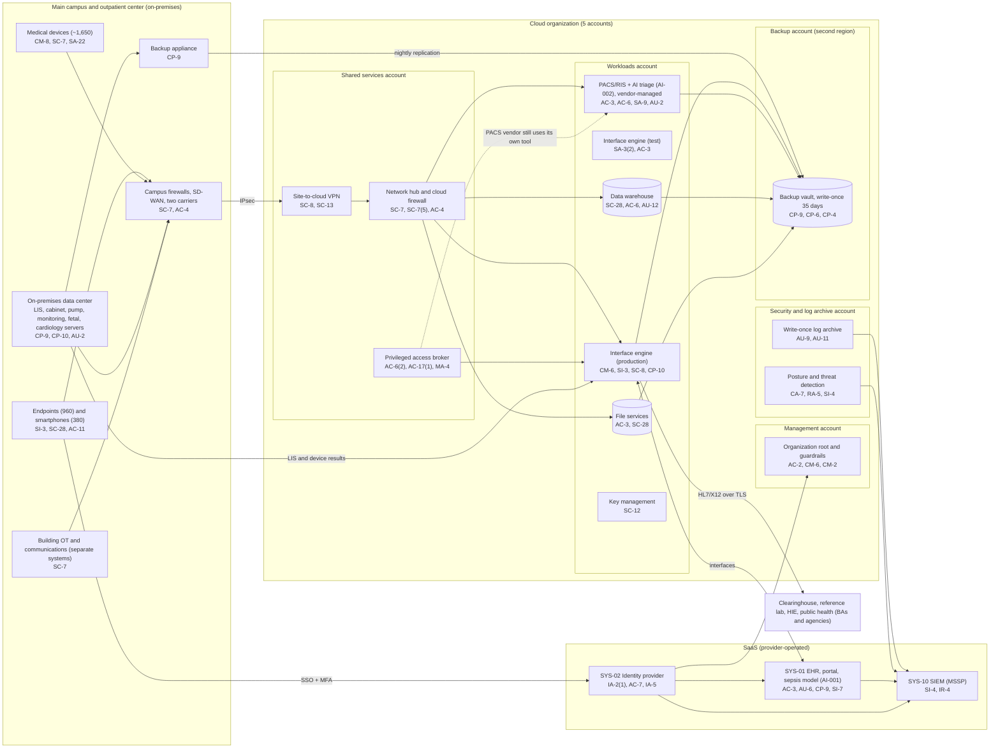

# Cloud Architecture and Control Placement: Cris Santos Company | Healthcare and Public Health | Mid-Market

**Organization:** Cris Santos Company, Inc. | **Tier:** Mid-Market | **Provider:** Vendor-agnostic public cloud (see section 4), plus SaaS
**System:** Hospital EHR and Clinical Systems (HECS), as defined in the SSP (P02) | **Prepared:** 2026-07-17 by the Information Security Manager; updated 2026-09-17 with P07 results
**Control map:** `cloud-control-map.csv` (60 rows, 19 components)

## 1. Diagram

## 2. Landing zone design
The landing zone separates duties across 5 accounts (subscriptions or projects, depending on the provider) under one cloud organization. Each account limits the damage an attacker can do from any other.

| Account | Purpose | Who administers | Key design decisions |
|---|---|---|---|
| **Management** | Organization root, guardrails, billing, account vending | Information Security Manager and vCISO only | No workloads. Root credentials sealed. Guardrails apply to every other account and cannot be disabled from them |
| **Security and log archive** | Posture management, threat detection, write-once log archive for all accounts | Information Security Manager and the 2 security analysts | Logs from every account land here; administrators of other accounts cannot delete them. Findings flow to the MSSP SIEM |
| **Shared services** | Network hub, cloud firewall, site-to-cloud VPN from the main campus and outpatient center, DNS, privileged access broker, patch service | IT Director's infrastructure team | All traffic between the campus, workloads, and the internet passes the hub |
| **Workloads** | Interface engine (production and test), PACS/RIS with the AI triage module, data warehouse, file services, key management | Infrastructure team; PACS vendor for the PACS application | Separate subnets per workload. No internet ingress. Hospital-managed keys |
| **Backup** | Backup vault with 35-day write-once retention in a second region; receives cloud backups and nightly replication from the campus backup appliance | 2 named backup administrators | Separate administrator credentials, not federated to everyday accounts. Cross-account role can write but not delete |

**What stays on campus.** The LIS, dispensing cabinet server, infusion pump server, monitoring gateway, fetal surveillance server, and cardiology system run in the on-premises data center because their manufacturers support them only on local servers next to the devices they control. They are not cloud components, but their recovery depends on the backup account, so they appear in the diagram and in the restore-test plan.

## 3. Layers and shared responsibility per service
| Layer | Components | Key controls | Service model | Responsibility |
|---|---|---|---|---|
| Identity | Organization root and break-glass accounts, privileged access broker, SYS-02 | AC-2, AC-6(2), AC-6(5), AC-17(1), MA-4, IA-2(1), IA-5, AC-7 | PaaS / IaaS / SaaS | Customer configures identities, roles, MFA, and reviews; provider runs the identity services |
| Network | Hub, cloud firewall, VPN, DNS | SC-7, SC-7(5), SC-8, SC-13, SC-20, AC-4, SI-4(4) | PaaS | Customer designs routes, rules, and segmentation; provider runs the gateway, firewall, and DNS services |
| Compute | Interface engine (production and test), PACS/RIS, AI triage module, patch service | CM-2, CM-3, CM-6, SI-2, SI-3, SI-10, SA-3(2), CP-10 | IaaS / PaaS | Customer (guest OS, applications, EDR); PACS vendor for the PACS application under contract; provider for hosts and hypervisor |
| Data | Object storage, managed database, file shares, keys, backups | SC-28, SC-12, CP-9, CP-6, CP-4, AC-3, AC-6, AU-12 | PaaS | Shared: provider encrypts and operates storage and engines; customer controls keys, access, retention, isolation, and restore testing |
| Logging and monitoring | Posture service, threat detection, log archive, SIEM | AU-2, AU-9, AU-11, CA-7, RA-5, SI-4, IR-4 | PaaS / SaaS | Shared: provider generates logs and detections; customer enables, retains, forwards, and acts on them; MSSP monitors |
| SaaS applications | EHR, identity provider, SIEM | AC-3, AU-6, CP-9, SI-7, CM-4, AC-7, IA-5 | SaaS | Provider runs the application and infrastructure; customer keeps users, roles, feature choices, audit review, and data |
| Physical | Provider data centers | PE-3, PE-13 | IaaS | Provider (inherited, evidenced by SOC 2 reports) |

**Responsibility counts in `cloud-control-map.csv`:** 32 Customer, 20 Shared, 8 Provider. By service model: 19 IaaS, 31 PaaS, 10 SaaS rows. As the three providers' shared responsibility models agree, the customer side is always identity, data protection, and logging.

## 4. Service categories and provider equivalents
The design is independent of the provider. This table gives each provider's name for the service category, for reading its shared responsibility documentation (SRC-AWS-SRM, SRC-AZURE-SRM, SRC-GCP-SRM in `00_universal-framework/sources/source-register.csv`).

| Service category | AWS | Microsoft Azure | Google Cloud |
|---|---|---|---|
| Multi-account organization and guardrails | AWS Organizations, service control policies | Management groups, Azure Policy | Resource Manager folders, organization policies |
| Account, subscription, or project | Account | Subscription | Project |
| Network hub | Transit Gateway | Virtual WAN hub or hub virtual network | Network Connectivity Center or shared VPC |
| Cloud firewall | AWS Network Firewall | Azure Firewall | Cloud NGFW |
| Site-to-cloud VPN | Site-to-Site VPN | VPN Gateway | Cloud VPN |
| Virtual machines | EC2 | Virtual Machines | Compute Engine |
| Object storage with write-once retention | S3 with Object Lock | Blob Storage with immutability policies | Cloud Storage with bucket lock |
| Managed database (warehouse) | Amazon Redshift or RDS | Azure Synapse or Azure SQL | BigQuery or Cloud SQL |
| Managed file shares | Amazon FSx | Azure Files | Filestore |
| Backup service | AWS Backup (vault lock) | Azure Backup (immutable vault) | Backup and DR Service |
| Key management | AWS KMS | Azure Key Vault | Cloud KMS |
| Audit logging | CloudTrail | Azure Monitor activity log | Cloud Audit Logs |
| Posture and threat detection | Security Hub, GuardDuty | Microsoft Defender for Cloud | Security Command Center |

**Service model split used here (all three providers agree):**
- **IaaS** (virtual machines): the provider owns facilities, hosts, and virtualization. The customer owns the guest OS, applications, network configuration, identities, and data.
- **PaaS** (managed database, file shares, backup, keys, firewall, VPN, posture services): the provider also owns the platform software and its patching. The customer owns access, keys, data, rules, and configuration.
- **SaaS** (EHR, identity provider, SIEM): the provider also owns the application. The customer keeps identities, roles, feature settings, audit review, and data.

## 5. Findings from the mapping
1. **PACS is a hybrid island.** The PACS vendor manages the application inside the hospital's workloads account, but it still reaches the servers with its own remote tool instead of the privileged access broker, and its service accounts held domain administrator rights on the campus directory (P07; P01 R-009, R-010). The vendor has no SOC 2 report. Fix: move vendor support to the broker, scope the service accounts, and write the division of duties and a SOC 2 requirement into the renewal.
2. **PHI in the test environment.** The interface engine test environment holds copies of production messages, and 2 vendor engineers can reach it (EV-025, EV-065; P01 R-031). Fix: synthetic or de-identified test data by 2026-12-31 (SA-3(2)).
3. **Logging stops at the workload.** Control-plane logs are complete and locked, but the interface engine, PACS, and data warehouse operating system and application logs do not reach the SIEM, and egress volume alerting is not configured (EV-022; P01 R-002, R-037). Fix: onboard them and add egress alerts by 2027-01-31.
4. **Recovery is designed but unproven.** The backup account is the strongest control in the environment (separate account, second region, write-once, separate credentials). But no application has been restored from it, and the on-premises clinical servers that depend on it have never been rebuilt (EV-021, EV-028). Fix: quarterly restore tests into an isolated recovery network, starting with the interface engine on 2026-10-20, then PACS, the LIS, and the dispensing cabinet server.
5. **The campus backup appliance is the weak link.** It is joined to the hospital directory, so a domain administrator compromise could delete local backups before replication (P01 R-004). The cloud copy survives because it is write-once. Fix: remove the appliance from the domain and give it separate credentials by 2026-12-31.
6. **Boundary check.** Every in-scope component in the SSP (P02 section 9) appears in the diagram. Every cloud component has at least one row in the control map, and each account has controls from at least 2 of the AC, AU, CM, IA, SC, and SI families or inherits them.
7. **Inherited controls rely on SOC 2 reports.** Controls marked Provider or Shared for the EHR, identity provider, cloud provider, and MSSP depend on their SOC 2 Type 2 reports and complementary user entity controls, which are reviewed each year in P09 `vendor-soc2-review.csv`.
