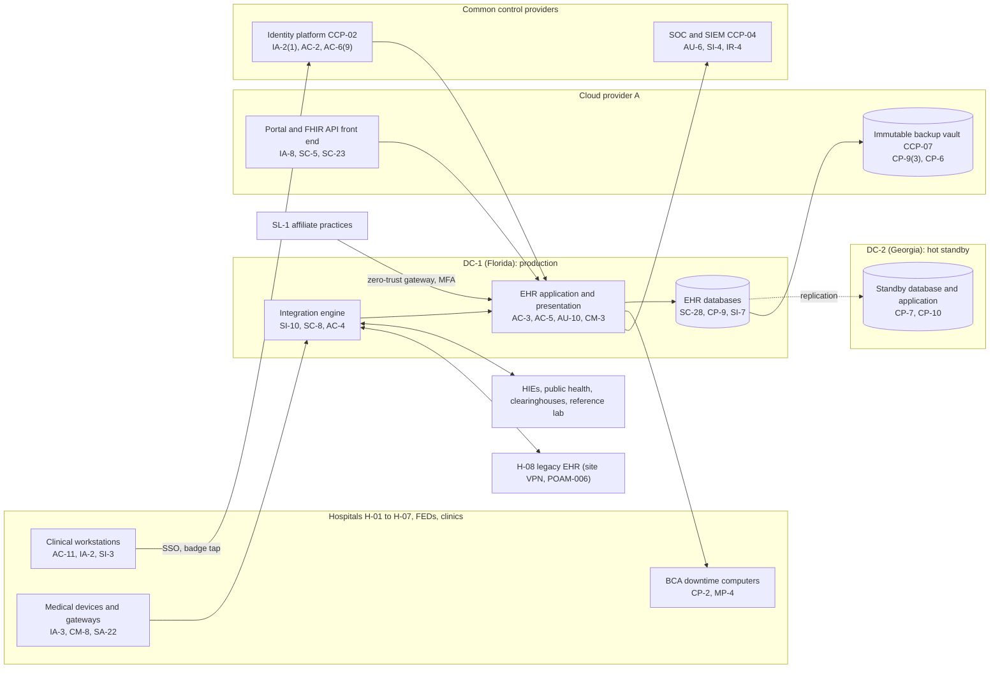

# System Security Plan: Enterprise Clinical Information System (ECIS)

**Organization:** Cris Santos Company, Inc. (publicly traded for-profit hospital system: 8 hospitals, 1,970 beds; FL, GA, AL) | **Tier:** Enterprise | **Vertical:** Healthcare and Public Health
**Outline:** NIST SP 800-18 Rev. 2, System Security Plan Outline Example (June 2026) | **Version:** 3.0, 2026-08-24

## 1. System Name and Identifier
Enterprise Clinical Information System (**ECIS**), identifier CSC-SYS-ECIS-001. Tier-1 system in the enterprise application inventory.

## 2. System Overview
The ECIS is the hospital system's instance of its commercial enterprise EHR (SYS-01) and the components that keep it running and connected. It supports emergency, inpatient, surgical, laboratory, pharmacy, radiology, physician group, and revenue cycle work at H-01 to H-07, the 3 freestanding emergency departments, and the 46 physician group clinics. It also hosts the SL-1 affiliate environment used by about 70 independent physician practices. It is the system the BIA ranked highest: 10 of the 14 High-criticality processes depend on it, and its RTO is 4 hours (P05).

**Why integrity and availability matter most.** A wrong or missing result, medication order, or allergy entry can harm a patient directly. CMS requires a system of author identification and record maintenance that ensures the integrity of authentication and protects the security of all record entries (42 CFR 482.24(b)), and hospital laboratories must send results accurately and reliably to the final report destination (42 CFR 493.1291(a)). When the EHR is down, the EDs may have to divert ambulances (P05 section 5), so availability is a patient safety and EMTALA issue as well as a business one.

**Major components:**
- EHR database servers (operational and reporting), application servers, and presentation (application delivery) servers in DC-1, with a hot standby in DC-2
- Integration engine cluster (about 640 interfaces: laboratory analyzers through middleware, pharmacy systems, PACS, HIEs, public health, clearinghouses, SL-1 practices, and the interim H-08 connection)
- Clinical device integration gateways that bring monitor, pump, and ventilator data into the EHR
- Business continuity access (BCA) downtime computers (about 900) with local printers on emergency power
- Patient portal and FHIR API front end on Cloud provider A (application servers behind the landing zone web application firewall)
- The configuration of the sepsis prediction model (SYS-15), a vendor feature inside the EHR
- About 21,000 workstations, workstations on wheels, and thin clients that run EHR sessions (managed by CCP-06)

**Users:** about 19,000 workforce users (employees, medical staff, agency and contracted staff, students), about 1,450 SL-1 affiliate users, and about 1.1 million active patient portal accounts.

## 3. Laws, Regulations, and Policies Affecting the System
| ID | Requirement | Citation | How it affects the ECIS |
|---|---|---|---|
| C-HPH-R01 | HIPAA Security Rule | 45 CFR Part 164, Subpart C | ePHI safeguards for the affiliated covered entity; also business associate duties for SL-1 practices |
| C-HPH-R02 | HIPAA Breach Notification Rule | 45 CFR 164.400-164.414 | Breach response for ECIS data (P08) |
| C-HPH-R03 | HIPAA Security Rule NPRM (proposed, not in force) | 90 FR 898 (2025-01-06) | Tracked only (P03 section 6) |
| C-HPH-R06 | 42 CFR Part 2 | 42 CFR 2.16 | H-03 Part 2 program records are stored in the ECIS; formal security policies (2.16(a)) and breach notice (2.16(b)) apply |
| C-HPH-R07 | CMS emergency preparedness | 42 CFR 482.15 (unified program under 482.15(f)) | Medical documentation in emergencies (482.15(b)(5)); sharing records for continuity of care (482.15(c)(4)) |
| CMS CoP | Medical record services | 42 CFR 482.24(b), (c) | Record integrity, confidentiality, authentication, and 5-year retention |
| EMTALA | Special responsibilities in emergency cases | 42 CFR 489.24 | Screening and stabilization continue in downtime; diversion only within 489.24(b); records sent with transfers (489.24(e)(2)(iii)) |
| CLIA | Test report requirements | 42 CFR 493.1291(a), (g), (k) | Accurate result transmission; critical values; corrected reports |
| Promoting Interoperability | Medicare program for eligible hospitals | 42 CFR 495.24(f) | Security risk analysis measure for the certified EHR (P01 supports the attestation) |
| Section 1557 | Patient care decision support tools | 45 CFR 92.210 | Applies to the sepsis model (SYS-15) and EHR clinical rules (P10) |
| SEC | Cybersecurity disclosure | Form 8-K Item 1.05; 17 CFR 229.106 | A material ECIS incident goes through the P08 materiality step |
| State | Breach notification laws | Each state where affected individuals reside (Florida worked example: Fla. Stat. 501.171) | Notification (P08) |
| Contract | SL-1 hosting agreements and BAAs | P09 | Availability and confidentiality commitments to affiliate practices |
| Internal | POL-01 to POL-05 and standards | P06 | Enterprise policy hierarchy |

Not applicable to the ECIS: C-HPH-R05 (FTC Health Breach Notification Rule; 16 CFR 318.1 excludes HIPAA covered entities and business associates acting as such). C-HPH-R04 (FDA 524B) binds device manufacturers; the system uses it in procurement of devices that connect to the ECIS. C-HPH-R08 to C-HPH-R10 are voluntary practices and the recognized security practices statute; the CPG benchmark is in P03. C-HPH-R11 (CIRCIA) is proposed only.

## 4. System Status
### 4.1 System Security Plan Approval
Prepared by the EHR Technical Director and the GRC team. Reviewed by the CISO, the Chief Medical Information Officer, the Chief Nursing Officer, and the Vice President, Clinical Applications. Approved by the Chief Operating Officer on 2026-08-24.
### 4.2 System Authorization Decision
The hospital system is not a federal agency, so there is no formal ATO. The equivalent internal decision:
- **Authorizing official equivalent:** Chief Operating Officer, on the CISO's recommendation.
- **Decision (2026-08-24):** continue operation with conditions, based on the Internal Audit assessment (P07) and the enterprise risk register (P01).
- **Conditions:** finish the isolated recovery environment and prove a cyber restore within 24 hours (POAM-003, by 2027-03-31); vault the remaining service accounts and rotate integration engine credentials (POAM-001, by 2026-12-31); restrict and then replace the H-08 site VPN path to the integration engine (POAM-006, by 2027-03-01); run a multi-hospital downtime and diversion exercise (POAM-004, by 2026-11-18).
- **Reauthorization:** annually, or after a major change (the H-08 migration on 2027-03-01 is a major change).
### 4.3 System Operational Status
Operational. Planned major modifications: H-08 conversion to the ECIS (2027-03-01); isolated recovery environment (2027-03-31); automated interface reconciliation (SI-7).

## 5. Role Identification and Responsible Personnel
| Role | Title | Responsibility |
|---|---|---|
| System owner | Vice President, Clinical Applications | Accountable for the ECIS; approves role templates with clinical leaders |
| Authorizing official (equivalent) | Chief Operating Officer | Accepts residual risk to operate |
| Clinical owners | Chief Medical Information Officer; Chief Nursing Officer | Clinical build, decision support, downtime procedures |
| System administrator | EHR Technical Director | Day-to-day technical administration, upgrades, recovery |
| Information security | CISO; Director of Security Operations (HIPAA Security Officer) | Program oversight; SOC monitoring; incident response |
| Privacy | Chief Privacy Officer (HIPAA Privacy Officer) | Access monitoring, Part 2 handling, breach determinations |
| Common control providers | See section 10.3 | Operate inherited controls |
| Independent assessor | Chief Audit Executive (Internal Audit) | Annual assessment (P07) |

## 6. System Information Types and System Categorization
Information types come from NIST SP 800-60 Vol. 2 Rev. 1. Impact levels follow FIPS 199, used as a model because the system is not a federal agency.

| Information type | Confidentiality | Integrity | Availability | Rationale |
|---|---|---|---|---|
| Health care delivery services (orders, results, medications, notes) | Moderate | **High** | **High** | Disclosure harms patients and triggers breach duties (Moderate). A wrong or altered entry can cause death or serious injury (High). Loss for more than the 8-hour MTD forces diversion and paper medication administration at every hospital (High; P05 BP-01, BP-02) |
| Health care administration (registration, coverage, claims) | Moderate | Moderate | Moderate | Claims can queue (P05 BP-10), but registration errors cause denials and wrong-patient risk |
| Substance use disorder records (H-03 Part 2 program) | Moderate | Moderate | Moderate | Unauthorized disclosure carries Part 2 restrictions; treated as Moderate with added access controls |
| Information security (audit logs, credentials, keys) | Moderate | High | Moderate | Protects the evidence for record integrity |
| **ECIS category** | **Moderate** | **High** | **High** | High-water mark: **High** |

**Baseline.** The ECIS uses the **SP 800-53B High baseline**. `control-implementation.csv` documents **212 controls**: all 188 base controls of the High baseline and 24 control enhancements selected because they carry the most risk for this system (account automation, MFA, backups, recovery, integrity checks). The remaining 158 High-baseline enhancements are fully inherited from the common control catalog (section 10.3) and are listed there rather than repeated here. Program management (PM) controls are documented once at the enterprise level, and privacy-baseline controls are documented in the enterprise privacy program (PL-11).

## 7. Authorization Boundary Description
**Inside the boundary:** EHR database, application, and presentation servers in DC-1 and DC-2; the integration engine cluster; clinical device integration gateways; BCA downtime computers; the portal and FHIR API front end in its Cloud provider A workload account; the SYS-15 configuration; and EHR configuration for the SL-1 affiliate environment.

**Outside the boundary (common control providers and interconnected systems):**
- Identity platform (CCP-02); SOC, SIEM, and EDR (CCP-04); network (CCP-05); endpoints and medical devices (CCP-06); cloud landing zones and backup vault (CCP-07); data center facilities (CCP-03)
- H-08 legacy EHR (SYS-13), PACS (SYS-08), ERP (SYS-09), tele-critical care platform (SYS-14), clearinghouses, HIEs, state health departments, reference laboratory, and SL-1 practice networks

The enterprise architecture diagram is in P04 `cloud-architecture.md`.

## 8. Information Exchanges Summary
| Connected system / party | Direction | Data | Agreement |
|---|---|---|---|
| H-08 legacy EHR (SYS-13) | Bidirectional (HL7 over site VPN) | Orders, results, transfers | Interim interconnection agreement until 2027-03-01 (POAM-006) |
| SL-1 affiliate practices (about 70) | Bidirectional (zero-trust gateway) | Full EHR use for their patients | Hosting agreements and BAAs (the system is their business associate) |
| Health information exchanges (3 states) | Bidirectional | Clinical documents | HIE participation agreements |
| State health departments | Outbound | Electronic laboratory, case, immunization, and syndromic reports | Public health reporting (permitted disclosure) |
| Primary and secondary clearinghouses | Bidirectional | Claims, eligibility, remittance | BAAs and service agreements |
| Reference laboratory | Bidirectional | Send-out orders and results | BAA and interface agreement |
| PACS (SYS-08) | Bidirectional | Orders, reports, image links | Internal interface agreement |
| Tele-critical care platform (SYS-14) | Bidirectional | Patient context for remote monitoring of system ICUs | Internal interface agreement |
| EHR vendor | Remote support (through PAM) | Troubleshooting access | Support agreement and BAA |
| Analyzer and device vendors | Remote support | Device diagnostics | Service agreements; **3 platforms outside PAM (POAM-011)** |
| Data and analytics platform (Cloud provider B) | Outbound nightly | Limited and de-identified data sets; model monitoring data | Internal data use agreement |

## 9. System Component Inventory
| Component | Type | Location / provider | Owner |
|---|---|---|---|
| EHR database servers (operational, reporting, standby) | Physical servers | DC-1; standby in DC-2 | EHR Technical Director |
| EHR application and presentation servers (about 60) | Virtual servers | DC-1; standby in DC-2 | EHR Technical Director |
| Integration engine cluster (4 nodes per site) | Virtual servers | DC-1 and DC-2 | Integration Services Manager |
| Clinical device integration gateways (16) | Vendor appliances and servers | DC-1 and hospital device networks | Director of Clinical Engineering |
| BCA downtime computers (about 900) and printers | Endpoints on emergency power | Every nursing unit and ED | EHR Technical Director |
| Portal and FHIR API front end | Managed containers and web application firewall | Cloud provider A workload account | Vice President, Digital Health |
| Sepsis model configuration (SYS-15) | Vendor feature settings | Inside the EHR | Chief Medical Information Officer |

## 10. Control Implementation Details
### 10.1 Control implementation status
See `control-implementation.csv` (212 controls).

| Status | Count |
|---|---|
| Implemented | 184 |
| Partially implemented | 26 |
| Planned | 2 |
| **Total** | **212** |

| Inheritance | Count |
|---|---|
| Common (fully inherited from a common control provider) | 130 |
| Hybrid (shared between a provider and the ECIS team) | 21 |
| System-specific | 61 |

Partially implemented controls: AC-2, AC-2(3), AC-17, AT-3, AU-6, CM-3, CM-8, CP-2, CP-4, CP-10, IA-5, IA-8, IR-8, MA-4, PS-4, PS-7, RA-5, SA-9, SA-17, SA-22, SC-4, SC-7, SI-2, SI-4, SI-7, SR-6. Planned controls: SR-9, SR-10.

### 10.2 Control assessment status
Internal Audit assessed 46 of these controls from 2026-06-22 to 2026-08-07 using SP 800-53A Rev. 5 procedures and statistical sampling (P07 `assessment-plan.md`, `assessment-results.csv`). Weaknesses are in P07 `poam.csv`.

### 10.3 Common control providers and inheritance
Common and hybrid controls are inherited from the enterprise platform. Each provider publishes its controls in the enterprise **common control catalog** (maintained by the GRC team in the GRC platform) and is assessed on its own cycle; the ECIS inherits the results.

| Provider | Name | Accountable role | Controls provided | Rows in this plan | Evidence of operation |
|---|---|---|---|---|---|
| CCP-01 | Enterprise GRC program | CISO (with the Chief Risk Officer, and the Chief Audit Executive for assessment) | Policies and standards (P06), risk method, assessment, POA&M, continuous monitoring, supply chain policy | 29 | Annual Internal Audit assessment (P07); GRC platform |
| CCP-02 | Identity platform (SYS-02) | Director of Identity and Access Management | SSO, badge-tap authentication, MFA, PAM, identity governance, account lifecycle | 17 | SOX IT general control testing; P07 AC-2, IA-2, IA-5 results |
| CCP-03 | Data center operations (DC-1, DC-2) | Director of Data Center Operations | Physical and environmental protection, alternate sites, maintenance, media handling | 26 | Colocation SOC 2 report for DC-2; DC-1 access reviews; generator tests |
| CCP-04 | Security operations | Director of Security Operations (HIPAA Security Officer) | 24x7 SOC, SIEM, EDR, vulnerability management, incident response, threat intelligence, penetration testing | 22 | SOC metrics; P07 SI-4, RA-5, IR results |
| CCP-05 | Enterprise network (SYS-05) | Director of Network Engineering | SD-WAN, segmentation, NAC, wireless, transport encryption, DNS, DDoS protection with CCP-07 | 12 | Network configuration reviews; P07 SC-7 test |
| CCP-06 | Endpoint and clinical engineering (SYS-06) | Director of Endpoint Engineering, with the Director of Clinical Engineering for medical devices | Endpoint baselines, patching, device control, medical device inventory and unsupported component tracking | 14 | Configuration compliance and patch reports |
| CCP-07 | Cloud landing zones (SYS-04) | Director of Cloud Platform Engineering | Immutable backup vault, key management, encryption services, log archive copy, portal edge protection | 8 | Posture management reports; cloud provider SOC 2 Type 2 reports |
| CCP-08 | Human resources and workforce training | Chief Human Resources Officer | Screening, terminations, sanctions, training, acknowledgments, agency staff terms | 13 | HR and learning system reports |
| CCP-09 | Third-party risk management | Director of Third-Party Risk Management | Vendor tiering, BAAs, contract security terms, SOC report reviews, supply chain risk management | 9 | Vendor register; SOC report reviews |
| CCP-10 | Facilities and physical security (hospitals) | Vice President, Facilities | Physical protection of clinical areas, BCA computer locations, display placement | 1 | Facility walkthroughs |

**Inheritance rules:**
- A Common control is fully inherited; the ECIS team verifies only that the ECIS is onboarded (for example, SSO integration and log forwarding).
- A Hybrid control names both parts in the implementation statement: the provider's part and the ECIS team's part.
- If a provider's assessment finds a weakness, the finding is linked to every inheriting system's POA&M. Example: POAM-002 (late removal of agency staff) is a CCP-08 weakness that affects the ECIS because agency nurses hold EHR access.

## 11. Digital Identity Acceptance Statement
- **Workforce users:** SSO with MFA for remote access and badge tap plus PIN on site; privileged users use phishing-resistant FIDO2 keys through PAM. Controlled substance prescribing uses the EHR's two-factor signing. This is comparable to NIST SP 800-63 AAL2 for users and AAL3-like protection for privileged users.
- **SL-1 affiliate users:** identity vouched for by the practice administrator under the hosting agreement; MFA required; shared logins prohibited (9 practices found sharing; POAM-015).
- **Patients:** portal accounts with identity verification at enrollment and MFA offered; MFA required for proxy access.

## 12. Referenced Artifacts
Scenario facts (`../00_company-facts.md`), BIA (P05), multi-cloud and data center architecture (P04), enterprise risk register (P01), regulatory gap analysis (P03), policy hierarchy and policies (P06), Internal Audit assessment and POA&M (P07), ransomware and diversion runbook (P08), SOC 2 readiness for SL-1 and SL-2 (P09), AI portfolio and sepsis model assessment (P10), ECIS contingency plan v6, enterprise common control catalog.

## 13. Acronym List and Glossary
- **BCA:** business continuity access (read-only downtime computers with recent patient reports)
- **CCP:** common control provider
- **ECIS:** Enterprise Clinical Information System
- **EMTALA:** Emergency Medical Treatment and Labor Act (42 CFR 489.24)
- **FHIR:** Fast Healthcare Interoperability Resources
- **MLLP:** minimal lower layer protocol (HL7 transport)
- **PAM:** privileged access management
- **POA&M:** plan of action and milestones
- **SL-1:** affiliate EHR hosting service line

## 14. System Security Plan Review and Change Records
| Version | Date | Change | Author |
|---|---|---|---|
| 1.0 | 2024-06-28 | Initial plan (High baseline) | EHR Technical Director |
| 2.0 | 2025-08-29 | DC-2 hot standby; immutable vault; SL-1 affiliate environment | EHR Technical Director |
| 3.0 | 2026-08-24 | H-08 interim connection; common control provider mapping; 2026 assessment results | EHR Technical Director with GRC team |
