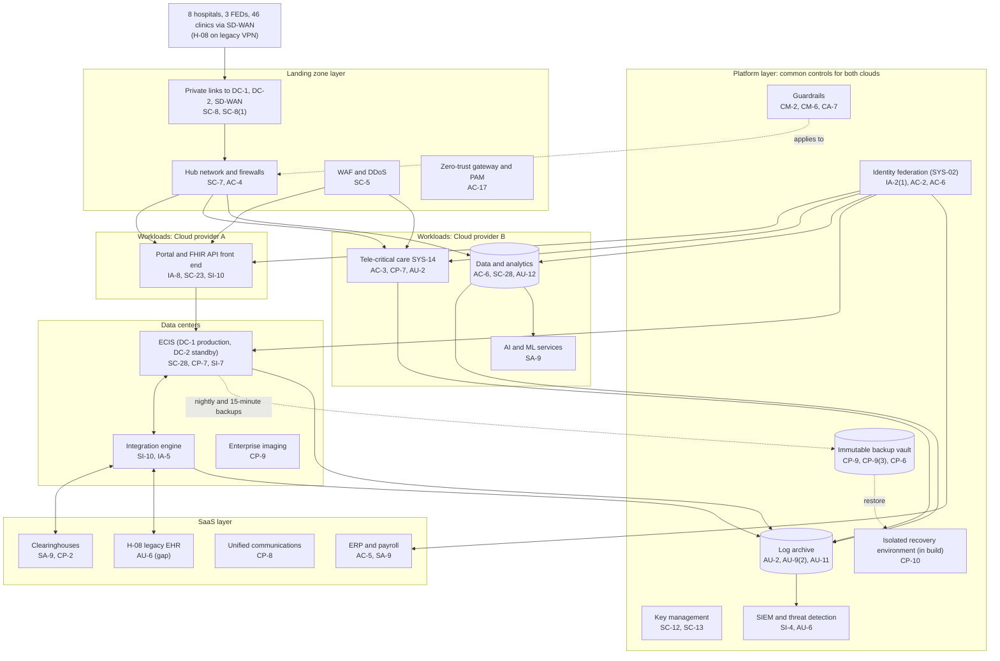

# Cloud and Data Center Architecture and Control Placement: Cris Santos Company | Healthcare and Public Health | Enterprise

**Organization:** Cris Santos Company, Inc. (publicly traded for-profit hospital system: 8 hospitals, 1,970 beds; FL, GA, AL) | **Tier:** Enterprise | **Provider:** Multi-cloud, vendor-agnostic: two public cloud providers (called Cloud provider A and Cloud provider B), two data centers (DC-1 system-owned, DC-2 colocation), and SaaS
**Owner:** Director of Cloud Platform Engineering, with the Director of Data Center Operations and the CISO | **Date:** 2026-08-24 | **Related:** ECIS SSP (P02), enterprise BIA (P05)

## 1. Architecture in layers
The estate has five layers. Each lower layer provides **common controls** that the layers above inherit, so a workload team configures only what is specific to its system. Unlike many enterprises, the hospital system keeps its EHR in its own data centers, so the cloud layers mostly support the EHR (backup vault, recovery environment, portal edge) and run the newer workloads (tele-critical care, analytics, AI).

| Layer | What it is | Examples | Who runs it |
|---|---|---|---|
| **Platform** | Organization-wide services in both clouds | Guardrails, identity federation, key management, log archive, SIEM feeds, posture management, immutable backup vault, isolated recovery environment (in build), CI/CD pipelines | Cloud Platform Engineering; Security Operations; Identity team |
| **Landing zone** | The standard account pattern every cloud workload lands in | Account vending with mandatory tags, hub network with cloud firewalls, private links to DC-1, DC-2, and the SD-WAN, WAF and DDoS protection, private DNS, zero-trust gateway and PAM | Cloud Platform Engineering; Network Engineering |
| **Workload** | Systems the hospital system builds or runs in the clouds | Cloud A: patient portal and FHIR API front end (ECIS). Cloud B: tele-critical care platform (SYS-14, SL-2), data and analytics platform, AI and machine learning services | Application teams |
| **Data center** | Systems in DC-1 and DC-2 | ECIS database, application, and integration tiers; enterprise imaging; network core | Data Center Operations; EHR Technical Director |
| **SaaS** | Vendor-operated applications | ERP and payroll, productivity suite, clearinghouses, tele-ICU application, H-08 legacy EHR, unified communications | Vendors, with the system's configuration and oversight |

## 2. Diagram

## 3. Responsibility by service model
Sources: SRC-AWS-SRM, SRC-AZURE-SRM, and SRC-GCP-SRM in `00_universal-framework/sources/source-register.csv`. The three published shared responsibility models agree on the split used here, so the design does not depend on which two providers the system uses.

| Service model | Provider | Hospital system (customer) | Shared |
|---|---|---|---|
| IaaS (recovery environment, scanners) | Facilities, hosts, hypervisor, physical network | Guest OS, applications, identities, data, network policy | Encryption (provider service, customer keys), logging |
| PaaS (portal containers, tele-critical care, analytics, backup service) | Also the platform runtime and its patching | Data, access, configuration, keys, application code | Backups, availability configuration |
| SaaS (ERP, clearinghouse, tele-ICU application, H-08 EHR) | Also the application | Users, roles, data, oversight of the vendor | Audit review (complementary user entity controls) |
| Colocation (DC-2) | Building, power, cooling, perimeter | Racks, equipment, cage access list | None |
| Group-operated data center (DC-1) | None | Everything | None |

## 4. Service categories and provider equivalents
| Service category | AWS | Microsoft Azure | Google Cloud |
|---|---|---|---|
| Organization guardrails | AWS Organizations service control policies | Azure Policy with management groups | Organization Policy Service |
| Key management | AWS KMS | Azure Key Vault | Cloud KMS |
| Audit logging | AWS CloudTrail | Azure Monitor activity log | Cloud Audit Logs |
| Threat detection and posture | Amazon GuardDuty; AWS Security Hub | Microsoft Defender for Cloud | Security Command Center |
| Backup with retention lock | AWS Backup (vault lock) | Azure Backup (immutable vaults) | Backup and DR Service (backup vaults) |
| Managed containers | Amazon EKS | Azure Kubernetes Service | Google Kubernetes Engine |
| Web application firewall | AWS WAF | Azure Web Application Firewall | Cloud Armor |

This table is for reading provider documentation only. The architecture, control map, and SSP describe service categories.

## 5. Common controls
`cloud-control-map.csv` has **63 rows** across 31 components: Platform 23, Landing zone 9, Workload 12, Data center 10, SaaS 9. Responsibility: Customer 46, Shared 13, Provider 4.

**33 rows are published as common controls** (`common_control` = Yes) in the enterprise common control catalog. They map to the common control providers in the ECIS SSP (P02 section 10.3): identity (CCP-02), data center operations (CCP-03), security operations (CCP-04), network (CCP-05), and cloud landing zones (CCP-07). The two isolated recovery environment rows are not yet published as common controls because the environment is still being built.

**Rules for inheriting:**
1. A cloud workload may claim a common control only if its account was created by account vending and passes the posture baseline.
2. Customer-side identity, data protection, and logging stay explicit at every layer: even a SaaS application has Customer rows for access and audit review, because those are always the system's responsibility.
3. SaaS rows cite the vendor's SOC 2 report, reviewed by the third-party risk team (P09 evidence map).

## 6. Validation against the ECIS SSP (P02)
Every ECIS component in the SSP boundary appears here or in the SSP with controls from each required family, directly or inherited:
| ECIS component | AC | AU | CM | IA | SC | SI | CP |
|---|---|---|---|---|---|---|---|
| EHR database and application tiers | AC-6 (inherited) | AU-9(2) (archive copy) | CM-2 (SSP) | IA-2(1) (inherited) | SC-28 | SI-7 | CP-7; CP-9 (vault) |
| Integration engine | AC-4 (SSP) | AU-2 (SSP) | CM-3 (SSP) | IA-5 | SC-8 (SSP) | SI-10 | CP-9 (vault) |
| Portal and FHIR API front end | AC-4 (hub) | AU-2 (platform) | CM-2 (guardrails) | IA-8 | SC-23; SC-5 (edge) | SI-10 | CP-9 (vault) |
| Backup and recovery | AC-6 (vault account) | AU-6 (SIEM rules) | CM-6 (guardrails) | IA-2(1) (federation) | SC-12 (keys) | SI-4 (detection) | CP-9(3); CP-10 |

## 7. Findings from the mapping
1. **Recovery depends on an unfinished environment.** Backups are immutable and separated from the production directory, but there is no clean place to rebuild the ECIS if both data centers are compromised. The isolated recovery environment rows are Customer-only and not yet common controls (POAM-003).
2. **H-08 connects around the landing zone.** H-08 reaches the integration engine over a legacy site VPN that bypasses SD-WAN segmentation (POAM-006), and its vendor-hosted EHR sends no logs to the SIEM (POAM-007).
3. **Integration engine credentials.** Interface service accounts are moving into the PAM vault; legacy accounts with static passwords remain (POAM-001).
4. **Two clouds, one control set.** Guardrails, logging, and key policies are written once as code and applied to both clouds. Differences are limited to service names (section 4).
5. **Clearinghouse is SaaS with no platform fallback.** Concentration risk must be handled by contract and procedure, not architecture (POAM-019).
6. **AI services** run under the cloud provider's BAA with no training on customer data. The AI governance committee reviews each new model deployment (P10).
