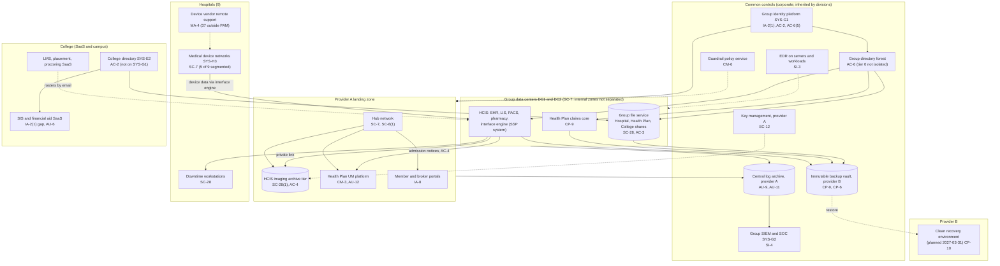
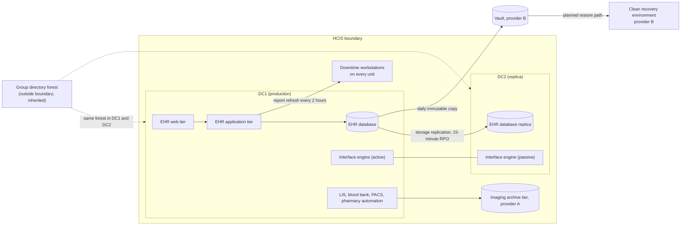

# Cloud Architecture and Control Placement: Cris Santos Company Holdings | Healthcare and Public Health | Multi-Sector

**Organization:** Cris Santos Company Holdings, Inc. | **Tier:** Multi-Sector | **Providers:** two group data centers (DC1, DC2) and two public cloud providers, called provider A and provider B (vendor-agnostic; see section 5)
**Scope:** the shared corporate platform (SYS-G1 to SYS-G3: identity, SOC, data centers, cloud landing zone, backup vault) plus the division workloads that run on it or beside it. The SSP system (P02) is the Hospital Clinical Information System (HCIS).

## 1. Design in one paragraph
Most clinical systems in a hospital system of this size still run in the group's **two data centers**: the EHR (SYS-H1), the ancillary clinical systems (SYS-H2), the Health Plan claims core, and the group file service all run in DC1, with replicas in DC2. Corporate runs one cloud **landing zone** at provider A (identity federation from SYS-G1, a hub network, guardrail policies, a central log archive, key management) where the Health Plan's UM platform and member portals and the HCIS imaging archive tier run in their own accounts. Provider B holds the **immutable backup vault** and, from 2027, a **clean recovery environment** for rebuilding the EHR after ransomware. The College uses SaaS academic systems and its own campus networks and directory; only its administrative file shares sit on group infrastructure. Identity, SOC monitoring, EDR, keys, guardrails, and backups are **common** controls; division applications, device networks, and external-user identity are **division-specific**.

## 2. Diagrams
### 2.1 Group platform and division workloads

### 2.2 HCIS boundary and recovery path

**Why the recovery path matters.** Failover to DC2 handles a site loss; it does not handle ransomware, because DC2 trusts the same directory forest. The target state (POAM-012, due 2027-03-31) is a clean recovery environment at provider B with its own identity store, golden images, and a tested EHR restore sequence, plus a separated highest-privilege directory tier and data center zones split by division (POAM-007, due 2027-06-30).

## 3. Common versus division-specific controls
`cloud-control-map.csv` has 46 rows across 38 components. The `control_scope` column shows who owns each placement:

| Scope | Rows | What it means |
|---|---|---|
| Common (group) | 21 | Provided once by corporate (SYS-G1, SYS-G2, SYS-G3) and inherited by divisions. Listed in the P02 common control catalog |
| Shared system (HCIS) | 10 | Controls of the SSP system that sit on the shared platform (data centers, archive tier, planned recovery environment) |
| Division-specific (Hospital System) | 4 | Medical device networks, device vendor access, portal web tier, telehealth |
| Division-specific (Health Plan) | 5 | UM platform, portals, claims core backups |
| Division-specific (College) | 6 | SaaS academic systems and the College's own directory |

| Responsibility | Rows |
|---|---|
| Customer (the group or a division) | 33 |
| Shared (provider and group) | 11 |
| Provider | 2 |

**Rule of thumb.** Identity, network guardrails, logging, keys, backups, and EDR are **common**. A division cannot opt out of them, only request an exception through POL-01. Application behavior, data flows between covered entities, medical device networks, and external-user identity are **division-specific**, because they answer to each division's regulators (CMS and OCR for the hospitals, CMS and state insurance departments for the Health Plan, Federal Student Aid and the FTC Safeguards Rule for the College).

## 4. Layers
| Layer | Common components | Division components | Key controls | Responsibility |
|---|---|---|---|---|
| Identity | SYS-G1, group directory, cloud IAM | Member and broker portals, telehealth, College directory | AC-2, AC-3, AC-6, AC-6(5), IA-2(1), IA-8 | Customer (configuration); vendor (identity service) |
| Network | Hub network, private links, data center firewalls | Device networks, portal web tier, vendor remote support | SC-7, SC-8(1), SC-5, MA-4 | Customer, with provider DDoS and circuit duties shared |
| Compute | EDR, guardrails | EHR tiers, UM platform, downtime workstations, clean recovery environment | SI-3, CM-6, CM-3, CP-7, CP-10 | Customer (guest OS, applications) |
| Data | Keys, backup vault, file service | EHR database, imaging archive tier, claims core, College SaaS data | SC-12, SC-28, SC-28(1), CP-9, CP-6, AC-4 | Shared: providers encrypt media; the group owns keys, zoning, and retention |
| Logging and monitoring | Log archive, SIEM | EHR audit logs, UM decision logs, College SIS logs | AU-9, AU-11, AU-12, AU-6, SI-4 | Shared: platforms generate logs; the group retains and reviews |
| SaaS dependencies | Identity, SIEM, EDR, email vendors | EHR vendor, telehealth, College SaaS, proctoring | SA-9, SI-8, IA-8 | Provider for the service; customer for configuration and oversight |
| Physical | Provider data centers; DC1 and DC2 | Hospital closets and device rooms | PE-3 | Provider (cloud); group (DC1, DC2) |

## 5. Service categories and provider equivalents
The design does not depend on a provider. This table gives each provider's name for each service category, for reading its shared responsibility documentation.

| Service category | AWS | Microsoft Azure | Google Cloud |
|---|---|---|---|
| Account structure and guardrails | AWS Organizations with service control policies | Management groups with Azure Policy | Resource hierarchy with Organization Policy |
| Object storage (imaging archive tier) | Amazon S3 | Azure Blob Storage | Cloud Storage |
| Managed containers (UM platform) | Amazon EKS | Azure Kubernetes Service | Google Kubernetes Engine |
| Key management | AWS KMS | Azure Key Vault | Cloud KMS |
| Audit logging | AWS CloudTrail | Azure Monitor activity log | Cloud Audit Logs |
| Backup with immutability | AWS Backup (vault lock) | Azure Backup (immutable vault) | Backup and DR Service |
| Private connectivity | AWS Direct Connect | Azure ExpressRoute | Cloud Interconnect |

Shared responsibility sources: SRC-AWS-SRM, SRC-AZURE-SRM, SRC-GCP-SRM in `00_universal-framework/sources/source-register.csv`. All three agree on the split used here: for IaaS the provider owns facilities, hosts, and virtualization; for PaaS the provider also owns the runtime; for SaaS the provider owns the application. The customer always keeps identities, access decisions, data classification, and data. For DC1 and DC2 the group owns every layer except the colocation operator's building perimeter at DC2.

## 6. Findings from the mapping
1. **The shared directory, not the cloud, is the weak point.** Cloud guardrails, keys, and the backup vault are sound (CM-6, SC-12, CP-9, CP-6). The ransomware risk comes from one directory forest and unseparated server zones that span both data centers and three divisions (AC-6, SC-7; P01 GR-01; POAM-007, POAM-012).
2. **The vault is ready; the restore path is not.** Immutable copies exist in a separate provider and account, but there is no clean place to restore the EHR into. The planned recovery environment at provider B closes this gap (CP-10).
3. **Device networks and vendor access are division-specific risks with group consequences.** Flat device networks at 4 hospitals and 37 vendor connections outside PAM (SC-7, MA-4; POAM-013, POAM-015) are owned by the Hospital System but feed group risk GR-02.
4. **The College sits mostly outside the common controls.** Its SaaS systems lack enforced MFA and log review (IA-2(1), AU-6), and its directory is separate (AC-2). Its data on the group file service inherits encryption and backup, which is why a data center incident reaches the College (P08).
5. **Data flows between covered entities need their own control.** The admission-notice feed to the Health Plan crosses an account and entity boundary (AC-4) and needs a minimum-necessary protocol, not just encryption (POAM-016).
