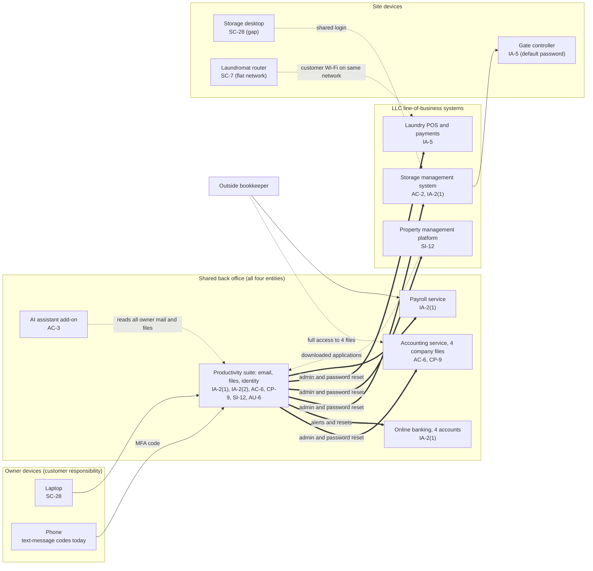

# SaaS Architecture and Control Placement: Cris Santos Company | Management of Companies and Enterprises | Sole Proprietorship

**Organization:** Cris Santos Company (the owner's management business for three wholly owned LLCs) | **Tier:** Sole Proprietorship | **Provider:** SaaS only (no IaaS or PaaS)
**System:** Shared Back-Office Platform (SBP), as defined in the system profile (P02)

## 1. Diagram
Control IDs on each node are the ones in `cloud-control-map.csv`. Thick lines show where the owner's one email identity reaches. Dashed lines are flows with a known gap.

## 2. Layers
| Layer | Components | Key controls | Responsibility |
|---|---|---|---|
| Identity | Owner administrator accounts in all seven SaaS services; Storage manager and Laundry accounts; bookkeeper | IA-2(1), IA-2(2), AC-2, AC-6, IA-5 | Customer configures; vendor provides MFA and roles |
| Data | Mail and files, four company files, applications and screening reports, tenant records | CP-9, SI-12, AC-3 | Vendor protects data inside its service; customer decides what is kept, where, and for how long |
| Endpoints | Laptop, phone, Storage desktop, POS tablet, gate controller | SC-28, IA-5 | Customer |
| Network | Home, Storage office, and laundromat routers | SC-7 | Customer (internet providers supply the equipment) |
| Logging | Suite sign-in log; storage system activity; bank payment alerts | AU-2 (vendor), AU-6 (customer) | Shared: vendor records, customer reviews |
| SaaS applications and hosting | All seven services | Inherited (AC-3, AU-2, SC-5, PE family) | Provider |

## 3. Shared responsibility for SaaS
All three major cloud providers' shared responsibility models (SRC-AWS-SRM, SRC-AZURE-SRM, SRC-GCP-SRM) agree on the SaaS split: the provider runs the application, the platform, and the facilities; **the customer always keeps its identities and accounts, its data, and its devices.** That is why 13 of the 19 rows in the control map are the owner's alone and 4 more are shared. A vendor's SOC 2 report never covers these three layers. No IaaS provider equivalents table is needed, because the business runs no infrastructure.

**The holding company point.** Each LLC's system has its own vendor and its own shared responsibility split, but all of them sit behind one customer-side identity: the owner's email account receives every password reset and security notice. Separating the LLCs legally did not separate them technically. The SaaS model cannot fix this; only the owner's own identity controls can (stronger MFA on the email account, a separate administrator account, and unique passwords per system).

## 4. Findings from the mapping
1. **One mailbox is the master key for four entities.** Anyone who controls the owner's email can reset the password of every LLC system, read bank alerts, and approve vendor changes. Text-message MFA is the only barrier. Tracked as P01 R-001.
2. **MFA is off where it is free to turn on** (storage system, Storage manager mailbox, shared Laundry mailbox), and a password was reused across two LLC systems. Tracked as R-015 and R-005.
3. **The vendors back up their platforms, not the owner's data.** The suite keeps deleted items for 30 days and nothing more; the rental applications exist nowhere else. Tracked as R-008.
4. **Restricted data has leaked into the shared layer.** Applications and screening reports were downloaded from the property management platform into general file storage, where the AI assistant can also read them. Tracked as R-003 and R-009.
5. **Site devices are the weakest layer:** a shared, unencrypted Storage desktop, a default gate password, and a flat laundromat network. Tracked as R-005, R-006, and R-007.
