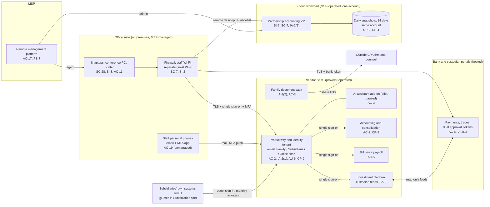

# Cloud Architecture and Control Placement: Cris Santos Company | Management of Companies and Enterprises | Micro

**Organization:** Cris Santos Company, LLC (family holding company and single-family office) | **Tier:** Micro | **Provider:** Vendor-agnostic SaaS plus one IaaS workload (see section 3)
**System:** Family Office Shared Services Platform (FOSSP), as defined in the SSP (P02) | **Prepared:** 2026-08-14 by the Family Office Director with the MSP lead technician | **Approved:** Principal, 2026-09-18

## 1. Diagram
The office runs no servers on site. Its "cloud" is a set of SaaS services, the banks' and custodians' portals, and one IaaS workload that the MSP runs for it: the legacy partnership accounting server (SYS-11).

## 2. Layers and who is responsible
| Layer | Components | Key controls | Customer (the office) | MSP (on the office's behalf) | Provider |
|---|---|---|---|---|---|
| Identity | SYS-02 single sign-on and MFA; vault and bank sign-ins; SYS-11 local administrator | AC-2, AC-6, IA-2(1), IA-2(2) | Decides who gets access, MFA strength, guest rules; removes leavers | Holds a shared global admin account (to be replaced); administers SYS-11 accounts | Runs the sign-in and MFA services; banks issue tokens |
| Network | Office firewall and Wi-Fi; SYS-11 cloud firewall rules | SC-7, AC-17 | Approves rule changes | Configures both firewalls | Cloud provider runs the underlying network |
| Compute | Laptops, conference PC; SYS-11 operating system | SI-2, SI-3, SI-4, SC-28 | Approves exceptions and the SYS-11 upgrade | Patching, antivirus, encryption | Cloud provider runs the hypervisor and hardware |
| SaaS applications | Accounting, bill pay, payroll, investment platform, vault, AI assistant | AC-3, AC-5, SA-9 | Roles, approval settings, sharing links, AI data access | Administration on request | Application, platform, data centers |
| Data | Mail and files, family records, SYS-11 data and snapshots | CP-9, CP-4, SC-28, SI-12 | Retention, backup design, restore testing | Operates SYS-11 snapshots; will run the new SaaS backup | Encrypts and backs up its own platform |
| Logging | SYS-02 audit logs; firewall logs; SaaS logs | AU-2, AU-6, AU-11 | **Reviews logs monthly and buys longer retention (gap today)** | Keeps firewall logs; will route alerts | Generates and stores logs |
| Physical | Office suite; provider data centers | PE-3 | Office suite keys, alarm, safe | Not applicable | Data center security |
| Vendor governance | Contracts, SOC 2 reports, MSP oversight | SA-9, PS-7 | Selects, contracts with, and assesses providers (16 CFR 314.4(f)) | Discloses its own subcontractors | Provides SOC 2 reports and terms |

**The MSP is not a cloud provider in the shared responsibility sense.** It performs the office's customer-side duties. Anything marked "Customer (performed by MSP)" in `cloud-control-map.csv` remains the office's responsibility: the Safeguards Rule requires the office to select, contract with, and periodically assess its service providers (16 CFR 314.4(f)), so the office must direct the MSP's work and check the evidence.

**SaaS and IaaS split differently.** For SaaS, the provider runs the application, platform, and infrastructure, and the customer keeps identities, access, data, and devices. For SYS-11 (IaaS), the customer side is much larger: the operating system, its patches, its firewall rules, its accounts, and its snapshots all belong to the office. That is why SYS-11 has the most "Customer (performed by MSP)" rows.

## 3. Service categories and provider equivalents
The design is vendor-agnostic. The shared responsibility split is the same in all three major cloud providers' models (SRC-AWS-SRM, SRC-AZURE-SRM, SRC-GCP-SRM in `00_universal-framework/sources/source-register.csv`). For the office's SaaS vendors, the SOC 2 report or vendor security documentation is the evidence of the provider side.

| Service category used | What it is here | Equivalent category in the large cloud providers |
|---|---|---|
| Productivity and identity suite | Email, files, chat, single sign-on, MFA, AI assistant add-on | Productivity and collaboration SaaS with an identity service |
| Line-of-business SaaS | Accounting, bill pay, payroll, investment reporting, document vault | Industry SaaS built on any provider |
| Infrastructure as a service: virtual machine | SYS-11 partnership accounting server | Virtual machine service (compute instance) |
| Block storage snapshots | SYS-11 daily snapshots | Snapshot service; cross-account or vault backup service as the fix |
| Remote monitoring and management | MSP device and server management | Device management SaaS |

## 4. Findings from the mapping
1. **The identity tenant is the front door to everything (IA-2(1), AU-6).** Single sign-on means one stolen SYS-02 session reaches accounting, bill pay, payroll, and the investment platform. Push MFA does not stop adversary-in-the-middle phishing, and nobody watches for new inbox rules. Tracked as P01 R-001 and P07 POAM-002 (MFA) and POAM-003 (log review and alerts).
2. **The MSP's shared global administrator account is the biggest single credential (AC-2, AC-6).** It can read every mailbox and file and delete data, and its MFA is on a shared phone. Fix: named MSP admin accounts with security keys and just-in-time elevation (R-005, POAM-001 and POAM-002).
3. **SYS-11 is the one place the office carries IaaS duties, and all of them have gaps (SC-7, SI-2, IA-2(1), CP-9, CP-4).** Remote desktop is reachable from the internet, the operating system is near end of support, administrator sign-in is password-only, and snapshots sit in the same account with no restore test. Fix: close the port and use the MSP's MFA gateway, upgrade, copy snapshots to a separate account, test a restore (R-007, POAM-006, POAM-007, and POAM-011).
4. **No independent backup of mail and files (CP-9).** The vendor's resilience protects against the vendor's failures, not against an attacker or administrator deleting the office's data (R-006, POAM-006).
5. **Access design, not technology, is the main SaaS gap (AC-3).** The Family site and the Subsidiaries site are open to everyone in each group. The AI assistant made the Family site problem visible (R-004, POAM-005, P10).
6. **Bank-side controls are strong and evidenced (AC-5).** The banks enforce dual approval and tokens. The office's part, the callback log, is missing, and the bill pay platform's own approval setting is off (R-002, R-023).
