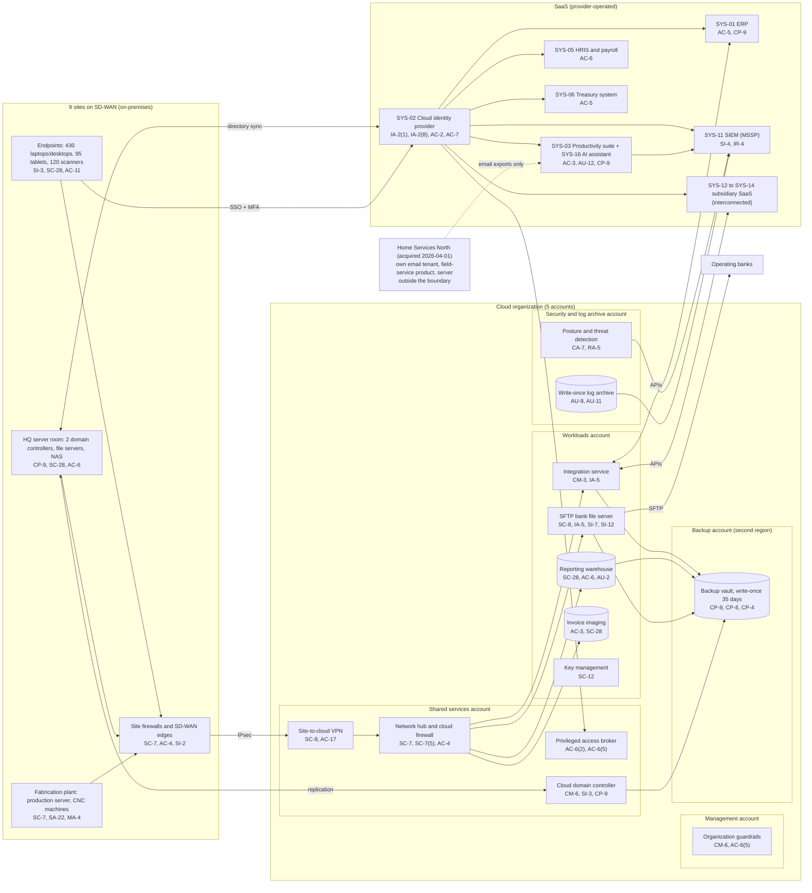

# Cloud Architecture and Control Placement: Cris Santos Company | Management of Companies and Enterprises | Mid-Market

**Organization:** Cris Santos Company, Inc. | **Tier:** Mid-Market | **Provider:** Vendor-agnostic public cloud (see section 4), plus SaaS and on-premises systems
**System:** Shared Corporate Services Platform (SCSP), as defined in the SSP (P02) | **Prepared:** 2026-08-07 by the Security Manager and the VP of Information Technology; updated 2026-09-22 with P07 results
**Control map:** `cloud-control-map.csv` (51 rows, 20 components)

## 1. Diagram

## 2. Landing zone design
The landing zone separates duties across 5 accounts (subscriptions or projects, depending on the provider) under one cloud organization. Each account limits what an attacker can do from any other.

| Account | Purpose | Who administers | Key design decisions |
|---|---|---|---|
| **Management** | Organization root and guardrails only | Security Manager and 1 security analyst | No workloads. Root credentials sealed. Guardrails apply to every other account and cannot be disabled from them |
| **Security and log archive** | Write-once log archive (3 years), posture management, threat detection | Security team | Logs from all accounts land here and cannot be deleted by any role. Findings flow to the MSSP SIEM |
| **Shared services** | Network hub, cloud firewall, site-to-cloud VPN, DNS, privileged access broker, the cloud domain controller | Infrastructure team | All traffic between sites, workloads, and the internet passes the hub. The cloud domain controller is a Tier 0 asset and belongs with identity, not with workloads |
| **Workloads** | Integration service, reporting warehouse, SFTP server, invoice imaging, key management | Infrastructure team; Controller and Treasurer own the data | Separate subnets per workload. Only the SFTP server accepts inbound connections, and only from the banks. Company-managed keys |
| **Backup** | Backup vault with 35-day write-once retention in a second region | 2 named backup administrators | Separate administrator credentials, not federated to everyday accounts. A cross-account role can write but not delete |

**The hybrid seam.** The on-premises directory forest synchronizes to the cloud identity provider, and the cloud domain controller replicates with the two at HQ. This seam is the most important design fact in the environment: a compromise of the on-premises directory flows to the cloud identity provider through synchronization, and from there to every SaaS system and the cloud consoles. The landing zone's account separation does not help if the identities that administer it are taken over. That is why P01 rates R-004 (directory compromise) High and why POAM-002 starts with directory tiering.

## 3. Layers and shared responsibility per service
| Layer | Components | Key controls | Service model | Responsibility |
|---|---|---|---|---|
| Identity | Organization guardrails, cloud federation, privileged access broker, cloud domain controller, SYS-02 | AC-2, AC-6(2), AC-6(5), IA-2(1), IA-2(8), AC-7, CM-6 | IaaS, PaaS, SaaS | Customer configures identities, roles, MFA, and reviews; provider runs the identity and policy services. The domain controller guest OS is fully the customer's |
| Network | Hub, cloud firewall, VPN, SD-WAN edges | SC-7, SC-7(5), SC-8, AC-4, AC-17 | PaaS | Customer designs routes, rules, and segmentation; provider runs the gateway services |
| Compute | SFTP server, integration service, cloud domain controller | IA-5, SI-2, SI-3, SI-7, CM-3 | IaaS, PaaS | Customer (guest OS, functions, EDR, secrets); provider for hosts, hypervisor, and the serverless runtime |
| Data | Warehouse, invoice imaging, keys, backups | SC-28, SC-12, CP-9, CP-6, CP-4, AC-3, AC-6, SI-12 | PaaS | Shared: provider encrypts and operates storage and the database engine; customer controls keys, access, retention, isolation, and restore testing |
| Logging and monitoring | Log archive, posture service, SIEM forwarding | AU-2, AU-9, AU-11, AU-12, CA-7, RA-5, SI-4 | IaaS, PaaS | Shared: provider generates logs and detections; customer enables, retains, forwards, and acts on them; MSSP monitors |
| SaaS applications | Identity provider, productivity suite and AI assistant, ERP, HRIS, treasury system | AC-3, AC-5, AC-6, AU-12, CP-9, IA-2(1) | SaaS | Provider runs the application and infrastructure; customer keeps users, roles, audit review, and data (including its own backup of the suite) |
| Physical | Provider data centers | PE-3, PE-13 | All | Provider (inherited, evidenced by SOC 2 reports) |

**Responsibility counts in `cloud-control-map.csv`:** 31 Customer, 16 Shared, 4 Provider. By service model: 25 PaaS, 15 IaaS, 11 SaaS rows. The customer side is always identity, data protection, and logging, as the three providers' shared responsibility models agree.

**On-premises systems are fully the company's.** The HQ server room, the plant server and machines, and the site networks have no provider to share with. They are covered in the SSP (P02) control statements rather than in this cloud map, and their weaknesses (unencrypted file servers, same-room backups, flat plant network) appear in P01 and P07.

## 4. Service categories and provider equivalents
The design is independent of the provider. This table gives each provider's name for the service category, for reading its shared responsibility documentation (SRC-AWS-SRM, SRC-AZURE-SRM, SRC-GCP-SRM in `00_universal-framework/sources/source-register.csv`).

| Service category | AWS | Microsoft Azure | Google Cloud |
|---|---|---|---|
| Multi-account organization and guardrails | AWS Organizations, service control policies | Management groups, Azure Policy | Resource Manager folders, organization policies |
| Account, subscription, or project | Account | Subscription | Project |
| Network hub | Transit Gateway | Virtual WAN hub or hub virtual network | Network Connectivity Center or shared VPC |
| Cloud firewall | AWS Network Firewall | Azure Firewall | Cloud NGFW |
| Site-to-cloud VPN | Site-to-Site VPN | VPN Gateway | Cloud VPN |
| Virtual machines (SFTP server, domain controller) | EC2 | Virtual Machines | Compute Engine |
| Serverless functions (integration service) | AWS Lambda | Azure Functions | Cloud Run functions |
| Managed database (reporting warehouse) | Amazon Redshift or RDS | Azure Synapse or Azure SQL | BigQuery or Cloud SQL |
| Object storage with write-once retention | S3 with Object Lock | Blob Storage with immutability policies | Cloud Storage with bucket lock |
| Backup service | AWS Backup (vault lock) | Azure Backup (immutable vault) | Backup and DR Service |
| Key management and secrets | AWS KMS, Secrets Manager | Azure Key Vault | Cloud KMS, Secret Manager |
| Audit logging | CloudTrail | Azure Monitor activity log | Cloud Audit Logs |
| Posture and threat detection | Security Hub, GuardDuty | Microsoft Defender for Cloud | Security Command Center |

**Service model split used here (all three providers agree):**
- **IaaS** (virtual machines, storage buckets): the provider owns facilities, hosts, and virtualization. The customer owns the guest OS, applications, network configuration, identities, and data.
- **PaaS** (serverless functions, managed database, backup, key service, firewall service): the provider also owns the platform software and its patching. The customer owns access, keys, data, and configuration.
- **SaaS** (identity provider, suite, ERP, HRIS, treasury): the provider also owns the application. The customer keeps identities, roles, audit review, and data.

## 5. Findings from the mapping
1. **The hybrid identity seam outweighs the landing zone design.** The cloud accounts are well separated, but 14 Domain Admins members, including 4 service accounts, can sign in to the cloud domain controller and, through synchronization, affect cloud identities. Fix: directory tiering, removal of service accounts from Domain Admins, MFA for directory administration through the broker (POAM-002; P01 R-004).
2. **The bank file path has a weak secret.** The SFTP server is well placed (inbound only from the banks), but the ACH signing service account password sits in an IT runbook readable by 14 staff, and files are not integrity-checked before upload. Fix: move the secret to the secrets service, rotate it, add a hash and file totals check (POAM-004; P01 R-050).
3. **Backups are strong in the cloud and weak on-premises.** Cloud backups are isolated (separate account, second region, write-once, separate credentials) and were restore-tested in 2026-03. HQ server backups sit on a NAS in the same room, and the plant uses a removable drive. Fix: send HQ and plant backups to the backup account and test a directory forest recovery (POAM-010).
4. **Logging gaps sit in the data layer.** Warehouse query logs and the subsidiary SaaS audit logs are not forwarded, and there is no egress anomaly alerting (P01 R-002, R-018). Fix: forward them and add egress alerts on the cloud firewall (POAM-006, POAM-015).
5. **Vendor access bypasses the broker.** Machine vendors and the seller's IT provider at Home Services North connect outside the privileged access broker (POAM-012).
6. **Boundary check.** Every in-scope cloud and SaaS component in the SSP (P02 section 9) appears in the diagram. Each cloud account has at least one row in the control map, and each has controls from at least 2 of the AC, AU, CM, IA, SC, and SI families or inherits them.
7. **Inherited controls rely on SOC 2 reports.** Controls marked Provider or Shared for the cloud provider, identity vendor, suite provider, ERP vendor, and MSSP depend on their SOC 2 Type 2 reports and the complementary user entity controls the company must operate, which are reviewed in P09 `vendor-soc2-review.csv`.
