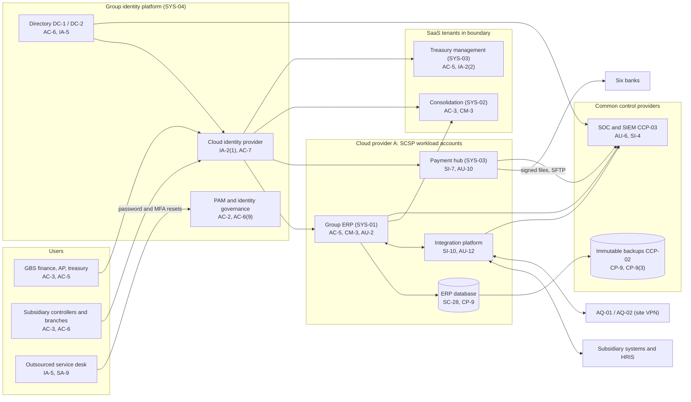

# System Security Plan: Shared Corporate Services Platform (SCSP)

**Organization:** Cris Santos Company, Inc. (publicly traded holding company with four operating subsidiaries) | **Tier:** Enterprise | **Vertical:** Management of Companies and Enterprises
**Outline:** NIST SP 800-18 Rev. 2, System Security Plan Outline Example (June 2026) | **Version:** 3.0, 2026-09-18

## 1. System Name and Identifier
Shared Corporate Services Platform (**SCSP**), identifier CSC-SYS-SCSP-001. Tier-1 system in the group application inventory and the core of the SOX IT general control scope.

## 2. System Overview
The SCSP is the set of shared systems that Global Business Services (GBS) runs for every subsidiary. It records every subsidiary's transactions, produces the consolidated financial statements filed with the SEC, releases about $1.1 billion of payments a week, and controls who can sign in to almost every system in the group.

**Why integrity matters most.** A changed vendor bank account, an altered payment file, or an unauthorized journal entry can move money out of the group or misstate the financial statements. Management must evaluate internal control over financial reporting every year (Exchange Act Rule 13a-15(c); SOX section 404), and the external auditor attests to it. The identity platform matters for the same reason: whoever controls it can grant themselves any of these powers.

**Major components:**
- **Group ERP (SYS-01):** commercial ERP software, customer-managed on Cloud provider A virtual machines with a managed database. General ledger, payables, receivables, fixed assets, and intercompany for all entities except AQ-01 and AQ-02.
- **Financial close and consolidation (SYS-02):** vendor SaaS for consolidation, SEC reporting packages, and disclosure checklists.
- **Treasury management and payment hub (SYS-03):** treasury management is vendor SaaS; the payment hub runs on Cloud provider A and sends signed wire and ACH files to 6 banks over host-to-host links.
- **Group identity platform (SYS-04):** one on-premises directory (domain controllers at DC-1 and DC-2) synchronized to a cloud identity provider for single sign-on and MFA, privileged access management (PAM), and identity governance.
- **Integration platform:** managed integration service and middleware on Cloud provider A that carries journals, invoices, payroll results, and bank files between subsidiary systems, the ERP, the HRIS, and the banks.

**Users.** About 2,900 named users of the ERP, consolidation, and treasury applications (GBS accounting, payables, treasury, and payroll staff; subsidiary controllers and branch office staff; corporate accounting). The identity platform holds about 14,500 workforce identities and 3,100 service accounts, and about 1,180 privileged accounts.

## 3. Laws, Regulations, and Policies Affecting the System
| ID | Requirement | Citation | How it affects the SCSP |
|---|---|---|---|
| N55-R03 | SOX section 404 | 15 U.S.C. 7262(a)-(b) | The SCSP is the main ICFR system; its IT general controls (access, change, operations) are tested each year by Internal Audit and the external auditor |
| Rule 13a-15 | Disclosure controls and ICFR | 17 CFR 240.13a-15(a)-(d) | Quarterly disclosure controls evaluation and annual ICFR evaluation depend on SCSP data and on incident escalation (P08) |
| N55-R01 | Reg S-K Item 106 | 17 CFR 229.106(b)-(c) | The 10-K describes the risk management processes this plan documents |
| N55-R02 | Form 8-K Item 1.05 | Form 8-K Item 1.05; SEC Release 33-11216 | A material SCSP incident goes through the P08 materiality step |
| FTC Safeguards Rule | Finance's information security program | 16 CFR 314.4(c)-(f) | Finance customer bank data travels through the payment hub and integration platform, and the identity platform protects Finance's systems; GBS is Finance's service provider (314.4(f)) |
| N55-R06 | HIPAA plan sponsor duties | 45 CFR 164.314(b); 164.504(f) | The identity platform controls access to the restricted benefits site where plan PHI is kept (P03) |
| State | State breach and data security laws | Each state where affected individuals reside (Florida worked example: Fla. Stat. 501.171) | Employee and vendor data in the ERP; notification (P08) |
| Contract | Bank treasury services agreements | Host-to-host and portal agreements with 6 banks | Dual approval, file security, and fraud notice duties |
| Internal | POL-01 to POL-05, standards and procedures | P06 | Group policy hierarchy |

Not applicable: N55-R04 and N55-R05 (the group is not a bank holding company; P03 section 1) and N55-R07 (CIRCIA is proposed only).

## 4. System Status
### 4.1 System Security Plan Approval
Prepared by the Director of ERP Platform with the GRC team and the Director of Identity and Access Management. Reviewed by the CISO, the Chief Accounting Officer, and the Treasurer. Approved by the CFO on 2026-09-18.

### 4.2 System Authorization Decision
The group is not a federal agency, so there is no formal authorization to operate. The equivalent internal decision:
- **Authorizing official equivalent:** CFO, on the recommendation of the CISO and with the concurrence of the Chief Accounting Officer.
- **Decision (2026-09-18):** continue operation with conditions, based on the Internal Audit assessment (P07) and the enterprise risk register (P01).
- **Conditions:** verified identity proofing at the outsourced service desk (POAM-001, due 2026-12-15); directory administrative tiering (POAM-005, due 2026-12-31); removal of the Home Services payables conflicts (POAM-007, due 2026-12-31); restriction of AQ site VPNs to named hosts (POAM-015, interim milestone 2026-11-15); a DR retest that proves the 8-hour ERP RTO (POAM-010, due 2027-02-28).
- **Reauthorization:** annually, or after a major change (for example, migration of AQ-01 and AQ-02 onto the group ERP in 2027).

### 4.3 System Operational Status
Operational. Planned major modifications: AQ-02 migration to the group ERP (2027-04) and AQ-01 (2027-06); automated change blocking (CM-3(1)); payment function self-tests (SI-6).

## 5. Role Identification and Responsible Personnel
| Role | Title | Responsibility |
|---|---|---|
| System owner | Vice President, Global Business Services | Accountable for the SCSP and the shared services it supports |
| Authorizing official (equivalent) | CFO | Accepts residual risk to operate |
| Component owners | Director of ERP Platform (ERP, consolidation, integration platform); Treasurer (treasury management and payment hub); Director of Identity and Access Management (identity platform) | Day-to-day ownership of each component |
| System administrator | Director of ERP Platform | Administration, change control, recovery |
| Financial reporting control owner | Chief Accounting Officer | SOX control design and the quarterly sub-certification process |
| Information security | CISO; Director of Security Operations | Program oversight; SOC monitoring; incident response |
| Finance customer information | Finance Information Security Officer (Qualified Individual) | Confirms the SCSP safeguards Finance customer information under 16 CFR 314.4(f) |
| Common control providers | See section 10.3 | Operate inherited controls |
| Independent assessor | Chief Audit Executive (Internal Audit, with its co-source firm) | Annual assessment (P07) |

## 6. System Information Types and System Categorization
Information types come from NIST SP 800-60 Vol. 2 Rev. 1. Impact levels follow FIPS 199.

| Information type | Confidentiality | Integrity | Availability | Rationale |
|---|---|---|---|---|
| Financial reporting and accounting (general ledger, consolidation, SEC reporting) | Moderate | **High (treated)** | Moderate | Before release, results are MNPI. An undetected change misstates SEC filings. Close can run on controlled spreadsheets for a few days (P05 BP-11: MTD 120 h, 48 h at quarter-end) |
| Payments and funds management (vendor bank details, payment files, bank credentials) | Moderate | **High (treated)** | Moderate | An altered payment file or bank detail sends money to an attacker. Bank portals keep priority payments going (P05 BP-08: MTD 24 h, RTO 8 h) |
| Identity and access (directory, credentials, privileged accounts) | Moderate | Moderate | Moderate | A compromise reaches every subsidiary; break-glass and recovery procedures exist (P05 DEP-01: RTO 1 h) |
| Personnel and payroll data passing through the integration platform | Moderate | Moderate | Low | SSNs and bank accounts; payroll can repeat the prior file (P05 BP-09) |
| **SCSP category** | **Moderate** | **Moderate baseline, integrity supplemented** | **Moderate** | See the decision below |

**Categorization decision.** Under a strict FIPS 199 high-water mark, the High integrity rating would make the whole system High. The group is not a federal agency and uses FIPS 199 as a model. The executive risk committee approved this tailoring on 2026-09-14:
- The SCSP uses the **SP 800-53B Moderate baseline**.
- It adds **10 High-baseline controls** that protect financial and payment integrity: AU-6(5), AU-9(3), AU-10, CM-3(1), CM-4(1), CM-5(1), CP-9(3), SI-6, SI-7(2), SI-7(15).
- The decision is reviewed annually. If the payment-integrity POA&M items (POAM-007, POAM-008) are not closed by 2027-06-30, the CISO will recommend full High categorization for the payment hub.

**Documented controls.** `control-implementation.csv` documents **145 controls**: 135 from the Moderate baseline and 10 High-baseline integrity supplements. The remaining Moderate-baseline enhancements are fully inherited from the common control catalog (section 10.3) and are listed there rather than repeated here.

## 7. Authorization Boundary Description
**Inside the boundary:** the ERP application and database servers and the payment hub in the SCSP workload accounts (Cloud provider A); the integration platform; the SCSP tenants of the consolidation and treasury SaaS applications (configuration, users, and data, not the vendors' infrastructure); the directory domain controllers at DC-1 and DC-2; the cloud identity provider tenant; PAM; and identity governance.

**Outside the boundary (common control providers and interconnected systems):**
- Landing zone services (network hub, key management, log archive, backup accounts, standby region): CCP-02
- SOC, SIEM, EDR, vulnerability scanning: CCP-03
- Subsidiary systems (distribution, field service, MES, loan platform), the HRIS, the six banks, the AQ-01 and AQ-02 legacy ERPs, and the outsourced service desk

The group multi-cloud diagram is in P04 `cloud-architecture.md`.

## 8. Information Exchanges Summary
| Connected system / party | Direction | Data | Agreement |
|---|---|---|---|
| Six banks | Bidirectional (host-to-host SFTP with PGP and file signing) | Payment files, acknowledgments, statements, positive pay files | Treasury services agreements |
| HRIS and payroll (SYS-05) | Bidirectional | Worker events (to identity governance); payroll journals and pay files | HRIS contract; internal interface specification |
| Subsidiary systems (distribution, field service, MES, loan platform) | Inbound journals and invoices; outbound master data | Sales, cost, and loan accounting entries | Internal interface specifications |
| AQ-01 and AQ-02 legacy ERPs | Inbound (manual upload, site VPN) | Trial balances | Integration plans; **site VPN reaches the integration platform subnet (POAM-015)** |
| Consolidation and treasury SaaS vendors | Bidirectional | Trial balances, cash positions | Vendor contracts with security terms; SOC 2 Type 2 reports reviewed |
| Outsourced service desk provider | Inbound (reset actions in identity governance) | Credential and MFA resets | Services contract; **no identity-verification standard (POAM-012)** |
| ERP software vendor | Remote support through PAM | Troubleshooting access | Support agreement |
| External auditor | Read-only guest access during audit windows | SOX evidence | Engagement letter |

## 9. System Component Inventory
| Component | Type | Location / provider | Owner |
|---|---|---|---|
| ERP application servers (6) | IaaS virtual machines | Cloud provider A, primary region; standby in second region | Director of ERP Platform |
| ERP database | Managed relational database (PaaS) | Cloud provider A | Director of ERP Platform |
| Payment hub (2 application servers, hardware security module service) | IaaS and managed key service | Cloud provider A | Treasurer |
| Integration platform | Managed integration service plus middleware servers (4) | Cloud provider A | Director of Enterprise Integration |
| Consolidation tenant | SaaS | Vendor | Chief Accounting Officer |
| Treasury management tenant | SaaS | Vendor | Treasurer |
| Domain controllers (8) | Virtual servers | DC-1 (4), DC-2 (4) | Director of Identity and Access Management |
| Cloud identity provider tenant, PAM, identity governance | SaaS and virtual appliances | Vendor; DC-1 and DC-2 | Director of Identity and Access Management |
| Administrator workstations (about 140) | Hardened endpoints | GBS offices | Director of Endpoint Engineering |

## 10. Control Implementation Details
### 10.1 Control implementation status
See `control-implementation.csv` (145 controls).

| Status | Count |
|---|---|
| Implemented | 115 |
| Partially implemented | 26 |
| Planned | 4 |
| **Total** | **145** |

| Inheritance | Count |
|---|---|
| Common (fully inherited from a common control provider) | 67 |
| Hybrid (shared between a provider and the SCSP team) | 28 |
| System-specific | 50 |

The Planned controls are High-baseline integrity supplements: AU-6(5), CM-3(1), SI-6, SI-7(2). Partially implemented controls (26): AC-2, AC-2(3), AC-4, AC-5, AC-6, AC-6(5), AT-3, AU-6, AU-10, AU-12, CM-3, CM-8, CP-2, CP-10, IA-2(1), IA-5, IR-4, IR-8, PS-4, RA-5, SA-9, SA-22, SC-7, SI-2, SI-7, SR-6.

### 10.2 Control assessment status
Internal Audit, with its co-source firm, assessed 44 of these controls from 2026-07-13 to 2026-08-28 using SP 800-53A Rev. 5 procedures and statistical sampling (P07 `assessment-plan.md`, `assessment-results.csv`). Weaknesses are in P07 `poam.csv`.

### 10.3 Common control providers and inheritance
Common and hybrid controls are inherited from the group platform. Each provider publishes its controls in the group **common control catalog** (kept by the GRC team in the GRC platform) and is assessed on its own cycle; the SCSP inherits the results. The identity platform is inside this boundary, so identity controls are system-specific here and are inherited by every other group system.

| Provider | Name | Accountable role | Controls provided | Rows in this plan | Evidence of operation |
|---|---|---|---|---|---|
| CCP-01 | Group GRC program | CISO (with the Chief Risk Officer and Chief Audit Executive for assessment) | Policies and standards (P06), risk method, assessment, POA&M, continuous monitoring | 25 | Annual Internal Audit assessment (P07); GRC platform |
| CCP-02 | Cloud landing zone (Cloud provider A) | Director of Cloud Platform Engineering | Guardrails, network policies, key management, encryption, backups, log archive, standby region | 21 | Posture reports; provider SOC 2 Type 2 |
| CCP-03 | Security operations | Director of Security Operations | 24x7 SOC, SIEM, EDR operations, vulnerability management, incident response | 17 | SOC metrics; P07 AU-6, RA-5, IR-8 results |
| CCP-04 | Enterprise network (SYS-08) | Director of Network Engineering | SD-WAN, data center and hub firewalls, zero-trust access, transport encryption | 7 | Network configuration reviews |
| CCP-05 | Endpoint and server engineering (SYS-09) | Director of Endpoint Engineering | Server and workstation baselines, EDR agents, patching, unsupported component tracking | 5 | Configuration compliance and patch reports |
| CCP-06 | Facilities and data centers | Vice President, Facilities | DC-1 and DC-2 physical and environmental controls; colocation provider controls | 5 | Badge reviews; colocation SOC 2 report |
| CCP-07 | HR and workforce training | Chief Human Resources Officer | Screening, terminations, sanctions, training, acknowledgments | 9 | HRIS and learning system reports |
| CCP-08 | Third-party risk management | Director of Third-Party Risk Management | Vendor tiering, contract terms, SOC report reviews, supply chain risk | 6 | Vendor register; SOC report reviews |

**Inheritance rules:**
- A Common control is fully inherited; the SCSP team verifies only that the SCSP is onboarded (for example, log forwarding and backup policy assignment).
- A Hybrid control names both parts in the implementation statement.
- If a provider's assessment finds a weakness, the finding is linked to every inheriting system's POA&M. Example: POAM-013 (overdue tier-1 vendor reassessments) is a CCP-08 weakness that affects the SCSP because the consolidation and treasury vendors are tier-1.

## 11. Digital Identity Acceptance Statement
- **Workforce users:** single sign-on with MFA (authenticator push with number matching, or a FIDO2 security key). Treasury approvers and payment releasers must use FIDO2 keys. This is comparable to NIST SP 800-63 AAL2.
- **Privileged users:** PAM with MFA. The target is phishing-resistant FIDO2 keys for all 1,180 privileged accounts (AAL3-like protection); 62% are there today (POAM-002, due 2027-03-31).
- **Account recovery:** the weakest point today. The outsourced service desk resets passwords and MFA after knowledge-based verification only. The required standard is verified identity proofing (live video verification against the HRIS photo, or a manager-approved in-person reset) for every reset (POAM-001, due 2026-12-15).
- **External users:** none, apart from external auditor guest accounts with MFA.

## 12. Referenced Artifacts
Scenario facts (`../00_company-facts.md`), BIA (P05), multi-cloud architecture and control map (P04), enterprise risk register (P01), regulatory gap analysis (P03), policy hierarchy and policies (P06), Internal Audit assessment and POA&M (P07), shared-services compromise runbook (P08), SOC 2 readiness (P09), AI portfolio (P10), SCSP contingency plan v5, SOX risk and control matrix, group common control catalog.

## 13. Acronym List and Glossary
- **AAL:** authenticator assurance level (NIST SP 800-63)
- **CCP:** common control provider
- **GBS:** Global Business Services, the shared services organization
- **ICFR:** internal control over financial reporting
- **ITGC:** IT general controls
- **MNPI:** material non-public information
- **PAM:** privileged access management
- **POA&M:** plan of action and milestones
- **SCSP:** Shared Corporate Services Platform
- **SoD:** segregation (separation) of duties

## 14. System Security Plan Review and Change Records
| Version | Date | Change | Author |
|---|---|---|---|
| 1.0 | 2024-09-20 | Initial plan (Moderate baseline) | Director of ERP Platform |
| 2.0 | 2025-09-19 | Added the payment hub and the identity platform to the boundary | Director of ERP Platform with the GRC team |
| 3.0 | 2026-09-18 | Integrity supplementation; common control provider mapping; AQ-01 and AQ-02 interfaces; 2026 assessment results | Director of ERP Platform with the GRC team |
