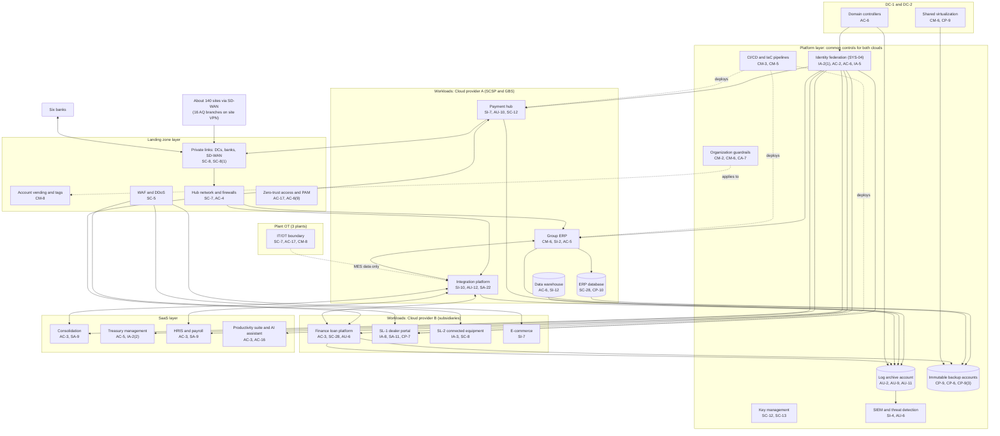

# Cloud Architecture and Control Placement: Cris Santos Company | Management of Companies and Enterprises | Enterprise

**Organization:** Cris Santos Company, Inc. (publicly traded holding company with four operating subsidiaries) | **Tier:** Enterprise | **Provider:** Multi-cloud, vendor-agnostic: two public cloud providers (called Cloud provider A and Cloud provider B), two data centers (DC-1 company-owned in Florida, DC-2 colocation in Georgia), plant OT at 3 plants, and SaaS (see section 4)
**Owner:** Director of Cloud Platform Engineering, with the CISO | **Date:** 2026-08-31 | **Related:** SCSP SSP (P02), group BIA (P05)

## 1. Architecture in layers
The estate is organized in layers. Each lower layer provides **common controls** that the layers above inherit, so a subsidiary or workload team configures only what is specific to its system. This is how one GBS platform team serves four subsidiaries without each subsidiary building its own security stack.

| Layer | What it is | Examples | Who runs it |
|---|---|---|---|
| **Platform** | Organization-wide services in both clouds | Organization guardrails, identity federation to the group identity platform, key management, log archive, SIEM feeds, vulnerability and posture management, immutable backup accounts, CI/CD pipelines | Cloud Platform Engineering; Security Operations; Identity team |
| **Landing zone** | The standard account pattern every workload lands in | Account vending with mandatory owner, entity, and data-class tags; hub-and-spoke networks with cloud firewalls; WAF and DDoS protection; zero-trust and PAM access; private links to data centers, banks, and SD-WAN | Cloud Platform Engineering; Network Engineering |
| **Workload** | Systems built or run by GBS or a subsidiary | Cloud A: group ERP, payment hub, integration platform, data warehouse (SCSP and GBS). Cloud B: Finance loan platform, SL-1 dealer financing portal, SL-2 connected equipment platform, Building Products e-commerce | GBS application teams; subsidiary application teams |
| **SaaS** | Vendor-operated applications | Consolidation, treasury management, HRIS and payroll, productivity suite and AI assistant, field-service management, board portal | Vendors, with GBS configuration and oversight |
| **Data center** | DC-1 and DC-2 | Domain controllers, shared virtualization (about 420 virtual machines from every subsidiary), offline backup copies | GBS infrastructure; colocation provider for DC-2 building |
| **Plant OT** | Control networks at 3 plants | Controllers, operator panels, robots, engineering workstations, MES servers | Manufacturing, with the Director of OT Security |

## 2. Diagram

## 3. Responsibility by service model
Sources: SRC-AWS-SRM, SRC-AZURE-SRM, and SRC-GCP-SRM in `00_universal-framework/sources/source-register.csv`. The three published models agree on the split used here, so the design does not depend on which two providers the group uses.

| Service model | Provider | Group (customer) | Shared |
|---|---|---|---|
| IaaS (ERP servers, payment hub, middleware) | Facilities, hosts, hypervisor, physical network | Guest OS, applications, identities, data, network policy | Encryption (provider service, customer keys), logging |
| PaaS (ERP database, integration service, loan platform, SL-1 and SL-2 platforms) | Also the platform runtime and its patching | Data, access, configuration, keys, application code | Backups, availability configuration |
| SaaS (consolidation, treasury, HRIS, productivity, field service) | Also the application | Users, roles, data, oversight of the vendor | Audit review (complementary user entity controls) |
| Data centers and plants | DC-2: building, power, cooling, perimeter (colocation provider) | DC-1 and plants entirely; DC-2 racks, equipment, cage access | None |

## 4. Service categories and provider equivalents
| Service category | AWS | Microsoft Azure | Google Cloud |
|---|---|---|---|
| Organization guardrails | AWS Organizations service control policies | Azure Policy with management groups | Organization Policy Service |
| Account vending | AWS Control Tower account factory | Azure landing zone subscription vending | Resource Manager project creation |
| Key management and hardware security modules | AWS KMS; AWS CloudHSM | Azure Key Vault; Azure Managed HSM | Cloud KMS; Cloud HSM |
| Audit logging | AWS CloudTrail | Azure Monitor activity log | Cloud Audit Logs |
| Threat detection and posture | Amazon GuardDuty; AWS Security Hub | Microsoft Defender for Cloud | Security Command Center |
| Managed relational database | Amazon RDS | Azure SQL Database | Cloud SQL |
| Managed integration service | Amazon MQ; AWS Step Functions | Azure Integration Services | Application Integration |
| Web application firewall | AWS WAF | Azure Web Application Firewall | Cloud Armor |
| Backup service | AWS Backup | Azure Backup | Backup and DR Service |

This table is for reading provider documentation only. The architecture, control map, and SSP describe service categories.

## 5. Common controls
`cloud-control-map.csv` has **75 rows** across 33 components: Platform 22, Landing zone 8, Workload 24, SaaS 13, Data center 5, Plant OT 3. Responsibility: Customer 56, Shared 12, Provider 7.

**35 rows are published as common controls** (`common_control` = Yes) in the group common control catalog. They map to the common control providers in the SCSP SSP (P02 section 10.3): landing zone (CCP-02), security operations (CCP-03), network (CCP-04), and facilities and data centers (CCP-06), plus the identity platform, which is inside the SCSP boundary and is inherited by every other system. A workload inherits them by being deployed through account vending, which applies the guardrails, logging, network, key, and backup policies automatically.

**Rules for inheriting:**
1. A workload may claim a common control only if its account was created by account vending and passes the posture baseline.
2. Customer-side identity, data protection, and logging stay explicit at every layer: even a SaaS application has Customer rows for access (AC-3, AC-5) because those are always the group's responsibility.
3. SaaS rows cite the vendor's SOC 2 report, reviewed by the third-party risk team (P09 evidence map).
4. Plant OT does not inherit cloud common controls. It has its own boundary controls (SC-7, AC-17, CM-8) owned by Manufacturing with the Director of OT Security.

## 6. Validation against the SCSP SSP (P02)
Every SCSP component in the SSP boundary appears here with controls from each required family, directly or inherited:

| SCSP component | AC | AU | CM | IA | SC | SI / CP |
|---|---|---|---|---|---|---|
| ERP application servers | AC-5 | AU-2, AU-9 (inherited) | CM-6, CM-2 (inherited) | IA-2(1) (inherited from federation) | SC-7 (inherited) | SI-2 |
| ERP database | AC-6 (inherited) | AU-2 | CM-6 (inherited) | IA-2(1) (inherited) | SC-28 | CP-10, SI-2 (provider) |
| Payment hub | AC-6 (inherited) | AU-10 | CM-3 (inherited) | IA-2(1) (inherited) | SC-12, SC-8(1) (inherited) | SI-7 |
| Integration platform | AC-4 (inherited) | AU-12 | CM-3 (inherited) | IA-2(1) (inherited) | SC-8 (inherited) | SI-10, SA-22 |
| Consolidation and treasury SaaS | AC-3, AC-5 | AU-6 (inherited) | Vendor (SOC 2) | IA-2(2) | Vendor (SOC 2) | CP-9 (provider) |
| Directory and identity platform | AC-6, AC-2 | AU-2 (inherited) | CM-6 (inherited) | IA-5 | SC-8 (inherited) | CP-9 (inherited) |

## 7. Findings from the mapping
1. **Acquired-business connectivity.** The 16 AQ-01 and AQ-02 branches connect over legacy site VPNs that terminate on the hub and reach the integration platform subnet, bypassing SD-WAN segmentation (P07 SC-7). Fix: restrict VPN access lists to named hosts now, then migrate to SD-WAN (POAM-015).
2. **Identity is the true common control.** Every layer, including SaaS, depends on the group identity platform. Its weakest point is account recovery at the outsourced service desk, which no cloud guardrail can fix (POAM-001).
3. **Shared virtualization is outside the cloud guardrails.** About 420 virtual machines from every subsidiary sit on the DC-1 and DC-2 virtualization layer, protected by PAM and backups but not by account-level isolation. Moving DC-1-only workloads to the clouds by 2027-06 reduces this (P01 R-031).
4. **Two clouds, one control set.** Guardrails, logging, and key policies are written once as code and applied to both clouds. Differences are limited to service names (section 4).
5. **Log coverage.** Platform logging covers every cloud account, but the AQ directories, plant OT, and integration platform content changes are not yet in the SIEM (POAM-009).
6. **Plant OT is a separate world.** Plant 3 has no IT/OT boundary, and two plants allow unmanaged vendor remote access (POAM-015, POAM-016). Only MES summary data crosses to the integration platform.
7. **The AI assistant runs on existing file permissions.** No platform control limits what it can retrieve beyond what each user can already open, so sensitivity labels and site sharing are the controls that matter (POAM-024; P10).
