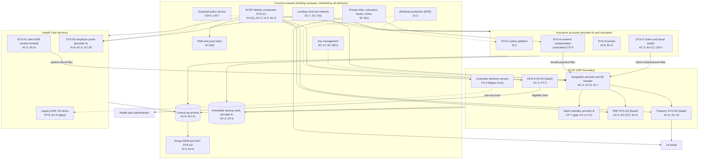
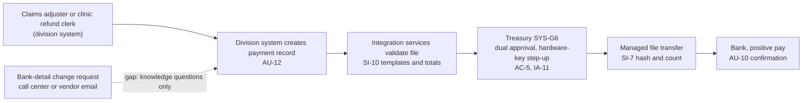

# Cloud Architecture and Control Placement: Cris Santos Company Holdings | Management of Companies and Enterprises | Multi-Sector

**Organization:** Cris Santos Company Holdings, Inc. | **Tier:** Multi-Sector | **Providers:** two public cloud providers, called provider A and provider B (vendor-agnostic; see section 6), one colocation data center, and SaaS vendors
**Scope:** the shared corporate platform (SYS-G1 identity, SYS-G3 landing zones and network) and the Shared Corporate Services Platform (SCSP, the P02 SSP system), plus the Insurance and Health Care Services workloads that run on or connect to it.

## 1. Design in one paragraph
The holding company runs one **landing zone** per provider: identity federation from SYS-G1, a hub network, guardrail policies, a central log archive, key management, EDR, and an immutable backup vault in provider B. Each division gets its own **accounts** inside the landing zone and inherits these guardrails. Provider A hosts the hub, the SCSP integration services and managed file transfer, the insurers' personal lines policy platform (SYS-I1), claims (SYS-I2), and portals (SYS-I3), and the Health Care Services employer portal (SYS-H2) and check-in app (SYS-H3). Provider B hosts the backup vault and warm standbys for the SCSP integration services and claims. Three important systems sit outside the cloud platform: the SCSP's own SaaS applications (ERP, HCM, treasury, identity), the clinic EHR (SYS-H1, vendor-hosted, plus a legacy EHR at a hosting provider for 50 acquired clinics), and the workers' compensation platform (SYS-I4) in the colocation data center.

## 2. Diagrams
### 2.1 Group landing zone, SCSP, and division workloads

### 2.2 Payment flow through the SCSP (the integrity path)

**Target state (POAM-001, POAM-006, POAM-013, due 2026-11-30 to 2027-03-31):** division-scoped administration in SYS-G1 so a division help desk cannot reset a user in another division or any administrator; MFA resets require identity verification to the strength of the authenticator replaced; the legacy directory trust removed; and claimant and vendor bank-detail changes verified through a channel already on file before the integration services accept a payment to the new account.

## 3. Tenancy and identity decision
**Decision.** All three divisions federate to the group identity platform (SYS-G1), which is part of the SCSP and includes the corporate directory. Each division gets its own accounts inside the SYS-G3 landing zone, with cloud roles scoped to its own accounts. No division has a separate tenant with its own identity. The 50 acquired clinics still have a legacy directory, joined to the corporate forest by a two-way trust, until they migrate to SYS-H1 (2027-03-31).

**Reason.** Every subsidiary depends on one identity, ERP, HCM, and treasury layer, and one identity platform lets group internal audit assess common controls once. The sample names no rule or contract that requires a division to have its own tenant. The cost is stated plainly in the sample: one weakness in SYS-G1 is a weakness in all three divisions.

**What limits blast radius.** Administrators use phishing-resistant hardware keys and just-in-time PAM with session recording through jump hosts. Only 9 named identity engineers can change SYS-G1 security settings, through PAM. Treasury payment release needs hardware-key step-up. Backups sit in a separate provider with a separate backup identity.

**Known gaps.** 212 accounts, including 61 division help desk agents, hold group-wide reset or admin rights, and MFA resets verify too little; division-scoped roles are the target (POAM-001). The legacy directory trust has no agreement and no SIEM coverage (POAM-006). 112 service accounts have no owner (POAM-002).

Cross-division risks: GR-01 (help desk reset takes over the shared identity platform), GR-02 (ransomware through shared identity and network), GR-08 (pivot through the legacy directory trust), GR-14 (identity vendor outage).

## 4. Common versus division-specific controls
`cloud-control-map.csv` has **59 rows across 31 components**. The `control_scope` column shows who owns each placement:

| Scope | Rows | What it means |
|---|---|---|
| Common (group) | 24 | Provided once by the holding company (SYS-G1, SYS-G2, SYS-G3, providers) and inherited by every division account. Listed in the P02 common control catalog |
| Shared system (SCSP) | 17 | Controls of the SSP system: integration services, file transfer, standby, ERP, HCM, treasury, and directory servers |
| Division-specific (Insurance) | 10 | Policy platform, claims and fraud model, portals, call center, workers' compensation platform, estimating vendor |
| Division-specific (Health Care Services) | 8 | Clinic EHR, legacy EHR, employer portal, telehealth vendor |

| Responsibility | Rows |
|---|---|
| Customer (the group or a division) | 44 |
| Shared (provider and group) | 10 |
| Provider | 5 |

**Rule of thumb.** Identity, network guardrails, logging, keys, backups, and EDR are **common**. A division cannot opt out of them, only request an exception through POL-01. Application behavior, data access inside the application, and customer-facing identity (policyholders, agents, employer clients) are **division-specific**, because they depend on each division's regulators and customers.

## 5. Layers
| Layer | Common components | Division components | Key controls | Responsibility |
|---|---|---|---|---|
| Identity | SYS-G1, PAM, cloud IAM, directory servers | Policyholder and agent identity (SYS-I3); employer client identity (SYS-H2); call center caller verification | AC-2, AC-6, AC-6(5), IA-2(1), IA-5, IA-8, CA-3 | Customer (configuration); vendor (service) |
| Network | Hub, private links | Portal web application firewalls | SC-7, SC-7(5), SC-8(1), SC-5 | Customer, with provider DDoS protection shared |
| Compute | EDR; integration services | Policy platform, claims, fraud model, employer portal | SI-2, SI-3, CM-3, SI-10 | Customer (guest OS, containers, code) |
| Data | Keys, backup vault, file transfer | Claims data, employer portal database, workers' compensation data | SC-12, SC-28(1), CP-9, CP-6, SI-7, AC-4 | Shared: provider encrypts; group owns keys, routes, and retention |
| Logging | Log archive, SIEM | Claims and EHR activity logs | AU-3, AU-6, AU-9, AU-11, AU-12, SI-4 | Shared: providers generate platform logs; group retains and reviews |
| SaaS | ERP, HCM, treasury, identity, SIEM | EHR, legacy EHR, telehealth, estimating vendor | SA-9, AC-5, AC-3, CP-9 | Provider for the service; customer for roles, use, and oversight |
| Physical | Provider data centers, colocation | none | PE-3, MP-6 | Provider (inherited); colocation access list shared |

## 6. Service categories and provider equivalents
The design does not depend on a provider. This table gives each provider's name for each service category, for reading its shared responsibility documentation.

| Service category | AWS | Microsoft Azure | Google Cloud |
|---|---|---|---|
| Account structure and guardrails | AWS Organizations with service control policies | Management groups with Azure Policy | Resource hierarchy with Organization Policy |
| Integration and workflow service | AWS Step Functions and Amazon EventBridge | Azure Logic Apps | Application Integration and Workflows |
| Managed file transfer | AWS Transfer Family | Azure Blob Storage SFTP support | Cloud Storage with a partner SFTP service |
| Managed containers | Amazon EKS | Azure Kubernetes Service | Google Kubernetes Engine |
| Key management | AWS KMS | Azure Key Vault | Cloud KMS |
| Audit logging | AWS CloudTrail | Azure Monitor activity log | Cloud Audit Logs |
| Backup with immutability | AWS Backup (vault lock) | Azure Backup (immutable vault) | Backup and DR Service |
| Private connectivity | AWS Direct Connect / PrivateLink | Azure ExpressRoute / Private Link | Cloud Interconnect / Private Service Connect |

Shared responsibility sources: SRC-AWS-SRM, SRC-AZURE-SRM, SRC-GCP-SRM in `00_universal-framework/sources/source-register.csv`. All three agree on the split used here: for IaaS the provider owns facilities, hosts, and virtualization; for PaaS the provider also owns the runtime; for SaaS the provider owns the application. The customer always keeps identities, access decisions, data classification, and data.

## 7. Findings from the mapping
1. **The cloud is not where the group's main exposure sits; identity is.** Landing-zone controls are sound and common. The weak points are in SYS-G1 administration: 212 group-wide reset and admin rights and a reset process that verifies too little (AC-6, IA-5; P01 GR-01; POAM-001). Because every division federates to SYS-G1, one weakness here is a weakness in all three divisions.
2. **The SCSP's integrity path is strong once a payment exists, and weak before it.** Validation, dual approval, hardware-key step-up, file hashing, and positive pay protect the payment itself (SI-10, AC-5, IA-11, SI-7). A fraudulent bank-detail change made earlier, in the call center or by vendor email, flows straight through them (POAM-013).
3. **Three systems sit outside the landing zone and its guardrails.** The workers' compensation platform has no second site (POAM-015), the legacy EHR has a 24-hour RPO and no SIEM feed (POAM-018, POAM-021), and the ERP's vendor support accounts are standing superusers (POAM-003). Each is covered by division-specific or SCSP rows rather than common ones.
4. **The legacy directory trust bypasses the common identity design** (CA-3; POAM-006). It lets accounts in a directory the group does not monitor authenticate to corporate resources.
5. **Common controls are reused.** One identity platform, one SIEM, one backup design, and one set of guardrails is what lets group internal audit assess them once (P07).
