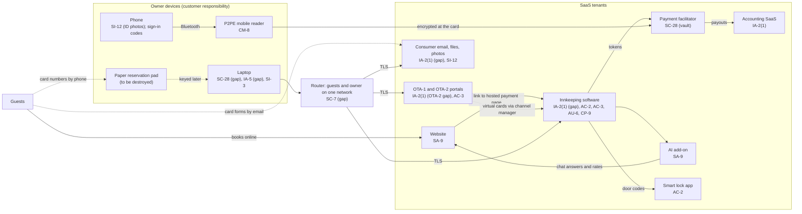

# SaaS Architecture and Control Placement: Cris Santos Company | Accommodation and Food Services | Sole Proprietorship

**Organization:** Cris Santos Company (six-room bed-and-breakfast inn) | **Tier:** Sole Proprietorship | **Provider:** SaaS only (no IaaS or PaaS)
**System:** Inn Business Systems Profile (IBSP), as defined in the system profile (P02)

## 1. Diagram
Control IDs on each node are the ones in `cloud-control-map.csv`. Dashed lines are card data flows that put the inn's own devices or accounts in PCI DSS scope today.

## 2. Layers
| Layer | Components | Key controls | Responsibility |
|---|---|---|---|
| Identity | Innkeeping, OTA, email, accounting, lock app accounts | IA-2(1), AC-2, IA-5 | Customer configures; vendor provides MFA and user management |
| Data | Reservations and profiles, card vaults, email card forms, ID photos, paper pad | SC-28, SI-12, AC-3, CP-9 | Vendors protect data inside their services; the owner decides where card and guest data go and how long they stay |
| Endpoints | Laptop, phone, mobile reader | SC-28, IA-5, SI-3, CM-8 | Customer |
| Network | One router for guests and owner | SC-7 | Customer (the internet service provider supplies the device) |
| Logging | Innkeeping activity log, email sign-in history, OTA and lock app logs | AU-2 (vendor), AU-6 (customer) | Shared: vendor records, customer reviews |
| SaaS applications and hosting | Innkeeping platform, payment platform, OTA systems | Inherited (AU-2, CP-9, vault encryption) | Provider |

## 3. Shared responsibility for SaaS
All three major cloud providers' shared responsibility models (SRC-AWS-SRM, SRC-AZURE-SRM, SRC-GCP-SRM) agree on the SaaS split: the provider runs the application, the platform, and the facilities; **the customer always keeps its identities and accounts, its data, and its devices.** That is why 14 of the 20 rows in the control map are the owner's alone and 4 more are shared. A vendor's AOC or SOC 2 report never covers these three layers. No IaaS provider equivalents table is needed, because the inn runs no infrastructure.

**PCI DSS view of the same split.** The innkeeping vendor and the payment facilitator are PCI DSS service providers with AOCs, so card data inside their platforms is their responsibility. Card data **outside** their platforms (the paper pad, email forms, numbers keyed on the laptop, numbers displayed on screen) is the inn's, and it is what makes the current design an SAQ D merchant (P03).

## 4. Findings from the mapping
1. **Three of the five card data flows bypass the vendors' protections** (paper pad, email forms, displayed virtual cards). No SaaS setting fixes this; only changing how the owner takes phone payments and forms does. Tracked as P01 R-002 and R-003.
2. **MFA is off where it is free to turn on** (innkeeping administrator, email, OTA-2). With passwords saved in a shared family browser, one stolen password opens the reservation system and guests' messages. Tracked as P01 R-001 and R-004.
3. **The owner's phone is part of the security boundary.** It receives sign-in codes, runs the payment app and reader, and holds about 1,900 guest ID photos. Losing it is both a disclosure risk (R-008) and a lockout risk (R-010).
4. **Inherited controls depend on the vendors' reports** and on the owner operating the customer controls they list (user removal, MFA, log review), recorded in P09.
5. **The lock app had a forgotten third-party administrator** (the installer's account, found during P07 testing and removed 2026-07-23). Cloud-managed physical devices need the same account review as the SaaS tenants (R-005).
