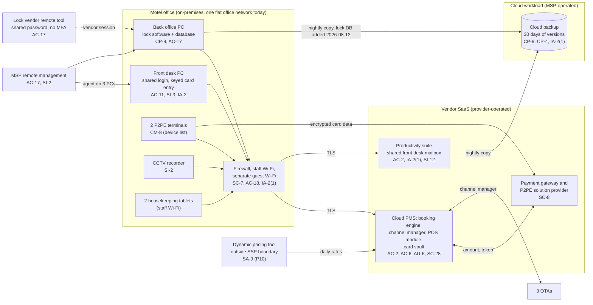

# Cloud Architecture and Control Placement: Cris Santos Company | Accommodation and Food Services | Micro

**Organization:** Cris Santos Company, LLC (independent 38-unit roadside motel) | **Tier:** Micro | **Provider:** Vendor-agnostic SaaS (see section 3)
**System:** Motel Property Management and Point-of-Sale System (MPPS), as defined in the SSP (P02) | **Prepared:** 2026-07-24 by the Assistant Manager with the MSP lead technician | **Approved:** Owner-Manager, 2026-08-31

## 1. Diagram
The motel runs no servers in a cloud tenant. Its "cloud" is a set of SaaS services plus one cloud workload that the MSP operates for it: the nightly backup of the back office PC and the productivity suite (SYS-09). The only on-site "server" is the back office PC that hosts the door lock software and database.

## 2. Layers and who is responsible
| Layer | Components | Key controls | Customer (motel) | MSP (on the motel's behalf) | Provider (SaaS vendor or payment provider) |
|---|---|---|---|---|---|
| Identity | PMS, suite, gateway portal, lock system, Windows logins; firewall and backup logins | AC-2, AC-6, IA-2(1), IA-5 | Decides who gets access and which PMS permissions; enforces MFA settings; ends shared logins | Creates Windows accounts; holds firewall and backup console logins | Runs the sign-in and MFA services |
| Network | Firewall, office network, staff and guest Wi-Fi, internet line | SC-7, AC-18, SI-2 | Approves changes; decides the network design | Configures, patches, and monitors | Not applicable |
| Endpoints | Front desk PC, back office PC, laptop, tablets | SI-3, SI-2, AC-11, SC-28 | Approves exceptions; keeps the inventory | Antivirus, patching, encryption, screen lock | Not applicable |
| Payment devices | 2 P2PE terminals | CM-8, SC-8 | Device list, inspections, staff training (per the P2PE Instruction Manual) | None | Encrypts card data; manages keys; replaces devices |
| SaaS applications | PMS, suite, gateway portal | AC-3, AU-2, AU-6, SI-12 | Roles, card-display permission, retention settings, activity review | Suite administration on request | Application, platform, data centers |
| Data | PMS data and vault, mailbox content, backup copies, lock database | CP-9, CP-4, SC-28, SI-12 | Decides retention, purges card forms, orders restore tests | Operates the backup and runs restore tests | Encrypts and backs up its own platform |
| Logging | PMS activity log, suite sign-in log, firewall log | AU-2, AU-6, AU-11 | **Reviews weekly (gap today)** | Keeps firewall logs; forwards alerts | Generates and stores logs |
| Vendor governance | AOCs, SOC 2 report, MSP and lock vendor terms | SA-9 | Keeps the provider list and responsibility matrix; checks AOCs yearly | Provides its own security evidence | Provides AOCs, SOC 2 reports, and terms |

**The MSP is not a cloud provider in the shared responsibility sense.** It performs customer-side duties for the motel. Anything marked "Customer (performed by MSP)" in `cloud-control-map.csv` remains the motel's responsibility under PCI DSS and the FTC Act. The motel must direct the work, receive evidence, and check it (PCI DSS requirement group 12.8; SA-9).

**The P2PE provider does carry part of the motel's PCI DSS load.** Card data from the terminals is encrypted before it reaches the motel's network, so the terminals alone would not bring the office network into scope. The keyed entry on the front desk PC, the card forms in email, and the displayed virtual cards do. That is why the 2025 SAQ P2PE was not valid and why the redesign in P03 targets those three paths.

## 3. Service categories and provider equivalents
The design is vendor-agnostic. The shared responsibility split for SaaS is the same in all three major cloud providers' models: the provider runs the application, platform, and infrastructure; the customer keeps identities, access, data, and devices (SRC-AWS-SRM, SRC-AZURE-SRM, SRC-GCP-SRM in `00_universal-framework/sources/source-register.csv`). For the motel's vendors, the SOC 2 report, the PCI DSS AOC, or vendor security documentation is the evidence of the provider side.

| Service category used | What it is here | Equivalent category in the large cloud providers (for reading their documentation) |
|---|---|---|
| Line-of-business SaaS | All-in-one cloud PMS | Industry SaaS built on any provider |
| Payment service provider | Gateway, P2PE solution, tokenization, pay-by-link | Payment processing SaaS (outside the cloud providers' own services) |
| Productivity suite | Email, shared mailbox, file storage | Productivity and collaboration SaaS |
| Backup service | Nightly copy of a PC and the suite | Backup service or third-party SaaS backup |
| Remote monitoring and management | MSP device management | Device management SaaS |
| Remote support tool | Lock vendor support sessions | Remote access service |

## 4. Findings from the mapping
1. **An outside party had an open door to the office network (AC-17).** The lock vendor's remote support tool was always on, its password is shared by the vendor's technicians, and there is no MFA. The MSP set it to start only when the motel accepts a session on 2026-08-05; the rest is still open. The back office PC it reaches sits on the same flat network as the front desk PC, where card numbers are keyed. This is the Wyndham pattern (unrestricted vendor access plus no internal separation). Fix: turn the tool off between sessions, start each session from the motel side, require MFA or a one-time code, and put the lock system on its own network. Tracked as P01 R-001 and R-008 and P07 POAM-003 and POAM-005.
2. **Card data sits in a SaaS mailbox that the whole front desk shares (SI-12, AC-2, IA-2(1)).** The suite vendor encrypts its storage, but that does not help when the card forms are readable to anyone with the shared password. Fix: purge, stop accepting forms, named mailboxes with MFA. Tracked as R-003 and POAM-002.
3. **The lock database was not backed up (CP-9).** The backup job copied the back office PC's documents but excluded the lock software's database folder. The MSP added it on 2026-08-12; it still needs a restore test with the lock vendor. Tracked as R-009 and POAM-010.
4. **Customer-side controls are the weak layer.** The PMS vendor and the payment provider are strong and evidenced (SOC 2, AOCs, P2PE listing). The gaps are on the motel's side: who can display card numbers, shared logins, retention settings left off, and nobody reading the logs.
5. **The dynamic pricing tool sits outside the boundary on purpose.** It holds no card data and no guest identities. It is mapped here only for the SA-9 gap and because its rates feed the PMS. Its pricing risks are assessed in P10.
