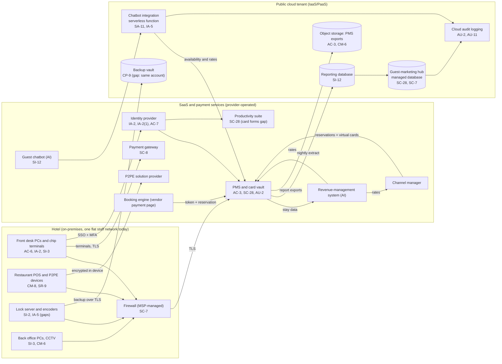

# Cloud Architecture and Control Placement: Cris Santos Company | Accommodation and Food Services | Small

**Organization:** Cris Santos Company, LLC (independent 140-room beachfront hotel) | **Tier:** Small | **Provider:** Vendor-agnostic (see section 3)
**System:** Property Management and Point-of-Sale Platform (PMPS), as defined in the SSP (P02)

## 1. Diagram

## 2. Layers
| Layer | Components | Key controls | Responsibility |
|---|---|---|---|
| Identity | Identity provider, cloud IAM roles, PMS roles | AC-2, AC-6, IA-2, IA-2(1), AC-7 | Customer (configuration), provider (service) |
| Network / edge | Hotel firewall, staff network, cloud private endpoints | SC-7, SC-8 | Customer (hotel and cloud network settings) |
| Compute / application | Chatbot integration function | SA-11, SI-2, IA-5 | Shared: provider runs the platform, hotel (through the web agency) owns code and secrets |
| Data | Managed database, reporting database, object storage, backup vault, key management | SC-28, SC-12, CP-9, SI-12, AC-3 | Shared: provider encrypts, hotel sets access, retention, and isolation |
| Logging / monitoring | Cloud audit logs, identity provider sign-in logs, PMS activity reports | AU-2, AU-11, AU-6 | Shared: provider generates, hotel retains and reviews |
| SaaS and payment services | PMS, gateway, P2PE, booking engine, channel manager, chatbot, pricing | AC-3, SC-8, SC-28, SA-9 | Provider (application, infrastructure, card vault), hotel (users, roles, data, contract terms). PCI responsibilities follow each provider's AOC |
| Physical / hypervisor | Provider data centers | PE family | Provider (inherited) |

## 3. Service categories and provider equivalents
The hotel's design is independent of the provider. This table gives each provider's name for each service category, to use when reading its shared responsibility documentation.

| Service category | AWS | Microsoft Azure | Google Cloud |
|---|---|---|---|
| Managed relational database | Amazon RDS | Azure SQL Database | Cloud SQL |
| Object storage | Amazon S3 | Azure Blob Storage | Cloud Storage |
| Serverless functions | AWS Lambda | Azure Functions | Cloud Run functions |
| Secrets storage | AWS Secrets Manager | Azure Key Vault | Secret Manager |
| Backup service | AWS Backup | Azure Backup | Backup and DR Service |
| Identity and access management | AWS IAM | Azure role-based access control with Microsoft Entra ID | Cloud IAM |
| Key management | AWS KMS | Azure Key Vault | Cloud KMS |
| Audit logging | AWS CloudTrail | Azure Monitor activity log | Cloud Audit Logs |

Shared responsibility sources: SRC-AWS-SRM, SRC-AZURE-SRM, SRC-GCP-SRM in `00_universal-framework/sources/source-register.csv`. All three models agree on the split used here:
- **IaaS:** the provider owns physical facilities, hosts, and the virtualization layer. The customer owns guest operating systems, applications, network configuration, identities, and data.
- **PaaS (managed database, serverless):** the provider also runs the operating system and platform runtime. The customer owns code, configuration, access, secrets, and data.
- **SaaS:** the provider also owns the application. The customer keeps identities, access, data, and devices.

**PCI DSS note.** No card data is stored or processed in the cloud tenant. The reporting database and exports carry guest names and stay data, never card numbers (confirmed by a sample query on 2026-07-21). The tenant is therefore outside PCI scope as long as it has no connection that could affect card data. That is why the chatbot integration reads PMS availability and rates only and has no payment function. PCI responsibility for SaaS payment services is split according to each provider's AOC and responsibility summary (P03 row 12.8).

## 4. Findings from the mapping
1. **Card data sits in a SaaS service not meant for it (SC-28).** The productivity suite encrypts mail at rest, but that does not make stored card numbers acceptable. They must be removed and kept out (POAM-006).
2. **Backup isolation (CP-9).** The backup vault shares the production account and administrator roles. Fix: separate backup account with immutable retention (POAM-018).
3. **Log retention and review (AU-6, AU-11).** Cloud, identity, and PMS logs use default retention and nobody reviews them. Fix: export to the MSP central log service with 12-month retention (POAM-015).
4. **Custom code without review (SA-11).** The chatbot integration was built by the web agency with no code review or secret rotation. It is also where the missing amenity fee in chatbot quotes originates (16 CFR 464.2; P10).
5. **Inherited controls rely on provider evidence.** Control statements marked "Common/Inherited" or "Hybrid" in P02 depend on the PMS vendor's SOC 2 report (reviewed in P09) and the payment providers' AOCs (P03 row 12.8). The gateway AOC is more than 12 months old and must be renewed.
