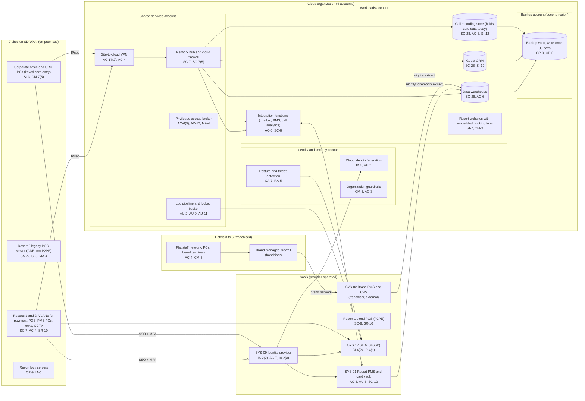

# Cloud Architecture and Control Placement: Cris Santos Company | Accommodation and Food Services | Mid-Market

**Organization:** Cris Santos Company, Inc. | **Tier:** Mid-Market | **Provider:** Vendor-agnostic public cloud (see section 4), plus SaaS
**System:** Property Management and Point-of-Sale Platform (PMPS), as defined in the SSP (P02) | **Prepared:** 2026-07-31 by the IT Director and the Security Manager; updated 2026-09-15 with P07 results
**Control map:** `cloud-control-map.csv` (57 rows, 22 components)

## 1. Diagram

## 2. Landing zone design
The landing zone separates duties across 4 accounts (subscriptions or projects, depending on the provider) under one cloud organization. Each account limits the damage an attacker can do from any other.

| Account | Purpose | Who administers | Key design decisions |
|---|---|---|---|
| **Identity and security** | Organization root, cloud identity federation to SYS-09, organization guardrails, posture management and threat detection | Security Manager and security analyst | No workloads. Root credentials sealed. Guardrails apply to every other account and cannot be disabled from them |
| **Shared services** | Network hub, cloud firewall, site-to-cloud VPN, privileged access broker, patch service, log pipeline and locked log bucket | IT Director's infrastructure team | All traffic between the SD-WAN sites, workloads, and the internet passes the hub. Logs from all accounts land in a write-once bucket here |
| **Workloads** | Data warehouse, guest CRM, integration functions, call recording store, resort websites, key management | Infrastructure team; web agency for website releases through the pipeline | Separate subnets per workload. No internet ingress except the websites behind the content delivery service. Company-managed keys |
| **Backup** | Backup vault with 35-day write-once retention in a second region | 2 named backup administrators | Separate administrator credentials, not federated to everyday accounts. A cross-account role can write but not delete |

**Hotels 3 to 6 are outside the SD-WAN.** Their networks sit behind brand-managed firewalls that connect to the franchisor's platform. Staff there reach company cloud services over the internet through SYS-09 with MFA. The company cannot see or change the brand firewall rules (gap 3).

## 3. Layers and shared responsibility per service
| Layer | Components | Key controls | Service model | Responsibility |
|---|---|---|---|---|
| Identity | Cloud federation, break-glass accounts, privileged access broker, SYS-09 | IA-2, IA-2(1), IA-2(2), AC-2, AC-6(5), AC-17, MA-4, AC-7 | PaaS / SaaS / IaaS | Customer configures identities, roles, MFA, and reviews; provider runs the identity services |
| Network | Hub, cloud firewall, VPN | SC-7, SC-7(5), AC-4, AC-17(2), SI-4(4) | IaaS | Customer designs routes, rules, and segmentation; provider runs the gateways |
| Compute | Integration functions, websites, patch service | AC-6, SC-8, CM-3, SI-7, SA-8, SC-5, SI-2 | PaaS | Customer owns code, roles, and release control; provider owns the runtime and its patching |
| Data | Data warehouse, CRM, call recording store, keys, backups | SC-28, SC-12, AC-3, AC-6, SI-12, CP-9, CP-9(1), CP-6 | IaaS / PaaS | Shared: provider encrypts and operates storage; customer controls keys, access, retention, what data is stored, and restore testing |
| Logging and monitoring | Log pipeline, posture service, SIEM | AU-2, AU-9, AU-11, CA-7, RA-5, AU-6, SI-4(2), IR-4(1) | PaaS / SaaS | Shared: provider generates logs and detections; customer enables, retains, forwards, and acts on them; MSSP monitors |
| SaaS applications | SYS-01, Resort 1 POS, cloud lock service, SYS-09, SIEM | AC-3, AC-12, AU-6, SC-12, SC-8, SR-10, AC-2, CP-9 | SaaS | Provider runs the application and infrastructure; customer keeps users, roles, activity review, device inspections, and data |
| Physical | Provider data centers | PE-3, PE-6 | IaaS | Provider (inherited, evidenced by SOC 2 reports) |

**Responsibility counts in `cloud-control-map.csv`:** 26 Customer, 20 Shared, 11 Provider. By service model: 16 IaaS, 27 PaaS, 14 SaaS rows. The customer side is always identity, data protection, and logging, as the three providers' shared responsibility models agree.

## 4. Service categories and provider equivalents
The design is independent of the provider. This table gives each provider's name for the service category, for reading its shared responsibility documentation (SRC-AWS-SRM, SRC-AZURE-SRM, SRC-GCP-SRM in `00_universal-framework/sources/source-register.csv`).

| Service category | AWS | Microsoft Azure | Google Cloud |
|---|---|---|---|
| Multi-account organization and guardrails | AWS Organizations, service control policies | Management groups, Azure Policy | Resource Manager folders, organization policies |
| Account, subscription, or project | Account | Subscription | Project |
| Cloud identity federation | IAM Identity Center | Microsoft Entra ID with Azure RBAC | Cloud Identity with IAM |
| Network hub | Transit Gateway | Virtual WAN hub or hub virtual network | Network Connectivity Center or shared VPC |
| Cloud firewall | AWS Network Firewall | Azure Firewall | Cloud NGFW |
| Site-to-cloud VPN | Site-to-Site VPN | VPN Gateway | Cloud VPN |
| Serverless functions | AWS Lambda | Azure Functions | Cloud Run functions |
| Containers for websites | Amazon ECS | Azure Container Apps | Cloud Run |
| Content delivery with denial-of-service protection | Amazon CloudFront with AWS Shield | Azure Front Door | Cloud CDN with Cloud Armor |
| Object storage with write-once retention | S3 with Object Lock | Blob Storage with immutability policies | Cloud Storage with bucket lock |
| Managed database (warehouse, CRM) | Amazon Redshift or RDS | Azure Synapse or Azure SQL | BigQuery or Cloud SQL |
| Backup service | AWS Backup (vault lock) | Azure Backup (immutable vault) | Backup and DR Service |
| Key management | AWS KMS | Azure Key Vault | Cloud KMS |
| Audit logging | CloudTrail | Azure Monitor activity log | Cloud Audit Logs |
| Posture and threat detection | Security Hub, GuardDuty | Microsoft Defender for Cloud | Security Command Center |

**Service model split used here (all three providers agree):**
- **IaaS** (networks, object storage, virtual machines): the provider owns facilities, hosts, and virtualization. The customer owns network configuration, identities, stored data, and anything it installs.
- **PaaS** (managed databases, functions, containers, backup, key service): the provider also owns the platform software and its patching. The customer owns access, keys, code, data, and configuration.
- **SaaS** (SYS-01, Resort 1 POS, lock service, identity provider, SIEM): the provider also owns the application. The customer keeps identities, roles, activity review, and data.

## 5. Findings from the mapping
1. **Call recordings put the workloads account in PCI scope.** The call recording store holds spoken card numbers and security codes (gap 2). Storage encryption does not help, because anyone allowed to play a recording hears the data. Until pause-and-resume recording is live and old recordings are purged, the workloads account, the shared services account that routes to it, and the 14 users who can play recordings are in the CDE (POAM-013; P01 R-003).
2. **The data warehouse is clean of card data.** Nightly extracts from SYS-01 and SYS-02 carry tokens and the last 4 digits only (field list checked 2026-07-21). Keep it that way with a guardrail that blocks card-number patterns in the extract bucket.
3. **Payment page scripts are unmanaged.** The resort websites embed the booking engine's payment form in an iframe. PCI SSC's v4.0 SAQ A notes that Requirement 6.4.3 applies to the merchant pages that provide the service provider's payment form and that 11.6.1 applies to merchants that include a service provider's iframe payment form. The company's pages load 23 scripts, including 9 from marketing vendors, with no inventory or tamper detection (POAM-015; P01 R-008).
4. **Recovery is designed but unproven.** Backups are isolated (separate account, second region, write-once, separate credentials), the strongest control in the environment. No restore of the data warehouse or CRM has been tested, and the resort lock servers are not backed up to the cloud at all (POAM-011).
5. **Privileged access is strong in the cloud and weak on-premises.** The broker covers cloud and SYS-01 administration. The Resort 2 POS and lock vendors connect around it (POAM-004).
6. **Boundary check.** Every in-scope component in the SSP (P02 section 9) appears in the diagram. Every cloud component has at least one row in the control map, and each account has controls from at least 2 of the AC, AU, CM, IA, SC, and SI families or inherits them. Hotels 3 to 6 appear in the diagram but have no cloud rows, because the franchisor operates their network edge.
7. **Inherited controls rely on SOC 2 reports and AOCs.** Controls marked Provider or Shared for SYS-01, the Resort 1 POS, the identity provider, the cloud provider, and the MSSP depend on their SOC 2 Type 2 reports, PCI DSS AOCs, and complementary user entity controls, which are reviewed each year in P09 `vendor-soc2-review.csv`.
