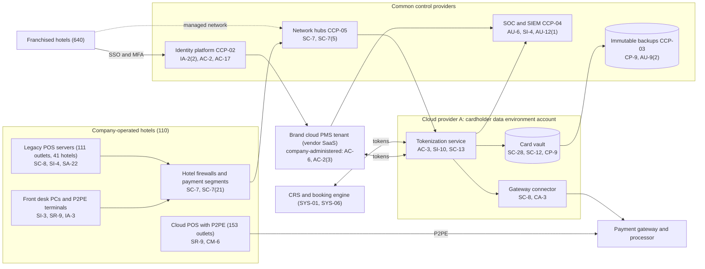

# System Security Plan: Property and Payment Platform (PPP)

**Organization:** Cris Santos Company, Inc. (publicly traded hotel franchisor, manager, and owner) | **Tier:** Enterprise | **Vertical:** Accommodation and Food Services
**Outline:** NIST SP 800-18 Rev. 2, System Security Plan Outline Example (June 2026) | **Version:** 3.0, 2026-09-14

## 1. System Name and Identifier
Property and Payment Platform (**PPP**), identifier CSC-SYS-PPP-001. Tier-1 system in the enterprise application inventory and the core of both PCI DSS assessments (merchant and service provider).

## 2. System Overview
The PPP is the "property management and point-of-sale system" for the whole brand. It lets 741 hotels check guests in and out, post charges, and take card payments, and it protects every stored card number the company holds. It has four parts:
- **Brand cloud PMS tenant (SYS-02).** The PMS software is vendor SaaS, but the company administers the multi-property tenant: configuration, roles, users (company and franchisee staff), and interfaces to the CRS, POS, door locks, and the tokenization service.
- **Tokenization service and card vault (SYS-03).** A company-built service in a dedicated cardholder data environment account on Cloud provider A. It replaces card numbers with tokens for the CRS, PMS, booking engine, and contact center, and detokenizes them only for authorization through the payment gateway. About 6.2 million active tokens.
- **POS estate at company-operated hotels (SYS-04).** 153 food and beverage outlets on a cloud POS with validated P2PE devices, and 111 outlets at 41 hotels on a legacy integrated POS with on-property servers.
- **Property payment network segments (part of SYS-05).** The payment and POS segments at the 110 company-operated hotels, the hotel firewalls, and the hub rules that connect them to the cloud.

**Why confidentiality matters most.** The vault and the payment paths hold or carry card data for all 750 hotels and 180 distribution clients. A compromise would trigger card brand investigations, notices to guests in every state where they reside, franchisee and owner claims, and possibly an SEC Form 8-K. The 2015 *FTC v. Wyndham* decision shows that a hotel franchisor answers for the security of the systems it manages for its hotels.

**Users:** about 36,500 PMS tenant accounts (about 8,900 company-operated hotel staff, about 26,400 franchisee staff, about 1,200 corporate and support staff), 46 vault and tokenization administrators and engineers, and about 5,600 POS users at company-operated hotels.

## 3. Laws, Regulations, and Policies Affecting the System
| ID | Requirement | Citation | How it affects the PPP |
|---|---|---|---|
| N72-R01 | PCI DSS v4.0.1 | PCI Security Standards Council standard (contractual, not law) | The PPP is the core of the merchant ROC (company-operated hotels) and the service provider ROC (franchise and distribution services). Service-provider-only requirements apply (for example 11.4.6, 12.4.2, 12.5.2.1, 12.9) |
| N72-R02 | FTC Act Section 5 | 15 U.S.C. 45(a), (n) | Reasonable security for card and guest data, including for systems the company manages for franchisees (*FTC v. Wyndham*, 799 F.3d 236) |
| N72-R03 | FTC Disposal Rule | 16 CFR 682.3 | Disposal of background-check information for staff with vault access |
| N72-R04 | State breach notification laws | Each state where affected individuals reside (Florida worked example: Fla. Stat. 501.171) | Notification after a compromise (P08) |
| SEC | Cybersecurity disclosure | Form 8-K Item 1.05; 17 CFR 229.106 | A material PPP incident goes through the P08 materiality step; the PPP program is described in the Item 106 disclosure |
| SOX | Internal control over financial reporting | Sarbanes-Oxley Act Section 404 (separate program) | PMS folio and night audit data feed revenue, owner reporting, and franchise fees; SOX IT general controls cover the PMS interfaces to the ERP |
| Florida | Guest register | Fla. Stat. 509.101(2) | PMS register data for Florida hotels is kept at least 2 years |
| Contract | Acquirer agreement; franchise agreements; management agreements; SL-1 and SL-2 client agreements | P03; P09 | Reporting, availability, and security commitments |
| Internal | POL-01 to POL-05, standards, and brand technology standards BS-TECH-01 to BS-TECH-06 | P06 | Enterprise policy hierarchy and the minimum rules for franchisees |

Not applicable: N72-R05 (Illinois BIPA; the PPP collects no biometric identifiers, and the company has disabled face matching at its Illinois hotels; P10 AI-005); N72-R06 (CIRCIA is proposed only; the PPP would be in scope of incident reporting if the rule is finalized as proposed, because the company exceeds the SBA size standard).

## 4. System Status
### 4.1 System Security Plan Approval
Prepared by the Vice President, Hotel Technology, the Director of Payments and PCI Compliance, and the GRC team. Reviewed by the CISO and the Director of Franchise Technology Compliance. Approved by the Chief Operating Officer on 2026-09-14.
### 4.2 System Authorization Decision
The company is not a federal agency, so there is no formal ATO. The equivalent internal decision:
- **Authorizing official equivalent:** Chief Operating Officer, with the CISO's recommendation and the CFO's concurrence for payment risks.
- **Decision (2026-09-14):** continue operation with conditions, based on the Internal Audit assessment (P07) and the risk register (P01).
- **Conditions:** remove the vendor remote tools at the 37 hotels (POAM-005 by 2026-12-31); close the franchised-segment hub rule and complete the overdue service provider segmentation test (POAM-004 by 2026-10-31); change the default credentials found on legacy POS servers (POAM-010, done 2026-08-14, verify by 2026-09-30); complete legacy POS replacement with P2PE (POAM-001 by 2027-06-30).
- **Reauthorization:** annually, or after a major change (for example, the resort migrations and the end of the transition services agreement in 2027-03).
### 4.3 System Operational Status
Operational. Planned major modifications: replacement of the legacy POS (111 outlets), migration of 9 resorts to the brand PMS and network, user behavior analytics for PMS and CRS use (AC-2(12)), and automatic rollback of unauthorized cloud configuration changes (CM-6(2)).

## 5. Role Identification and Responsible Personnel
| Role | Title | Responsibility |
|---|---|---|
| System owner | Vice President, Hotel Technology | Accountable for the PMS tenant, POS estate, and property payment networks; approves PMS roles |
| Payments owner | Director of Payments and PCI Compliance | Tokenization service, card vault, gateway relationship, PCI DSS program for both ROCs |
| Authorizing official (equivalent) | Chief Operating Officer | Accepts residual risk to operate |
| System administrators | PMS Tenant Administration Manager; Payments Platform Engineering Manager; POS Operations Manager | Day-to-day administration, change control, device management |
| Franchise oversight | Director of Franchise Technology Compliance | Brand technology standards, franchisee AOC tracking, franchisee administrator onboarding |
| Information security | CISO; Director of Security Operations | Program oversight; SOC monitoring; incident response |
| Privacy | Chief Privacy Officer | Data retention, breach determinations |
| Common control providers | See section 10.3 | Operate inherited controls |
| Independent assessors | Chief Audit Executive (Internal Audit); external QSA firm | Annual assessment (P07); PCI DSS ROCs |

## 6. System Information Types and System Categorization
Information types are modeled on NIST SP 800-60 Vol. 2 Rev. 1 and rated with FIPS 199 as a model; the impact levels are the company's own.

| Information type | Confidentiality | Integrity | Availability | Rationale |
|---|---|---|---|---|
| Cardholder data (card number, expiry, cardholder name; sensitive authentication data only in transit during authorization) | **High (treated)** | Moderate | Moderate | Disclosure of millions of card numbers would cause severe financial and reputational harm, card brand assessments, and multi-state notices. Integrity errors are caught by settlement reconciliation. Payments can fall back to P2PE terminals for hours (P05 BP-03: MTD 4 h, RTO 2 h) |
| Guest reservation and stay data (names, contact details, stay history, folios) | Moderate | Moderate | Moderate | Personal information under state breach laws; folio accuracy feeds revenue and SOX reporting |
| Hotel operations data (room status, key encoding interface, night audit) | Low | Moderate | Moderate | Room access depends on the PMS-to-lock interface (P05 BP-04) |
| Security information (keys, logs, credentials) | Moderate | Moderate | Moderate | Protects the evidence and keys behind the vault |
| **PPP category** | **Moderate baseline, confidentiality supplemented** | **Moderate** | **Moderate** | See the decision below |

**Categorization decision.** Under a strict FIPS 199 high-water mark, a High confidentiality rating would make the whole PPP High. The company is not a federal agency and uses FIPS 199 as a model. The risk committee of the board approved this tailoring on 2026-09-10:
- The PPP uses the **SP 800-53B Moderate baseline**.
- It adds **10 High-baseline controls** that protect cardholder data and match PCI DSS requirements: AC-2(12), AU-9(2), AU-12(1), CA-8, CA-8(1), CM-6(2), SC-7(21), SI-4(14), SI-7(2), SR-9.
- The decision is reviewed annually. If the legacy POS replacement (POAM-001) and the segmentation fix (POAM-004) are not closed by 2027-06-30, the CISO will recommend full High categorization for the payment components.

**Documented controls.** `control-implementation.csv` documents **145 controls**: 135 from the Moderate baseline and 10 High-baseline supplements. The remaining Moderate-baseline controls (mostly enhancements for AC, AU, CM, CP, IA, SC, and SI) are fully inherited from the common control catalog (section 10.3) and are listed there rather than repeated here. Privacy-baseline controls are documented in the enterprise privacy program.

## 7. Authorization Boundary Description
**Inside the boundary:** the card vault and tokenization service (cardholder data environment account, Cloud provider A); the payment gateway connector; the company's configuration, roles, users, and interfaces of the brand PMS tenant; the cloud POS configuration and P2PE device estate at company-operated hotels; the legacy POS servers and workstations at 41 hotels; the payment and POS network segments and hotel firewalls at the 110 company-operated hotels; front desk PCs and payment terminals at company-operated hotels.

**Outside the boundary (common control providers and interconnected systems):**
- Landing zone services (network hub, key management service, log archive, backup accounts, standby region): CCP-03
- Identity platform (SYS-09): CCP-02
- SOC, SIEM, EDR, scanners: CCP-04
- Managed property network hubs and SD-WAN (SYS-05): CCP-05
- Interconnected: CRS (SYS-01), booking engine (SYS-06), distribution switch (SYS-08), contact center and tone-masking service (SYS-13), PMS vendor's own infrastructure, payment gateway and processor, P2PE solution provider, door lock systems (SYS-11), franchised hotels' own networks and terminals, and the 9 resorts still on the seller's systems

The enterprise multi-cloud diagram is in P04 `cloud-architecture.md`.

## 8. Information Exchanges Summary
| Connected system / party | Direction | Data | Agreement |
|---|---|---|---|
| CRS (SYS-01) and booking engine (SYS-06) | Bidirectional (TLS API) | Card numbers in for tokenization; tokens out | Internal interface specification |
| Brand cloud PMS (vendor) | Bidirectional (TLS API) | Tokens; detokenization requests for authorization; folio postings | PMS vendor agreement with PCI DSS responsibility matrix; vendor service provider AOC |
| Payment gateway and processor | Outbound (TLS) | Authorization and settlement requests | Gateway agreement; gateway service provider AOC |
| P2PE solution provider | Device key injection and decryption at the provider | Encrypted card data from P2PE devices | P2PE agreement and P2PE Instruction Manual |
| Legacy POS vendor | Remote support | Troubleshooting access | Support agreement; **vendor-managed remote tool (POAM-005)** |
| Door lock vendors (2) | PMS-to-lock interface; remote support | Room numbers, guest names, key validity | Support agreements; **vendor-managed remote tools at 37 hotels (POAM-005)** |
| Distribution switch | Inbound (TLS API) | Reservations and virtual card numbers delivered to the vault | Distribution agreement; switch service provider AOC |
| Contact center tone-masking service | Inbound | Card numbers captured by keypad, passed straight to tokenization | Service agreement; service provider AOC |
| Franchised hotels (640) | PMS and CRS access through SSO; 410 through the managed network | Reservations, folios, tokens | Franchise agreements and brand technology standards |
| SIEM (CCP-04) | Outbound | Logs | Internal |

## 9. System Component Inventory
| Component | Type | Location / provider | Owner |
|---|---|---|---|
| Tokenization service (containers) | Managed containers (PaaS) | Cloud provider A, primary region; standby in second region | Payments Platform Engineering Manager |
| Card vault database | Managed relational database (PaaS) with hardware security module keys | Cloud provider A | Director of Payments and PCI Compliance |
| Gateway connector | Managed containers | Cloud provider A | Payments Platform Engineering Manager |
| PMS tenant configuration and interfaces | SaaS configuration | PMS vendor | PMS Tenant Administration Manager |
| Cloud POS configuration and P2PE devices (about 1,900 devices) | SaaS plus devices | 153 outlets | POS Operations Manager |
| Legacy POS servers (41) and workstations (about 470) | On-premises | 41 company-operated hotels | POS Operations Manager |
| Front desk PCs (about 1,150) and payment terminals (about 640) | Endpoints and devices | 110 company-operated hotels | Director of Endpoint Engineering |
| Hotel firewalls (110 pairs) | Network appliances | Company-operated hotels | Director of Network Engineering |

## 10. Control Implementation Details
### 10.1 Control implementation status
See `control-implementation.csv` (145 controls).

| Status | Count |
|---|---|
| Implemented | 113 |
| Partially implemented | 30 |
| Planned | 2 |
| **Total** | **145** |

| Inheritance | Count |
|---|---|
| Common (fully inherited from a common control provider) | 95 |
| Hybrid (shared between a provider and the PPP team) | 36 |
| System-specific | 14 |

The Planned controls are High-baseline supplements: AC-2(12) and CM-6(2). Partially implemented controls: AC-2, AC-2(3), AC-6, AC-17, AU-6, CA-2(1), CA-8, CM-2, CM-6, CM-8, CM-12, CP-2, CP-10, IA-5, IR-8, MA-4, MP-4, PS-4, RA-5, SA-9, SA-22, SC-7, SC-7(21), SC-8, SI-2, SI-4, SI-7, SI-7(2), SI-12, SR-9.

### 10.2 Control assessment status
Internal Audit assessed 42 of these controls from 2026-07-13 to 2026-08-28 using SP 800-53A Rev. 5 procedures and statistical sampling (P07 `assessment-plan.md`, `assessment-results.csv`). Weaknesses are in P07 `poam.csv`. The QSA assesses the same components against PCI DSS for the merchant ROC (fieldwork 2026-10-19 to 2026-11-13).

### 10.3 Common control providers and inheritance
Common and hybrid controls are inherited from the enterprise platform. Each provider publishes its controls in the enterprise **common control catalog** (maintained by the GRC team in the GRC platform) and is assessed on its own cycle; the PPP inherits the results.

| Provider | Name | Accountable role | Controls provided | Rows in this plan | Evidence of operation |
|---|---|---|---|---|---|
| CCP-01 | Enterprise GRC program | CISO (with the Chief Risk Officer and Chief Audit Executive for assessment) | Policies and standards (P06), risk methodology, assessment, POA&M, continuous monitoring, data location | 25 | Annual Internal Audit assessment (P07); GRC platform |
| CCP-02 | Identity platform (SYS-09) | Director of Identity and Access Management | SSO, MFA, PAM, identity governance, franchisee account federation | 20 | SOX IT general control testing; P07 AC-2, IA-2, IA-5 results |
| CCP-03 | Cloud landing zone (Cloud provider A) | Director of Cloud Platform Engineering | Account guardrails, network policies, key management service, encryption, backups, log archive, standby region | 18 | Posture management reports; provider SOC 2 Type 2 and service provider AOC |
| CCP-04 | Security operations | Director of Security Operations | 24x7 SOC, SIEM, EDR, vulnerability management, penetration testing, incident response | 27 | SOC metrics; P07 SI-4, RA-5, IR results |
| CCP-05 | Managed property network (SYS-05) | Director of Network Engineering | Hubs, SD-WAN, hotel firewalls, wireless, network access control | 8 | Firewall rule reviews; segmentation tests |
| CCP-06 | Endpoint engineering | Director of Endpoint Engineering | PC and POS terminal baselines, EDR agents, patching, device management, unsupported component tracking | 10 | Configuration compliance and patch reports |
| CCP-07 | Corporate security, hotel engineering, and colocation | Vice President, Corporate Security and Facilities | Hotel IT room physical access, media destruction, device inspections with hotel engineering, colocation physical controls | 8 | Badge reviews; inspection logs; colocation SOC 2 reports |
| CCP-08 | Human resources and workforce training | Chief Human Resources Officer | Screening, terminations, sanctions, training, acknowledgments | 9 | HR and learning system reports |
| CCP-09 | Third-party risk management | Director of Third-Party Risk Management | Vendor tiering, AOC and SOC report reviews, supply chain controls | 6 | Vendor register; AOC reviews |

**Inheritance rules:**
- A Common control is fully inherited; the PPP team verifies only that the PPP is onboarded (for example, SSO integration and log forwarding).
- A Hybrid control names both parts in the implementation statement: the provider's part and the PPP team's part.
- If a provider's assessment finds a weakness, the finding is linked to every inheriting system's POA&M. Example: POAM-003 (terminations at the resorts) is a CCP-02/CCP-08 weakness that affects the PPP because resort staff will hold PMS access after migration and already hold POS access.
- Franchisees inherit nothing automatically. What they may rely on is set out in the service provider responsibility matrix given with the service provider AOC (PCI DSS 12.9.2).

## 11. Digital Identity Acceptance Statement
- **Workforce users:** SSO with MFA (authenticator app with number matching, or a FIDO2 security key). Privileged users use phishing-resistant FIDO2 keys through PAM. This matches an authentication assurance level comparable to NIST SP 800-63 AAL2 for users and AAL3-like protection for privileged users.
- **Franchisee staff:** identity is vouched for by each hotel's designated administrator under the franchise agreement; MFA has been required for all PMS and CRS users since 2025-02. Shared logins are prohibited by brand standard BS-TECH-02.
- **Vendor support users:** named accounts through PAM with approval and session recording; the 5 vendors still on their own remote tools are the main exception (POAM-005).
- **Guests** do not use the PPP directly. Loyalty member sign-in belongs to the loyalty platform (SYS-07) and is assessed in P01 and P03.

## 12. Referenced Artifacts
Scenario facts (`../00_company-facts.md`), BIA (P05), multi-cloud architecture and control map (P04), enterprise risk register (P01), regulatory gap analysis (P03), policy hierarchy and policies (P06), Internal Audit assessment and POA&M (P07), POS and reservation compromise runbook (P08), SOC 2 readiness for SL-1 and SL-2 (P09), AI portfolio (P10), PPP contingency plan v3, cardholder data flow diagram v7, PCI DSS responsibility matrix for franchisees, 2025 merchant ROC, 2026 service provider ROC, enterprise common control catalog.

## 13. Acronym List and Glossary
- **AOC:** attestation of compliance (PCI DSS)
- **ASV:** approved scanning vendor
- **CCP:** common control provider
- **CDE:** cardholder data environment
- **CRS:** central reservation system
- **P2PE:** point-to-point encryption (PCI-listed validated solution)
- **PAM:** privileged access management
- **PMS:** property management system
- **POA&M:** plan of action and milestones
- **QSA:** Qualified Security Assessor
- **ROC:** Report on Compliance
- **Tokenization:** replacing a card number with a surrogate value that cannot be reversed without the vault

## 14. System Security Plan Review and Change Records
| Version | Date | Change | Author |
|---|---|---|---|
| 1.0 | 2024-09-20 | Initial plan (Moderate baseline) | Vice President, Hotel Technology |
| 2.0 | 2025-09-12 | Added the card vault rebuild and cloud POS; resort collection noted as pending integration | Director of Payments and PCI Compliance |
| 3.0 | 2026-09-14 | Confidentiality supplementation; common control provider mapping; 2026 assessment results | Vice President, Hotel Technology with GRC team |
