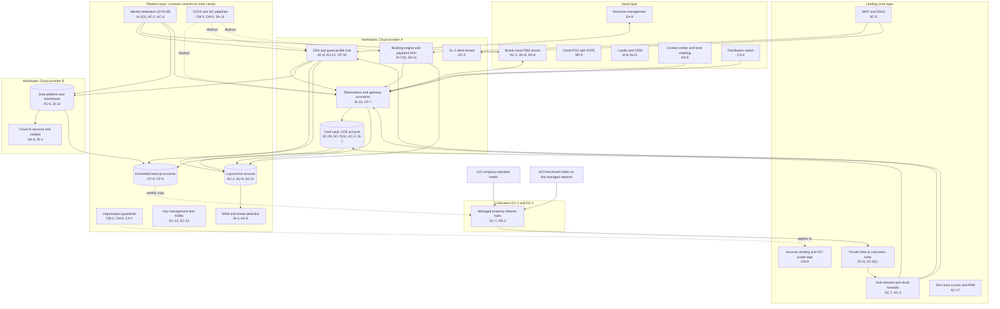

# Cloud Architecture and Control Placement: Cris Santos Company | Accommodation and Food Services | Enterprise

**Organization:** Cris Santos Company, Inc. (publicly traded hotel franchisor, manager, and owner) | **Tier:** Enterprise | **Provider:** Multi-cloud, vendor-agnostic: two public cloud providers (called Cloud provider A and Cloud provider B), two colocation data centers that host the managed property network hubs, and SaaS (see section 4)
**Owner:** Director of Cloud Platform Engineering, with the CISO and the Director of Payments and PCI Compliance | **Date:** 2026-08-31 | **Related:** PPP SSP (P02), enterprise BIA (P05)

## 1. Architecture in layers
The estate is organized in four layers plus colocation. Each lower layer provides **common controls** that the layers above inherit, so a workload team configures only what is specific to its system.

| Layer | What it is | Examples | Who runs it |
|---|---|---|---|
| **Platform** | Organization-wide services in both clouds | Cloud organization guardrails, identity federation, key management and hardware security modules, log archive, SIEM feeds, vulnerability and posture management, immutable backup accounts, CI/CD pipelines | Cloud Platform Engineering; Security Operations; Identity team |
| **Landing zone** | The standard account pattern every workload lands in | Account vending with mandatory PCI scope tags, hub-and-spoke network with cloud firewalls, private links to the colocation hubs, WAF and DDoS protection, zero-trust and PAM access | Cloud Platform Engineering; Network Engineering |
| **Workload** | Systems built or run by the company | Cloud A: CRS (SYS-01), card vault and tokenization service (SYS-03, its own cardholder data environment account), booking engine (SYS-06), SL-2 distribution client tenant. Cloud B: data platform and warehouse (SYS-14), cloud AI services and the chatbot integration | Application teams (for example, the Payments Platform Engineering Manager) |
| **SaaS** | Vendor-operated applications | Brand cloud PMS, cloud POS with P2PE, loyalty and CRM, contact center with tone-masking, distribution switch, revenue management, ERP and payroll, productivity suite | Vendors, with the company's configuration and oversight |

Colocation DC-1 (Florida) and DC-2 (Texas) host the managed property network hubs that connect the 110 company-operated hotels and 410 franchised hotels, plus an offline copy of the immutable backups.

## 2. Diagram

## 3. Responsibility by service model
Sources: SRC-AWS-SRM, SRC-AZURE-SRM, and SRC-GCP-SRM in `00_universal-framework/sources/source-register.csv`. The three published models agree on the split used here, so the design does not depend on which two providers the company uses.

| Service model | Provider | Company (customer) | Shared |
|---|---|---|---|
| IaaS (hub network, private links) | Facilities, hosts, hypervisor, physical network | Guest OS, network policy, identities, data | Encryption (provider service, customer keys), logging |
| PaaS (vault database, tokenization containers, CRS, warehouse, AI services) | Also the platform runtime and its patching | Data, access, configuration, keys, application code | Backups, availability configuration |
| SaaS (PMS, POS, loyalty, contact center, switch) | Also the application | Users, roles, data, oversight of the vendor (AOC and SOC report review) | Audit review; the PCI DSS responsibility matrix in each vendor contract |
| Colocation (network hubs) | Building, power, cooling, perimeter | Racks, equipment, cage access lists | None |

**PCI DSS twist.** Every cloud provider and SaaS vendor that stores, processes, or transmits card data, or can affect its security, is a third-party service provider under PCI DSS 12.8. The company keeps each one's AOC and a written split of responsibilities. In turn, the company is the service provider for franchisees and SL-2 clients and gives them its own AOC and responsibility matrix (PCI DSS 12.9).

## 4. Service categories and provider equivalents
| Service category | AWS | Microsoft Azure | Google Cloud |
|---|---|---|---|
| Organization guardrails | AWS Organizations service control policies | Azure Policy with management groups | Organization Policy Service |
| Account vending | AWS Control Tower account factory | Azure landing zone subscription vending | Resource Manager project creation |
| Key management | AWS KMS | Azure Key Vault | Cloud KMS |
| Dedicated hardware security modules | AWS CloudHSM | Azure Dedicated HSM or Managed HSM | Cloud HSM |
| Audit logging | AWS CloudTrail | Azure Monitor activity log | Cloud Audit Logs |
| Threat detection | Amazon GuardDuty | Microsoft Defender for Cloud | Security Command Center |
| Managed relational database | Amazon RDS | Azure SQL Database | Cloud SQL |
| Managed containers | Amazon EKS | Azure Kubernetes Service | Google Kubernetes Engine |
| Web application firewall | AWS WAF | Azure Web Application Firewall | Cloud Armor |
| Backup service | AWS Backup | Azure Backup | Backup and DR Service |

This table is for reading provider documentation only. The architecture, control map, and SSP describe service categories.

## 5. Common controls
`cloud-control-map.csv` has **61 rows** across 30 components: Platform 23, Landing zone 7, Workload 16, SaaS 12, Colocation 3. Responsibility: Customer 39, Shared 16, Provider 6.

**28 rows are published as common controls** (`common_control` = Yes) in the enterprise common control catalog. They map to the common control providers in the PPP SSP (P02 section 10.3): identity (CCP-02), landing zone (CCP-03), security operations (CCP-04), the managed property network (CCP-05), and colocation (CCP-07). A workload inherits them by being deployed through account vending, which applies the guardrails, logging, network, key, and backup policies automatically.

**Rules for inheriting:**
1. A workload may claim a common control only if its account was created by account vending and passes the posture baseline.
2. The cardholder data environment account claims common controls for logging, backups, and identity, but its network isolation, encryption, and integrity monitoring are its own (rows marked No), because the QSA tests them directly.
3. Customer-side identity, data protection, and logging stay explicit at every layer: even a SaaS application has Customer rows for access (AC-2, AU-6) because those are always the company's responsibility.
4. SaaS rows cite the vendor's AOC or SOC 2 report, reviewed by the third-party risk team (P09 evidence map).

## 6. Validation against the PPP SSP (P02)
Every cloud or SaaS component in the SSP boundary appears here with controls from each required family, directly or inherited:
| PPP component | AC | AU | CM | IA | SC | SI |
|---|---|---|---|---|---|---|
| Card vault (CDE account) | AC-3 | AU-2, AU-9 (inherited) | CM-6 (inherited) | IA-2(1) (inherited) | SC-28, SC-7(21) | SI-7 |
| Tokenization service and gateway connector | AC-6 (inherited) | AU-2 (inherited) | CM-3, CM-5 (inherited) | IA-2(1) (inherited) | SC-8(1) (inherited), SC-12 | SI-10 |
| Brand cloud PMS tenant (SaaS) | AC-2 | AU-6 | CM-2 (vendor, per AOC) | IA-2(1) (inherited) | SC-8 (vendor, per AOC) | SA-9 for the vendor's part |
| Cloud POS with P2PE (SaaS) | AC-2 (inherited) | AU-6 (inherited) | CM-8 (P02) | IA-3 (P02) | SC-8 (P2PE) | SR-9 |

The legacy POS servers and hotel firewalls are on premises and are covered in P02, not here.

## 7. Findings from the mapping
1. **Franchised segments reach the CRS integration tier.** One hub rule let franchised hotel segments reach the CRS integration tier on 2 ports (2026-05 penetration test). This is the *FTC v. Wyndham* pattern: hotel networks the franchisor connects must not reach its core systems. Fix: rule removed 2026-06-02 pending verification; segmentation retest every six months as a service provider (POAM-004).
2. **Resort microsites outside the platform.** The 3 resort booking microsites run on the seller's hosting under the transition services agreement, outside the landing zone, with no payment page script controls (POAM-015). They move to the brand booking engine by 2026-12-15.
3. **Two clouds, one control set.** Guardrails, logging, and key policies are written once as code and applied to both clouds. Card data stays in Cloud provider A only; Cloud provider B sees tokens and hashed identifiers.
4. **Card data where it should not be.** Platform controls cannot stop card numbers typed into email or chat. Data discovery found about 4,800 emails with card numbers (POAM-006), and chat transcripts are now redacted before storage.
5. **SaaS assurance is the control.** For the PMS, cloud POS, contact center, and switch, the company's control is the vendor's AOC plus the responsibility matrix. Three vendor AOCs expire in 2026 Q4 and are tracked by the third-party risk team.
6. **AI services** run under contract terms with no training on company data; the AI governance committee reviews each new model deployment (P10).
