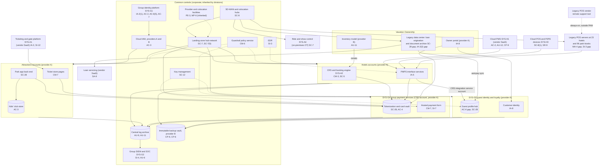
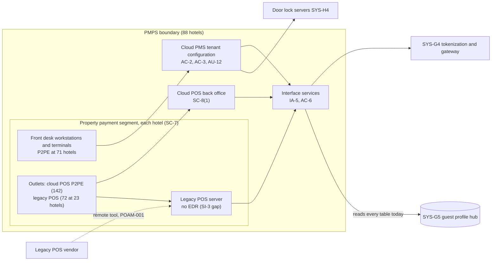

# Cloud Architecture and Control Placement: Cris Santos Company Holdings | Accommodation and Food Services | Multi-Sector

**Organization:** Cris Santos Company Holdings, Inc. | **Tier:** Multi-Sector | **Providers:** two public cloud providers, called Cloud provider A and Cloud provider B (vendor-agnostic; see section 6), two colocation data centers, and SaaS vendors
**Scope:** the shared corporate platform (SYS-G1 to SYS-G5) plus the division workloads that run on it or connect to it. The SSP system (P02) is the Hotels division's Property Management and Point-of-Sale Platform (PMPS).

## 1. Design in one paragraph
Corporate runs one **landing zone** per provider: identity federation from SYS-G1, a hub network, guardrail policies, a central log archive, key management, EDR, and an immutable backup vault. Two **colocation hubs** terminate the SD-WAN from every hotel, park, resort, and sales gallery. **Group payment services (SYS-G4)** run in a dedicated cardholder data environment (CDE) account in Cloud provider A and serve all three divisions; the **guest profile hub (SYS-G5)** runs in its own account next to it. Divisions get their own accounts inside the landing zone and inherit the guardrails. Cloud provider A hosts the Hotels CRS and booking engine, the park app and ticket store pages, and the owner portal. Cloud provider B hosts the backup vault, disaster recovery replicas, and the Vacation Ownership inventory model, and is the 2027 target for the division's legacy data center. Several important systems sit **outside the cloud platform**: the PMS, cloud POS, ticketing, and loan servicing are vendor SaaS; the legacy POS servers sit at 23 hotels; ride and show control networks sit at 7 parks; and Vacation Ownership's loan origination and document archive sit in its legacy data center.

## 2. Diagrams
### 2.1 Group platform and division workloads

### 2.2 PMPS (SSP boundary) and its property segments

**Target state (POAM-001, POAM-013, P2PE program; 2026-11-30 to 2027-06-30):** the legacy POS vendor reaches its servers only through group PAM with named accounts, and then the legacy POS is replaced by the cloud POS with validated P2PE; the CRS integration service account reads only the loyalty fields; owners' bank data leaves the guest profile hub and stays tokenized in SYS-V3 (P03).

## 3. Tenancy and identity decision
**Decision.** Hotels, Attractions, and corporate share the group identity platform (SYS-G1). Each division gets its own accounts inside the landing zones, with roles federated from SYS-G1. Group payment services (SYS-G4) run in a dedicated CDE account, and the guest profile hub (SYS-G5) in its own account, both under SYS-G1. Vacation Ownership's 6,500 users stay on the division's legacy directory until they join SYS-G1 on 2027-03-31. No division has a separate tenant by design.

**Reason.** One identity platform, one SIEM, one tokenization service, and one backup design let group internal audit assess common controls once. The dedicated CDE account keeps card data in one PCI DSS scope that serves all three divisions with tokens. The sample names no rule that requires a division to have its own identity tenant.

**What limits blast radius.** Administrators use phishing-resistant MFA and just-in-time PAM with session recording, and 11 of 13 property-system vendors connect through PAM. CDE accounts allow only payments engineering roles, and cloud IAM has no long-lived user keys. Divisions receive card tokens, not card numbers. Backups use a separate backup identity.

**Known gaps.** The legacy POS vendor's always-on tool is outside PAM (POAM-001). The CRS integration service account reads every guest profile hub table (POAM-013). 340 Vacation Ownership users reach loan origination without MFA (POAM-020). A vendor jump host bridges park business and ride control networks (GR-09).

Cross-division risks: GR-05 (ransomware through shared identity and network), GR-01 (POS malware through the shared vendor), GR-10 (credential stuffing across the shared guest identity).

## 4. Common versus division-specific controls
`cloud-control-map.csv` has 52 rows across 34 components. The `control_scope` column shows who owns each placement:

| Scope | Rows | What it means |
|---|---|---|
| Common (group) | 26 | Provided once by corporate (SYS-G1 to SYS-G5) and inherited by divisions. Listed in the P02 common control catalog |
| PMPS (Hotels SSP system) | 9 | Controls of the SSP system documented in P02 |
| Division-specific (Hotels) | 5 | CRS, contact center, revenue management, chatbot |
| Division-specific (Attractions) | 7 | Ticketing and gates, ticket store pages, park app, kids' club, ride control |
| Division-specific (Vacation Ownership) | 5 | Legacy data center, loan servicing, owner portal, inventory model |

| Responsibility | Rows |
|---|---|
| Customer (the group or a division) | 37 |
| Shared (provider and group) | 11 |
| Provider | 4 |

**Rule of thumb.** Identity, network guardrails, logging, keys, backups, EDR, and **payment tokenization** are common. A division cannot opt out of them, only request an exception through POL-01. Application behavior, data held inside division applications, and customer-facing features are division-specific, because they depend on each division's regulators: card brands for all three, the FTC's children's rule for the kids' club, and the FTC Safeguards Rule for loan data.

**Why payment services are common.** One tokenization service means one place where card numbers are stored, one key hierarchy, and one set of PCI DSS Requirement 3 controls. All three divisions' validations (two QSA ROCs and one SAQ D) inherit them, and group internal audit assessed them once (P07).

## 5. Layers
| Layer | Common components | Division components | Key controls | Responsibility |
|---|---|---|---|---|
| Identity | SYS-G1, cloud IAM, SYS-G5 customer identity | PMS roles, ticketing staff sign-in, Vacation Ownership legacy directory | AC-2, AC-3, AC-6(5), IA-2(1), IA-2(2), IA-8 | Customer (configuration); vendor (service) |
| Network | Hubs, SD-WAN, colocation | Property payment segments, ride control networks | SC-7, SC-7(5), SC-8, SC-5 | Customer, with provider DDoS protection shared |
| Compute | Guardrails, EDR | CRS containers, legacy POS servers, ticket store pages | CM-3, CM-6, CM-7, SI-3, MA-4 | Customer (guest OS, containers, code); vendor for SaaS |
| Data | SYS-G4 vault, keys, backup vault, guest profile hub | Kids' club store, loan document archive, P2PE devices | SC-12, SC-28, SC-8(1), CP-9, CP-6, SI-12 | Shared: provider encrypts storage; group owns keys, tokenization, and retention |
| Logging and monitoring | Log archive, SIEM | PMS audit export, chatbot transcripts, inventory model records | AU-3, AU-6, AU-9, AU-11, AU-12, SI-4, SI-7 | Shared: providers generate platform logs; group retains and reviews |
| SaaS dependencies | Identity, SIEM, EDR vendors | PMS, cloud POS, ticketing, loan servicing, contact center, revenue management, chatbot | SA-9, CP-9 | Provider for the service; customer for use and oversight |
| Physical | Provider and colocation facilities | Hotel IT rooms, POI devices, ride control cabinets | PE-3, MP-6, SR-9 | Provider (inherited) for data centers; customer for properties |

## 6. Service categories and provider equivalents
The design does not depend on a provider. This table gives each provider's name for each service category, for reading its shared responsibility documentation.

| Service category | AWS | Microsoft Azure | Google Cloud |
|---|---|---|---|
| Account structure and guardrails | AWS Organizations with service control policies | Management groups with Azure Policy | Resource hierarchy with Organization Policy |
| Managed containers (CRS) | Amazon EKS | Azure Kubernetes Service | Google Kubernetes Engine |
| Managed relational database (profile hub, park app) | Amazon RDS / Aurora | Azure SQL Database / Azure Database for PostgreSQL | Cloud SQL / AlloyDB |
| Key management with hardware backing | AWS KMS / CloudHSM | Azure Key Vault Managed HSM | Cloud KMS / Cloud HSM |
| Web application firewall and DDoS protection | AWS WAF / Shield | Azure Web Application Firewall / DDoS Protection | Cloud Armor |
| Audit logging | AWS CloudTrail | Azure Monitor activity log | Cloud Audit Logs |
| Backup with immutability | AWS Backup (vault lock) | Azure Backup (immutable vault) | Backup and DR Service |
| Private connectivity to colocation hubs | AWS Direct Connect / PrivateLink | Azure ExpressRoute / Private Link | Cloud Interconnect / Private Service Connect |

Shared responsibility sources: SRC-AWS-SRM, SRC-AZURE-SRM, SRC-GCP-SRM in `00_universal-framework/sources/source-register.csv`. All three agree on the split used here: for IaaS the provider owns facilities, hosts, and virtualization; for PaaS the provider also owns the runtime; for SaaS the provider owns the application. The customer always keeps identities, access decisions, data classification, and data. For PCI DSS, each SaaS or service provider's AOC and responsibility matrix (Requirement 12.8.5) shows which requirements it meets for the group.

## 7. Findings from the mapping
1. **The weakest links are outside the cloud platform.** The common cloud controls are sound. The gaps sit at the legacy POS servers (vendor remote tool outside PAM, no EDR; MA-4, SI-3), the ride control networks (SC-7), and the Vacation Ownership legacy data center (SC-28, IA-2(2)). Each is a division-specific or PMPS row.
2. **The guest profile hub is a shared data store with a shared credential.** Encryption is in place (SC-28), but the CRS integration service account reads every table (AC-6), and the hub holds owners' bank account numbers that should never have left SYS-V3 (P01 GR-02; POAM-013).
3. **Payment page scripts are a shared duty.** SYS-G4 serves the payment form, but each division owns the pages that embed it. The 3 park ticket microsites lack a script inventory and tamper detection (CM-7, SI-7; PCI DSS 6.4.3 and 11.6.1; POAM-012).
4. **Children's and biometric data sit with vendors.** The kids' club analytics vendor and the gate vendor hold sensitive data under contracts that lack the written assurances 16 CFR 312.8(c) requires and any deletion schedule (SA-9, SI-12; POAM-017, POAM-018).
5. **Common controls are strong and reused.** One identity platform, one SIEM, one tokenization service, one backup design. That is what lets group internal audit assess them once (P07). The weak link is documentation of inheritance for Vacation Ownership (P02, POAM-027), not the controls themselves.
