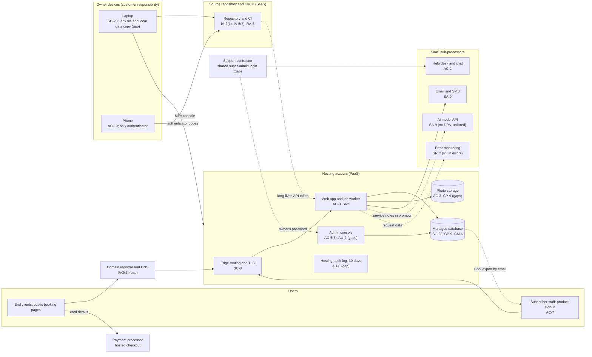

# Cloud Architecture and Control Placement: Cris Santos Company | Information | Sole Proprietorship

**Organization:** Cris Santos Company (independent B2B SaaS software publisher) | **Tier:** Sole Proprietorship | **Provider:** Vendor-agnostic. PaaS and SaaS only (no IaaS)
**System:** Multi-tenant Booking Platform (MBP), as defined in the system profile (P02) | **Control map:** `cloud-control-map.csv` (23 rows, 15 components)

**Why PaaS is in scope at this tier.** The tier default is SaaS tenants only. This business publishes its own SaaS product, so the product's hosting is part of the owner's stack. It runs on a managed application platform and managed database, where the provider runs servers, operating systems, and networks. The owner still manages no infrastructure (`../00_company-facts.md` section 5).

## 1. Diagram
Control IDs on each node are the ones in `cloud-control-map.csv`. Dashed lines are flows with a gap.

## 2. Layers
| Layer | Components | Key controls | Responsibility |
|---|---|---|---|
| Identity | Hosting console, repository, registrar, admin console, help desk, secrets | IA-2(1), IA-5, IA-5(7), AC-6(5), AC-2 | Customer (the owner) for every account, token, and second factor; providers supply MFA features |
| Network / edge | Edge routing, TLS, database network exposure | SC-8, CM-6 | Shared: provider runs the edge and certificates; owner sets HTTPS rules and who can reach the database |
| Compute / application | Web application, job worker, admin console | AC-3, SI-2 | Shared: provider patches the runtime and operating system; owner owns code, libraries, and tenant isolation |
| Data | Managed database, backups, photo storage, local copy on the laptop | SC-28, CP-9, AC-3 | Shared: provider encrypts and runs backups; owner decides retention, copy locations, and link exposure |
| Logging | Hosting audit log, application logs, error monitoring | AU-2, AU-6, SI-12 | Shared: provider records platform events; owner must log admin actions, keep logs, review them, and keep personal data out of error reports |
| SaaS sub-processors | Messaging, AI model API, error monitoring, help desk | SA-9 | Provider runs the service; owner owns contracts, configuration, and oversight |
| Endpoints | Laptop and phone | SC-28, AC-19 | Customer |
| Physical | Provider data centers | Inherited (PE family) | Provider |

## 3. Shared responsibility and provider equivalents
All three major cloud providers' shared responsibility models (SRC-AWS-SRM, SRC-AZURE-SRM, SRC-GCP-SRM) agree on the split used here:
- **PaaS (managed application platform and database):** the provider runs facilities, hosts, operating systems, the runtime, and database patching. The customer keeps its code, libraries, identities, secrets, configuration, and data.
- **SaaS (repository, messaging, AI API, monitoring, help desk, registrar):** the provider also runs the application. The customer keeps its accounts, settings, and data.

**Whatever the model, the owner always keeps identities and secrets, data and where copies go, logging and review, and vendor oversight.** That is why 19 of the 23 rows in the control map are the owner's, 3 are shared, and only 1 (database encryption at rest) is the provider's alone. A provider's SOC 2 report never covers these rows.

| Service category | AWS | Microsoft Azure | Google Cloud |
|---|---|---|---|
| Managed application platform | AWS Elastic Beanstalk or AWS App Runner | Azure App Service | Cloud Run or App Engine |
| Managed relational database | Amazon RDS | Azure Database for PostgreSQL | Cloud SQL |
| Object storage with signed links | Amazon S3 presigned URLs | Azure Blob Storage shared access signatures | Cloud Storage signed URLs |
| Account audit log | AWS CloudTrail | Azure Monitor activity log | Cloud Audit Logs |

This table only helps the owner read each provider's documentation. The company's actual hosting provider is described by category, not by name.

## 4. Findings from the mapping
1. **One stolen secret reaches everything (IA-5, IA-5(7)).** The long-lived hosting API token can deploy code, read settings (including the database password), and delete backups. A copy sits in a plaintext `.env` file on the laptop. This is the entry point in the P08 scenario (P01 R-001).
2. **The admin console is the weakest door (AC-6(5), AU-2).** It can open and export any subscriber's data, uses a password only, is shared with the contractor, and records nothing (R-003).
3. **Backups share a blast radius with production (CP-9).** All database backups live in the production account, and photos have no backup at all. The website promises "automatic backups every day" (R-007; P03 G-033).
4. **Found during this mapping:** photos are served through public links that never expire, and the database accepts connections from any address with a password (CM-6, AC-3). Both are configuration changes the owner can make without cost.
5. **Data leaves the platform in three unplanned ways:** service notes in AI prompts (SA-9; P10), client names and phone numbers in error reports (SI-12), and CSV exports sent by email (SC-8).
6. **The domain registrar has no MFA (IA-2(1)).** Whoever controls the domain controls every booking link and the company's email (R-012).
