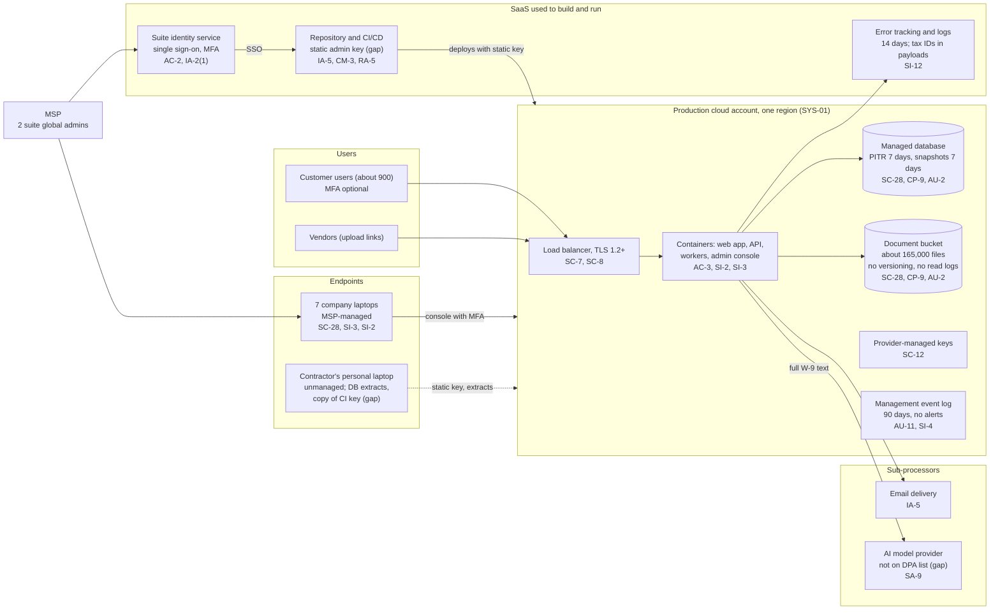

# Cloud Architecture and Control Placement: Cris Santos Company | Information | Micro

**Organization:** Cris Santos Company, LLC (B2B SaaS software publisher) | **Tier:** Micro | **Provider:** Vendor-agnostic public cloud plus SaaS (see section 3)
**System:** Vendor Compliance Platform (VCP), as defined in the SSP (P02) | **Prepared:** 2026-08-07 by the CTO with the Senior Software Engineer and the MSP lead technician | **Approved:** Chief Executive Officer, 2026-09-15

## 1. Diagram
The company runs one cloud workload, its own production account (SYS-01), and buys everything else as SaaS. The MSP manages the laptops and the productivity suite but has no access to the production account.

## 2. Layers and who is responsible
| Layer | Components | Key controls | Customer (the company) | MSP (on the company's behalf) | Provider (cloud or SaaS vendor) |
|---|---|---|---|---|---|
| Identity | Cloud console accounts, CI key, root account, suite single sign-on, admin console accounts | AC-2, AC-6, IA-2(1), IA-5 | Decides who gets which cloud role; manages keys and the root account; admin console accounts | Creates and disables suite accounts; enforces suite MFA; holds 2 global administrator accounts | Runs the sign-in and MFA services |
| Network | Load balancer, subnets, network rules | SC-7, SC-8 | Defines rules in infrastructure code; sets TLS policy | None | Network fabric, TLS termination |
| Compute | Containers for web app, API, workers, admin console | SI-2, SI-3, AC-3 | Images, libraries, application code, tenant isolation, upload scanning | None | Container platform and its patching |
| Data | Database, document bucket, snapshots, keys | SC-28, CP-9, SC-12, SI-12 | Retention, versioning, backup location, who can read data, restore tests, deletion of former customers' data | None | Storage encryption, key management, durability |
| Logging | Management events, data events, application logs | AU-2, AU-11, SI-4 | Turns on data-level logs, archive, and alerts; reviews them | Laptop and suite alerts during business hours | Records management events by default |
| SaaS | Repository and CI/CD, error tracking, email delivery, AI model provider | CM-3, RA-5, SA-9 | Configuration, keys, what data is sent, contracts and reviews | Suite administration | Application, platform, and data centers |
| Endpoints | 7 company laptops; the contractor's laptop | SC-28, SI-3, SI-2, AC-11 | Approves exceptions; keeps the inventory; brings the contractor's laptop under control | Encryption, antivirus, patching, screen lock, wiping | Not applicable |
| Physical | Provider data centers | PE-3 | Reviews the provider's SOC 2 report each year | None | Fully responsible |

**The MSP is not a cloud provider in the shared responsibility sense.** It performs customer-side duties for the company on the laptops and the suite. Anything marked "Customer (performed by MSP)" in `cloud-control-map.csv` stays the company's responsibility: the company must direct the work, receive evidence, and check it (SA-9, PS-7). Because the suite's single sign-on opens the repository, the MSP's two global administrator accounts are an indirect path to the CI pipeline (P01 R-012).

## 3. Service categories and provider equivalents
The design is vendor-agnostic. This table gives each large provider's name for each category, only to help read their shared responsibility documentation.

| Service category | AWS | Microsoft Azure | Google Cloud |
|---|---|---|---|
| Managed containers | Amazon ECS or AWS Fargate | Azure Container Apps | Cloud Run |
| Managed relational database | Amazon RDS | Azure Database for PostgreSQL | Cloud SQL |
| Object storage | Amazon S3 | Azure Blob Storage | Cloud Storage |
| Key management | AWS KMS | Azure Key Vault | Cloud KMS |
| Secrets manager | AWS Secrets Manager | Azure Key Vault | Secret Manager |
| Audit logging | AWS CloudTrail | Azure Monitor activity log | Cloud Audit Logs |
| Threat detection | Amazon GuardDuty | Microsoft Defender for Cloud | Security Command Center |
| Federated workload credentials for CI | IAM OIDC identity provider with IAM roles | Microsoft Entra workload identity federation | Workload Identity Federation |

Shared responsibility sources: SRC-AWS-SRM, SRC-AZURE-SRM, SRC-GCP-SRM in `00_universal-framework/sources/source-register.csv`. All three models agree on the split used here:
- **IaaS (object storage, network):** the provider owns facilities, hardware, and the virtualization layer. The company owns configuration, identities, access, and data.
- **PaaS (managed containers and database):** the provider also runs the platform software and its patching. The company still owns images, code, access, configuration, backups, retention, and data.
- **SaaS:** the provider also owns the application. The company keeps identities, access, configuration, and the data it chooses to send.

## 4. Findings from the mapping
1. **One static key reaches everything (IA-5, AC-6).** The CI pipeline deploys with a long-lived key that has full administrator rights over the account, including the document bucket and snapshots, and a copy sits on an unmanaged personal laptop. This is the entry point in the P08 scenario. Fix: short-lived federated credentials scoped to deployment, and delete the key (P01 R-001, P07 POAM-004, due 2026-10-15).
2. **The company cannot see who read which file (AU-2, SI-4).** Only management events are logged, for 90 days. After a key leak the company could not tell customers which documents were taken, so it would have to assume all of them were. Fix: object read logging on the bucket, database audit logging, provider threat detection, and a 1-year archive in a separate account (R-001, POAM-005, due 2026-11-30).
3. **Backups share a blast radius with production (CP-9).** Snapshots live in the production account, and the bucket has no versioning. A compromised administrator or a faulty script could delete customer data and its recovery points. Fix: versioning, and copies in a separate backup account with write-once retention of 35 days, which also meets the 30-day promise in the security exhibit (R-007, POAM-007).
4. **Customer data leaves the boundary in three uncontrolled ways (SA-3(2), SA-9, SI-12).** Database extracts on laptops, full W-9 text (with Social Security numbers) sent to the AI model provider, and tax IDs in error payloads. None of these is in the DPA's description of processing, and the website says tax IDs never leave the platform (P03 G-032). Fix: stop extracts, redact before sending, and sign a DPA with the model provider (R-003, R-005, R-016).
5. **The provider side is strong; the company side is the weak layer.** The cloud provider's SOC 2 report (P09 V-01) evidences the inherited controls. The gaps are in what the provider's report assigns to the customer: keys, roles, logging, backups, and network rules.
