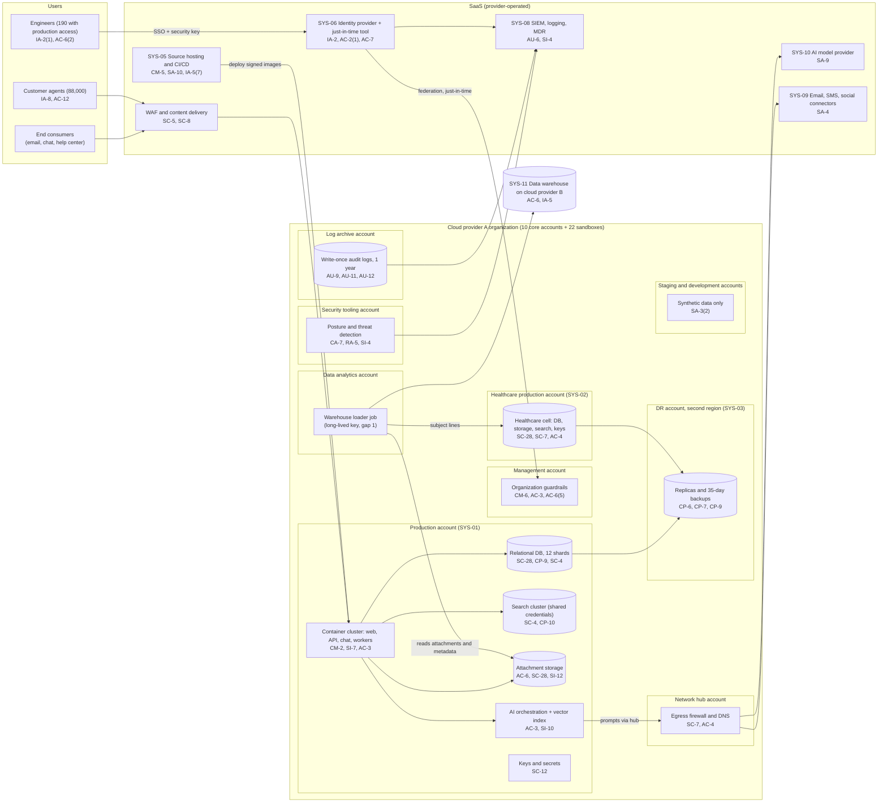

# Cloud Architecture and Control Placement: Cris Santos Company | Information | Mid-Market

**Organization:** Cris Santos Company, Inc. | **Tier:** Mid-Market | **Provider:** Vendor-agnostic public cloud provider A (primary), a SaaS data platform on cloud provider B, plus SaaS services (see section 4)
**System:** Customer Engagement Platform (CEP), as defined in the SSP (P02) | **Prepared:** 2026-08-07 by the VP Platform Engineering and the Director of Security; updated 2026-09-29 with P07 results
**Control map:** `cloud-control-map.csv` (56 rows, 23 components)

## 1. Diagram

## 2. Landing zone design
The landing zone separates duties across 10 core accounts (subscriptions or projects, depending on the provider) under one cloud organization, plus 22 engineer sandboxes in a separate organizational unit. Each account limits what an attacker can reach from any other.

| Account | Purpose | Who administers | Key design decisions |
|---|---|---|---|
| **Management** | Organization root, guardrails, billing | Director of Security and VP Platform Engineering (2 people) | No workloads. Root credentials sealed. Guardrails apply to every member account and cannot be disabled from them |
| **Security tooling** | Posture management, threat detection, security automation | Security team (6) | Delegated administrator for security services across the organization |
| **Log archive** | Cloud audit logs from every account | Security team (read: 3 people) | Write-once retention for 1 year. Nobody in a workload account can delete logs |
| **Network hub** | Egress firewall, DNS, inter-account routing | Platform engineering | All workload egress passes the hub. Production, healthcare, and development have no routes to each other |
| **Production** | SYS-01: the multi-tenant platform for about 2,350 customers | Platform engineering, through just-in-time access | Private subnets; ingress only through the edge; company-managed keys |
| **Healthcare production** | SYS-02: the healthcare cell for 46 customers | Platform engineering, through just-in-time access | Separate keys, database, storage, and search. Egress only to sub-processors under BAAs (2 exceptions, gap 8) |
| **DR** | SYS-03: replicas, images, 35-day backups in a second U.S. region | Platform engineering | Pilot light today; warm standby planned |
| **Staging** | Pre-production testing | Engineering | Synthetic data only; snapshot sharing from production blocked |
| **Development** | Shared development and CI runners | Engineering | No production credentials reachable |
| **Data analytics** | Export staging and the warehouse loader | Data team | Loader uses a long-lived key into production and pushes to cloud provider B (gaps 1 and 3) |

## 3. Layers and shared responsibility per service
| Layer | Components | Key controls | Service model | Responsibility |
|---|---|---|---|---|
| Identity | Organization root, cloud federation, just-in-time access, workload identities, SYS-06 | IA-2, IA-2(1), IA-5, IA-5(7), AC-2, AC-6(2), AC-6(5) | PaaS / SaaS | Customer configures identities, roles, MFA, keys, and reviews; provider runs the identity services |
| Network | Hub firewall, routing, edge WAF and content delivery | SC-5, SC-7, SC-8, AC-4 | IaaS / SaaS | Customer designs routes, rules, and segmentation; provider runs the gateways and absorbs volumetric attacks |
| Compute | Container cluster, search cluster virtual machines, AI orchestration | CM-2, CM-6, SI-2, SI-7, AC-3, SI-10 | PaaS / IaaS | Customer owns images, application code, tenant isolation, and guest OS for search; provider owns the control plane, hosts, and hypervisor |
| Data | Database, search indexes, attachments, keys, replicas, backups, healthcare cell, warehouse | SC-28, SC-12, SC-4, CP-6, CP-7, CP-9, CP-10, AC-6, SI-12 | PaaS / IaaS / SaaS | Shared: provider encrypts and runs storage and database engines; customer controls keys, access, tenant separation, retention, deletion, and recovery testing |
| Logging and monitoring | Log archive, posture and threat detection, SIEM, logging SaaS | AU-2, AU-6, AU-9, AU-11, AU-12, CA-7, RA-5, SI-4 | PaaS / SaaS | Shared: provider generates logs and detections; customer enables data events, keeps, correlates, and acts on them |
| SaaS services | Source hosting and CI/CD, identity provider, SIEM, AI model provider, messaging delivery | CM-5, SA-10, AC-7, AC-2(1), SA-9, SA-4 | SaaS | Provider runs the application; customer keeps users, settings, contracts, and the data it chooses to send |
| Physical | Provider data centers | PE-3 | All | Provider (inherited, evidenced by SOC 2 reports) |

**Responsibility counts in `cloud-control-map.csv`:** 31 Customer, 21 Shared, 4 Provider. By service model: 36 PaaS, 12 SaaS, 8 IaaS rows. By layer: 19 Data, 11 Identity, 8 Logging, 6 Compute, 6 SaaS, 5 Network, 1 Physical. The customer side is always identity, data protection, and logging, as the three providers' shared responsibility models agree.

## 4. Service categories and provider equivalents
The design is independent of the provider. This table gives each provider's name for the service category, for reading its shared responsibility documentation (SRC-AWS-SRM, SRC-AZURE-SRM, SRC-GCP-SRM in `00_universal-framework/sources/source-register.csv`).

| Service category | AWS | Microsoft Azure | Google Cloud |
|---|---|---|---|
| Multi-account organization and guardrails | AWS Organizations, service control policies | Management groups, Azure Policy | Resource Manager folders, organization policies |
| Account, subscription, or project | Account | Subscription | Project |
| Cloud identity federation and just-in-time roles | IAM Identity Center | Microsoft Entra ID with Privileged Identity Management | Cloud Identity with IAM and Privileged Access Manager |
| Managed container platform | Amazon EKS | Azure Kubernetes Service | Google Kubernetes Engine |
| Managed relational database | Amazon RDS or Aurora | Azure Database for PostgreSQL or MySQL | Cloud SQL or AlloyDB |
| Object storage with write-once retention | S3 with Object Lock | Blob Storage with immutability policies | Cloud Storage with bucket lock |
| Key management and secrets | AWS KMS, Secrets Manager | Azure Key Vault | Cloud KMS, Secret Manager |
| Egress firewall | AWS Network Firewall | Azure Firewall | Cloud NGFW |
| Audit logging | CloudTrail (management and data events) | Azure Monitor activity and resource logs | Cloud Audit Logs (admin and data access) |
| Posture and threat detection | Security Hub, GuardDuty | Microsoft Defender for Cloud | Security Command Center |
| Backup with vault lock | AWS Backup (vault lock) | Azure Backup (immutable vault) | Backup and DR Service |

**Service model split used here (all three providers agree):**
- **IaaS** (virtual machines for search, networks, the organization root): the provider owns facilities, hosts, and virtualization. The customer owns the guest OS, applications, network configuration, identities, and data.
- **PaaS** (managed containers, database, object storage, keys, logging, threat detection): the provider also owns the platform software and its patching. The customer owns access, keys, data, and configuration.
- **SaaS** (identity provider, source hosting, SIEM, AI model provider, messaging, the warehouse on cloud provider B): the provider also owns the application. The customer keeps identities, settings, contracts, and the data it sends.

## 5. Findings from the mapping
1. **A long-lived key crosses every tenant boundary (IA-5, AC-6).** The warehouse loader runs in the data analytics account and authenticates to production with a long-lived key, because federation between the two clouds was never set up. That key can read every Standard and Enterprise attachment. It is the entry point in the P08 credential compromise runbook. Fix: workload identity federation from cloud provider B, read access limited to a metadata export, and no attachment access (P01 R-001; POAM-002).
2. **Data-level activity is invisible (AU-2, AU-12, SI-4).** Control-plane events are logged for 1 year in a write-once archive, which is a real strength. But attachment reads and database queries are not logged, and no alert fires on bulk reads. After a key leak the company could not tell customers which files were taken. Fix: object-level logging (healthcare cell first), database audit logs, bulk-read and snapshot-sharing alerts, and MDR coverage of cloud workloads (R-002; POAM-004).
3. **Tenant isolation has one layer in the data tier (AC-3, SC-4).** All tenants share database shards and the search cluster. Isolation depends on application code and index naming. Fix: database row-level security and per-tenant search credentials, plus an automated cross-tenant test suite (R-003; POAM-003).
4. **The healthcare cell is well separated, except for one export (AC-4).** Separate account, keys, and network make the cell the strongest part of the design. But its ticket subject lines leave nightly for the warehouse on another cloud, where 140 employees can read them, and 2 of its 6 egress destinations have no subcontractor BAA. Fix: stop the export by 2026-10-31 and sign or replace the 2 subcontractors (R-004, R-005; POAM-006, POAM-015).
5. **Recovery is designed for a zone, not a region (CP-7, CP-9, CP-10).** The pilot-light DR region took 9 hours to bring up, search indexes are not replicated, and backups can be deleted by a production administrator. Fix: warm standby, cross-region search snapshots, and a write-once backup vault with separate administrators (R-006, R-007; POAM-010, POAM-011).
6. **Boundary check.** Every in-scope component in the SSP (P02 section 9) appears in the diagram. Every cloud account has at least one row in the control map, and each core account has controls from at least 2 of the AC, AU, CM, IA, SC, and SI families or inherits them.
7. **Inherited controls rely on SOC 2 reports.** Rows marked Provider or Shared for cloud provider A, the data platform on cloud provider B, the identity provider, the source hosting vendor, the SIEM and logging SaaS, the AI model provider, and the messaging services depend on their SOC 2 reports and complementary user entity controls, reviewed each year in P09 `vendor-soc2-review.csv`.
