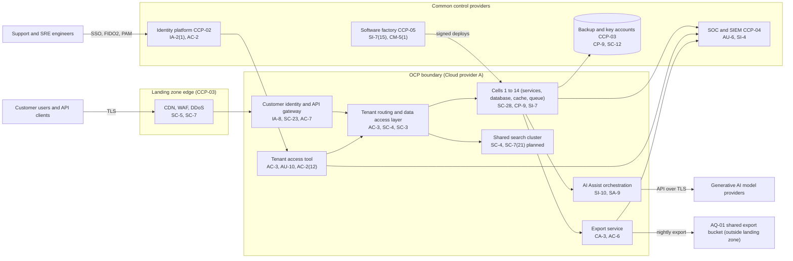

# System Security Plan: Operations Cloud Production Platform (OCP)

**Organization:** Cris Santos Company, Inc. (publicly traded B2B SaaS software publisher) | **Tier:** Enterprise | **Vertical:** Information
**Outline:** NIST SP 800-18 Rev. 2, System Security Plan Outline Example (June 2026) | **Version:** 3.0, 2026-09-14

## 1. System Name and Identifier
Operations Cloud Production Platform (**OCP**), identifier CSC-SYS-OCP-001. Tier-1 system in the enterprise application inventory (SYS-01).

## 2. System Overview
The OCP is the commercial, multi-tenant production environment of the Operations Cloud: customer service case management, field service scheduling and dispatch, the employee service desk, and the AI Assist features embedded in them. It serves about 9,800 business customers and about 1.9 million named users, holds about 310 million end-customer (consumer) records on customers' behalf, and handles about 2.4 billion API calls and 6 million new cases a day.

**Why confidentiality and tenant isolation matter most.** Every customer's data sits on shared infrastructure. A flaw that lets one tenant, one support engineer, or one integration read another tenant's data would expose many customers at once, break the DPA and the trust page statements, and could be an unfair or deceptive practice under FTC Act Section 5 (N51-R01). Availability matters almost as much: customers run their own customer service on the platform under a 99.95% SLA (P05 BP-01).

**Major components:**
- **Cells.** 14 isolated stacks (cells 1 to 8 in region 1, cells 9 to 14 in region 2), each with application services on managed containers, a managed relational database, a cache, and a message queue, serving a fixed set of tenants. Each cell has a warm standby in the recovery region.
- **Shared platform services.** Customer identity service and API gateway, tenant routing, key service integration, search cluster, notification service, file storage, and the AI Assist orchestration service that calls external generative AI model providers.
- **Export service.** Scheduled customer exports, connectors, and the nightly export to AQ-01 for shared customers.
- **Tenant access tool.** The only path for workforce access to customer tenant data, used by support engineers and site reliability engineers.
- **Operations tooling.** Deployment pipelines (from the software factory), observability, and runbooks.

Users: about 1.9 million customer users (agents, administrators, field technicians, employees of customers), about 1,100 workforce users with OCP roles (engineers, site reliability engineers, support engineers), and machine clients through the API.

## 3. Laws, Regulations, and Policies Affecting the System
| ID | Requirement | Citation | How it affects the OCP |
|---|---|---|---|
| N51-R01 | FTC Act Section 5 | 15 U.S.C. 45(a) | Reasonable security for customer and consumer personal information (unfairness), and accuracy of security and data-use statements (deception); the main legal driver for controls here |
| N51-R03 | CCPA/CPRA and CPPA regulations | Cal. Civ. Code 1798.100 et seq.; Cal. Code Regs. tit. 11, 7050-7051 (service providers), 7120-7124 (cybersecurity audits) | Service provider use limits for customer data; the company-level cybersecurity audit (first audit period 2027) will include the OCP |
| N51-R04 | DOJ Data Security Program | 28 CFR Part 202 | Customer data likely exceeds bulk thresholds for some categories; vendor and employment agreements that give countries of concern or covered persons access must be screened (none today) |
| N51-R08 | SEC cybersecurity disclosure | Form 8-K Item 1.05; 17 CFR 229.106 | A material OCP incident goes through the P08 materiality step; the OCP risk process is described in Item 106 |
| Bank | Bank service provider notification | 12 CFR 53.4; 225.303; 304.24 | About 140 banking organization customers use the OCP; disruptions of covered services for 4 hours or more require notice (P08) |
| State | State breach and data security laws | Each state where affected individuals reside (Florida worked example: Fla. Stat. 501.171(2), (6), (8)) | Reasonable measures, third-party agent notice to customers, and disposal |
| Contract | MSA, DPA, and trust page commitments; SOC 2 and ISO/IEC 27001 | P03, P09 | 99.95% availability, 24/48/72-hour incident notice, 30-day sub-processor notice, deletion within 30 and 90 days, no cross-customer AI training |
| Internal | POL-01 to POL-05, standards and procedures | P06 | Enterprise policy hierarchy |

Not applicable to the OCP: N51-R02 (COPPA; not directed to children and the customers are the operators of any child-directed service), N51-R05 (PADFA; not a data broker), N51-R06 (CPNI; not a carrier), N51-R07 (FedRAMP; applies to the separately bounded Government Edition, SYS-03, which has its own FedRAMP SSP and continuous monitoring and shares only the common controls in section 10.3).

## 4. System Status
### 4.1 System Security Plan Approval
Prepared by the Vice President, Platform Engineering and the GRC team. Reviewed by the CISO, the Chief Privacy Officer, and the Vice President, Site Reliability Engineering. Approved by the Chief Technology Officer on 2026-09-14.
### 4.2 System Authorization Decision
The company is not a federal agency, so there is no formal ATO for the OCP. The equivalent internal decision:
- **Authorizing official equivalent:** Chief Technology Officer, with the CISO's recommendation.
- **Decision (2026-09-14):** continue operation with conditions, based on the Internal Audit assessment (P07) and the enterprise risk register (P01).
- **Conditions:** close the High POA&M items that affect tenant data confidentiality (POAM-001 and POAM-003 by 2026-12-15; POAM-002 and POAM-004 by 2027-01-31); correct the trust page statements (POAM-021 by 2026-10-30); rerun the Cell 4 failover test to prove the 4-hour RTO (POAM-007 by 2027-02-28).
- **Reauthorization:** annually, or after a major change (for example, the per-cell search cluster in SC-7(21) or the AQ-01 integration).
### 4.3 System Operational Status
Operational. Planned major modifications: per-cell search clusters (SC-7(21)), behavioral analytics for support access (AC-2(12)), and replacement of the AQ-01 export with a minimized, tenant-scoped API (POAM-001).

## 5. Role Identification and Responsible Personnel
| Role | Title | Responsibility |
|---|---|---|
| System owner | Vice President, Platform Engineering | Accountable for the OCP; approves OCP roles and changes to the security architecture |
| Authorizing official (equivalent) | Chief Technology Officer | Accepts residual risk to operate |
| Availability and recovery | Vice President, Site Reliability Engineering | Contingency plan, DR tests, capacity |
| Support access owner | Vice President, Customer Support | Tenant access tool rules and session review |
| Information security | CISO; Director of Security Operations | Program oversight; SOC monitoring; incident response |
| Privacy | Chief Privacy Officer | DPA terms, service provider use limits, breach determinations |
| Common control providers | See section 10.3 | Operate inherited controls |
| Independent assessor | Chief Audit Executive (Internal Audit) | Annual assessment (P07) |

## 6. System Information Types and System Categorization
Information types come from NIST SP 800-60 Vol. 2 Rev. 1, used as a model. Impact levels follow FIPS 199.

| Information type | Confidentiality | Integrity | Availability | Rationale |
|---|---|---|---|---|
| Customer case and service data, including end-customer personal information (held for customers) | Moderate | Moderate | Moderate | Disclosure across tenants would harm many customers and their consumers and trigger notice duties in many states; no Social Security numbers or payment card numbers are expected in structured fields, and protected health information is prohibited by contract. Customers have manual fallbacks, so availability is Moderate (P05 BP-01: MTD 8 h, RTO 4 h) |
| Customer administration and billing contacts | Moderate | Moderate | Low | Business contact data; billing runs elsewhere (P05 BP-12) |
| System and security information (audit logs, keys, configurations, credentials) | Moderate | Moderate | Moderate | Protects the evidence and the mechanisms for tenant isolation |
| **OCP category** | **Moderate** | **Moderate** | **Moderate** | See the tailoring decision below |

**Tailoring decision.** The OCP uses the **SP 800-53B Moderate baseline**. Because one failure can expose many customers, the cybersecurity and risk committee approved 10 supplements on 2026-09-10:
- **Tenant isolation:** SC-3, SC-7(21).
- **Support access attribution:** AC-2(12), AU-10.
- **Software integrity and secrets:** CM-5(1), SI-7(15), SA-11(1), IA-5(7).
- **Assurance:** CA-8, CA-8(1).

**Documented controls.** `control-implementation.csv` documents **178 controls**: 168 from the Moderate baseline and 10 supplements. The remaining Moderate-baseline enhancements are fully inherited from the common control catalog (section 10.3) and are listed there rather than repeated here. Privacy-baseline controls are documented in the enterprise privacy program.

## 7. Authorization Boundary Description
**Inside the boundary:** the 14 cells and their standby stacks, the shared platform services (customer identity service, API gateway, tenant routing, search cluster, notification service, file storage, AI Assist orchestration), the export service, the tenant access tool, and the OCP production accounts in the Cloud provider A landing zone.

**Outside the boundary (common control providers and interconnected systems):**
- Landing zone services (network edge, key service, log archive, backup accounts, guardrails): CCP-03
- Identity platform (SYS-04): CCP-02
- Software factory (SYS-05): CCP-05
- SOC, SIEM, EDR, scanners (SYS-06): CCP-04
- Data Cloud (SYS-02), Government Edition (SYS-03), AQ-01 (SYS-09), generative AI model providers, support ticketing SaaS, email and SMS delivery

The enterprise multi-cloud diagram is in P04 `cloud-architecture.md`.

## 8. Information Exchanges Summary
| Connected system / party | Direction | Data | Agreement |
|---|---|---|---|
| Customer identity providers | Inbound (SAML or OIDC federation) | Assertions for customer users | Customer configuration under the MSA |
| Customer systems (API clients, connectors) | Bidirectional (TLS, OAuth tokens) | Cases, work orders, users | MSA and DPA; API terms |
| Data Cloud (SYS-02) | Outbound event stream | Case events for analytics customers | Internal interconnection agreement |
| AQ-01 Conversational AI (SYS-09) | Outbound nightly export; inbound handoffs | Full case transcripts and conversation records for 1,150 shared customers | **No interconnection agreement; export not minimized (POAM-001)** |
| Generative AI model providers (3) | Outbound API calls | Prompts with case content; responses | Sub-processor agreements with no-training and zero-retention terms |
| Support ticketing SaaS | Bidirectional | Ticket links for tenant access sessions | Sub-processor agreement |
| Email and SMS delivery services | Outbound | Notifications with case references | Sub-processor agreements |
| Government Edition (SYS-03) | None (separate boundary) | No data flows; shares only common controls | FedRAMP boundary documentation |

## 9. System Component Inventory
| Component | Type | Location / provider | Owner |
|---|---|---|---|
| Cell application services (14 cells) | Managed containers | Cloud provider A, regions 1 and 2; standby in the recovery region | Vice President, Platform Engineering |
| Cell databases, caches, queues | Managed database, cache, and queue services (PaaS) | Cloud provider A | Vice President, Site Reliability Engineering |
| Customer identity service and API gateway | Managed containers and gateway service | Cloud provider A | Director of Identity and Access Management |
| Shared search cluster | Managed search service | Cloud provider A | Vice President, Platform Engineering |
| File storage | Object storage with per-tenant prefixes and keys | Cloud provider A | Vice President, Platform Engineering |
| AI Assist orchestration | Managed containers | Cloud provider A | Chief Product Officer |
| Export service | Managed containers and object storage | Cloud provider A (writes to AQ-01's bucket in Cloud provider B) | Vice President, Platform Engineering |
| Tenant access tool | Internal web application behind the zero-trust gateway | Cloud provider A | Vice President, Customer Support |

## 10. Control Implementation Details
### 10.1 Control implementation status
See `control-implementation.csv` (178 controls).

| Status | Count |
|---|---|
| Implemented | 150 |
| Partially implemented | 26 |
| Planned | 2 |
| **Total** | **178** |

| Inheritance | Count |
|---|---|
| Common (fully inherited from a common control provider) | 117 |
| Hybrid (shared between a provider and the OCP team) | 19 |
| System-specific | 42 |

The Planned controls are supplements: AC-2(12), SC-7(21). Partially implemented controls: AC-2, AC-3, AC-6, AT-3, AU-6, CA-3, CM-3, CM-8, CP-2, CP-4, CP-10, IA-5, IR-6, IR-8, PS-4, RA-5, SA-9, SC-7, SC-12, SI-2, SI-4, SI-10, SI-12, SR-6, AU-10, IA-5(7).

### 10.2 Control assessment status
Internal Audit assessed 44 of these controls from 2026-07-13 to 2026-08-28 using SP 800-53A Rev. 5 procedures and statistical sampling (P07 `assessment-plan.md`, `assessment-results.csv`). Weaknesses are in P07 `poam.csv`.

### 10.3 Common control providers and inheritance
Common and hybrid controls are inherited from the enterprise platform. Each provider publishes its controls in the enterprise **common control catalog** (maintained by the GRC team in the GRC platform) and is assessed on its own cycle; the OCP inherits the results. The Government Edition inherits the same providers for its FedRAMP package where its boundary allows.

| Provider | Name | Accountable role | Controls provided | Rows in this plan | Evidence of operation |
|---|---|---|---|---|---|
| CCP-01 | Enterprise GRC program | CISO (with the Chief Risk Officer and Chief Audit Executive for assessment) | Policies and standards (P06), risk method, assessment, POA&M, continuous monitoring | 26 | Annual Internal Audit assessment (P07); GRC platform |
| CCP-02 | Identity platform (SYS-04) | Director of Identity and Access Management | SSO, phishing-resistant MFA, PAM, identity governance, account lifecycle | 18 | SOX IT general control testing; P07 AC-2, IA-2, IA-5 results |
| CCP-03 | Cloud provider A landing zone | Director of Cloud Platform Engineering | Guardrails, network edge and policies, key service, encryption, backups, log archive, inventory | 28 | Posture management reports; provider SOC 2 Type 2 |
| CCP-04 | Security operations (SYS-06) | Director of Security Operations | 24x7 SOC, SIEM, EDR, vulnerability management, incident response, threat intelligence | 25 | SOC metrics; P07 SI-4, RA-5, IR results |
| CCP-05 | Software factory (SYS-05) | Director of Product Security (with the developer platform team) | Source control, pipelines, code and secret scanning, signing, SBOM | 15 | Pipeline policy logs; P07 CM-3, IA-5 results |
| CCP-06 | Endpoint engineering (SYS-08) | Director of Endpoint Engineering | Laptop baselines, EDR agents, device lock, software control | 2 | Configuration compliance reports |
| CCP-07 | Cloud provider A physical and hypervisor layer; offices | Director of Cloud Platform Engineering (provider oversight); Vice President, Workplace and Facilities (offices) | Data center physical security, media sanitization, network backbone | 5 | Provider SOC 2 Type 2 report reviewed under CC9.2 |
| CCP-08 | Human resources and workforce training | Chief People Officer | Screening, terminations, sanctions, training, acknowledgments | 9 | HR and learning system reports |
| CCP-09 | Third-party risk management | Director of Third-Party Risk Management | Vendor tiering, sub-processor reviews, supply chain risk management, DSP screening | 8 | Vendor register; SOC report reviews |

**Inheritance rules:**
- A Common control is fully inherited; the OCP team verifies only that the OCP is onboarded (for example, SSO integration and log forwarding).
- A Hybrid control names both parts in the implementation statement: the provider's part and the OCP team's part.
- If a provider's assessment finds a weakness, the finding is linked to every inheriting system's POA&M. Example: POAM-002 (long-lived keys and live secrets) is a CCP-05 weakness that affects the OCP because 9 legacy OCP pipelines deploy with static keys.

## 11. Digital Identity Acceptance Statement
- **Workforce users:** SSO with phishing-resistant MFA (FIDO2 security keys or platform authenticators) for all users; privileged users elevate through PAM. This is comparable to NIST SP 800-63 AAL3-like protection for privileged access and at least AAL2 for all workforce.
- **Customer users:** authenticated by the customer identity service or by the customer's own identity provider through federation. Customer administrators can require MFA for all their users; MFA is mandatory for customer administrator roles. Identity proofing of customer users is the customer's responsibility under the MSA.
- **Machine clients:** OAuth client credentials scoped to one tenant, with rotation; long-lived keys are being removed from internal pipelines (POAM-002).

## 12. Referenced Artifacts
Scenario facts (`../00_company-facts.md`), BIA (P05), multi-cloud architecture and control map (P04), enterprise risk register (P01), regulatory gap analysis (P03), policy hierarchy and policies (P06), Internal Audit assessment and POA&M (P07), cloud credential compromise runbook (P08), SOC 2 readiness for SL-1 (P09), AI portfolio including AI-001 AI Assist (P10), OCP contingency plan v7, tenant isolation test suite, enterprise common control catalog.

## 13. Acronym List and Glossary
- **Cell:** an isolated stack of OCP services and data stores serving a fixed set of tenants
- **CCP:** common control provider
- **DPA:** Data Processing Addendum
- **MSA:** Master Subscription Agreement
- **Non-human identity:** a service account, workload role, or API key used by software rather than a person
- **OCP:** Operations Cloud Production Platform
- **PAM:** privileged access management
- **POA&M:** plan of action and milestones
- **Tenant:** one customer's logically separated data and configuration
- **Tenant access tool:** the internal tool that is the only path for workforce access to tenant data

## 14. System Security Plan Review and Change Records
| Version | Date | Change | Author |
|---|---|---|---|
| 1.0 | 2024-09-20 | Initial plan (Moderate baseline) | Vice President, Platform Engineering |
| 2.0 | 2025-10-03 | Cell architecture; AI Assist orchestration added | Vice President, Platform Engineering |
| 2.1 | 2026-02-13 | Export service and AQ-01 export added after the acquisition | Vice President, Platform Engineering |
| 3.0 | 2026-09-14 | Tailoring supplements; common control provider mapping; 2026 assessment results | Vice President, Platform Engineering with GRC team |
