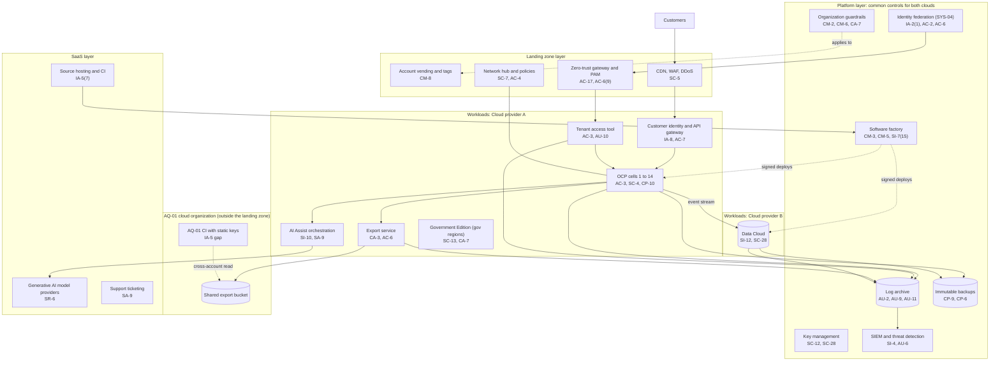

# Cloud Architecture and Control Placement: Cris Santos Company | Information | Enterprise

**Organization:** Cris Santos Company, Inc. (publicly traded B2B SaaS software publisher) | **Tier:** Enterprise | **Provider:** Multi-cloud, vendor-agnostic: two public cloud providers (called Cloud provider A and Cloud provider B) and SaaS (see section 4); no company-owned data centers
**Owner:** Director of Cloud Platform Engineering, with the CISO | **Date:** 2026-08-31 | **Related:** OCP SSP (P02), enterprise BIA (P05)

## 1. Architecture in layers
The estate is organized in four layers. Each lower layer provides **common controls** that the layers above inherit, so a workload team configures only what is specific to its system.

| Layer | What it is | Examples | Who runs it |
|---|---|---|---|
| **Platform** | Organization-wide services in both clouds | Cloud organization guardrails, identity federation, workload identity and secrets, key management, log archive, SIEM and threat detection, immutable backup accounts, software factory pipelines, vulnerability and posture management | Cloud Platform Engineering; Security Operations; Identity team; Product Security |
| **Landing zone** | The standard account pattern every workload lands in | Account vending with mandatory tags, hub-and-spoke network with deny-by-default policies, internet edge (CDN, WAF, DDoS), zero-trust gateway and PAM, DNS | Cloud Platform Engineering |
| **Workload** | Systems the company builds and runs | Cloud A: OCP cells, customer identity service, tenant access tool, export service, AI Assist orchestration, and the Government Edition (government regions). Cloud B: Data Cloud and the AQ-01 Conversational AI platform | Product engineering teams (for example, the Vice President, Platform Engineering for the OCP) |
| **SaaS** | Vendor-operated applications | Source hosting and CI, support ticketing, SIEM and observability, generative AI model providers, email and SMS delivery, productivity suite, ERP and billing, HR and payroll | Vendors, with the company's configuration and oversight |

The Government Edition is a separate workload in Cloud provider A's government regions with its own FedRAMP Moderate boundary. It reuses the platform patterns but not shared accounts, and only U.S. persons operate it.

## 2. Diagram

## 3. Responsibility by service model
Sources: SRC-AWS-SRM, SRC-AZURE-SRM, and SRC-GCP-SRM in `00_universal-framework/sources/source-register.csv`. The three published models agree on the split used here, so the design does not depend on which two providers the company uses.

| Service model | Provider | Company (customer of the cloud) | Shared |
|---|---|---|---|
| IaaS (network primitives, AQ-01 compute) | Facilities, hosts, hypervisor, physical network | Guest OS, applications, identities, data, network policy | Encryption (provider service, company keys), logging |
| PaaS (managed containers, databases, caches, search, warehouse) | Also the platform runtime and its patching | Data, access, configuration, keys, application code, tenant isolation | Backups, availability configuration |
| SaaS (source hosting, ticketing, SIEM, AI model APIs) | Also the application | Users, roles, data sent, configuration, oversight of the vendor | Audit review (complementary user entity controls) |

**One more layer of shared responsibility.** The company is itself a SaaS provider. Its customers rely on the company the way the company relies on its cloud providers, so every control in this map also appears as a commitment in the SOC 2 system descriptions (P09) and the DPA. Customer-side controls (customer user access, customer identity provider security, what customers put in free-text fields) are listed as complementary user entity controls in the SOC 2 reports.

## 4. Service categories and provider equivalents
| Service category | AWS | Microsoft Azure | Google Cloud |
|---|---|---|---|
| Organization guardrails | AWS Organizations service control policies | Azure Policy with management groups | Organization Policy Service |
| Account vending | AWS Control Tower account factory | Azure landing zone subscription vending | Resource Manager project creation |
| Key management | AWS KMS | Azure Key Vault | Cloud KMS |
| Secrets manager | AWS Secrets Manager | Azure Key Vault secrets | Secret Manager |
| Audit logging | AWS CloudTrail | Azure Monitor activity log | Cloud Audit Logs |
| Threat detection | Amazon GuardDuty | Microsoft Defender for Cloud | Security Command Center |
| Managed containers | Amazon EKS | Azure Kubernetes Service | Google Kubernetes Engine |
| Managed relational database | Amazon RDS | Azure SQL Database | Cloud SQL |
| Web application firewall | AWS WAF | Azure Web Application Firewall | Cloud Armor |
| Backup service | AWS Backup | Azure Backup | Backup and DR Service |
| Government regions | AWS GovCloud (US) | Azure Government | Assured Workloads |

This table is for reading provider documentation only. The architecture, control map, and SSP describe service categories.

## 5. Common controls
`cloud-control-map.csv` has **64 rows** across 32 components: Platform 20, Landing zone 8, Workload 21, SaaS 10, Provider 5. Responsibility: Customer 41, Shared 18, Provider 5.

**33 rows are published as common controls** (`common_control` = Yes) in the enterprise common control catalog. They map to the common control providers in the OCP SSP (P02 section 10.3): identity (CCP-02), landing zone (CCP-03), security operations (CCP-04), software factory (CCP-05), and the cloud providers' physical layer (CCP-07). A workload inherits them by being deployed through account vending, which applies the guardrails, logging, network, key, and backup policies automatically.

**Rules for inheriting:**
1. A workload may claim a common control only if its account was created by account vending and passes the posture baseline. **AQ-01's cloud organization does not**, so none of its rows are common controls until it is migrated (POAM-019, POAM-001 to POAM-003).
2. Customer-side identity, data protection, and logging stay explicit at every layer: even a SaaS application has Customer rows for access because those are always the company's responsibility.
3. SaaS and provider rows cite the vendor's SOC 2 report, reviewed by the third-party risk team (P09 evidence map).

## 6. Validation against the OCP SSP (P02)
Every OCP component in the SSP boundary appears here with controls from each required family, directly or inherited:
| OCP component | AC | AU | CM | IA | SC | SI |
|---|---|---|---|---|---|---|
| Cells | AC-3, AC-4 (inherited) | AU-2, AU-9 (inherited) | CM-6; CM-2 (inherited) | IA-2(1) (inherited) | SC-4; SC-28 (inherited) | SI-2 (shared); SI-4 (inherited) |
| Customer identity and API gateway | AC-7 | AU-2 (inherited) | CM-6 (inherited) | IA-8 | SC-5 (inherited) | SI-4 (inherited) |
| Tenant access tool | AC-3; AC-6(9) (inherited) | AU-10 | CM-3 (inherited) | IA-2(1) (inherited) | SC-7 (inherited) | SI-4 (inherited) |
| Export service | AC-6 | AU-2 (inherited) | CM-3 (inherited) | IA-5 (inherited) | SC-28 (inherited) | SI-4 gap (POAM-003) |
| AI Assist orchestration | AC-3 (cells) | AU-2 (inherited) | CM-3 (inherited) | IA-5 (inherited) | SC-8 (inherited) | SI-10 |

## 7. Findings from the mapping
1. **AQ-01 is outside the platform.** Its organization has no guardrails, its keys are long-lived, its logs do not reach the SIEM, and its CI build logs were publicly readable (found by Internal Audit, P07). Because the OCP export lands in AQ-01's bucket, the weakest environment holds a copy of the most sensitive data. Fix: minimize and re-scope the export now, then enroll AQ-01 in the landing zone (POAM-001, POAM-019) and federate its identities (POAM-002).
2. **Tenant isolation is a workload responsibility.** No cloud service can enforce tenant boundaries inside a shared database; the OCP owns AC-3 and SC-4 and tests them on every release. The shared search cluster is the main remaining shared component (SC-7(21) planned).
3. **Two clouds, one control set.** Guardrails, logging, and key policies are written once as code and applied to both clouds. Differences are limited to service names (section 4).
4. **Single DNS provider.** The edge layer depends on one managed DNS provider (P05 DEP-06; P01 R-016).
5. **AI model providers are SaaS sub-processors.** No platform control can stop prompt injection inside a tenant; the OCP team owns SI-10 for AI Assist (POAM-018), and the vendor program owns no-training and zero-retention terms.
6. **Retention commitments live in two clouds.** Deletion within 90 days of termination must hold in Cloud provider A (OCP offboarding job, POAM-011) and Cloud provider B (Data Cloud snapshots, POAM-022).
