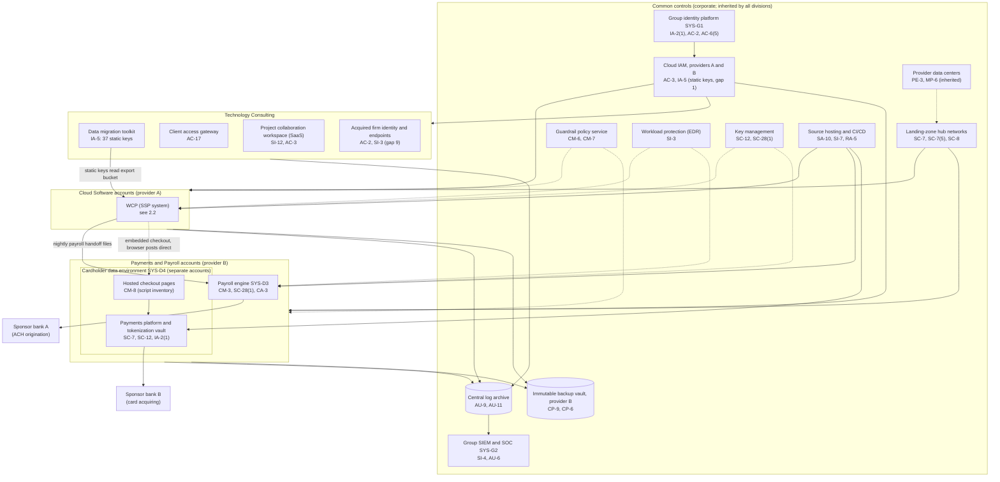
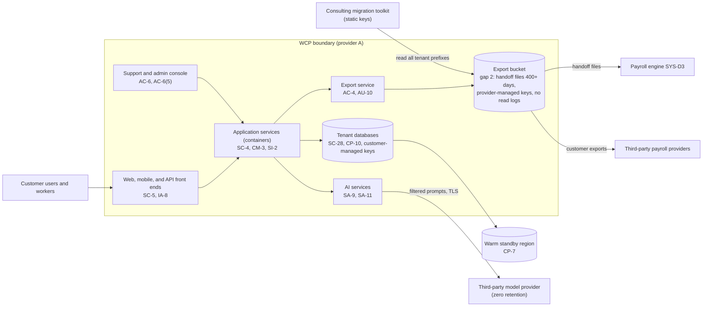

# Cloud Architecture and Control Placement: Cris Santos Company Holdings | Information | Multi-Sector

**Organization:** Cris Santos Company Holdings, Inc. | **Tier:** Multi-Sector | **Providers:** two public cloud providers, called provider A and provider B (vendor-agnostic; see section 6)
**Scope:** the shared corporate cloud platform (SYS-G3 landing zones, CI/CD, keys, logging, backups) plus the division workloads that run on it. The SSP system (P02) is the Workforce Cloud Platform (WCP, SYS-D1).

## 1. Design in one paragraph
Corporate runs one **landing zone** per provider: identity federation from SYS-G1, a hub network, guardrail policies, a central log archive, key management, EDR, and an immutable backup vault in provider B for every division. Divisions get their own **accounts** inside the landing zone and inherit these guardrails. Provider A hosts the corporate hub, the WCP (primary and warm standby regions), the export bucket, the group data platform, and a small consulting workload (the data migration toolkit's runtime). Provider B hosts the payroll engine (SYS-D3), the payments cardholder data environment (SYS-D4) in **separate accounts with their own segmentation**, and the backup vault. Consulting's other delivery systems (collaboration workspace, client access gateway) are SaaS, and the acquired consulting firm still runs its own identity provider and endpoint stack until 2027-03-31.

## 2. Diagrams
### 2.1 Group landing zone and division workloads

### 2.2 Workforce Cloud Platform (SSP boundary)

**Target state (POAM-001, POAM-006 to POAM-009, due by 2026-12-31):** handoff files move to a dedicated per-recipient channel in the payroll engine's intake (provider B) with customer-managed keys, read logging, and 7-day retention; the export bucket keeps only customer-requested exports with 30-day retention; every integration, including the consulting toolkit, uses short-lived workload credentials scoped to one tenant and one project; a guardrail blocks new static keys.

## 3. Tenancy and identity decision
**Decision.** All three divisions share the group identity platform (SYS-G1). Each division gets its own accounts inside the landing zones, with roles federated from SYS-G1 and account-level permission boundaries. The payments cardholder data environment (SYS-D4) sits in separate accounts in provider B with its own segmentation, still under SYS-G1. No division has a separate tenant by design. The 2,600 consultants from the 2025 acquisition still federate from the acquired firm's own identity provider until 2027-03-31.

**Reason.** One identity platform, one SIEM, one backup design, and one pipeline let group internal audit assess common controls once. The sample treats regulator-specific segmentation (the PCI DSS cardholder data environment, the federal contract information area) as division-specific, and builds the CDE with separate accounts and segmentation, not a separate identity.

**What limits blast radius.** Administrators use phishing-resistant hardware keys and just-in-time PAM with session recording. All access into the CDE goes through group PAM with MFA. WCP tenants are separated by tenant-scoped database roles, and support access is tenant-scoped with a ticket. Backups for all divisions sit in provider B with a separate backup identity.

**Known gaps.** 1,140 static cloud keys exist, and 37 consulting toolkit keys can read every tenant export prefix (POAM-001). Acquired firm accounts are outside group certification and EDR (POAM-015, POAM-016). The six-monthly CDE segmentation test was missed (POAM-021).

Cross-division risks: GR-01 (leaked static key reads data across divisions), GR-02 (attack spreads through shared identity and CI/CD), GR-10 (acquired firm stack as entry point), GR-07 (identity outage stops all divisions).

## 4. Common versus division-specific controls
`cloud-control-map.csv` has 54 rows across 27 components. The `control_scope` column shows who owns each placement:

| Scope | Rows | What it means |
|---|---|---|
| Common (group) | 26 | Provided once by corporate (SYS-G1, SYS-G2, SYS-G3) and inherited by every division account. Listed in the P02 common control catalog |
| System (WCP, Cloud Software) | 15 | Controls of the SSP system documented in the P02 SSP |
| Division-specific (Technology Consulting) | 6 | Migration toolkit, client access gateway, collaboration workspace, acquired firm stack |
| Division-specific (Payments and Payroll) | 7 | Payroll engine, CDE segmentation and keys, hosted checkout pages |

| Responsibility | Rows |
|---|---|
| Customer (the group or a division) | 42 |
| Shared (provider and group) | 10 |
| Provider | 2 |

**Rule of thumb.** Identity, network guardrails, logging, keys, backups, EDR, and CI/CD are **common**. A division cannot opt out of them, only request an exception through POL-01. Data flows, application behavior, and regulator-specific segmentation (the PCI DSS cardholder data environment, the federal contract information area) are **division-specific**, because they depend on each division's regulators and customers.

## 5. Layers
| Layer | Common components | Division components | Key controls | Responsibility |
|---|---|---|---|---|
| Identity | SYS-G1, cloud IAM, secrets manager | WCP customer identity; consulting toolkit keys; acquired firm identity provider; CDE access | AC-2, AC-3, AC-6(5), IA-2(1), IA-5, IA-8 | Customer (configuration); vendor (service) |
| Network | Hub networks, guardrails | WCP gateway and firewall; consulting access gateway; CDE segmentation | SC-7, SC-7(5), SC-8, SC-5, AC-17 | Customer, with provider DDoS protection shared |
| Compute | EDR, CI/CD | WCP containers, payroll engine, checkout pages | SI-2, SI-3, SI-7, CM-3, CM-8, SC-4 | Customer (images, code, configuration) |
| Data | Keys, backup vault | Tenant databases, export bucket, collaboration workspace, tokenization vault | SC-12, SC-28, SC-28(1), CP-9, AC-4, SI-12 | Shared: provider encrypts; group owns keys, flows, and retention |
| Logging and monitoring | Log archive, SIEM | Application and export logs | AU-2, AU-6, AU-9, AU-11, AU-12, SI-4 | Shared: providers generate platform logs; group enables data-plane logs and reviews |
| SaaS dependencies | Identity, SIEM, EDR, source hosting vendors | Model provider; collaboration SaaS | SA-9, SA-11 | Provider for the service; group for use and oversight |
| Physical | Provider data centers | none | PE-3, MP-6 | Provider (inherited) |

## 6. Service categories and provider equivalents
The design does not depend on a provider. This table gives each provider's name for each service category, for reading its shared responsibility documentation.

| Service category | AWS | Microsoft Azure | Google Cloud |
|---|---|---|---|
| Account structure and guardrails | AWS Organizations with service control policies | Management groups with Azure Policy | Resource hierarchy with Organization Policy |
| Object storage (export bucket) | Amazon S3 | Azure Blob Storage | Cloud Storage |
| Object-level read logging | CloudTrail data events | Storage diagnostic logs | Data Access audit logs |
| Managed relational database | Amazon RDS / Aurora | Azure Database / SQL Database | Cloud SQL / AlloyDB |
| Managed containers | Amazon EKS | Azure Kubernetes Service | Google Kubernetes Engine |
| Key management | AWS KMS | Azure Key Vault | Cloud KMS |
| Short-lived workload credentials | IAM roles with web identity federation | Workload identity federation (Entra ID) | Workload Identity Federation |
| Backup with immutability | AWS Backup (vault lock) | Azure Backup (immutable vault) | Backup and DR Service |

Shared responsibility sources: SRC-AWS-SRM, SRC-AZURE-SRM, SRC-GCP-SRM in `00_universal-framework/sources/source-register.csv`. All three agree on the split used here: for IaaS the provider owns facilities, hosts, and virtualization; for PaaS the provider also owns the runtime; for SaaS the provider owns the application. The customer always keeps identities, access decisions, data classification, and data.

## 7. Findings from the mapping
1. **Keys and buckets, not encryption, are the weak point.** Encryption is on everywhere (SC-28). The problem is who can read: one export bucket holds the most sensitive data in the group, uses provider-managed keys, has no read logging, and can be read by 37 static keys held by another division (AC-3, AC-4, AU-12, IA-5; P01 GR-01; the P08 scenario).
2. **The payroll handoff crosses a division boundary without a contract.** The data belongs to the Payments and Payroll program under 16 CFR Part 314, but it is stored and controlled by the Cloud Software division. Moving the intake into the payroll engine's accounts puts the data under the owner's controls (CA-3; POAM-020).
3. **Secret scanning stops at the group's repositories.** Keys in personal repositories are invisible to it (RA-5 row). The real fix is fewer static keys, not wider scanning.
4. **The CDE is well separated, but its proof lapsed.** Segmentation is in place; the six-monthly penetration test that proves it was missed after a network change (PCI DSS 11.4.6; POAM-021).
5. **Common controls are strong and reused.** One identity platform, one SIEM, one backup design, one pipeline. This is what lets group internal audit assess them once (P07). The exceptions are the acquired consulting firm's separate stack (gap 9) and undocumented inheritance for consulting (gap 10).
