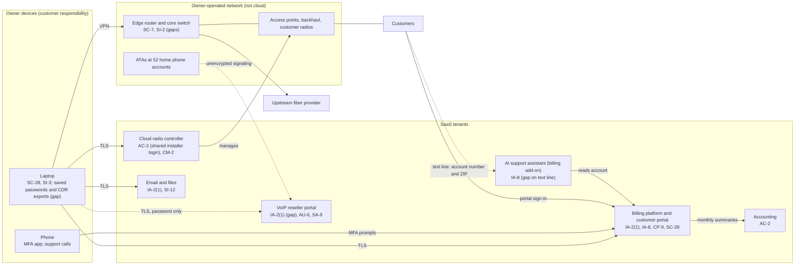

# SaaS Architecture and Control Placement: Cris Santos Company | Communications | Sole Proprietorship

**Organization:** Cris Santos Company (owner-operated wireless internet service provider) | **Tier:** Sole Proprietorship | **Provider:** SaaS only (no IaaS or PaaS)
**System:** ISP Operations Systems Profile (IOSP), as defined in the system profile (P02) | **Prepared:** 2026-07-22 by the owner-operator with the network consultant; adopted 2026-08-31

## 1. Diagram
Control IDs on each node are the ones in `cloud-control-map.csv`. Dashed lines are flows with a known gap.

## 2. Layers
| Layer | Components | Key controls | Responsibility |
|---|---|---|---|
| Identity | Owner admin accounts in every SaaS tenant; contractor and bookkeeper accounts; customer portal accounts | IA-2(1), AC-2, IA-8 | Customer configures; vendor provides MFA and login features |
| Data | Accounts and invoices, CDRs and 911 addresses, radio configurations, email and files, laptop copies | SC-28, CP-9, SI-12, SA-9 | Vendor protects data inside its service; customer decides where CPNI goes and how long copies are kept |
| Endpoints | Laptop, phone | SC-28, SI-3 | Customer |
| Network | Edge router, core switch, radios, ATAs | SC-7, SI-2, CM-2 | Customer (owner-operated, outside any cloud model) |
| Logging | SaaS sign-in histories; router logs | AU-2 (vendor), AU-6 (customer) | Shared: vendor records, customer reviews |
| SaaS applications and hosting | Billing, VoIP, controller, email, accounting, AI platforms | Inherited (application security, hosting, physical) | Provider |

## 3. Shared responsibility for SaaS
All three major cloud providers' shared responsibility models (SRC-AWS-SRM, SRC-AZURE-SRM, SRC-GCP-SRM) agree on the SaaS split: the provider runs the application, the platform, and the facilities; **the customer always keeps its identities and accounts, its data, and its devices.** That is why 12 of the 17 rows in the control map are the owner's (customer), 3 are shared, and only 2 are the provider's. A vendor's SOC 2 report never covers these three layers. No IaaS equivalents table is needed, because the company runs no cloud infrastructure.

The owner-operated network sits outside every cloud model. Its rows (SC-7, SI-2) are listed so the map shows the full path an attacker would take to CPNI (P08).

## 4. Findings from the mapping
1. **The SaaS account that holds the most CPNI has the weakest login.** The VoIP reseller portal holds call detail for all 58 lines, has MFA turned off, and its password is saved in the laptop browser. Tracked as P01 R-002.
2. **The customer-facing AI assistant had a weaker login than the portal it sits on.** On the text line it accepted account number and ZIP code, which the CPNI rules do not allow before online access to CPNI (64.2010(c)). Found in testing on 2026-07-22. Tracked as R-003 and in P10.
3. **CPNI leaves the SaaS boundary every month.** The CDR export lands on the laptop and in email, where no vendor control applies. Tracked as R-007.
4. **The VoIP provider is a key vendor with no assurance report** and no security terms in the reseller agreement. Tracked as R-013.
5. **A shared contractor login on the radio controller** means changes to customer radios cannot be traced to a person. Tracked as R-004.
