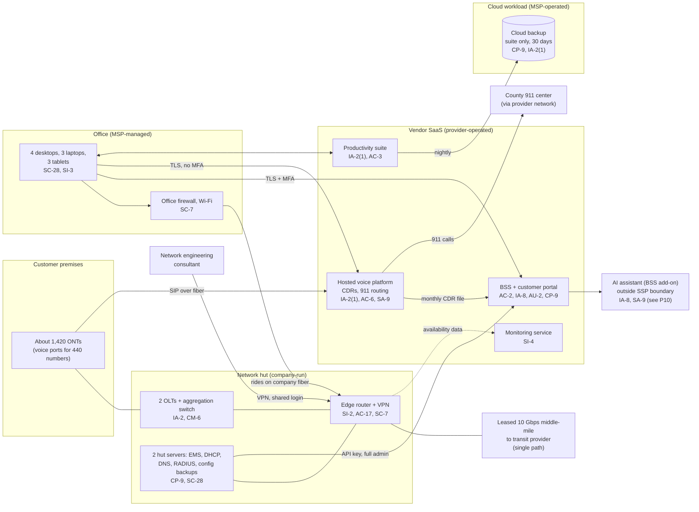

# Cloud Architecture and Control Placement: Cris Santos Company | Communications | Micro

**Organization:** Cris Santos Company, LLC (rural fiber broadband and voice carrier) | **Tier:** Micro | **Provider:** Vendor-agnostic SaaS (see section 3)
**System:** Network Operations and Customer Billing Platform (OSS/BSS), as defined in the SSP (P02) | **Prepared:** 2026-07-31 by the Office Manager with the Network Operations Lead and the MSP lead technician | **Approved:** Owner and General Manager, 2026-08-31

## 1. Diagram
The company runs no IaaS tenant. Its "cloud" is a set of SaaS services (billing, voice, monitoring, productivity) plus one cloud workload the MSP operates for it: the cloud backup (SYS-09). The network itself is on premises, in the hut and in the field.

## 2. Layers and who is responsible
| Layer | Components | Key controls | Company | MSP or consultant (on the company's behalf) | Provider (SaaS vendor) |
|---|---|---|---|---|---|
| Identity | BSS, voice platform, suite, backup, VPN, network device logins | AC-2, IA-2, IA-2(1), IA-5 | Decides who gets access; creates BSS and voice platform logins; owns network passwords | MSP creates suite and device accounts and holds the backup login; consultant uses the shared VPN login | Runs the sign-in and MFA service |
| Customer authentication | Portal sign-in, password reset, change notices, AI assistant verification | IA-8 | **Chooses the reset method and notices (gap today)** | None | Offers the options and runs the portal |
| Network | Edge router, OLTs, management segment, office firewall | SC-7, SI-2, CM-6, AC-17 | Runs the hut network; approves every change | Consultant configures the router and OLTs; MSP runs the office firewall | Not applicable |
| SaaS applications | BSS, voice platform, monitoring, suite | AC-3, AC-6, AU-2 | Roles, export rights, API key scope | MSP administers the suite | Application, platform, data centers |
| Data | CPNI in the BSS and voice platform; configurations on the hut server; suite backup | CP-9, SC-28 | Decides retention; keeps configuration backups; restore tests | MSP runs the suite backup | Encrypts and backs up its platform |
| Logging | BSS and voice platform logs, device logs, monitoring | AU-2, AU-6, AU-11, SI-4 | **Reviews logs monthly (gap today)** | MSP forwards office alerts | Generates and stores platform logs |
| Vendor governance | Contracts, SOC 2 review, CPNI terms | SA-9 | Signs contracts; reviews evidence | Not applicable | Provides SOC reports and contract terms |

**The MSP and the consultant are not cloud providers.** They do customer-side work for the company. Anything marked "Customer (performed by MSP)" in `cloud-control-map.csv` stays the company's responsibility, and the CPNI rules make the carrier responsible for protecting CPNI however it is processed (47 CFR 64.2010(a)). The company must direct the work, get evidence, and check it (SA-9).

## 3. Service categories and provider equivalents
The design is vendor-agnostic. The shared responsibility split for SaaS is the same in all three major cloud providers' models: the provider runs the application, platform, and infrastructure; the customer keeps identities, access, data, and devices (SRC-AWS-SRM, SRC-AZURE-SRM, SRC-GCP-SRM in `00_universal-framework/sources/source-register.csv`). For the company's vendors, the SOC 2 report or vendor security documentation is the evidence of the provider side.

| Service category used | What it is here | Equivalent category in the large cloud providers (for reading their documentation) |
|---|---|---|
| Line-of-business SaaS | BSS and customer portal (telecom billing) | Industry SaaS built on any provider |
| Communications platform as a service (wholesale) | Hosted voice platform (softswitch, numbers, 911 routing) | Communications or contact SaaS |
| Monitoring SaaS | Network availability monitoring and paging | Monitoring and observability service |
| Productivity suite | Email, files | Productivity and collaboration SaaS |
| SaaS-to-SaaS backup | Cloud backup of the suite | Backup service or third-party SaaS backup |
| Generative AI add-on | AI assistant in the portal | Managed generative AI or model hosting service |

## 4. Findings from the mapping
1. **The voice platform is the soft spot (IA-2(1), AC-6, SA-9).** It holds 18 months of CDRs for every number, has no MFA turned on, has a shared login, and lets any login export everything. The provider offers MFA and role limits; the company has not used them. Fix: MFA and named logins by 2026-09-30 (POAM-003), export limited to 2 roles, and CPNI terms in the contract (POAM-011). Tracked as P01 R-002.
2. **The hut server holds the keys to the SaaS side (SC-28, AC-6).** The BSS API key used by the provisioning link has full administrator rights and sits in plain text on the hut server next to a shared password file. An intruder in the hut can read every customer record, including driver license numbers, without touching the BSS sign-in page. Fix: a read-and-provision-only key, stored in the server's protected configuration; password file replaced by a password manager (P01 R-006).
3. **Configuration backups do not leave the building (CP-9).** The SaaS vendors back up their platforms, but the company's own network configurations exist only on the hut server. The cloud backup the MSP already runs can hold an encrypted copy at little cost. Fix by 2026-10-31 (POAM-008; P01 R-007).
4. **Remote access is the main door into the hut (AC-17, SI-2).** The router VPN runs on firmware 2 years behind, and the consultant's login is shared and has no MFA. The EMS web page was also exposed until 2026-08-03. Fix: firmware upgrade on 2026-09-20 (POAM-012), named VPN logins with MFA (POAM-002, POAM-003).
5. **The AI assistant sits outside the boundary on purpose.** It reads CPNI through the BSS for signed-in customers. It is mapped here only to show the IA-8 and SA-9 gaps. It joins the SSP boundary only after the P10 conditions are met.
