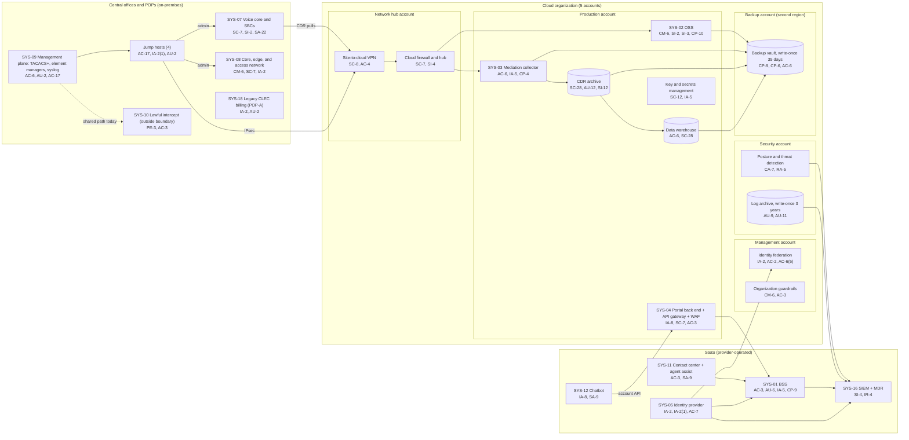

# Cloud Architecture and Control Placement: Cris Santos Company | Communications | Mid-Market

**Organization:** Cris Santos Company, Inc. | **Tier:** Mid-Market | **Provider:** Vendor-agnostic public cloud (see section 4), plus SaaS
**System:** Network Operations and Customer Billing Platform (OSS/BSS), as defined in the SSP (P02) | **Prepared:** 2026-07-31 by the Security Manager and the IT Director; updated 2026-09-17 with P07 results
**Control map:** `cloud-control-map.csv` (55 rows, 25 components)

## 1. Diagram

## 2. Landing zone design
The landing zone separates duties across 5 accounts (subscriptions or projects, depending on the provider) under one cloud organization, so that compromise of one account limits what an attacker can reach in the others. It was built in 2024 to replace a single cloud tenant.

| Account | Purpose | Who administers | Key design decisions |
|---|---|---|---|
| **Management** | Organization root, identity federation to SYS-05, organization guardrails | Security Manager and 1 IT administrator | No workloads. Root credentials sealed. Guardrails apply to every other account and cannot be disabled from them |
| **Security** | Posture management, threat detection, write-once log archive (3 years) | Security team | Logs from all accounts land here; only the security team can read them; the MDR reads through the SIEM |
| **Network hub** | Cloud firewall, site-to-cloud VPN to CO-1 and CO-4, DNS resolvers | IT Director's infrastructure team | All traffic between central offices, workloads, and the internet passes the hub. No route from POP corporate VLANs |
| **Production** | OSS, mediation collector and CDR archive, portal back end and API gateway, data warehouse, key and secrets management | Infrastructure team; application owners for their applications | Separate subnets per workload; no internet ingress except through the gateway and web application firewall; company-managed keys |
| **Backup** | Backup vault with 35-day write-once retention in a second region | 2 named backup administrators | Separate administrator credentials, not federated to everyday accounts. Backups are written by a cross-account role that can write but not delete |

**Hybrid link to the network.** The cloud is not separate from the carrier network. The mediation collector pulls CDRs from the voice core over the site-to-cloud VPN, and the OSS talks to element managers in the management plane. That makes the management plane (SYS-09) and its jump hosts part of the cloud attack surface, so they appear in the control map as hybrid components.

## 3. Layers and shared responsibility per service
| Layer | Components | Key controls | Service model | Responsibility |
|---|---|---|---|---|
| Identity | Federation, break-glass accounts, guardrails, SYS-05 | IA-2, IA-2(1), IA-2(8), AC-2, AC-6(5), AC-7, CM-6 | PaaS / SaaS | Customer configures identities, roles, MFA, and reviews; provider runs the identity services |
| Network | Cloud firewall, hub, VPN, DNS, gateway and WAF, jump hosts | SC-7, SC-8, AC-4, SC-20, AC-17 | IaaS / PaaS | Customer designs routes, rules, and segmentation; provider runs the gateway, firewall, and DNS services |
| Compute | OSS, mediation collector, portal back end | CM-6, SI-2, SI-3, AC-6, IA-5, CP-10 | IaaS / PaaS | Customer for guest OS, applications, EDR, and service accounts; provider for hosts, hypervisor, and PaaS runtime |
| Data | CDR archive, data warehouse, keys, secrets, backups | SC-28, SC-12, CP-9, CP-6, CP-4, AC-3, AC-6, SI-12, AU-12 | PaaS | Shared: provider encrypts and operates storage and databases; customer controls keys, access, retention, logging, and restore testing |
| Logging and monitoring | Posture service, log archive, forwarding, SIEM | AU-2, AU-9, AU-11, CA-7, RA-5, SI-4, IR-4 | PaaS / SaaS | Shared: provider generates logs and detections; customer enables, retains, forwards, and acts on them; MDR monitors |
| SaaS applications | BSS, identity provider, SIEM, contact center, chatbot | AC-3, AU-6, CP-9, IA-5, AC-7, SA-9, IA-8 | SaaS | Provider runs the application and infrastructure; customer keeps users, roles, audit review, customer authentication settings, and data |
| Physical | Provider data centers | PE-3, PE-13 | All | Provider (inherited, evidenced by SOC 2 reports) |

**Responsibility counts in `cloud-control-map.csv`:** 30 Customer, 18 Shared, 7 Provider. By service model: 14 IaaS, 29 PaaS, 12 SaaS rows. The customer side is always identity, data protection, and logging, as the three providers' shared responsibility models agree.

## 4. Service categories and provider equivalents
The design is independent of the provider. This table gives each provider's name for the service category, for reading its shared responsibility documentation (SRC-AWS-SRM, SRC-AZURE-SRM, SRC-GCP-SRM in `00_universal-framework/sources/source-register.csv`).

| Service category | AWS | Microsoft Azure | Google Cloud |
|---|---|---|---|
| Multi-account organization and guardrails | AWS Organizations, service control policies | Management groups, Azure Policy | Resource Manager folders, organization policies |
| Account, subscription, or project | Account | Subscription | Project |
| Cloud identity federation | IAM Identity Center | Microsoft Entra ID with Azure RBAC | Cloud Identity with IAM |
| Network hub and cloud firewall | Transit Gateway; AWS Network Firewall | Virtual WAN hub; Azure Firewall | Network Connectivity Center; Cloud NGFW |
| Site-to-cloud VPN | Site-to-Site VPN | VPN Gateway | Cloud VPN |
| Virtual machines | EC2 | Virtual Machines | Compute Engine |
| PaaS web app, API gateway, WAF | Elastic Beanstalk or App Runner; API Gateway; AWS WAF | App Service; API Management; Web Application Firewall | Cloud Run; API Gateway or Apigee; Cloud Armor |
| Object storage with write-once retention | S3 with Object Lock | Blob Storage with immutability policies | Cloud Storage with bucket lock |
| Managed database (warehouse) | Amazon Redshift or RDS | Azure Synapse or Azure SQL | BigQuery or Cloud SQL |
| Key management; secrets | AWS KMS; Secrets Manager | Azure Key Vault | Cloud KMS; Secret Manager |
| Backup service | AWS Backup (vault lock) | Azure Backup (immutable vault) | Backup and DR Service |
| Audit logging | CloudTrail | Azure Monitor activity log | Cloud Audit Logs |
| Posture and threat detection | Security Hub, GuardDuty | Microsoft Defender for Cloud | Security Command Center |

**Service model split used here (all three providers agree):**
- **IaaS** (virtual machines, networks): the provider owns facilities, hosts, and virtualization. The customer owns the guest OS, applications, network configuration, identities, and data.
- **PaaS** (web app runtime, managed database, storage, backup, key service): the provider also owns the platform software and its patching. The customer owns access, keys, data, logging settings, and configuration.
- **SaaS** (BSS, identity provider, SIEM, contact center, chatbot): the provider also owns the application. The customer keeps identities, roles, audit review, customer authentication settings, and data.

## 5. Findings from the mapping
1. **The weakest cloud entry point is on-premises.** The landing zone itself is well designed (guardrails, separate log and backup accounts, hardware keys for administrators). But the site-to-cloud VPN trusts the management plane, and the management plane has shared local accounts on access elements and a vendor VPN account with standing access (P07; P01 R-002, R-051). An intruder on an access element can reach the mediation collector. Fix: jump-host-only administration with named TACACS+ accounts (POAM-002) and vendor access through the access broker (POAM-003).
2. **The company cannot tell which CDRs were read.** Object-level read logging is off on the CDR archive, and egress volume alerting is not configured. In a breach, the company would have to assume the whole 36-month archive was exposed (P08 runbook 1). Fix: enable read logging and egress alerting by 2026-11-30 (POAM-005), and cut online retention to 18 months (POL-04).
3. **The mediation service account is over-privileged.** It has read and write rights on the switches and its secret is in a configuration file. Fix: read-only CDR pulls and the secrets manager (POAM-005).
4. **Recovery is designed but proven only for the OSS.** Backups are isolated (separate account, second region, write-once, separate credentials). Mediation, portal, and data warehouse restores are untested (gap 9). Fix: quarterly restore tests starting with mediation on 2026-11-12 (POAM-010).
5. **SaaS reliance needs evidence.** Controls marked Provider or Shared for the BSS, identity provider, cloud provider, and SIEM depend on SOC 2 Type 2 reports and complementary user entity controls (CUECs), reviewed each year in P09 `vendor-soc2-review.csv`. The BSS vendor's audit review CUEC is a company gap (POAM-005).
6. **Boundary check.** Every in-scope cloud and SaaS component in the SSP (P02 section 9) appears in the diagram and has at least one row in the control map. Each cloud account has controls from at least 2 of the AC, AU, CM, IA, SC, and SI families or inherits them. SYS-18 and the management plane are on-premises and are covered in P02 and P07, with the hybrid links mapped here.
