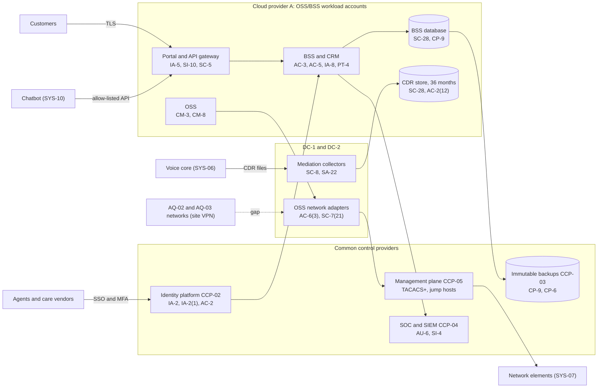

# System Security Plan: Customer Billing and Network Operations Platform (OSS/BSS)

**Organization:** Cris Santos Company, Inc. (publicly traded regional broadband and wired telecommunications carrier) | **Tier:** Enterprise | **Vertical:** Communications
**Outline:** NIST SP 800-18 Rev. 2, System Security Plan Outline Example (June 2026) | **Version:** 2.0, 2026-09-14

## 1. System Name and Identifier
Customer Billing and Network Operations Platform (**OSS/BSS**), identifier CSC-SYS-OSSBSS-001. Tier-1 system in the enterprise application inventory.

## 2. System Overview
The OSS/BSS runs customer and network operations for about 2.7 million accounts in four states (all accounts except those of the acquired carriers AQ-02 and AQ-03, which migrate in 2027). It holds the customer account record, CPNI approval flags, account passwords, bills, and 36 months of call detail for about 1.15 million voice lines; it orders, designs, and activates services; it tracks network inventory and trouble tickets; and it dispatches about 4,800 field technicians.

**Why confidentiality matters most.** The platform aggregates call detail and account data for millions of customers. A bulk disclosure would be a CPNI breach under 47 CFR 64.2011, could be a material cybersecurity incident for SEC purposes (P08), and could expose people whose calling patterns reveal sensitive relationships. Carriers are a publicly reported target: in 2024 a state-sponsored group was disclosed to have infiltrated at least eight U.S. communications companies by exploiting publicly known vulnerabilities and avoidable weaknesses (FCC, 90 FR 58006).

**Major components (inside the boundary):**
- **SYS-01 converged BSS:** commercial billing software, customer-managed on Cloud provider A IaaS and a managed database; includes the CRM and agent desktop used by in-house and care vendor agents
- **SYS-02 OSS:** inventory, activation orchestration, service assurance, workforce management (Cloud provider A)
- **SYS-03 mediation and CDR store:** collectors in DC-1 and DC-2; rating engine and object storage on Cloud provider A
- **SYS-04 customer portal, mobile app back end, and API gateway** (Cloud provider A), including the API client used by the chatbot
- **OSS network adapters:** northbound interfaces to element managers and activation adapters that log in to network elements through the management plane

Users: about 9,800 workforce accounts (care, billing, NOC, provisioning, engineering, field), about 2,600 care vendor agent accounts, and about 1.9 million registered portal and app users.

## 3. Laws, Regulations, and Policies Affecting the System
| ID | Requirement | Citation | How it affects the OSS/BSS |
|---|---|---|---|
| C-COMMUNICATIONS-R01 | FCC CPNI rules | 47 U.S.C. 222; 47 CFR 64.2001-64.2011 | Primary. Approvals (64.2007-64.2009), authentication (64.2010(b)-(f)), safeguards (64.2010(a)), breach notice and records (64.2011) |
| C-COMMUNICATIONS-R02 | FCC outage reporting | 47 CFR Part 4 (4.9, 4.18) | The OSS service assurance and workforce tools support outage detection, PSAP notice, and NORS and DIRS filings |
| C-COMMUNICATIONS-R03 | CALEA system security and integrity | 47 U.S.C. 1001-1010; 47 CFR 1.20000-1.20008 | The lawful-intercept platform (SYS-09) is outside the boundary; the OSS adapters must never reach it (SC-7(21)) |
| C-COMMUNICATIONS-R05 | CIRCIA (pending rule) | 6 U.S.C. 681b; proposed 6 CFR Part 226 | Tracked only. No final rule as of 2026-10-05 |
| C-COMMUNICATIONS-R06 | SEC cybersecurity disclosure | Form 8-K Item 1.05 (including 1.05(d)); 17 CFR 229.106 | A material OSS/BSS incident goes through the P08 materiality step |
| State | State breach notification laws | Each state where affected individuals reside (Florida worked example: Fla. Stat. 501.171) | Personal information in the BSS and portal (for example, online credentials) |
| Federal contracts | FAR reporting clauses | FAR 52.204-23, 52.204-25, 52.204-30 | Reporting duties if covered articles are found (P08) |
| Contract | Business customer contracts; SOC 2 readiness | P09 | CPNI authentication terms for 1,900 enterprise accounts (64.2010(g)); SL-1 and SL-2 commitments |
| Internal | POL-01 to POL-05 and standards | P06 | Enterprise policy hierarchy |

**Not applicable** (reasons in P03 section 1): submarine cable rules (C-COMMUNICATIONS-R04), CMRS-only CPNI rules (64.2010(h)), covered 911 service provider rules (47 CFR 9.19), and the EAS rules. Broadband usage data is not CPNI after *Ohio Telecom Ass'n v. FCC* (6th Cir. 2025), but POL-04 protects the whole customer account record to the CPNI standard.

## 4. System Status
### 4.1 System Security Plan Approval
Prepared by the BSS Application Manager and the GRC team. Reviewed by the CISO, the Chief Privacy Officer, the Chief Compliance Officer, and the Vice President, OSS/BSS Platforms. Approved by the Chief Operating Officer on 2026-09-14.
### 4.2 System Authorization Decision
The company is not a federal agency, so there is no formal ATO. The equivalent internal decision:
- **Authorizing official equivalent:** Chief Operating Officer, with the CISO's recommendation.
- **Decision (2026-09-14):** continue operation with conditions, based on the Internal Audit assessment (P07) and the risk register (P01).
- **Conditions:** close the High POA&M items that expose CPNI through authentication: the AQ-02 portal reset (POAM-006 by 2026-11-30) and care vendor authentication (POAM-005 by 2026-12-31); restrict the AQ site VPNs that reach the OSS adapters (POAM-003 by 2027-01-31); rerun the DR test to prove the 4-hour RTO (POAM-011 by 2027-01-31).
- **Reauthorization:** annually, or after a major change (for example, the AQ-02 BSS migration planned for 2027-03-31).
### 4.3 System Operational Status
Operational. Planned major modifications: AQ-02 and AQ-03 account migration into the BSS (2027-03-31 and 2027-09-30); atypical usage analytics on CPNI reads (AC-2(12), POAM-016); automated BSS database failover (POAM-011).

## 5. Role Identification and Responsible Personnel
| Role | Title | Responsibility |
|---|---|---|
| System owner | Vice President, OSS/BSS Platforms | Accountable for the OSS/BSS; approves access roles and changes |
| Authorizing official (equivalent) | Chief Operating Officer | Accepts residual risk to operate |
| Business owners | Chief Customer Officer (care, portal); Vice President, Billing and Revenue Assurance (billing, mediation); Chief Network Officer (OSS) | Role design, customer authentication procedures, CPNI approval logic |
| CPNI compliance officer | Chief Compliance Officer | Signs the annual CPNI certifications (64.2009(e)) |
| System administrator | BSS Application Manager | Day-to-day administration and change control |
| Information security | CISO; Director of Security Operations | Program oversight; SOC monitoring; incident response |
| Privacy | Chief Privacy Officer | CPNI breach determinations with counsel |
| Common control providers | See section 10.3 | Operate inherited controls |
| Independent assessor | Chief Audit Executive (Internal Audit) | Annual assessment (P07) |

## 6. System Information Types and System Categorization
Information types are the closest matches in NIST SP 800-60 Vol. 2 Rev. 1. Impact levels follow FIPS 199.

| Information type | Confidentiality | Integrity | Availability | Rationale |
|---|---|---|---|---|
| Customer account and CPNI records (closest type: Customer Services) | **High (treated)** | Moderate | Moderate | Bulk disclosure of call detail and account data for millions of customers would have a severe effect. Wrong approval flags cause unlawful CPNI use. Care can run on the offline account report for one shift (P05 BP-07: MTD 12 h, RTO 4 h) |
| Call detail and rating (closest type: Collections and Receivables) | **High (treated)** | Moderate | Low | 36 months of calling history for 1.15 million lines; switches buffer CDRs for 72 h (P05 BP-12: MTD 120 h) |
| Network inventory, configuration, and service assurance (closest types: System and Network Monitoring; IT Infrastructure Maintenance) | Moderate | Moderate | Moderate | Topology is sensitive; wrong activation data causes outages; the network keeps passing traffic, including 911, if the OSS is down (P05 BP-03 relies on the management plane, not the OSS) |
| Information security (audit logs, credentials, keys) | Moderate | Moderate | Moderate | Protects the evidence needed for 64.2011 determinations |
| **OSS/BSS category** | **Moderate baseline, confidentiality supplemented** | **Moderate** | **Moderate** | See the decision below |

**Categorization decision.** Under a strict FIPS 199 high-water mark, a High confidentiality rating would make the whole system High. The company is not a federal agency and uses FIPS 199 as a model. The risk and technology committee approved this tailoring on 2026-09-10:
- The OSS/BSS uses the **SP 800-53B Moderate baseline**.
- It adds **10 High-baseline controls** that protect CPNI confidentiality and the management paths into the network: AC-2(12), AC-6(3), AU-6(5), AU-9(2), AU-12(1), CA-8, CA-8(1), SC-7(21), SI-4(12), SI-4(20).
- It adds **3 privacy-baseline controls** because the platform processes CPNI approvals and notices: PT-2, PT-4, PT-5.
- The decision is reviewed annually. If the items that most affect CPNI exposure (POAM-002, POAM-004, POAM-016) are not closed by 2027-06-30, the CISO will recommend full High categorization.

**Documented controls.** `control-implementation.csv` documents **142 controls**: 129 from the Moderate baseline, 3 privacy-baseline controls, and 10 High-baseline confidentiality supplements. The remaining Moderate-baseline enhancements are fully inherited from the common control catalog (section 10.3) and are listed there rather than repeated here.

## 7. Authorization Boundary Description
**Inside the boundary:** the BSS, OSS, mediation and CDR store, portal and API gateway workload accounts on Cloud provider A; the mediation collectors in DC-1 and DC-2; the OSS network adapters; and the administrator workstations used for these components.

**Outside the boundary (common control providers and interconnected systems):**
- Landing zone services (network hub, key management, log archive, backup accounts, standby region): CCP-03
- Identity platform (SYS-05): CCP-02
- SOC, SIEM, EDR, scanners: CCP-04
- Network management plane (SYS-08: TACACS+, jump hosts, element managers) and the network elements themselves (SYS-06, SYS-07): CCP-05
- Contact center platform and chatbot (SYS-10), care vendors, payment processor, bill print vendor, AQ-02 and AQ-03 legacy billing systems

**Excluded:** the lawful-intercept platform (SYS-09), governed by the CALEA SSI plans. **Boundary weakness:** AQ-02 and AQ-03 management networks reach the OSS adapters over site VPNs (P07 SC-7; POAM-003).

The enterprise multi-cloud diagram is in P04 `cloud-architecture.md`.

## 8. Information Exchanges Summary
| Connected system / party | Direction | Data | Agreement |
|---|---|---|---|
| Voice core (SYS-06) to mediation collectors | Inbound | CDRs | Internal; **41 TDM switches use clear-text file transfer (POAM-017)** |
| Network elements through the management plane | Bidirectional | Activation commands, inventory, alarms | Internal; adapters authenticate through TACACS+ where elements support it |
| Contact center platform (SYS-10) | Bidirectional | Screen-pop account data; call recordings stay in the CCaaS | Vendor contract with CPNI terms |
| Chatbot (SYS-10) | Bidirectional (allow-listed API after customer sign-in) | Account data, bill and call detail lines | Vendor contract; **72-hour incident notice (POAM-014)** |
| Care vendors CV-1 to CV-3 | Agents use the BSS agent desktop on company virtual desktops | Account data, CPNI | Vendor contracts with CPNI and training terms |
| AQ-02 and AQ-03 legacy billing | Read-only lookups by enterprise care; nightly account extracts | Account data, CPNI | Integration plan; **legacy logs not in the SIEM (POAM-007)** |
| Payment processor | Outbound redirect and token return | Payment tokens only | Processor agreement |
| Bill print vendor | Outbound | Bill images, including toll call detail | Vendor contract with confidentiality terms |
| Number portability administration | Bidirectional | Port requests | Industry agreement |
| Data and AI platform (Cloud B) | Outbound nightly | Account and usage data for analytics, filtered by CPNI approval flags | Internal data sharing agreement |

## 9. System Component Inventory
| Component | Type | Location / provider | Owner |
|---|---|---|---|
| BSS application servers (12) | IaaS virtual machines | Cloud provider A, primary region; standby in second region | BSS Application Manager |
| BSS database | Managed relational database (PaaS) | Cloud provider A | BSS Application Manager |
| OSS application and database | Managed containers and database | Cloud provider A | Vice President, OSS/BSS Platforms |
| Rating engine and CDR store | Managed containers; object storage | Cloud provider A | Vice President, Billing and Revenue Assurance |
| Mediation collectors (4) | On-premises servers | DC-1 and DC-2 | Vice President, Billing and Revenue Assurance |
| OSS network adapters (6) | On-premises virtual machines | DC-1 and DC-2, management segment | Vice President, OSS/BSS Platforms |
| Portal, app back end, API gateway | PaaS web apps; managed API gateway; web application firewall | Cloud provider A | Chief Customer Officer |
| Administrator workstations | Hardened laptops | Enterprise | Director of Endpoint Engineering |

## 10. Control Implementation Details
### 10.1 Control implementation status
See `control-implementation.csv` (142 controls).

| Status | Count |
|---|---|
| Implemented | 113 |
| Partially implemented | 27 |
| Planned | 2 |
| **Total** | **142** |

| Inheritance | Count |
|---|---|
| Common (fully inherited from a common control provider) | 89 |
| Hybrid (shared between a provider and the OSS/BSS team) | 22 |
| System-specific | 31 |

The Planned controls are High-baseline supplements: AC-2(12) (POAM-016) and AU-6(5) (POAM-004). Partially implemented controls: AC-2, AC-6, AC-17, AT-3, AU-6, AU-12, CM-6, CM-8, CP-2, CP-10, IA-5, IA-8, IR-3, IR-4, IR-8, PS-4, PT-4, RA-5, SA-9, SA-22, SC-7, SC-8, SI-2, SI-4, AC-6(3), SC-7(21), SI-4(12).

### 10.2 Control assessment status
Internal Audit assessed 42 of these controls from 2026-07-13 to 2026-08-28 using SP 800-53A Rev. 5 procedures and statistical sampling (P07 `assessment-plan.md`, `assessment-results.csv`). Weaknesses are in P07 `poam.csv`.

### 10.3 Common control providers and inheritance
Common and hybrid controls are inherited from the enterprise platform. Each provider publishes its controls in the enterprise **common control catalog** (maintained by the GRC team in the GRC platform) and is assessed on its own cycle; the OSS/BSS inherits the results.

| Provider | Name | Accountable role | Controls provided | Rows in this plan | Evidence of operation |
|---|---|---|---|---|---|
| CCP-01 | Enterprise GRC program | CISO (with the Chief Risk Officer and Chief Audit Executive for assessment) | Policies and standards (P06), risk method, assessment, POA&M, continuous monitoring | 24 | Annual Internal Audit assessment (P07); GRC platform |
| CCP-02 | Identity platform (SYS-05) | Director of Identity and Access Management | SSO, MFA, PAM, identity governance, account lifecycle | 18 | SOX IT general control testing; P07 AC-2, IA-2, IA-5 results |
| CCP-03 | Cloud landing zone (Cloud provider A) | Director of Cloud Platform Engineering | Guardrails, network policies, key management, encryption, backups, log archive, standby region | 20 | Posture reports; provider SOC 2 Type 2 (physical and hypervisor) |
| CCP-04 | Security operations | Director of Security Operations | 24x7 SOC, SIEM, EDR, vulnerability management, penetration testing, incident response | 23 | SOC metrics; P07 SI-4, RA-5, IR results |
| CCP-05 | Network operations and management plane (SYS-08) | Director of Network Security Engineering (with the Chief Network Officer) | TACACS+, jump hosts, element hardening, segmentation of management paths, transport | 10 | TACACS+ coverage reports; P07 SC-7, CM-6 results |
| CCP-06 | Endpoint engineering (SYS-12) | Director of Endpoint Engineering | Workstation baselines, EDR agents, screen locks | 2 | Configuration compliance reports |
| CCP-07 | Facilities and physical security | Vice President, Facilities and Real Estate | Data center and NOC physical access; media destruction | 3 | Badge reviews; destruction certificates |
| CCP-08 | Human resources and workforce training | Chief Human Resources Officer | Screening, terminations, sanctions, training, acknowledgments | 6 | HR and learning system reports |
| CCP-09 | Third-party risk management | Director of Third-Party Risk Management | Vendor tiering, CPNI contract terms, SOC report reviews, supply chain | 5 | Vendor register; SOC report reviews |

**Inheritance rules:**
- A Common control is fully inherited; the OSS/BSS team verifies only that the system is onboarded (for example, SSO integration and log forwarding).
- A Hybrid control names both parts in the implementation statement: the provider's part and the OSS/BSS team's part.
- If a provider's assessment finds a weakness, the finding is linked to every inheriting system's POA&M. Example: POAM-002 (shared local accounts on legacy network elements) is a CCP-05 weakness that affects the OSS/BSS because the OSS adapters log in to those elements.

## 11. Digital Identity Acceptance Statement
- **Workforce and care vendor users:** SSO with MFA (authenticator app with number matching). Privileged users use phishing-resistant FIDO2 keys through PAM. This matches an authentication assurance level comparable to NIST SP 800-63 AAL2 for users and AAL3-like protection for privileged users. **Exception until 2027-03-31:** OSS adapter accounts on about 7,400 legacy elements use shared local passwords (POAM-002), mitigated by jump-host-only reachability.
- **Customers (non-organizational users):** the CPNI rules set the minimum. Online access requires authentication "without the use of readily available biographical information, or account information" and then a password (47 CFR 64.2010(c), (e)). The main portal enrolls and resets by a one-time code to the telephone number or email of record, offers an app-based second factor, and sends immediate notices of password, backup authentication, online account, and address-of-record changes (64.2010(f)). **Exception until 2026-11-30:** the AQ-02 portal (outside the boundary) still resets with date of birth and SSN4 (POAM-006).
- **Phone care:** call detail is discussed only after the caller gives the account password; otherwise it is sent to the address of record or the caller is called back at the telephone number of record (64.2010(b)). Business customers with a dedicated account representative and a contract addressing CPNI follow their contract terms (64.2010(g)).

## 12. Referenced Artifacts
Scenario facts (`../00_company-facts.md`), BIA and dependency map (P05), multi-cloud architecture and control map (P04), enterprise risk register (P01), regulatory gap analysis (P03), policy hierarchy and policies (P06), Internal Audit assessment and POA&M (P07), CPNI intrusion runbook and notification matrix (P08), SOC 2 readiness (P09), AI portfolio including the chatbot (P10), OSS/BSS contingency plan v3, enterprise common control catalog.

## 13. Acronym List and Glossary
- **BSS / OSS:** business support system (billing and care) / operations support system (inventory, activation, assurance)
- **CALEA:** Communications Assistance for Law Enforcement Act
- **CCP:** common control provider
- **CDR:** call detail record
- **CPNI:** customer proprietary network information (47 U.S.C. 222(h)(1))
- **NORS / DIRS:** FCC Network Outage Reporting System / Disaster Information Reporting System
- **PAM:** privileged access management
- **PSAP:** public safety answering point (a 911 special facility, 47 CFR 4.5(e))
- **SSI:** system security and integrity (CALEA)
- **TACACS+:** centralized authentication, authorization, and accounting for network devices

## 14. System Security Plan Review and Change Records
| Version | Date | Change | Author |
|---|---|---|---|
| 1.0 | 2025-09-12 | Initial plan (Moderate baseline) | BSS Application Manager |
| 1.1 | 2026-02-20 | Added AQ-02 legacy billing interfaces | BSS Application Manager |
| 2.0 | 2026-09-14 | Confidentiality supplementation; common control provider mapping; 2026 assessment results | BSS Application Manager with GRC team |
