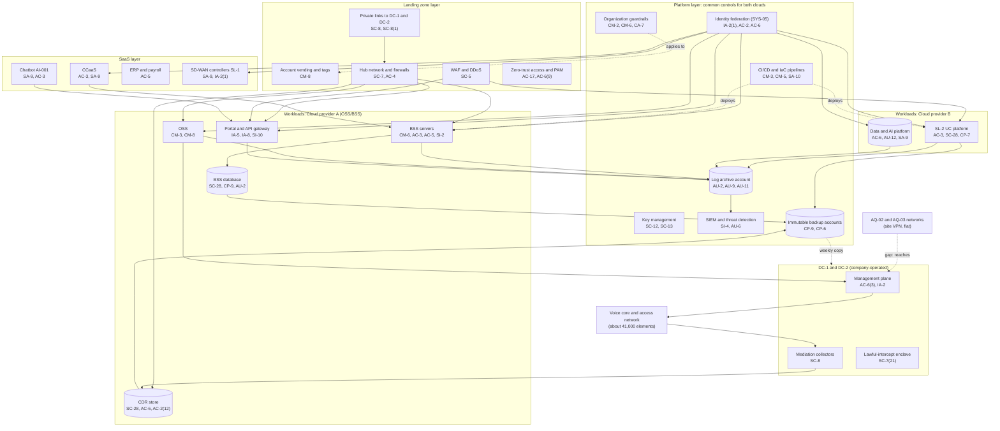

# Cloud Architecture and Control Placement: Cris Santos Company | Communications | Enterprise

**Organization:** Cris Santos Company, Inc. (publicly traded regional broadband and wired telecommunications carrier) | **Tier:** Enterprise | **Provider:** Multi-cloud, vendor-agnostic: two public cloud providers (called Cloud provider A and Cloud provider B), two company data centers (DC-1 Florida, DC-2 Georgia), and SaaS (see section 4)
**Owner:** Director of Cloud Platform Engineering, with the CISO and the Director of Network Security Engineering | **Date:** 2026-08-31 | **Related:** OSS/BSS SSP (P02), enterprise BIA (P05)

## 1. Architecture in layers
The IT estate is organized in four cloud layers plus the company data centers. Each lower layer provides **common controls** that the layers above inherit, so a workload team configures only what is specific to its system. The carrier network itself (voice core, IP and access network) is not cloud-hosted; it is managed from the management plane in the data centers.

| Layer | What it is | Examples | Who runs it |
|---|---|---|---|
| **Platform** | Organization-wide services in both clouds | Guardrails, identity federation, key management, log archive, SIEM feeds, vulnerability and posture management, immutable backup accounts, CI/CD pipelines; provider facilities (inherited) | Cloud Platform Engineering; Security Operations; Identity team |
| **Landing zone** | The standard account (subscription or project) pattern every workload lands in | Account vending with mandatory tags (including a CPNI data-class tag), hub-and-spoke network with cloud firewalls, private links to DC-1 and DC-2, WAF and DDoS protection, zero-trust and PAM access | Cloud Platform Engineering; Network Engineering |
| **Workload** | Systems built or run by the company | Cloud A: BSS, BSS database, OSS, rating engine and CDR store, portal and API gateway. Cloud B: SL-2 hosted unified communications platform, data and AI platform | Application teams (for example, the BSS Application Manager) |
| **SaaS** | Vendor-operated applications | CCaaS, customer-service chatbot, ERP and payroll, productivity suite, SD-WAN and firewall vendor controllers (SL-1) | Vendors, with the company's configuration and oversight |
| **Data center** | Company-operated facilities | Network management plane (TACACS+, jump hosts, element managers), mediation collectors, OSS network adapters, lawful-intercept enclave, offline backup copy | Network Security Engineering; NOC; Facilities |

## 2. Diagram

## 3. Responsibility by service model
Sources: SRC-AWS-SRM, SRC-AZURE-SRM, and SRC-GCP-SRM in `00_universal-framework/sources/source-register.csv`. The three published models agree on the split used here, so the design does not depend on which two providers the company uses.

| Service model | Provider | Company (customer) | Shared |
|---|---|---|---|
| IaaS (BSS servers, mediation VMs) | Facilities, hosts, hypervisor, physical network | Guest OS, applications, identities, data, network policy | Encryption (provider service, customer keys), logging |
| PaaS (databases, object storage, containers, API gateway, AI services) | Also the platform runtime and its patching | Data, access, configuration, keys, application code | Backups, availability configuration |
| SaaS (CCaaS, chatbot, ERP, productivity, SD-WAN controllers) | Also the application | Users, roles, data, oversight of the vendor | Audit review (complementary user entity controls) |
| Company data centers | Not applicable | Everything: building, power, racks, management plane, network elements | None |

## 4. Service categories and provider equivalents
| Service category | AWS | Microsoft Azure | Google Cloud |
|---|---|---|---|
| Organization guardrails | AWS Organizations service control policies | Azure Policy with management groups | Organization Policy Service |
| Account vending | AWS Control Tower account factory | Azure landing zone subscription vending | Resource Manager project creation |
| Key management | AWS KMS | Azure Key Vault | Cloud KMS |
| Audit logging | AWS CloudTrail | Azure Monitor activity log | Cloud Audit Logs |
| Threat detection | Amazon GuardDuty | Microsoft Defender for Cloud | Security Command Center |
| Managed relational database | Amazon RDS | Azure SQL Database | Cloud SQL |
| Object storage | Amazon S3 | Azure Blob Storage | Cloud Storage |
| Managed containers | Amazon EKS | Azure Kubernetes Service | Google Kubernetes Engine |
| API gateway | Amazon API Gateway | Azure API Management | Apigee API Management |
| Web application firewall | AWS WAF | Azure Web Application Firewall | Cloud Armor |
| Backup service | AWS Backup | Azure Backup | Backup and DR Service |

This table is for reading provider documentation only. The architecture, control map, and SSP describe service categories.

## 5. Common controls
`cloud-control-map.csv` has **68 rows** across 30 components: Platform 24, Landing zone 8, Workload 21, SaaS 9, Data center 6. Responsibility: Customer 46, Shared 16, Provider 6.

**34 rows are published as common controls** (`common_control` = Yes) in the enterprise common control catalog. They map to the common control providers in the OSS/BSS SSP (P02 section 10.3): identity (CCP-02), landing zone (CCP-03), security operations (CCP-04), network operations and management plane (CCP-05), and facilities (CCP-07). A workload inherits them by being deployed through account vending, which applies the guardrails, logging, network, key, and backup policies automatically.

**Rules for inheriting:**
1. A workload may claim a common control only if its account was created by account vending and passes the posture baseline.
2. Customer-side identity, data protection, and logging stay explicit at every layer: even a SaaS application has Customer rows for access (AC-3) because those are always the company's responsibility, and CPNI protection cannot be delegated away (47 CFR 64.2010(a)).
3. SaaS rows cite the vendor's SOC 2 report, reviewed by the third-party risk team (P09 evidence map).
4. Any account tagged as holding CPNI gets the CDR store pattern: customer-managed keys, read logging, and no public access policy.

## 6. Validation against the OSS/BSS SSP (P02)
Every OSS/BSS component in the SSP boundary appears here with controls from each required family, directly or inherited:
| OSS/BSS component | AC | AU | CM | IA | SC | SI |
|---|---|---|---|---|---|---|
| BSS application servers | AC-3, AC-5 | AU-2, AU-9 (inherited) | CM-6, CM-2 (inherited) | IA-2(1) (inherited) | SC-7 (inherited) | SI-2 |
| BSS database | AC-6 (inherited) | AU-2 | CM-6 (inherited) | IA-2(1) (inherited) | SC-28 | SI-2 (shared) |
| OSS application | AC-6 (inherited) | AU-2 (inherited) | CM-3, CM-8 | IA-2(1) (inherited) | SC-7 (inherited) | SI-2 (shared) |
| Rating engine and CDR store | AC-6, AC-2(12) (planned) | AU-2 (inherited) | CM-6 (inherited) | IA-2(1) (inherited) | SC-28 | SI-4 (inherited) |
| Portal and API gateway | AC-6 (inherited) | AU-2 (inherited) | CM-3 (inherited) | IA-5, IA-8 | SC-5 (inherited) | SI-10 |
| Mediation collectors and OSS adapters | AC-6(3) (inherited) | AU-2 (inherited) | CM-6 | IA-2 (inherited, gap) | SC-8 (gap) | SI-4 (inherited) |

## 7. Findings from the mapping
1. **Acquired-carrier connectivity.** AQ-02 and AQ-03 site VPNs terminate on the management network, so a flat AQ network can reach the OSS adapters and element managers (P07 SC-7). Fix: host-level access lists now, then migration behind enterprise jump hosts (POAM-003).
2. **The network is not a cloud workload.** No cloud guardrail protects the 41,000 network elements. Their identity, logging, and patching depend on the management plane (CCP-05), where shared local accounts remain on about 7,400 legacy elements (POAM-002) and only 58% of element logs reach the SIEM (POAM-004).
3. **CPNI in object storage.** The CDR store holds 36 months of call detail. Guardrails block public access, but there is no alerting on unusual read volume yet (AC-2(12), POAM-016).
4. **Two clouds, one control set.** Guardrails, logging, and key policies are written once as code and applied to both clouds. Differences are limited to service names (section 4).
5. **Clear-text CDR collection.** 41 TDM switches send CDRs by unencrypted file transfer to the collectors; the path is inside the management network, but the data is CPNI (POAM-017).
6. **Chatbot and CCaaS are SaaS with company-side controls.** The chatbot reaches account data only through the API gateway allow-list after customer sign-in; its contract still allows 72 hours for incident notice (POAM-014).
7. **Lawful intercept stays outside.** The enclave in DC-1 and DC-2 has no route from the OSS adapters or the clouds, which the reachability test confirmed (P07 SC-7 statement on the enclave).
