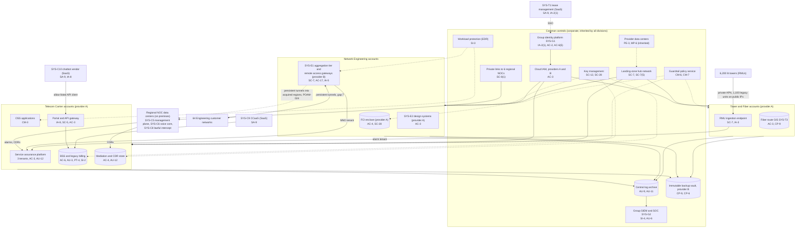
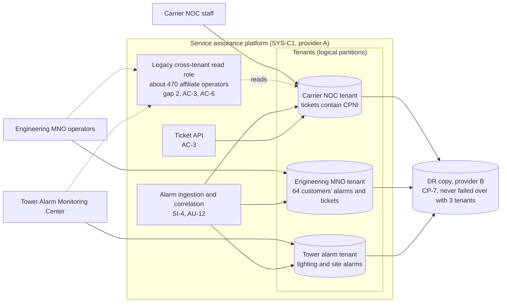

# Cloud Architecture and Control Placement: Cris Santos Company Holdings | Communications | Multi-Sector

**Organization:** Cris Santos Company Holdings, Inc. | **Tier:** Multi-Sector | **Providers:** two public cloud providers, called provider A and provider B (vendor-agnostic; see section 6)
**Scope:** the shared corporate cloud platform (SYS-G3 landing zones) plus the division workloads that run on it, and the private links to the Carrier's 6 regional NOC data centers. The SSP system (P02) is the Carrier's OSS/BSS, including the service assurance platform that the Engineering and Tower divisions use as tenants.

## 1. Design in one paragraph
Corporate runs one **landing zone** per provider: identity federation from SYS-G1, a hub network, guardrail policies, a central log archive, key management, EDR, and an immutable backup vault. Divisions get their own **accounts** (subscriptions or projects) inside the landing zone and inherit these guardrails. Provider A hosts the corporate hub, the Carrier OSS (including the service assurance platform), BSS, legacy billing system, mediation and CDR store, portal and API gateway, Engineering's design systems and FCI enclave (SYS-E2), the Tower fiber GIS (SYS-T3), and the RMU ingestion endpoint (SYS-T2). Provider B hosts the OSS and BSS disaster recovery copies, the immutable backup vault, and the Engineering MNO aggregation tier and remote access gateways (SYS-E1). The Carrier's management plane (SYS-C5), voice core (SYS-C6), and lawful-intercept systems (SYS-C8) stay **on premises** in 6 regional NOC data centers, linked to provider A over private connections. The contact center (SYS-C9), chatbot (SYS-C10), lease management (SYS-T1), and smart lock service are vendor SaaS.

## 2. Diagrams
### 2.1 Group landing zone and division workloads

### 2.2 Service assurance platform (shared system inside the SSP boundary)

**Target state (POAM-008, due 2027-03-31):** the legacy cross-tenant role is removed by 2026-11-30; each tenant gets its own role catalog, ticket API scope, and encryption key; Carrier tickets that Engineering crews need for joint restoration are shared through a minimum-data "work package" view that omits customer names and call detail; the Tower tenant's alarm path gets a standby ingestion route that does not depend on the Carrier tenant being reachable.

## 3. Tenancy and identity decision
**Decision.** All three divisions share the group identity platform (SYS-G1). Each division gets its own accounts inside the SYS-G3 landing zones, with roles federated from SYS-G1 only. Engineering's FCI enclave (SYS-E2) is a separate account, not a separate tenant. On the shared service assurance platform, Engineering and Tower operators are tenants that sign in through SYS-G1 like any workforce user. No division has a separate identity tenant.

**Reason.** One identity platform, one SIEM, and one backup design let group internal audit assess common controls once. The sample states that CPNI separation between divisions is an authorization problem (AC-3), not an authentication one, so it is solved by tenant partitioning, not by a separate identity provider.

**What limits blast radius.** IT administrators use phishing-resistant hardware keys and just-in-time PAM with session recording. Cloud IAM has no local users except sealed break-glass accounts, and the hub network denies by default for every division account. No administrator can delete logs in the object-locked archive, and the SIEM flags bulk CPNI access by any tenant role. Backups use a separate backup identity. Federal project data cannot be copied from the FCI enclave to the general design workspace.

**Known gaps.** About 470 affiliate operators still hold a legacy cross-tenant read role over Carrier tickets with CPNI (POAM-008). The SYS-E1 gateways keep persistent tunnels into the Carrier's acquired-region management plane and use six shared administrator accounts (POAM-024, POAM-025).

Cross-division risks: GR-01 (intrusion into management planes across divisions), GR-02 (shared service assurance platform exposes CPNI), GR-03 (ransomware through shared services), GR-08 (identity platform compromise).

## 4. Common versus division-specific controls
`cloud-control-map.csv` has 52 rows across 29 components. The `control_scope` column shows who owns each placement:

| Scope | Rows | What it means |
|---|---|---|
| Common (group) | 20 | Provided once by corporate (SYS-G1, SYS-G2, SYS-G3) and inherited by every division account. Listed in the P02 common control catalog |
| Shared system (OSS/BSS) | 15 | Controls of the SSP system, including the service assurance platform used by all three divisions |
| Division-specific (Telecom Carrier) | 3 | SaaS used only by the Carrier: contact center and chatbot |
| Division-specific (Network Engineering Services) | 7 | MNO aggregation and gateways, design systems, FCI enclave, media handling |
| Division-specific (Tower and Fiber Infrastructure) | 7 | Lease management, RMU ingestion, smart locks, fiber GIS |

| Responsibility | Rows |
|---|---|
| Customer (the group or a division) | 37 |
| Shared (provider and group) | 12 |
| Provider | 3 |

**Rule of thumb.** Identity, network guardrails, logging, keys, backups, and EDR are **common**. A division cannot opt out of them, only request an exception through POL-01. Application behavior, tenant partitioning, customer-facing identity, and device fleets (RMUs, network elements) are **division-specific**, because they depend on each division's regulators and customers.

## 5. Layers
| Layer | Common components | Division components | Key controls | Responsibility |
|---|---|---|---|---|
| Identity | SYS-G1, cloud IAM | Customer identity in the portal and chatbot; RMU device identity; MNO gateway accounts | AC-2, AC-3, AC-6(5), IA-2(1), IA-3, IA-5, IA-8 | Customer (configuration); vendor (service) |
| Network | Hub network, private links to NOCs | API gateway, WAF, MNO tunnels, RMU APN | SC-7, SC-7(5), SC-8(1), SC-5, AC-17 | Customer, with provider DDoS protection shared |
| Compute | EDR, guardrails | OSS containers, legacy billing, gateways | SI-2, SI-3, CM-3, CM-6, CM-7 | Customer (guest OS, containers, code) |
| Data | Keys, backup vault | BSS, CDR store, FCI enclave, fiber GIS | SC-12, SC-28, CP-9, CP-6, AC-4, PT-4 | Shared: provider encrypts; group owns keys, zoning, retention |
| Logging and monitoring | Log archive, SIEM | Ticket views, CPNI views, lock logs | AU-3, AU-6, AU-9, AU-11, AU-12, SI-4 | Shared: providers generate platform logs; group retains and reviews |
| SaaS dependencies | Identity and SIEM vendors | CCaaS, chatbot vendor, lease management, smart locks | SA-9, IA-8, AU-12 | Provider for the service; customer for use and oversight |
| Physical | Provider data centers | Regional NOC data centers (on premises, outside this map; P02 PE controls) | PE-3, MP-6 | Provider (cloud); Carrier (NOCs) |

## 6. Service categories and provider equivalents
The design does not depend on a provider. This table gives each provider's name for each service category, for reading its shared responsibility documentation.

| Service category | AWS | Microsoft Azure | Google Cloud |
|---|---|---|---|
| Account structure and guardrails | AWS Organizations with service control policies | Management groups with Azure Policy | Resource hierarchy with Organization Policy |
| Managed containers (OSS, service assurance) | Amazon EKS | Azure Kubernetes Service | Google Kubernetes Engine |
| Object storage (CDR store) | Amazon S3 | Azure Blob Storage | Cloud Storage |
| Object-level read logging | CloudTrail data events | Storage diagnostic logs | Data Access audit logs |
| Key management | AWS KMS | Azure Key Vault | Cloud KMS |
| Backup with immutability | AWS Backup (vault lock) | Azure Backup (immutable vault) | Backup and DR Service |
| Private connectivity to on-premises NOCs | AWS Direct Connect | Azure ExpressRoute | Cloud Interconnect |
| Managed API gateway and WAF | Amazon API Gateway and AWS WAF | Azure API Management and Web Application Firewall | Apigee and Cloud Armor |

Shared responsibility sources: SRC-AWS-SRM, SRC-AZURE-SRM, SRC-GCP-SRM in `00_universal-framework/sources/source-register.csv`. All three agree on the split used here: for IaaS the provider owns facilities, hosts, and virtualization; for PaaS the provider also owns the runtime; for SaaS the provider owns the application. The customer always keeps identities, access decisions, data classification, and data.

## 7. Findings from the mapping
1. **Tenant partitioning, not encryption, is the shared platform's weak point.** Encryption and keys are sound (SC-28, SC-12). The gap is that three divisions' operators share one instance and a legacy role lets about 470 affiliate operators read Carrier tickets with CPNI (AC-3, AC-6; P01 GR-02; POAM-008).
2. **The CDR store cannot answer "what was read?"** Every provider offers object-level read logging, but it is not enabled (AU-12; POAM-014). In an intrusion the Carrier would have to treat all 24 months of CDRs in the affected regions as exposed (P08).
3. **Engineering's gateways are a bridge between networks.** The SYS-E1 gateways in provider B hold persistent tunnels into 64 customer networks and into the Carrier's acquired-region management plane, with shared administrator accounts (AC-17, IA-5; POAM-024, POAM-025). This is the entry path in the P08 scenario.
4. **Legacy RMUs bypass the private APN.** About 1,100 units report over public IP addresses with shared credentials, and P07 testing found 212 that accept the default password (IA-3; POAM-022; P01 TF-014).
5. **Common controls are strong and reused.** One identity platform, one SIEM, one backup design. This is what lets group internal audit assess them once (P07). The weak links are documentation of inheritance for the Tower division (P02, POAM-021) and SIEM coverage of non-IT devices (POAM-003).
