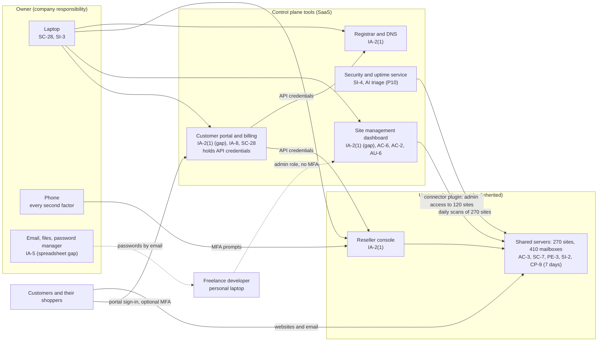

# SaaS Architecture and Control Placement: Cris Santos Company | Information Technology | Sole Proprietorship

**Organization:** Cris Santos Company (web hosting reseller) | **Tier:** Sole Proprietorship | **Provider:** SaaS only (no IaaS). The upstream reseller hosting is treated as a SaaS-like managed service
**System:** Hosting Control Plane and Customer Portal (HCP), as defined in the system security plan (P02)

## 1. Diagram
Control IDs on each node are the ones in `cloud-control-map.csv`. Dashed lines are paths with a known gap.

## 2. Layers
| Layer | Components | Key controls | Responsibility |
|---|---|---|---|
| Identity | Portal administrator, reseller console, registrar, dashboard accounts; customer portal accounts | IA-2(1), IA-8, AC-2, AC-6, IA-5 | Company (vendors provide MFA and roles) |
| Data | Customer sites, databases, mailboxes; API credentials; customer password spreadsheet | CP-9, SC-28, IA-5 | Shared: provider stores and backs up; company decides retention, independent backups, and where credentials live |
| Compute and application | Shared servers and hosting software; CMS core, plugins, themes on customer sites | SI-2 | Provider for servers; company for care-plan sites; customers for hosting-only sites (not written down today) |
| Network | Provider network, firewalls, denial-of-service filtering | SC-7 | Provider |
| Logging and monitoring | Console, portal, registrar, and dashboard logs; scans and uptime checks | AU-6, SI-4 | Shared: vendors record, company reviews |
| Endpoints | Laptop and phone | SC-28, SI-3 | Company |
| Physical | Provider U.S. data centers | PE-3 | Provider (colocation carved out in its SOC 2 report) |

## 3. Shared responsibility for a reseller: three layers, not two
All three major cloud providers' shared responsibility models (SRC-AWS-SRM, SRC-AZURE-SRM, SRC-GCP-SRM) agree on the SaaS split: the provider runs the application, the platform, and the facilities; **the customer always keeps its identities and accounts, its data, and its devices.** A reseller sits in the middle of that model:

| Layer | Who | What they control |
|---|---|---|
| Upstream provider | Wholesale hosting provider | Servers, operating systems, hosting software, network, data centers, 7-day backups |
| Reseller (this company) | Owner | Every customer account, package, DNS zone, and domain; the control plane tools; contractor access; care-plan patching; backups beyond 7 days |
| End customer | Each business | Its own site content, site administrator users, and (for hosting-only sites) site software updates |

That is why 10 of the 18 rows in the control map are the company's alone. The upstream provider's SOC 2 report (P09) covers only the top layer. **Customers see one brand and assume the company covers everything**, so the gaps between the layers must be written into the Terms of Service (P03 G-023 and G-041).

No provider equivalents table is needed, because the company runs no infrastructure of its own.

## 4. Findings from the mapping
1. **The portal is the master key.** It stores API credentials that can terminate any hosting account and redirect any domain, yet its administrator login had no MFA. This is a bigger exposure than the reseller console itself, which does use MFA. Tracked as P01 R-002.
2. **The dashboard is a code-push channel to 120 sites.** The freelance developer's administrator account had no MFA and was used from a personal laptop. A former contractor's account was still active (found in P07). Tracked as R-001 and R-012.
3. **Backups are not independent.** The only copy for 235 sites sits with the provider that runs production and is deleted with the account. Found while mapping CP-9: the provider's reseller terms state the deletion rule. Tracked as R-005.
4. **Nobody owns patching for hosting-only sites.** The provider patches servers, the company patches care-plan sites, and the gap in between holds 64 vulnerable sites. Tracked as R-004.
5. **Credentials live outside the password manager.** The spreadsheet and emailed passwords bypass the one control the owner uses well. Tracked as R-003.
