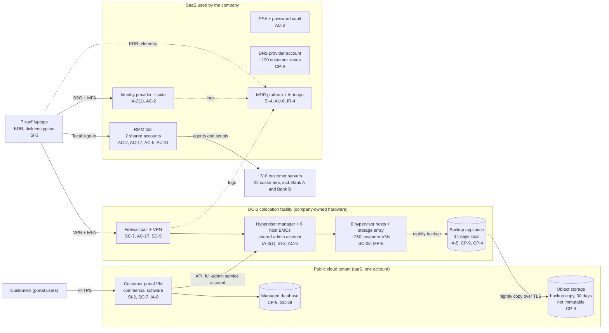

# Cloud Architecture and Control Placement: Cris Santos Company | Information Technology | Micro

**Organization:** Cris Santos Company, LLC (managed cloud hosting provider) | **Tier:** Micro | **Provider:** Vendor-agnostic (see section 3)
**System:** Hosting Control Plane and Customer Portal (HCP), as defined in the SSP (P02) | **Prepared:** 2026-07-31 by the Lead Systems Engineer with a Systems Engineer | **Approved:** Owner, 2026-09-15

## 1. Diagram
The company is a cloud provider to its own customers, but it is also a cloud customer. Its hosting platform is company-owned hardware in a colocation facility. Its single cloud workload is one IaaS tenant that runs the customer portal and holds the off-site backup copy. Everything else it uses to run the business is SaaS.

Dotted lines are the log sources the MDR receives today. The hypervisor manager, BMCs, RMM tool, cloud tenant, and DNS account send it nothing (P07 SI-4 finding).

## 2. Layers and who is responsible
| Layer | Components | Key controls | Company (customer of its vendors) | Outside provider | Vendor platform |
|---|---|---|---|---|---|
| Identity | Identity provider, RMM accounts, hypervisor manager, cloud users, DNS account, portal customer accounts | AC-2, AC-6, IA-2(1), IA-5, IA-8 | Decides who gets access, enforces MFA, removes leavers. **Weakest layer today** (shared accounts, no MFA at the hypervisor layer) | MDR watches identity provider sign-ins | Runs the sign-in and MFA features |
| Network | Firewall pair, VPN, VLANs, uplinks | SC-7, AC-17, SC-5 | Configures rules and the VPN; must null-route attacked addresses | Colocation provider filters volumetric attacks upstream | Not applicable |
| Compute | Hypervisor hosts and BMCs, portal VM, laptops | SI-2, SI-3 | Patches hosts, BMCs, the portal VM, and the portal software | MDR runs EDR response on laptops | Cloud provider patches below the portal VM |
| Data | Storage array, backup appliance, cloud backup copy, PSA vault, DNS zones | CP-9, CP-4, SC-28, MP-6, AC-3 | Encryption on the array, immutability of the cloud copy, restore tests, vault permissions, zone export | None | Cloud provider encrypts object storage and the database by default |
| Management and logging | RMM tool, hypervisor manager, MDR platform | AC-17, AC-5, AU-2, AU-6, AU-11, SI-4 | Sends all log sources to the MDR, reviews what the AI closes, keeps logs 12 months | MDR monitors and triages 24x7 | RMM and cloud vendors generate and keep logs for 30 and 90 days |
| Physical | DC-1 racks; cloud data centers | PE-2, PE-3 | Keeps the authorized-person list and its rack keys | Colocation provider runs entry, cameras, power, cooling | Cloud provider runs its data centers |
| Vendor governance | All contracts | SA-9 | Reviews reports, negotiates incident notice terms | Not applicable | Provide reports and terms |

**The company is a provider as well as a customer.** For the 260 customer VMs, the company plays the provider role in its own customers' shared responsibility model. It runs the hypervisors, storage, and network isolation between tenants, and customers patch their own guest operating systems under the MSA. The last two rows of `cloud-control-map.csv` show that split. The bank contracts care about both sides: what the company does as Bank A's provider, and how well it manages the vendors it depends on (Interagency Guidelines III.D.2).

**The MDR is not a cloud provider in the shared responsibility sense.** It performs monitoring that belongs to the company. Rows marked "Customer (performed by MDR)" stay the company's responsibility. The company must decide what the MDR watches, receive its reports, and check them (SA-9; P10).

## 3. Service categories and provider equivalents
The design is vendor-agnostic. The shared responsibility split for IaaS and PaaS is the same in all three major providers' models: the provider secures the facilities, hardware, and virtualization layer; the customer secures identities, the guest operating system, network rules, and data settings (SRC-AWS-SRM, SRC-AZURE-SRM, SRC-GCP-SRM in `00_universal-framework/sources/source-register.csv`).

| Service category used | What it is here | Equivalent category in the large cloud providers (for reading their documentation) |
|---|---|---|
| Virtual machine (IaaS) | Customer portal VM | Virtual machine service |
| Managed relational database (PaaS) | Portal database | Managed database service |
| Object storage | Off-site backup copy | Object storage with optional object lock or immutability |
| Cloud identity and access management | Tenant users and roles | Cloud identity and access management service |
| Cloud audit trail | Management event log | Cloud audit logging service |
| SaaS (identity, RMM, PSA, DNS, MDR) | Business tools | Industry SaaS built on any provider |

## 4. Findings from the mapping
1. **One account holds the portal and the backup copy (CP-9).** A stolen cloud administrator credential could delete the portal and every off-site backup at once. Fix: move the backup copy to a separate account with object lock (30 days) and a break-glass user stored offline, by 2026-12-31. Tracked as P01 R-002 and P07 POAM-006.
2. **The portal holds the keys to the cluster (AC-6).** The portal is internet-facing commercial software, and its service account has full administrator rights in the hypervisor manager with the password in plain text. Fix: a role limited to the VM actions the portal needs, with the secret in the cloud provider's secrets service, by 2026-11-30 (R-004, POAM-003).
3. **The RMM tool reaches 310 customer servers with no brakes (AC-17, AC-5).** Shared accounts, sign-ins from anywhere, and no approval step for multi-customer scripts make it the single most dangerous tool the company runs. Fix: named accounts, sign-in only from company addresses, approval workflow, and log export to the MDR (R-001; POAM-001, POAM-004, POAM-009).
4. **The MDR sees the edges, not the core (SI-4).** It watches laptops, sign-ins, and firewalls. It does not see the hypervisor manager, the RMM tool, the cloud tenant, or the DNS account, which are where an attacker would do the most damage (R-012; POAM-009).
5. **Customer-side controls are the weak layer, as usual.** The vendors' side is in place (encryption by default, MFA features, SOC 2 at the colocation facility). The gaps are in what the company configures: accounts, MFA settings, immutability, log export, and the colocation access list.
