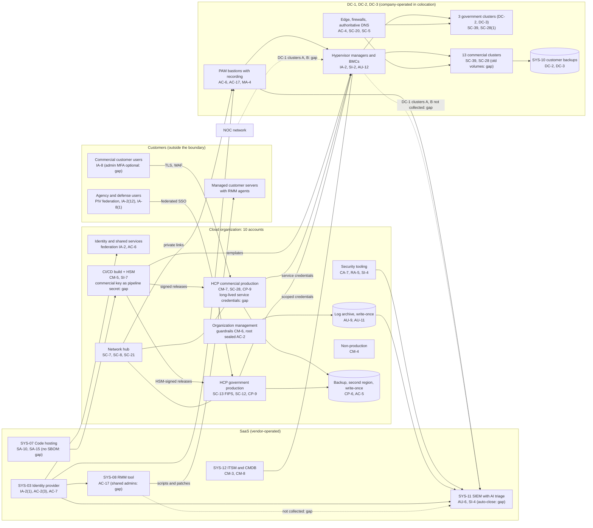

# Cloud Architecture and Control Placement: Cris Santos Company | Information Technology | Mid-Market

**Organization:** Cris Santos Company, Inc. (cloud hosting and managed infrastructure provider) | **Tier:** Mid-Market | **Provider:** Vendor-agnostic public cloud landing zone (10 accounts), SaaS tools, and three company-operated colocation data centers (see section 4)
**System:** Hosting Control Plane and Customer Portal (HCP), as defined in the SSP (P02) | **Prepared:** 2026-07-31 by the Director of Cloud Operations, the VP Platform Engineering, and the GRC Manager; updated 2026-09-22 with P07 results | **Approved:** Chief Technology Officer, 2026-09-22
**Control map:** `cloud-control-map.csv` (61 rows, 20 components)

## 1. Diagram

Dotted lines are paths that exist today but should not (the NOC network to the DC-1 management network) or data flows that are missing (DC-1 clusters A and B and the RMM tool to the SIEM). The RMM tool and the customer backup platform are outside the HCP boundary but appear because they share the identity provider and data centers.

## 2. Landing zone design
The landing zone separates duties across 10 accounts (subscriptions or projects, depending on the provider) under one cloud organization, built with infrastructure as code. Each account limits what an attacker can do from any other.

| Account | Purpose | Who administers | Key design decisions |
|---|---|---|---|
| **Organization management** | Organization root, guardrails, billing | 2 named cloud administrators | No workloads. Root credentials sealed with two custodians. Guardrails cannot be disabled from member accounts |
| **Identity and shared services** | Federation to SYS-03, permission sets, shared DNS resolvers | Director of Cloud Operations' team | Every human sign-in is federated; government roles are U.S.-person groups |
| **Network hub** | Cloud firewall, private links and tunnels to DC-2 and DC-3, egress control | Network engineers | No route between commercial and government production |
| **Security tooling** | Posture management, threat detection, scanner | Security Engineering Lead | Read-only roles into every account |
| **Log archive** | Write-once log storage for all accounts and SaaS exports | 2 security engineers | Separate from every system that creates logs (AU-9(4)) |
| **HCP commercial production** | SYS-01 and SYS-02 for commercial customers | Site reliability; software engineers through the pipeline | Managed containers and databases; long-lived hypervisor credentials (gap) |
| **HCP government production** | SYS-01 and SYS-02 for the government partition | U.S.-person site reliability engineers | Regions under the provider's FedRAMP certification; FIPS 140-validated endpoints; scoped short-lived credentials |
| **CI/CD build** | Build runners and the cloud HSM | VP Software Engineering's platform team | Ephemeral runners; government signing key in the HSM; commercial key still a pipeline secret (gap) |
| **Non-production** | Testing with synthetic data | Software engineering | Guardrail blocks production snapshot sharing |
| **Backup** | Control plane backups for both partitions, second region | 2 named backup administrators | Write-once retention, two-person deletion, credentials not federated to everyday roles |

## 3. Layers and shared responsibility per service
| Layer | Components | Key controls | Service model | Responsibility |
|---|---|---|---|---|
| Identity | Federation, permission sets, PAM, hypervisor manager accounts, SYS-03 | IA-2, IA-2(1), AC-2, AC-6, AC-17, IA-5 | PaaS / SaaS / company-run | Company configures identities, roles, MFA, and reviews; providers run the identity services |
| Network | Hub, cloud firewall, private links, edge routers, DNS, scrubbing | SC-7, SC-8, AC-4, SC-5, SC-20, SC-21 | PaaS / company-run | Company designs routes, rules, and segmentation; the provider runs gateway services; the scrubbing service mitigates attacks |
| Compute | Managed containers, build runners, hypervisor clusters | CM-5, CM-6, CM-7, SI-2, SI-7, SC-39 | PaaS / IaaS | Provider patches the container platform; the company owns images, runners, and its own hypervisors |
| Data | Tenant databases, keys and HSM, backups, storage arrays, drives | SC-12, SC-13, SC-28, CP-6, CP-9, MP-6 | PaaS / company-run | Shared in the cloud; the company alone for its storage arrays and drives |
| Logging and monitoring | Log archive, posture service, SIEM, PAM recordings | AU-2, AU-6, AU-9, AU-11, AU-12, CA-7, SI-4 | PaaS / SaaS | Providers generate and store; the company collects, retains, and reviews; the MDR partner triages |
| SaaS | Identity provider, code hosting, SIEM, RMM, ITSM | IA-2(1), SA-10, AU-6, AC-17, CM-3, CM-8, SR-6 | SaaS | Vendors run the applications; the company keeps users, settings, audit review, and vendor oversight |
| Physical | DC-1, DC-2, DC-3 colocation facilities and company cages | PE-3, PE-11, PE-13 | Colocation | Providers (inherited, evidenced by SOC 2 reports), except the cage access list and locks |

**Responsibility counts in `cloud-control-map.csv`:** 33 Customer (company), 23 Shared, 5 Provider. By service model: 27 PaaS, 20 IaaS, 14 SaaS. Every one of the 10 accounts has at least one row, and each account has controls from at least 2 of the AC, AU, CM, CP, IA, SC, and SI families or inherits them through organization guardrails.

## 4. Service categories and provider equivalents
The design is independent of the provider. This table gives each provider's name for each service category, for reading its shared responsibility documentation (SRC-AWS-SRM, SRC-AZURE-SRM, SRC-GCP-SRM in `00_universal-framework/sources/source-register.csv`).

| Service category | AWS | Microsoft Azure | Google Cloud |
|---|---|---|---|
| Multi-account organization and guardrails | AWS Organizations, service control policies | Management groups, Azure Policy | Resource Manager folders, organization policies |
| Account, subscription, or project | Account | Subscription | Project |
| Cloud identity federation | IAM Identity Center | Microsoft Entra ID with Azure RBAC | Cloud Identity with IAM |
| Network hub and cloud firewall | Transit Gateway; AWS Network Firewall | Virtual WAN hub; Azure Firewall | Network Connectivity Center; Cloud NGFW |
| Private link to data centers | Direct Connect | ExpressRoute | Cloud Interconnect |
| Managed containers | Amazon EKS | Azure Kubernetes Service | Google Kubernetes Engine |
| Managed relational database | Amazon RDS | Azure Database for PostgreSQL | Cloud SQL |
| Object storage with write-once retention | S3 with Object Lock | Blob Storage with immutability policies | Cloud Storage with bucket lock |
| Key management and HSM | AWS KMS; AWS CloudHSM | Azure Key Vault; Azure Managed HSM | Cloud KMS; Cloud HSM |
| Audit logging | CloudTrail | Azure Monitor activity log | Cloud Audit Logs |
| Posture and threat detection | Security Hub, GuardDuty | Microsoft Defender for Cloud | Security Command Center |
| Government regions | AWS GovCloud (US) | Azure Government | Assured Workloads |

**Service model split used here (all three providers agree):**
- **IaaS:** the provider owns facilities, hosts, and virtualization. The customer owns the guest, network configuration, identities, and data.
- **PaaS:** the provider also owns the platform software and its patching. The customer owns access, keys, data, and configuration.
- **SaaS:** the provider also owns the application. The customer keeps identities, roles, audit review, and data.

## 5. The company's own shared responsibility model
The company is a customer of the public cloud provider and SaaS vendors, and also a **provider** of IaaS to its customers. The MSA schedule for the managed private cloud and the Government Cloud customer responsibility matrix set the split:

| Area | Company | Customer |
|---|---|---|
| Facilities, hardware, hypervisors, storage, tenant network isolation | Yes | No |
| Guest operating system, applications, and data in the VM | No, unless the customer buys managed services (commercial only) | Yes |
| Patching of guest operating systems | Only for managed services customers, through the RMM tool | Everyone else |
| Backups of VM data | Government: every VM replicated between DC-2 and DC-3. Commercial: paid replication tier (about 35%) or the backup service | Everyone else (P05) |
| Customer portal accounts and MFA | Government: MFA enforced. Commercial: offered, not required (gap) | Enroll users; enable MFA |
| Encryption of VM volumes | Government: all volumes, company-managed keys. Commercial: default since 2025-01; about 9,000 older volumes unencrypted | May also encrypt inside the guest |
| CMMC and DFARS duties of defense customers | Provide FedRAMP Moderate status, the customer responsibility matrix, and the 252.204-7012(c) to (g) support | Document the matrix in their own SSP (32 CFR 170.16(c)(2)) |

The managed services line changes the model for 410 commercial customers. The RMM tool gives the company administrative reach into customer servers, so a compromise of that tool is the company's incident even though the servers belong to customers (P08).

## 6. Findings from the mapping
1. **Two-speed security is visible in the map (AC-6, IA-2, AU-12, SI-7).** Every government row is Implemented. Most gaps are in the commercial production account, the commercial signing key, and DC-1 clusters A and B. Fix: apply the government patterns (scoped credentials, HSM signing, PAM for all clusters, full log collection) to the commercial side (P01 R-002, R-003, R-011, R-015).
2. **The commercial control plane is a master key (IA-5, AC-6).** The commercial deployment holds long-lived credentials that act on all 13 commercial clusters. The government deployment already uses scoped short-lived credentials. Fix by 2027-03-31 (R-002).
3. **The RMM tool sits outside the boundary but inside the threat model (AC-17, AU-2, SR-6).** It shares the identity provider and can run scripts on 11,200 customer servers. Its logs stay with the vendor for 90 days and never reach the SIEM (R-001, R-015, R-025).
4. **Backups are the strongest control (CP-6, CP-9, AC-5).** Separate account, second region, write-once, two-person deletion. The weakness is restore practice: commercial reconstitution is unproven within the RTO (R-005).
5. **The boundary must grow for the 2026 rules (CM-8, MAS).** The code hosting, identity provider, SIEM, and ITSM tenants handle data that can affect federal customer data. The CMDB cannot yet list them by partition or as third-party information resources (R-035; P03).
6. **Boundary check.** Every in-scope component in the SSP (P02 section 9) appears in the diagram, and every cloud account and SaaS tenant has at least one row in the control map.
