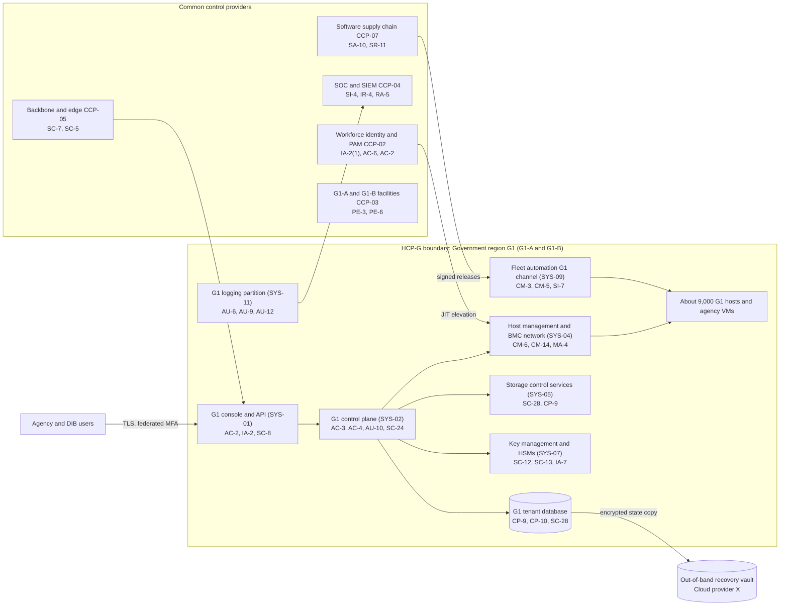

# System Security Plan: Hosting Control Plane and Customer Portal, Government Region (HCP-G)

**Organization:** Cris Santos Company, Inc. (publicly traded public cloud and managed infrastructure provider) | **Tier:** Enterprise | **Vertical:** Information Technology
**Outline:** NIST SP 800-18 Rev. 2, System Security Plan Outline Example (June 2026) | **Version:** 3.0, 2026-09-08
**Control baseline:** FedRAMP Rev5 Class D control list (FedRAMP Consolidated Rules for 2026, rule FRC-CSF-BSL), the target for the Class D upgrade of SL-2. The system holds a Rev5 Class C certification today (FR-2).

## 1. System Name and Identifier
Hosting Control Plane and Customer Portal, Government Region (**HCP-G**), identifier CSC-SYS-HCPG-001. HCP-G is the core of the SL-2 Government Cloud offering certified as **FR-2** (FedRAMP Rev5 Class C, originally a FedRAMP Moderate agency authorization in 2022, 52 services in scope).

## 2. System Overview
HCP-G is the set of services that lets government customers order, run, secure, and manage cloud resources in the Government region (G1). It runs in two company-operated data centers, **G1-A and G1-B**, in two eastern states. It is the G1 instance of the registry's "hosting control plane and customer portal," scoped to G1 because the Class D upgrade depends on it.

**Who uses it:**
- **Customers:** 38 federal civilian agencies and 12 state and local agencies (50 government customers), plus about 420 defense industrial base (DIB) companies that store controlled unclassified information (CUI). Together they hold about 26,000 G1 console identities.
- **Workforce:** about 260 G1 operations staff, all U.S. persons by company design, plus about 40 engineers in control plane, platform, and supply chain teams who hold G1 roles. All privileged access goes through privileged access management (PAM) with just-in-time elevation.

**Why it is High.** A civilian agency (the "sponsoring agency") plans to move a High-impact workload to G1 and will sponsor a Rev5 Class D Agency Certification. The control plane can reach every tenant resource and holds the keys that protect them, so its categorization follows the most sensitive workload it serves.

**Major components** (IDs from `../00_company-facts.md` section 3):
- **SYS-01 (G1 instance):** customer console and public API endpoints for G1, separate from the commercial console
- **SYS-02 (G1 instance):** regional control plane services: provisioning, placement, metering, the G1 tenant database cluster (spans G1-A and G1-B), and the G1 customer identity and access service
- **SYS-04 (G1 host management):** hypervisor management for about 9,000 G1 hosts and the out-of-band network for their baseboard management controllers (BMCs)
- **SYS-05 (G1 storage control services):** block and object storage control services, snapshot orchestration, and the G1 partition of the immutable backup vault
- **SYS-07 (G1 key management):** customer key management service backed by hardware security modules (HSMs) in each G1 data center
- **SYS-09 (G1 channel):** the G1 release channel of the fleet automation service, which deploys host software and guest-agent updates to G1 hosts and enrolled agency virtual machines (VMs)
- **SYS-11 (G1 logging):** the G1 partition of the SIEM and security data lake, with the G1 log archive

## 3. Laws, Regulations, and Policies Affecting the System
| ID | Requirement | Citation | Status for HCP-G |
|---|---|---|---|
| C-IT-R01 | FedRAMP | 44 U.S.C. 3607-3616; FedRAMP Consolidated Rules for 2026 (version 2026.10.05.01) | **Applies.** FR-2 must keep following the 2026 rules (mandatory for Rev5 certifications on the ruleset dates, all grace periods end 2028-02-01). The Class D upgrade needs a new certification with all applicable requirements met in advance (FRC-CCL-UCC), the sponsoring agency's ATO (FRC-APS-ATO), and a fresh independent assessment completed within the previous 3 months (FRC-APP-FIA), filed before FedRAMP stops accepting new Rev5 applications on 2027-06-11 |
| C-IT-R03 | DFARS Safeguarding CDI and Cyber Incident Reporting | 48 CFR 252.204-7012(b)(2)(ii)(D) | **Applies by contract.** DIB customers must ensure their cloud provider meets FedRAMP Moderate-equivalent requirements and paragraphs (c) to (g) (incident reporting, malicious software, media preservation for at least 90 days, forensic access, damage assessment). The company's DFARS addendum accepts these terms |
| C-IT-R02 | CMMC Program | 32 CFR Part 170; 32 CFR 170.16(c)(2) | **Indirect.** The company holds no DoD contract and needs no CMMC status itself. DIB customers may use a cloud offering that is FedRAMP Authorized at Moderate or higher, or Moderate-equivalent, for CUI. FR-2 meets that condition; customers inherit it in their own assessments |
| C-IT-R04 | DOJ Data Security Program | 28 CFR Part 202 | **Applies as a screening duty.** G1 holds government-related data, which has no bulk volume threshold. The company has no data brokerage, vendor, employment, or investment agreement that gives a country of concern or covered person access to G1 data; G1 staff are U.S. persons. Rechecked at every new G1 supplier contract |
| C-IT-R06 | CIRCIA (pending rule) | 6 U.S.C. 681b; proposed 6 CFR Part 226 | **Not in force.** No final rule as of 2026-09-25. Tracked in P03 |
| SEC | Cybersecurity disclosure | Form 8-K Item 1.05; 17 CFR 229.106 | A material G1 incident goes through the P08 materiality step |
| State | State breach notification laws | Each state where affected individuals reside (Florida worked example: Fla. Stat. 501.171(6), third-party agent notice to the covered entity within 10 days) | State and local agency customers are the data owners; the company notifies them as their agent (P08) |
| Contract | Agency agreements; customer agreement | 72-hour incident notice; FedRAMP incident communication; DFARS addendum | Applies to every G1 customer |
| Internal | POL-01 to POL-05, standards, procedures | P06 | POL-02 to POL-05 approved 2026-09-08; POL-01 approved by the board committee 2026-09-10 |

**Not applicable, with reasons:**
- **C-IT-R05 (bank service provider notification):** the 210 banking organizations use SL-1 and SL-3, not SL-2. The rule applies to those service lines (P03, P08).
- **HIPAA:** business associate agreements cover the HIPAA-eligible SL-1 services only. Agency health data in G1 is governed by agency agreements and FedRAMP.

## 4. System Status
### 4.1 System Security Plan Approval
Prepared by the Director of Government Cloud Engineering and the FedRAMP compliance group. Reviewed by the CISO, the Director of FedRAMP Compliance, and the Chief Audit Executive (for assessment scope only). Approved by the Senior Vice President, Government Cloud (system owner) and the Chief Technology Officer on 2026-09-08.

### 4.2 System Authorization Decision
**Current federal status.** FR-2 holds a FedRAMP Rev5 Class C certification. Each of the 38 federal agencies and the 12 state and local agencies relies on it under its own authorization.

**Class D upgrade.** A Class D certification is a new certification, not an amendment of FR-2 (FRC-CCL-UCC). The plan:

| Step | Rule | Target |
|---|---|---|
| Close the 43 Class D additions not yet fully in place (section 6) | FRC-CSF-BSL; FRC-CCL-UCC | 2027-03-31 |
| Cryptographic modules with active CMVP validations for all federal data (Class D MUST) | CMU-CSO-UVM | 2027-02-28 |
| FedRAMP independent assessment of the Class D package by a FedRAMP Recognized assessment service | FRC-APP-FIA; IVV-CSO-FIA | 2027-04-01 to 2027-04-30 |
| Sponsoring agency ATO for the High workload | FRC-APS-ATO | 2027-05-21 |
| Apply for Rev5 Class D Agency Certification | FRC-APP-AFC | By 2027-05-28 (cutoff 2027-06-11) |

**Internal risk decision (2026-09-08).** The Chief Technology Officer, on the CISO's recommendation, approved continued operation of HCP-G at Class C with these conditions:
- Close POAM-001 (guest-agent release approval) by 2026-12-15 and POAM-013 (automated host isolation without human review) by 2026-11-30.
- Rerun the G1 tenant database recovery test and meet the 2-hour RTO by 2027-01-31 (POAM-009).
- Report Class D progress monthly to the executive risk committee and quarterly to the risk and technology committee of the board.

Very High risks in P01 that touch HCP-G (R-001) were accepted by the Chief Executive Officer for the treatment period only.

### 4.3 System Operational Status
**Operational.** Major modification under way: the Class D upgrade. Each upgrade change (for example, the cryptographic library change and the new guest-agent approval workflow) is evaluated under the Significant Change Notification rules (SCN-CSO-EVA) and notified to agencies where the rules require it.

## 5. Role Identification and Responsible Personnel
| Role | Title | Responsibility |
|---|---|---|
| System owner | Senior Vice President, Government Cloud | Accountable for HCP-G and SL-2; approves G1 access roles; owns the Class D upgrade |
| Internal risk acceptor (authorizing official equivalent) | Chief Technology Officer (High risks); Chief Executive Officer (Very High risks) | Accept residual risk to operate |
| Federal authorizing officials | Agency authorizing officials; the sponsoring agency's AO for Class D | Agency ATO decisions |
| System technical lead | Director of Government Cloud Engineering | Day-to-day engineering, G1 change control, this plan |
| Control plane owner | Vice President, Control Plane Engineering | SYS-01 and SYS-02 code and runbooks |
| Information security | CISO; Director of Security Operations | Program oversight; 24x7 SOC; incident response |
| FedRAMP compliance | Director of FedRAMP Compliance (FedRAMP compliance group of 5) | Security Decision Record, Ongoing Certification Reports, vulnerability reporting, FedRAMP Security Inbox |
| Common control providers | See section 10.3 | Operate inherited controls |
| Internal assessor | Chief Audit Executive (Internal Audit) | Readiness assessment (P07); independent of the G1 teams |
| Independent assessor | FedRAMP Recognized assessment service | Annual FedRAMP independent assessment |

## 6. System Information Types and System Categorization
Information types come from NIST SP 800-60 Vol. 2 Rev. 1, adjusted for a cloud provider. Impact levels follow FIPS 199.

| Information type | Confidentiality | Integrity | Availability | Rationale |
|---|---|---|---|---|
| Hosted agency data (mission data of the sponsoring agency's High workload, other agency data, CUI from DIB customers) | **High** | **High** | **High** | The sponsoring agency rated its workload High on all three objectives. Other agency workloads are Moderate, but they share the control plane |
| IT infrastructure management (tenant inventory, placement data, host and BMC configuration, release artifacts) | High | High | High | Control plane data can change or expose every tenant at once. A malicious release through the G1 channel is the worst single event in P01 (R-001) |
| Cryptographic key management (customer master keys, HSM partitions, internal CA keys) | High | High | High | Key loss or exposure defeats encryption for all tenants |
| Information security (audit logs, detections, vulnerability data) | Moderate | High | Moderate | Logs are the evidence for incident reporting to FedRAMP and agencies; tampering would hide an attack |
| Customer account and contact data | Moderate | Moderate | Moderate | Personal contact data of agency staff; needed for incident notices |
| **HCP-G category (high-water mark)** | **High** | **High** | **High** | **High** |

Recovery objectives come from the BIA (P05 BP-03): MTD 4 hours, RTO 2 hours, RPO 15 minutes.

**Documented controls.** `control-implementation.csv` has **190 rows**, one per base control in the Rev5 Class D list. The list holds 409 controls and enhancements (190 base controls, 219 enhancements); each row names its Class D enhancements in the `class_d_enhancements` column. Enhancements that are in place are covered by the base control statement. Enhancements that are not yet in place are named in the statement with the gap.

**The Class D delta.** Class D adds 87 controls and enhancements to the Class C list (10 base controls, 77 enhancements). Status in G1 (shared with P03):

| Status | Count |
|---|---|
| Met | 42 |
| Partially met | 35 |
| Not met | 8 |
| Not applicable (no wireless in G1: AC-18(4), AC-18(5)) | 2 |
| **Total** | **87** |

The 43 not fully in place drive the POAM-021 Class D program, with the larger items tracked as their own POA&M entries.

## 7. Authorization Boundary Description
**Inside the boundary:** the G1 instances of the console and API, regional control plane services, host management and BMC networks, storage control services, the G1 key management service and HSMs, the G1 release channel of fleet automation, and the G1 partition of logging. Customer workloads run on G1 hosts inside the boundary; their contents are the customers' responsibility above the hypervisor.

**Outside the boundary (common control providers and interconnected systems):**
- Workforce identity platform (SYS-03): CCP-02
- Data center facilities G1-A and G1-B: CCP-03
- Security operations platform and SOC (SYS-11 enterprise tier): CCP-04
- Global network backbone and edge (SYS-06): CCP-05
- Software supply chain (SYS-08), which builds and signs the releases the G1 channel deploys: CCP-07
- Commercial regions R1 to R6, the legacy RMM tool (SYS-10), and corporate IT (SYS-12): **no connection into G1** except the corporate jump zone through PAM (see POAM-017)
- External Cloud provider X (SYS-14): hosts the public status page and the out-of-band recovery vault copy of G1 control plane state (encrypted with G1-held keys)

The enterprise multi-cloud and landing zone diagrams are in P04 `cloud-architecture.md`.

## 8. Information Exchanges Summary
| Connected system / party | Direction | Data | Agreement |
|---|---|---|---|
| Agency networks (50 government customers) | Bidirectional (private connections and TLS over the internet) | Agency workloads, API calls, logs exported to agency SOCs | Interconnection agreements; verified transfer authorizations for 31 of 50 (CA-3(6) gap) |
| DIB customers (about 420) | Bidirectional | CUI workloads | Customer agreement with DFARS addendum |
| CISA and agency SOCs | Outbound | Incident reports; log feeds where agreed | Agency agreements; FedRAMP IEC rules |
| FedRAMP | Outbound | Certification data, Ongoing Certification Reports, incident reports, monthly vulnerability reports | FedRAMP rules; trust center (CDS-CSO-UTC, in progress) |
| Software supply chain (SYS-08) | Inbound | Signed host software and guest-agent releases | Internal service agreement (CCP-07) |
| Workforce identity platform (SYS-03) | Inbound | Authentication and elevation decisions | Internal service agreement (CCP-02) |
| Enterprise SOC (SYS-11) | Outbound | G1 security events (G1 partition, U.S.-person analysts) | Internal service agreement (CCP-04) |
| External Cloud provider X (SYS-14) | Outbound | Encrypted control plane state copy; status page updates | Contract with security and incident notice terms; provider's own FedRAMP authorization verified |
| Storage array vendor | Remote support (through PAM) | Diagnostics | Support agreement; **diagnostic sessions not recorded (POAM-015)** |
| HSM manufacturer | None (on-site service under escort) | None | Support agreement |

## 9. System Component Inventory
| Component | Type | Location / provider | Owner |
|---|---|---|---|
| G1 console and API endpoints | Company-built web application and API gateway | G1-A and G1-B (active-active) | Vice President, Control Plane Engineering |
| G1 control plane services (about 40 microservices) | Company-built services on the internal container platform | G1-A and G1-B | Vice President, Control Plane Engineering |
| G1 tenant database cluster | Company-operated distributed database | Spans G1-A and G1-B | Vice President, Control Plane Engineering |
| G1 hosts (about 9,000) | Servers with company hypervisor | G1-A and G1-B | Vice President, Platform Engineering |
| BMC and out-of-band network | Management controllers, out-of-band console servers | G1-A and G1-B | Vice President, Data Center Operations |
| Storage control services and arrays | Company-built control services; vendor storage arrays | G1-A and G1-B | Director of Government Cloud Engineering |
| HSM clusters (2 per site) | Hardware security modules | G1-A and G1-B | Director of Key Management and PKI |
| Fleet automation G1 channel | Company-built deployment service | G1-A and G1-B | Vice President, Software Supply Chain |
| G1 log archive and SIEM partition | Write-once storage and SIEM tenant | G1-A and G1-B | Director of Security Operations |
| PAM bastions for G1 | Bastion hosts | G1 management network | Director of Identity and Access Management |

## 10. Control Implementation Details
### 10.1 Control implementation status
See `control-implementation.csv` (190 base controls).

| Status | Count |
|---|---|
| Implemented | 139 |
| Partially implemented | 47 |
| Planned | 1 |
| Not applicable | 3 |
| **Total** | **190** |

| Inheritance | Count |
|---|---|
| Common (fully inherited from a common control provider) | 111 |
| Hybrid (shared between a provider and the HCP-G team) | 38 |
| System-specific | 41 |

**Planned:** SR-9 (tamper resistance and detection; POAM-005). **Not applicable:** AC-18 (no wireless in the G1 boundary), PE-5 (no output devices in G1 data halls), SC-15 (no collaborative computing devices).

**Partially implemented (47):** AC-2, AC-4, AC-5, AC-10, AU-6, AU-9, AU-10, AU-12, CA-3, CA-7, CM-3, CM-5, CM-6, CM-8, CM-14, CP-2, CP-3, CP-4, CP-7, CP-8, CP-10, IA-5, IA-7, IA-12, IR-2, IR-4, IR-6, IR-8, MA-2, MA-4, MP-6, PE-6, PL-2, PS-4, RA-5, SA-9, SA-10, SA-17, SA-21, SC-7, SC-13, SC-24, SI-2, SI-4, SI-7, SR-3, SR-6. Some of these are fully in place at Class C and are partial only because a Class D enhancement is missing; the statement says which.

### 10.2 Control assessment status
Internal Audit assessed 48 controls of HCP-G from 2026-07-13 to 2026-08-28 as a Class D readiness assessment, using SP 800-53A Rev. 5 procedures and statistical sampling (P07 `assessment-plan.md`, `assessment-results.csv`). Weaknesses are in P07 `poam.csv`. The annual FedRAMP independent assessment of FR-2 by the FedRAMP Recognized assessment service is separate and was completed in 2026-03.

### 10.3 Common control providers and inheritance
Common and hybrid controls are inherited from enterprise providers. Each provider publishes its controls in the enterprise common control catalog, is assessed on its own cycle, and is in the scope of the FedRAMP independent assessment where it supports G1.

| Provider | Name | Accountable role | Controls provided | Rows (Common / Hybrid) | Evidence of operation |
|---|---|---|---|---|---|
| CCP-01 | Enterprise GRC program | CISO | Policies and standards (P06), risk method, assessment, POA&M, continuous monitoring, planning | 28 / 0 | Internal Audit assessment (P07); GRC platform |
| CCP-02 | Workforce identity platform (SYS-03) | Director of Identity and Access Management | SSO, phishing-resistant MFA, PAM with just-in-time elevation, identity governance | 2 / 5 | SOX IT general control testing; P07 AC-2, IA-2 results |
| CCP-03 | Data center facilities (G1-A and G1-B) | Vice President, Data Center Operations | Physical access, environmental protection, maintenance, media sanitization | 25 / 3 | Badge reviews; facility inspections |
| CCP-04 | Security operations (SYS-11) | Director of Security Operations | 24x7 SOC, SIEM, EDR, vulnerability management, incident response | 13 / 11 | SOC metrics; P07 SI-4, RA-5, IR results |
| CCP-05 | Global network and edge (SYS-06) | Vice President, Global Network | Boundary protection, DDoS mitigation, transport encryption, carriers | 4 / 4 | Network configuration reviews |
| CCP-06 | Platform engineering (host images, hypervisor, firmware) | Vice President, Platform Engineering | Host baselines, hypervisor, firmware, patching, inventory | 10 / 6 | Drift reports; patch reports |
| CCP-07 | Software supply chain (SYS-08) | Vice President, Software Supply Chain | Source control, CI/CD, artifact signing, release orchestration | 4 / 5 | Pipeline attestations; P07 CM-3 results |
| CCP-08 | Human resources and training | Chief Human Resources Officer | Screening, U.S.-person verification for G1, terminations, training | 12 / 0 | HR and learning system reports |
| CCP-09 | Third-party and supply chain risk management | Director of Third-Party Risk Management | Vendor tiering, SOC report reviews, supplier assessments, supply chain controls | 12 / 0 | Vendor register; SOC report reviews |
| CCP-10 | Key management and PKI (SYS-07) | Director of Key Management and PKI | HSM operations, key lifecycle, internal CAs | 1 / 4 | Key ceremony records; HSM audit logs |
| **Total** | | | | **111 / 38** | |

**Inheritance rules:**
- A Common control is fully inherited. The HCP-G team verifies only that G1 is onboarded (for example, log forwarding and PAM enrollment).
- A Hybrid control names both parts in the implementation statement.
- A weakness found in a provider is linked to every inheriting system's POA&M. Example: POAM-006 (overdue tier-1 vendor SOC reviews) is a CCP-09 weakness that affects HCP-G through 3 G1 suppliers.

## 11. Digital Identity Acceptance Statement
- **Workforce users:** SSO with phishing-resistant MFA (FIDO2 security keys) for every user. Privileged G1 access goes through PAM bastions with just-in-time elevation, session recording, and re-authentication on elevation. This is comparable to NIST SP 800-63 AAL3 for privileged users and at least AAL2 for others. G1 roles also require U.S.-person verification by HR (CCP-08). Gap: privileged users are identity-proofed with supervised remote verification, not in person (IA-12(4), decision record pending).
- **Agency users:** agencies federate their own identity providers (most use PIV-backed authentication) to the G1 customer identity service. Agencies that do not federate must use FIDO2 or authenticator-app MFA for every console identity; console access without MFA is blocked in G1 by default.
- **DIB users:** authenticator-app or FIDO2 MFA required; federation available.
- **Automation identities:** API tokens for automation are short-lived and scoped. Gap: usage conditions for privileged roles are enforced for console sessions but not for API tokens issued to automation (AC-2(11)).

## 12. Referenced Artifacts
Scenario facts (`../00_company-facts.md`), BIA (P05), enterprise cloud architecture and control map (P04), enterprise risk register (P01), regulatory gap analysis with the Class D delta (P03), policy hierarchy and policies (P06), Internal Audit assessment and POA&M (P07), provider tooling compromise runbook (P08), SOC 2 readiness for SL-2 (P09), AI portfolio including AI-001 (P10), HCP-G contingency plan v5, G1 configuration management plan, enterprise common control catalog, FR-2 FedRAMP certification package.

## 13. Acronym List and Glossary
- **BMC:** baseboard management controller
- **CCP:** common control provider
- **CMVP:** NIST Cryptographic Module Validation Program
- **DIB:** defense industrial base
- **FR-2:** the SL-2 Rev5 Class C FedRAMP certification
- **G1:** the Government region (data centers G1-A and G1-B)
- **HCP-G:** Hosting Control Plane and Customer Portal, Government Region
- **HSM:** hardware security module
- **IEC:** FedRAMP Incident Evaluation and Communication rules
- **JIT:** just-in-time (privilege elevation)
- **PAIN:** Potential Agency Impact N-rating (FedRAMP)
- **PAM:** privileged access management
- **SDR:** FedRAMP Security Decision Record
- **SL-2:** Government Cloud service line

## 14. System Security Plan Review and Change Records
| Version | Date | Change | Author |
|---|---|---|---|
| 1.0 | 2022-04-20 | Initial plan for the FedRAMP Moderate agency authorization of SL-2 | Director of Government Cloud Engineering |
| 2.0 | 2025-11-14 | Annual update; G1-B added as an active site | Director of Government Cloud Engineering |
| 2.1 | 2026-08-03 | Early adoption of the IEC incident rules; FR-2 recorded as Rev5 Class C | FedRAMP compliance group |
| 3.0 | 2026-09-08 | Rebased on the Class D control list; Class D delta; common control provider mapping; 2026 Internal Audit results | Director of Government Cloud Engineering with the GRC team |
