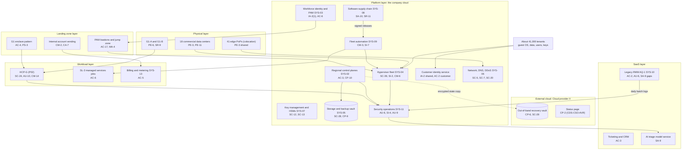
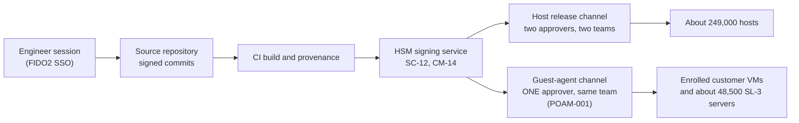

# Cloud Architecture and Control Placement: Cris Santos Company | Information Technology | Enterprise

**Organization:** Cris Santos Company, Inc. (publicly traded public cloud and managed infrastructure provider) | **Tier:** Enterprise
**Provider:** The company is itself a cloud provider. This mapping covers its own cloud platform (regions R1 to R6 and G1), its internal landing zones on that platform, one external public cloud used for recovery and the status page (called Cloud provider X, vendor-agnostic), and SaaS
**Owner:** Vice President, Platform Engineering, with the CISO and the Director of FedRAMP Compliance | **Date:** 2026-08-31 | **Related:** HCP-G SSP (P02), enterprise BIA (P05)

## 1. Architecture in layers
A cloud provider sits on both sides of the shared responsibility model. It is the provider to about 41,000 customers, and it is a customer of its own platform (for internal workloads), of Cloud provider X, and of SaaS vendors. The estate has six layers. Each lower layer provides **common controls** that the layers above inherit.

| Layer | What it is | Examples | Who runs it |
|---|---|---|---|
| **Physical** | Company data centers and colocation PoPs | 18 commercial data centers (R1 to R6), G1-A and G1-B, 41 edge PoPs | Data Center Operations; colocation providers for PoP buildings |
| **Platform** | The company's cloud services, which tenants buy and internal teams use | Hypervisor fleet, regional control planes, customer identity, key management and HSMs, storage and backup vault, managed Kubernetes and databases, global network and DNS, fleet automation, software supply chain, workforce identity, security operations | Platform, Control Plane, Network, Supply Chain, Identity, and Security Operations teams |
| **Landing zone** | The standard internal account pattern on the company cloud, plus the G1 enclave pattern | Internal account vending with guardrails, the G1 enclave (no peering to commercial regions, U.S.-person roles only), PAM bastions, private agency connections | Platform Engineering; Identity team |
| **Workload** | Systems built or run by the company | HCP-G (P02), SL-3 managed services jobs, billing and metering, SOC tooling | System teams |
| **External cloud** | Cloud provider X | Out-of-band recovery vault, public status page, corporate analytics | Cloud provider X, with the company's configuration |
| **SaaS** | Vendor-operated applications | Legacy RMM tool (AQ-1), ticketing and CRM, EDR console, AI triage model service, ERP and payroll, trust center, productivity suite | Vendors, with the company's configuration and oversight |

## 2. Diagrams
### 2.1 Enterprise layers and common controls

### 2.2 The release path that matters most (P01 R-001; P08 scenario)

The guest-agent channel is the weak link. A stolen engineer session that can author and approve a channel release can push signed code to every enrolled customer VM. The fix (two-person approval from separate teams, approver signature bound to the release, automated halt on integrity alerts) is POAM-001 and the Class D items AU-10 and SI-7(5).

## 3. Responsibility by service model
**How to read the `responsibility` column.** On rows for the company's own cloud (Physical, Platform), *Provider* means the company and *Customer* means its tenants. On rows for Landing zone, Workload, External cloud, and SaaS, the company is the customer: *Provider* means the vendor and *Customer* means the company.

**The company as provider** (published in its customer responsibility matrix for FR-1 and FR-2):

| Service model | Company (provider) | Tenant (customer) | Shared |
|---|---|---|---|
| IaaS (compute, block storage, networking) | Facilities, hosts, hypervisor, physical and backbone network, DDoS mitigation | Guest OS, applications, data, users, virtual network rules | Encryption (company service, tenant-chosen keys); audit logs (company records, tenant reviews) |
| PaaS (managed Kubernetes, databases, object storage, key management) | Also the managed runtime and its patching | Data, access policies, keys, application code, container images | Backups and availability configuration |
| Managed services (SL-3) | Patching and monitoring of customer servers under contract | Server ownership, approval of maintenance windows, data | Change approval for customer servers |

**The company as customer** of Cloud provider X and SaaS: same split as the public provider models (SRC-AWS-SRM, SRC-AZURE-SRM, SRC-GCP-SRM in `00_universal-framework/sources/source-register.csv`). The company owns identities, data, keys, and configuration; the vendor owns the infrastructure and, for SaaS, the application.

## 4. Service categories and provider equivalents
The company's own services and Cloud provider X are described by category. This table only helps readers map the categories to public provider documentation.

| Service category | AWS | Microsoft Azure | Google Cloud |
|---|---|---|---|
| Object storage with immutability lock (out-of-band vault) | Amazon S3 Object Lock | Azure Blob immutable storage | Cloud Storage bucket lock |
| Static website and status page hosting | Amazon S3 static hosting with CloudFront | Azure Static Web Apps | Cloud Storage static site with Cloud CDN |
| Key management | AWS KMS | Azure Key Vault | Cloud KMS |
| Organization guardrails | AWS Organizations service control policies | Azure Policy with management groups | Organization Policy Service |
| Audit logging | AWS CloudTrail | Azure Monitor activity log | Cloud Audit Logs |
| Managed analytics warehouse | Amazon Redshift | Azure Synapse Analytics | BigQuery |

## 5. Common controls
`cloud-control-map.csv` has **61 rows** across 41 components:

| Layer | Rows |
|---|---|
| Physical | 5 |
| Platform | 27 |
| Landing zone | 7 |
| Workload | 8 |
| External cloud | 5 |
| SaaS | 9 |

Responsibility: Customer 26, Provider 21, Shared 14. Domains: Identity 11, Data 10, Application 9, Compute 8, Logging 7, Governance 6, Physical 5, Network 5.

**37 rows are published as common controls** (`common_control` = Yes) in the enterprise common control catalog. They map to the common control providers in the HCP-G SSP (P02 section 10.3): facilities (CCP-03), security operations (CCP-04), network (CCP-05), platform engineering (CCP-06), software supply chain (CCP-07), workforce identity (CCP-02), and key management (CCP-10). The same common controls serve both FedRAMP certifications (FR-1 and FR-2) and the SOC 2 reports (P09), so each is tested once and the result is reused.

**Rules for inheriting:**
1. An internal workload may claim a common control only if its account was created by internal account vending and passes the posture baseline. G1 workloads must also use the G1 enclave pattern.
2. Tenant-facing rows marked Shared or Customer are written into the customer responsibility matrix and the secure configuration guide (SCG-CSO-RSC), so tenants know what they must do.
3. SaaS and Cloud provider X rows cite the vendor's SOC 2 report or FedRAMP authorization, reviewed by the third-party risk team. The legacy RMM tool has neither (POAM-022).

## 6. Validation against the HCP-G SSP (P02)
Every HCP-G component in the SSP boundary appears here with controls from each required family, directly or inherited:

| HCP-G component | AC | AU | CM | IA | SC | SI |
|---|---|---|---|---|---|---|
| Console and API (SYS-01 G1) | AC-2 | AU-6 (inherited) | CM-3 (inherited) | IA-2 (shared) | SC-5, SC-7 (inherited) | SI-4 (inherited) |
| Control plane (SYS-02 G1) | AC-3 | AU-10 | CM-3 (inherited) | IA-2(1) (inherited) | SC-24 | SI-7 (inherited) |
| Host management and BMC network | AC-6 (inherited), AC-17 | AU-9 (inherited) | CM-6, CM-14 | IA-2(1) (inherited) | SC-39 (inherited) | SI-2 (inherited) |
| Key management (SYS-07 G1) | AC-3 (inherited) | AU-9 (inherited) | CM-2 (inherited) | IA-2(1) (inherited) | SC-12, SC-13 | SI-4 (inherited) |
| Fleet automation G1 channel | AC-6 (inherited) | AU-6 (inherited) | CM-3 | IA-2(1) (inherited) | SC-12 (inherited) | SI-7 |

## 7. Findings from the mapping
1. **The release path is a platform-wide single point of compromise.** Fleet automation is a common control provider for every host and enrolled guest. Its guest-agent channel weakness (POAM-001) is inherited by both FedRAMP certifications and all three service lines.
2. **AQ-1 sits outside the common controls.** The legacy RMM tool does not use workforce identity, PAM, or real-time SIEM ingestion, and it has no vendor security terms. It reaches about 9,500 customer servers, including bank customers (POAM-022).
3. **The external cloud is a deliberate dependency.** The status page and the out-of-band vault run on Cloud provider X so they survive a company-wide outage. That design meets CDS-CSO-AVR, which requires availability reporting that stays up when the offering is down.
4. **G1 isolation is a landing zone property.** The G1 enclave pattern blocks peering to commercial regions and limits roles to U.S. persons. One corporate jump zone rule was broader than approved (POAM-017).
5. **Tenant responsibilities need to be published in machine-readable form for FedRAMP.** The secure configuration guide exists in human-readable form; the machine-readable version and the trust center are due with POAM-024.
6. **Cryptography is a provider responsibility tenants cannot fix.** The two G1 services with pending CMVP validation (POAM-004) block Class D because the rule is a MUST for Class D (CMU-CSO-UVM).
