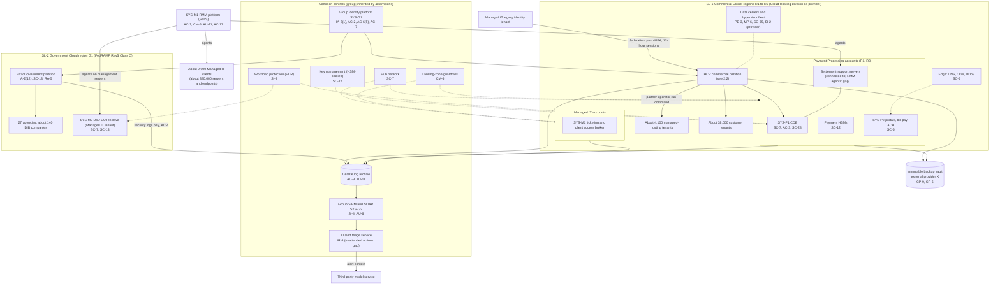
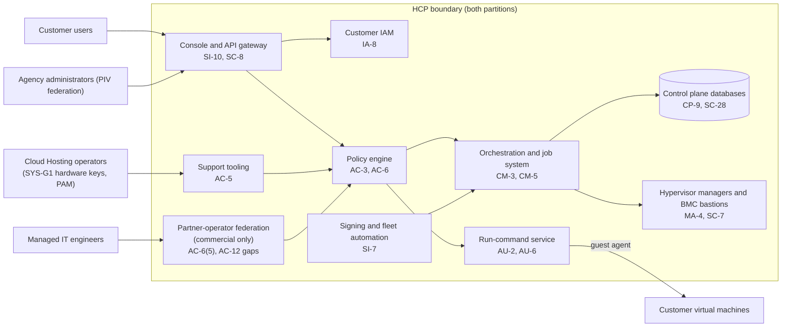

# Cloud Architecture and Control Placement: Cris Santos Company Holdings | Information Technology | Multi-Sector

**Organization:** Cris Santos Company Holdings, Inc. | **Tier:** Multi-Sector | **Providers:** the group's own commercial cloud (SL-1, operated by the Cloud Hosting division) and one unaffiliated public cloud provider ("external provider X") for the backup vault. Vendor-agnostic; see section 6.
**Scope:** the shared group platform (the landing zone on SL-1, the SOC, identity, and the backup vault) plus the division workloads that run on it. The SSP system (P02) is the HCP, the control plane of SL-1 and G1.

## 1. Design in one paragraph
Most groups rent a public cloud. This group **is** one. The Cloud Hosting division operates SL-1 (five commercial regions) and G1 (the Government Cloud region), and the rest of the group runs on SL-1 as an internal customer. Corporate runs a **landing zone** on SL-1: identity federation from SYS-G1, a hub network, guardrail policies, a central log archive, and key management. Divisions get their own **accounts** inside it: Payment Processing's cardholder data environment (CDE) in dedicated accounts in R1 and R3, and Managed IT's ticketing and client access broker. Managed IT's DoD CUI enclave (SYS-M2) is a tenant in G1, because covered defense information may be stored only with a cloud provider that meets the FedRAMP Moderate baseline or its equivalent (48 CFR 252.204-7012(b)(2)(ii)(D)). Two things sit outside SL-1 on purpose: the **immutable backup vault** with external provider X, so a provider-wide compromise of SL-1 cannot reach the last copy; and the **Managed IT RMM platform**, a SaaS product from an RMM vendor. Two paths cross the division lines: the **HCP partner-operator path**, through which Managed IT engineers act inside managed-hosting tenants, and **RMM agents** on Payment Processing and enclave servers.

## 2. Diagrams
### 2.1 Group platform and division workloads

### 2.2 HCP (SSP boundary)

**Target state (POAM-001 and POAM-002, due 2026-12-31):** partner operators sign in through SYS-G1 with hardware keys and request time-limited, per-client access through PAM; the federation trust with the legacy tenant is removed; run-command volume across tenants raises an alert; the RMM agents leave the CDE connected-to segment and the enclave (POAM-014), which get their own management tooling.

## 3. Tenancy and identity decision
**Decision.** All three divisions share the group identity platform (SYS-G1). Each division gets its own accounts in the group landing zone on SL-1, with roles federated from SYS-G1. Payment Processing's CDE runs in dedicated accounts in R1 and R3, still under SYS-G1. The DoD CUI enclave (SYS-M2) is the one separate tenant: it sits in G1, the Government Cloud region, with its own network boundary. Managed IT engineers still sign in through the division's legacy identity tenant, which federates into SYS-G1 until migration on 2027-03-31.

**Reason.** Covered defense information may be stored only with a cloud provider that meets the FedRAMP Moderate baseline or its equivalent (DFARS 252.204-7012(b)(2)(ii)(D)), so the enclave sits in G1, not in a commercial region. The immutable backup vault sits outside SL-1 at external provider X on purpose, so a provider-wide compromise of SL-1 cannot reach the last copy. Everything else shares SYS-G1 so common controls are assessed once.

**What limits blast radius.** Administrators and HCP privileged roles use phishing-resistant hardware keys and just-in-time PAM with session recording. CDE roles come only through SYS-G1 PAM, with no partner-operator or support path into CDE accounts. Cloud accounts have no local users except sealed break-glass accounts. Support engineers cannot grant themselves access. The backup vault uses a separate backup identity, confirmed in P07.

**Known gaps.** The partner-operator path gives standing access to about 4,100 tenants from the legacy tenant, with push MFA and 12-hour sessions (POAM-001, POAM-002). One RMM tenant has agents in the CDE connected-to segment and the enclave (POAM-014).

Cross-division risks: GR-01 (stolen partner-operator session), GR-02 (RMM script reaches the CDE and the enclave), GR-07 (ransomware through shared identity and landing zone), GR-11 (privileged insider across divisions).

## 4. Common versus division-specific controls
`cloud-control-map.csv` has 53 rows across 37 components. The `control_scope` column shows who owns each placement:

| Scope | Rows | What it means |
|---|---|---|
| Common (group) | 15 | Provided once by corporate (SYS-G1, SYS-G2, SYS-G3, the backup vault) and inherited by every division. Listed in the P02 common control catalog |
| Platform (SL-1 provider) | 7 | Provided by the Cloud Hosting division as cloud provider to every tenant, including the other divisions: facilities, hypervisor isolation, storage erase, DDoS |
| Shared system (HCP) | 12 | Controls of the HCP documented in the P02 SSP |
| Division-specific (Cloud Hosting G1) | 6 | FedRAMP-specific placements in the Government region |
| Division-specific (Managed IT) | 6 | RMM platform and the DoD CUI enclave |
| Division-specific (Payment Processing) | 7 | CDE segmentation, payment HSMs, logging, portals, connected-to inventory |

| Responsibility | Rows |
|---|---|
| Provider (the Cloud Hosting division as SL-1 and G1 provider, or a SaaS or IaaS vendor) | 21 |
| Customer (the group or a division as the workload owner) | 19 |
| Shared | 13 |

**Rule of thumb.** Identity, logging, keys, backups, and EDR are **common**. A division cannot opt out, only request an exception under POL-01. Facility, host, and isolation controls are **platform** controls: the other divisions inherit them from the Cloud Hosting division exactly as an external customer would, which is why Payment Processing needs them in its PCI DSS responsibility matrix (scenario gap 6). Application behavior, data access inside an application, and client-facing tooling are **division-specific**, because they answer to each division's regulators and clients.

## 5. Layers
| Layer | Common or platform components | Division components | Key controls | Responsibility |
|---|---|---|---|---|
| Identity | SYS-G1, landing-zone IAM, HCP policy engine | Partner-operator path, customer IAM, G1 agency federation, RMM accounts, CDE roles | AC-2, AC-3, AC-6(5), AC-12, IA-2(1), IA-8, IA-2(12) | Customer for workforce identity; provider for the HCP's enforcement; shared for customer MFA |
| Network | Hub network, edge services | CDE segmentation, enclave boundary, RMM agent paths | SC-7, SC-5, AC-4, AC-17 | Customer (divisions), with provider DDoS shared |
| Compute | Hypervisor fleet, EDR | RMM, run-command, settlement-support servers | SC-39, SI-2, SI-3, SI-7, CM-5 | Provider for hosts and firmware; customer for guests and tooling |
| Data | Keys, storage service, managed databases, backup vault | Tokenization vault, payment HSMs, enclave cryptography, G1 cryptographic modules | SC-12, SC-13, SC-28, SC-4, CP-9, CP-6 | Shared: provider encrypts and erases; owners hold keys and choose modules |
| Logging and monitoring | Log archive, SIEM, AI triage | HCP audit records, run-command logs, RMM logs, CDE logs | AU-2, AU-3, AU-6, AU-9, AU-11, SI-4, IR-4 | Shared: services generate logs; the SOC retains and reviews them |
| Physical | SL-1 and G1 data centers | CDE and G1 cages | PE-3, MP-6 | Provider (the Cloud Hosting division) |

## 6. Service categories and provider equivalents
The design does not depend on any named provider. The group's own service categories line up with the public providers' categories, which helps when customers and assessors compare shared responsibility documentation.

| Service category | AWS | Microsoft Azure | Google Cloud |
|---|---|---|---|
| Account structure and guardrails | AWS Organizations with service control policies | Management groups with Azure Policy | Resource hierarchy with Organization Policy |
| Key management (HSM-backed) | AWS KMS and CloudHSM | Azure Key Vault Managed HSM | Cloud KMS and Cloud HSM |
| Run commands inside virtual machines | AWS Systems Manager Run Command | Azure Run Command | VM Manager (OS Config) |
| Audit logging | AWS CloudTrail | Azure Monitor activity log | Cloud Audit Logs |
| Backup with immutability (external provider X) | AWS Backup (vault lock) | Azure Backup (immutable vault) | Backup and DR Service |
| DDoS protection | AWS Shield | Azure DDoS Protection | Cloud Armor |
| Government region | AWS GovCloud (US) | Azure Government | Assured Workloads |

Shared responsibility sources: SRC-AWS-SRM, SRC-AZURE-SRM, SRC-GCP-SRM in `00_universal-framework/sources/source-register.csv`. All three agree on the split the SL-1 shared responsibility model also uses: for IaaS the provider owns facilities, hosts, and virtualization; for PaaS the provider also owns the runtime; for SaaS the provider owns the application. The customer always keeps identities, access decisions, data classification, and data. The run-command row matters most here: every provider treats "who may run commands in my virtual machines" as a customer decision, so the partner-operator scope must be granted by each managed-hosting tenant, not assumed.

## 7. Findings from the mapping
1. **The weakest placement is a path, not a component.** The HCP's own controls are strong (AC-3 tenant isolation, SI-7 signing, AU-3 audit content). The gap is the partner-operator path: a standing, non-phishing-resistant identity from another division's tenant, with 12-hour sessions and reach into about 4,100 tenants (P01 GR-01; POAM-001).
2. **One RMM tenant connects three divisions.** RMM agents on settlement-support servers put the RMM vendor and every RMM technician inside Payment Processing's PCI DSS scope (connected-to systems) and inside the CMMC scope of the enclave. Separate tooling for internal systems removes both problems (POAM-014).
3. **The other divisions are customers of SL-1 and must treat it that way.** Seven platform rows (facilities, isolation, erase, DDoS) are inherited by the CDE and the enclave. Payment Processing's PCI DSS responsibility matrix and an intercompany agreement under 16 CFR 314.4(f) must say so (scenario gap 6; POAM-018).
4. **G1's FedRAMP scope must follow its data.** G1 security logs flow to the group SIEM and from there, as alert context, to a third-party model service. Under the 2026 rules those are information resources or third-party information resources of the offering (MAS-CSO-IIR, MAS-CSO-TPR), and they must be documented before the 2027-02-08 assessment (POAM-008).
5. **The backup vault is correctly outside SL-1.** It is the one control placement that survives a compromise of the provider itself. Its separate identity was confirmed in P07 (CP-9 satisfied).
