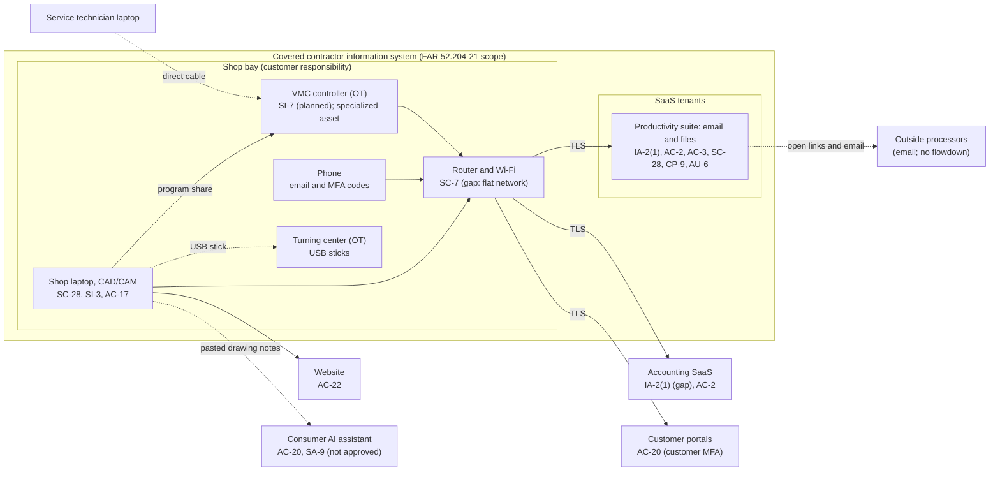

# SaaS Architecture and Control Placement: Cris Santos Company | Manufacturing | Sole Proprietorship

**Organization:** Cris Santos Company (owner-operated CNC machine shop) | **Tier:** Sole Proprietorship | **Provider:** SaaS only (no IaaS or PaaS)
**System:** Shop Business Systems (SBS), as defined in the system profile (P02)

## 1. Diagram
Control IDs on each node are the ones in `cloud-control-map.csv`. Dashed lines are flows the shop does not yet control well (gaps). The shaded box is the part of the shop that holds FCI and must meet FAR 52.204-21.

## 2. Layers
| Layer | Components | Key controls | Responsibility |
|---|---|---|---|
| Identity | Productivity suite account, accounting SaaS accounts, customer portal accounts | IA-2(1), AC-2 | Customer configures; provider offers MFA |
| Data | Drawings, CAM files, NC programs, inspection records in the file plan; local synced copy | AC-3, SC-28, CP-9 | Provider protects data inside its service; the shop decides who it is shared with and keeps a separate backup |
| Endpoints | Laptop, phone | SC-28, SI-3, AC-17 | Customer |
| Network | Router and shop Wi-Fi | SC-7 | Customer (the internet provider supplies the router) |
| Operational technology | VMC and turning center controllers | SI-7 | Customer; specialized assets under CMMC Level 1 scoping |
| Logging | Productivity suite and accounting sign-in history | AU-6 | Shared: provider records, customer reviews |
| External services | Customer portals, AI assistant, website builder | AC-20, SA-9, AC-22 | Customer decides what may go there |
| SaaS applications and hosting | Suite, accounting, website platforms | Inherited (PE family, platform patching, denial-of-service protection) | Provider |

## 3. Shared responsibility for SaaS
All three major cloud providers' shared responsibility models (SRC-AWS-SRM, SRC-AZURE-SRM, SRC-GCP-SRM) agree on the SaaS split: the provider runs the application, the platform, and the facilities; **the customer always keeps its identities and accounts, its data, and its devices.** That is why 14 of the 17 rows in the control map are the owner's alone, 2 are shared, and 1 (encryption at rest in the suite) is the provider's. A provider SOC 2 report never covers the customer's three layers. No IaaS equivalents table is needed, because the shop runs no infrastructure.

**What the SaaS model does not reach.** The CNC controllers, the router, and the USB sticks are the shop's own equipment. The machine builders no longer update the VMC controller software, so the only protection available is keeping it off the network the visitors and the internet can reach (SC-7) and checking programs before they run (SI-7).

## 4. Findings from the mapping
1. **The FCI boundary is larger than it needs to be.** Aerospace drawings travel by email, sit in the general Jobs folder, and are open to anyone on the flat Wi-Fi through the VMC program share, which accepts connections without a password. Keeping aerospace files in one restricted folder, turning on the share password, and moving the laptop and VMC to their own wired segment shrink what CMMC Level 1 must cover. Tracked as P01 R-003 and R-005.
2. **Open sharing links are the main leak path for drawings.** 27 "anyone with the link" shares were open, some more than a year old, including 4 aerospace drawing packages sent to the anodizer. Tracked as R-004.
3. **MFA is off where it is free to turn on** (the accounting SaaS administrator). Tracked as R-002.
4. **The consumer AI assistant is outside every agreement the shop has.** Customer drawing content went there under consumer terms. Tracked as R-008 and assessed in P10.
5. **Sync is not backup.** The provider's 30-day versions help, but ransomware on the laptop would sync encrypted files; a separate backup the laptop cannot overwrite is needed. Tracked as R-001.
