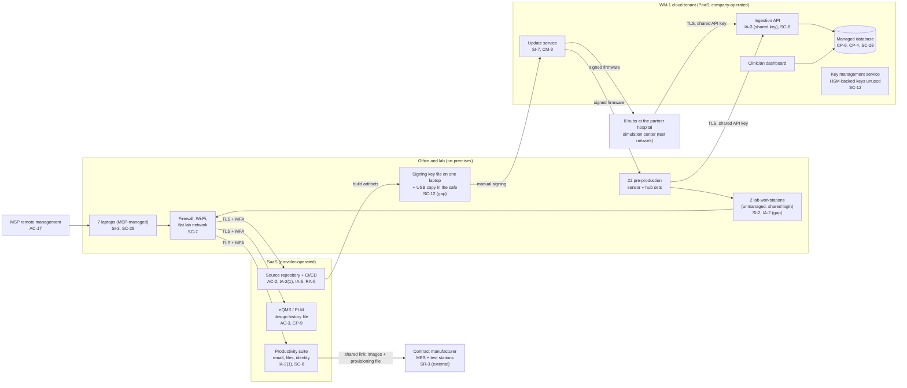

# Cloud Architecture and Control Placement: Cris Santos Company | Manufacturing | Micro

**Organization:** Cris Santos Company, LLC (medical device startup) | **Tier:** Micro | **Provider:** Vendor-agnostic PaaS and SaaS (see section 3)
**System:** Product Development and Release Platform (PDRP), as defined in the SSP (P02) | **Prepared:** 2026-07-31 by the Cloud Software Engineer with the Operations Manager and the MSP lead technician | **Approved:** CEO, 2026-08-31

## 1. Diagram
The company runs one cloud workload: the pre-production WM-1 cloud service in a PaaS tenant (SYS-04). Everything else is SaaS, plus laptops and a small lab. The update service in the cloud tenant is a **related system** under section 524B: FDA's premarket guidance (section VII.C.2) names update servers as related systems. That makes the tenant part of the device's security, not only corporate IT.

## 2. Layers and who is responsible
| Layer | Components | Key controls | Customer (company) | MSP (on the company's behalf) | Provider |
|---|---|---|---|---|---|
| Identity | Suite, repository, eQMS, cloud console accounts; hub API key; lab login | AC-2, IA-2(1), IA-3, IA-5, AC-6 | Grants and removes access; owns the shared owner account problem and device identity design | Creates and disables suite accounts | Runs sign-in and MFA services |
| Network | Firewall, Wi-Fi, lab bench network; cloud endpoints | SC-7, SC-8 | Approves changes; sets TLS policy in the tenant | Configures and patches the firewall | Runs the cloud network and TLS termination |
| Compute | Laptops, lab workstations, cloud runtimes and containers | SI-2, SI-3, SC-28, CM-14 | Lab workstations (unmanaged); container images | Laptop EDR, patching, encryption | Platform patching |
| Data | Cloud database and storage, update images, design history, signing key | CP-9, CP-4, SC-12, SI-7 | Backup settings, restore tests, key custody, image integrity | Not in contract | Encryption at rest; snapshot mechanism; HSM-backed key service (available, unused) |
| Logging | Cloud activity log, repository audit log, suite sign-ins | AU-2, AU-6 | Decides retention; reviews logs (gap) | Forwards laptop EDR alerts | Generates and stores logs |
| Supply chain | Contract manufacturer, SaaS vendors | SR-3, SA-9 | Quality agreement and supplier review | None | SOC 2 reports |

**The MSP is not a cloud provider in the shared responsibility sense.** It performs customer-side duties for the laptops, the suite, and the network. Anything marked "Customer (performed by MSP)" in `cloud-control-map.csv` remains the company's responsibility. **The MSP contract does not cover the cloud tenant, the repository, the lab workstations, or the signing key.** Those are run by two engineers with no outside check today.

## 3. Service categories and provider equivalents
The design is vendor-agnostic. The shared responsibility models of the three major cloud providers split PaaS the same way: the provider runs the physical data center, network, host, and managed runtime; the customer keeps identities, access, data, keys it controls, application code, and configuration (SRC-AWS-SRM, SRC-AZURE-SRM, SRC-GCP-SRM in `00_universal-framework/sources/source-register.csv`). The cloud provider's SOC 2 Type 2 report is the evidence for the provider side (P09).

| Service category used | What it is here | Equivalent category in the large cloud providers (for reading their documentation) |
|---|---|---|
| Managed container runtime | Ingestion API, dashboard, update service | Managed container or app hosting service |
| Managed relational database | Test telemetry, unit registry | Managed database service |
| Object storage | Firmware images, exports | Object storage service |
| Key management with HSM-backed keys | Planned home for the signing key and device certificate authority | Key management service with HSM-backed key tier; dedicated cloud HSM |
| Identity and access management | Console and API access | Cloud identity and access management |
| Source repository and CI/CD | Code, builds, secrets | Developer platform SaaS or the provider's code and pipeline services |

## 4. Findings from the mapping
1. **The signing key is not in the cloud, and it should be (SC-12).** The tenant already offers HSM-backed keys that never leave the service and can require approval before use. Today the key is a file on one laptop. Fix: move signing into an HSM-backed key with two-person approval before design freeze (P01 R-001; P07 POAM-003).
2. **Every hub shares one API key, and the key has leaked (IA-3, IA-5).** The key is compiled into firmware, sent to the contract manufacturer by shared link, and printed in CI build logs. Anyone holding it can impersonate any hub. FDA's guidance asks that compromise of one device not reveal keys for others (Appendix 1, cryptography). Fix: per-device certificates issued from a private certificate authority, and rotate the current key now (P01 R-002, R-023).
3. **The update service is a related system with no change control (SI-7, CM-3).** Images are uploaded by hand from a laptop. The device signature check protects against tampered images, but nothing records which reviewed commit became which release. Fix: release pipeline that builds, signs through the key service, and publishes with a record (POAM-003).
4. **The shared owner account defeats MFA (IA-2(1), AC-6).** Codes are read from the CEO's phone. Fix: named break-glass account in the safe, daily work under least-privilege roles (POAM-002).
5. **Backups exist but restore is unproven (CP-9, CP-4).** Test data only today, but the same design will hold patient data after clearance. Fix: infrastructure as code and a restore test by 2026-10-31 (P01 R-015).
6. **The contract manufacturer is the weakest handoff (SR-3).** Secrets and images travel by a link that never expires. Fix: security terms in the quality agreement and an authenticated transfer with expiry (P01 R-009).
