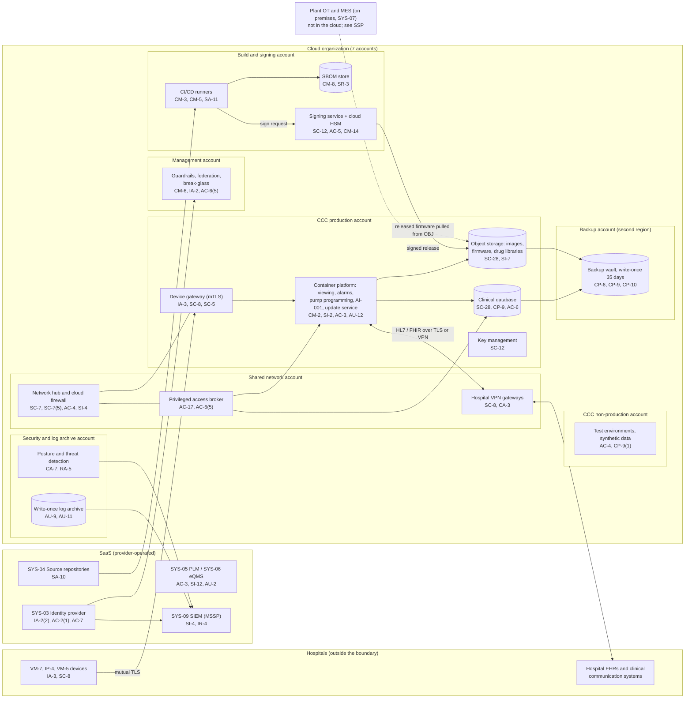

# Cloud Architecture and Control Placement: Cris Santos Company | Manufacturing | Mid-Market

**Organization:** Cris Santos Company, Inc. | **Tier:** Mid-Market | **Provider:** Vendor-agnostic public cloud (see section 4), plus SaaS
**System:** Device Lifecycle Platform (DLP), as defined in the SSP (P02) | **Prepared:** 2026-07-31 by the Security Manager and the Director of Cloud Operations; updated 2026-09-17 with P07 results
**Control map:** `cloud-control-map.csv` (57 rows, 26 components)

## 1. Diagram

## 2. Landing zone design
The landing zone separates duties across 7 accounts (subscriptions or projects, depending on the provider) under one cloud organization. The design goal is that a compromise of any one account cannot reach patient data, signing keys, and backups at the same time.

| Account | Purpose | Who administers | Key design decisions |
|---|---|---|---|
| **Management** | Organization root, guardrail policies, identity federation to SYS-03, break-glass accounts | Security Manager (2 people) | No workloads. Root credentials sealed. Guardrails cannot be disabled from member accounts |
| **Security and log archive** | Posture management, threat detection, write-once log archive | Security Manager | Logs from all accounts land here. No one can delete logs before retention ends |
| **Shared network** | Network hub, cloud firewall, 31 hospital site-to-site VPN gateways, DNS, privileged access broker | IT Director's infrastructure team | All traffic between accounts and to the internet passes the hub. Administrative sessions only through the broker |
| **Build and signing** | CI/CD runners, SBOM store, signing service with cloud HSM | VP Engineering's build and release team | Production cannot initiate connections here. Release signing requires two approvers. The only path out is signed artifacts to production object storage |
| **CCC production** | Device gateway, container platform, clinical database, object storage, key management | Director of Cloud Operations | Company-managed keys. Tenant isolation in the application and database. No inbound path except the gateway and web front end |
| **CCC non-production** | Development and test environments | Cloud engineering | No PHI; synthetic data only; monthly isolated restore tests of production backups |
| **Backup** | Backup vault in a second region, 35-day write-once retention | 2 named backup administrators | Separate credentials, not federated to everyday accounts. Backups are pushed by a cross-account role that can write but not delete |

**Why build and signing is its own account.** The signing path is a section 524B related system: whoever controls it controls what every device installs. Separating it means that an attacker who takes over the CCC production account cannot sign firmware, and an attacker in the build account cannot read PHI.

## 3. Layers and shared responsibility per service
| Layer | Components | Key controls | Service model | Responsibility |
|---|---|---|---|---|
| Identity | Federation, guardrails, break-glass, privileged access broker, SYS-03 | IA-2, IA-2(1), AC-2, AC-6(5), AC-17, CM-6 | PaaS / SaaS | Customer configures identities, roles, MFA, and reviews; provider runs the identity and policy services |
| Network | Hub, cloud firewall, VPN gateways, device gateway | SC-7, SC-7(5), SC-8, SC-5, AC-4, CA-3, IA-3 | PaaS | Customer designs routes, rules, TLS policy, and device authentication; provider runs the gateway, VPN, and denial-of-service services |
| Compute | CI/CD runners, container platform, update service, test environments | CM-2, CM-3, CM-5, SI-2, SA-11, AU-12 | IaaS / PaaS | Customer (images, application code, pipeline rules); provider for hosts, hypervisor, and the managed control plane |
| Data | Database, object storage, SBOM store, key management, signing HSM, backups | SC-28, SC-12, SC-13, CP-9, CP-6, CP-10, SI-7, CM-8, CM-14, AC-5 | IaaS / PaaS | Shared: provider encrypts and operates storage, the database engine, and the HSM hardware; customer controls keys, signing policy and quorum, access, retention, and restore testing |
| Logging and monitoring | Audit logging, posture service, log archive, SIEM | AU-2, AU-9, AU-11, CA-7, RA-5, SI-4, IR-4 | PaaS / SaaS | Shared: provider generates events and detections; customer enables, retains, forwards, and acts on them; MSSP monitors |
| SaaS applications | Identity provider, repositories, PLM, eQMS, SIEM | IA-2(2), AC-2(1), AC-7, SA-10, AC-3, SI-12, AU-2 | SaaS | Provider runs the application and infrastructure; customer keeps users, roles, retention, audit review, and data |
| Physical | Provider data centers | PE-3 | All | Provider (inherited, evidenced by SOC 2 reports) |

**Responsibility counts in `cloud-control-map.csv`:** 32 Customer, 19 Shared, 6 Provider. By service model: 14 IaaS, 34 PaaS, 9 SaaS rows. As the three providers' shared responsibility models agree, the customer side is always identity, data protection (including keys), and logging.

## 4. Service categories and provider equivalents
The design is independent of the provider. This table gives each provider's name for the service category, for reading its shared responsibility documentation (SRC-AWS-SRM, SRC-AZURE-SRM, SRC-GCP-SRM in `00_universal-framework/sources/source-register.csv`).

| Service category | AWS | Microsoft Azure | Google Cloud |
|---|---|---|---|
| Multi-account organization and guardrails | AWS Organizations, service control policies | Management groups, Azure Policy | Resource Manager folders, organization policies |
| Account, subscription, or project | Account | Subscription | Project |
| Cloud identity federation | IAM Identity Center | Microsoft Entra ID with Azure RBAC | Cloud Identity with IAM |
| Network hub and cloud firewall | Transit Gateway, AWS Network Firewall | Virtual WAN hub, Azure Firewall | Network Connectivity Center, Cloud NGFW |
| Site-to-site VPN | Site-to-Site VPN | VPN Gateway | Cloud VPN |
| Managed container platform | Amazon EKS | Azure Kubernetes Service | Google Kubernetes Engine |
| Managed relational database | Amazon RDS or Aurora | Azure Database for PostgreSQL | Cloud SQL |
| Object storage with write-once retention | S3 with Object Lock | Blob Storage with immutability policies | Cloud Storage with bucket lock |
| Key management | AWS KMS | Azure Key Vault | Cloud KMS |
| Cloud HSM | AWS CloudHSM | Azure Managed HSM | Cloud HSM |
| Backup service | AWS Backup (vault lock) | Azure Backup (immutable vault) | Backup and DR Service |
| Denial-of-service protection and web application firewall | AWS Shield, AWS WAF | Azure DDoS Protection, Azure Web Application Firewall | Cloud Armor |
| Audit logging | CloudTrail | Azure Monitor activity log | Cloud Audit Logs |
| Posture and threat detection | Security Hub, GuardDuty | Microsoft Defender for Cloud | Security Command Center |

**Service model split used here (all three providers agree):**
- **IaaS** (virtual machines, networks, raw storage): the provider owns facilities, hosts, and virtualization. The customer owns the guest OS, applications, network configuration, identities, and data.
- **PaaS** (managed containers, database, key service, HSM, backup): the provider also owns the platform software and its patching. The customer owns access, keys, data, configuration, and, for the HSM, the key policies and quorum.
- **SaaS** (identity provider, repositories, PLM, eQMS, SIEM): the provider also owns the application. The customer keeps identities, roles, retention, audit review, and data.

## 5. Findings from the mapping
1. **The signing path is well separated, but its recovery is unproven.** The build and signing account, two-person signing, and the HSM are the strongest controls in the environment. HSM key recovery has never been exercised, and the VM-5 legacy key sits outside the landing zone on an offline laptop (P01 R-012). Fix: key recovery exercise and VM-5 key migration into the HSM by 2026-12-31.
2. **Production access is broader than the design.** Just-in-time elevation covers the database but not the container platform, and 9 engineers keep standing all-tenant write access (gap 7; P01 R-007). Fix: extend the access broker to the container platform by 2026-12-31.
3. **Recovery is designed but slow.** Backups are isolated (separate account, second region, write-once, separate credentials). Regional failover took 6 hours against a 2-hour RTO (P01 R-016). Fix: automated failover by 2027-03-31, then quarterly tests.
4. **The plant is outside the cloud but inside the trust chain.** Test stations pull released firmware from production object storage, and the factory provisioning server issues device certificates with a software-held key (gap 6; P01 R-010). The cloud map therefore cannot show all of the signing and identity path. The SSP (P02) covers the plant side.
5. **Boundary check.** Every cloud and SaaS component in the SSP (P02 section 9) appears in the diagram. Every cloud account has at least one row in the control map, and each has controls from at least 2 of the AC, AU, CM, IA, SC, and SI families or inherits them.
6. **Inherited controls rely on SOC 2 reports.** Rows marked Provider or Shared for the cloud provider, identity vendor, repository vendor, PLM and eQMS vendors, and the MSSP depend on their SOC 2 Type 2 reports and complementary user entity controls, reviewed each year in P09 `vendor-soc2-review.csv`.
