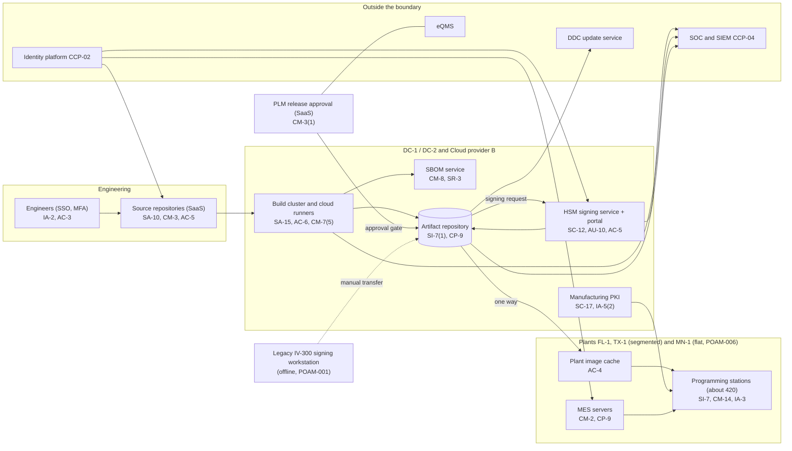

# System Security Plan: Device Software Factory and Manufacturing Execution System (DSF-MES)

**Organization:** Cris Santos Company, Inc. (publicly traded connected medical device manufacturer) | **Tier:** Enterprise | **Vertical:** Manufacturing (NAICS 334510)
**Outline:** NIST SP 800-18 Rev. 2, System Security Plan Outline Example (June 2026) | **Version:** 2.0, 2026-09-14

## 1. System Name and Identifier
Device Software Factory and Manufacturing Execution System (**DSF-MES**), identifier CSC-SYS-DSF-001. Tier-1 system in the enterprise application inventory.

## 2. System Overview
DSF-MES is the path every line of device code takes from an engineer's commit to a device on a customer's shelf. It builds, tests, signs, and releases firmware and cloud software for all product lines (VM-700, VM-500, DG-10, IV-300, CR-100, US-20, HB-40), produces an SBOM for every build, publishes released images to the DDC update service, and loads signed firmware and device identity certificates into devices at the three plants.

**Why integrity matters most.** A malicious or unapproved change that gets signed reaches every fielded device of that product line. That is the multi-patient harm FDA's premarket guidance asks manufacturers to consider, and it is why section 524B(b)(2) requires processes that give "a reasonable assurance that the device and related systems are cybersecure." The same pipeline also has to be available: out-of-cycle fixes for critical vulnerabilities must be made available "as soon as possible" (524B(b)(2)(B)).

**Major components:**
- Source repositories and code review (SaaS tenant): about 2,600 repositories
- CI/CD build farm: 64-node on-premises build cluster at DC-1 (firmware) and ephemeral cloud runners on Cloud provider B (cloud software)
- HSM code-signing service: HSM clusters at DC-1 (primary) and DC-2 (secondary), signing portal with two-person approval, one key set per product line
- Legacy IV-300 1.x signing workstation: standalone and offline, at MN-1 (being retired, POAM-001)
- Artifact repository and SBOM service: DC-1 with a replica at DC-2; matches SBOM components against vulnerability sources including CISA's Known Exploited Vulnerabilities catalog
- PLM release records (SaaS tenant): design change and release approvals that gate artifact promotion
- Manufacturing PKI: offline root CA and an issuing CA high-availability pair at DC-1, issuing device identity certificates
- MES servers at FL-1 and TX-1 (clusters) and MN-1 (single server), plant image caches, and about 420 test and programming stations (FL-1 180, TX-1 150, MN-1 90)

**Users:** about 1,400 engineering users of the repositories (including about 220 contractors), 60 release engineers, 12 signing approvers in product-line signing groups, 6 HSM administrators, and about 2,000 plant operators and supervisors on MES (about 400 at MN-1 on shared logins).

## 3. Laws, Regulations, and Policies Affecting the System
| ID | Requirement | Citation | How it affects DSF-MES |
|---|---|---|---|
| N31-33-R05 | FD&C Act section 524B | 21 U.S.C. 360n-2(b)(1)-(3) | Processes that assure the device and related systems are cybersecure; regular and out-of-cycle patches; SBOM for each submission. DSF-MES produces all three |
| QMSR | Quality management system regulation | 21 CFR 820.10(c) (design and development under ISO 13485 clause 7.3); 820.35 (records) | Design change control, verification, and release records; production records and UDI |
| MDR and 806 | Reporting | 21 CFR 803.50, 803.53; 806.10, 806.20 | A compromise of the signing or release path could trigger a correction and FDA reporting (P08) |
| FDA guidance | Premarket cybersecurity guidance (2026-02-03); postmarket cybersecurity guidance (December 2016) | Nonbinding | Secure product development framework, code integrity, SBOM content, and patch timeliness expectations (P03) |
| SEC | Cybersecurity disclosure | Form 8-K Item 1.05; 17 CFR 229.106 | A compromise of the signing path would go through the P08 materiality step; Item 106 describes this program |
| State | State breach laws | Each state where affected individuals reside (Florida worked example) | Only if workforce personal information in the system is breached |
| Internal | POL-01 to POL-05 and standards | P06 | Enterprise policy hierarchy, including STD-01.8 Secure Product Development |

Not applicable: N62-R01 and N62-R03 (DSF-MES stores no PHI; the DDC and RCM platform are covered in their own plans), N62-R06 (no consumer health data), N31-33-R01 to R04 (see `../00_company-facts.md` section 1).

## 4. System Status
### 4.1 System Security Plan Approval
Prepared by the Director of Build and Release Engineering, the Vice President, Manufacturing Systems, and the GRC team. Reviewed by the CISO, the VP Product Security, and the CQRO. Approved by the Chief Operating Officer on 2026-09-14.
### 4.2 System Authorization Decision
The company is not a federal agency, so there is no formal ATO. The equivalent internal decision:
- **Authorizing official equivalent:** Chief Operating Officer, with the CISO's recommendation.
- **Decision (2026-09-14):** continue operation with conditions, based on the Internal Audit assessment (P07) and the risk register (P01).
- **Conditions:** retire the legacy IV-300 signing workstation into the HSM service (POAM-001, by 2027-01-31); segment the MN-1 OT network (POAM-006, by 2027-03-31); replace checksum-only verification at MN-1 stations (POAM-019, by 2027-03-31); remove long-lived CI runner credentials (POAM-003, by 2026-12-31).
- **Reauthorization:** annually, or after a major change (for example, the MN-1 MES replacement in 2027).
### 4.3 System Operational Status
Operational. Planned major modifications: MN-1 MES replacement and network segmentation (2027), signed firmware build provenance (SR-4), and reproducible builds (SA-10(1)).

## 5. Role Identification and Responsible Personnel
| Role | Title | Responsibility |
|---|---|---|
| System owner | Chief Technology Officer (with the Vice President, Manufacturing Systems for the MES part) | Accountable for DSF-MES; approves access roles and signing group membership |
| Authorizing official (equivalent) | Chief Operating Officer | Accepts residual risk to operate |
| System administrators | Director of Build and Release Engineering; Vice President, Manufacturing Systems | Day-to-day operation of the pipeline, signing service, and MES |
| Product security | VP Product Security | Threat models, SBOM monitoring, CVD, product security incidents |
| Quality and regulatory | CQRO | Design controls, release records, FDA reporting decisions |
| Information security | CISO; Director of Security Operations | Program oversight; SOC monitoring; incident response |
| Common control providers | See section 10.3 | Operate inherited controls |
| Independent assessor | Chief Audit Executive (Internal Audit) | Annual assessment (P07) |

## 6. System Information Types and System Categorization
Information types come from NIST SP 800-60 Vol. 2 Rev. 1 where one fits; the company defined the last two types itself. Impact levels follow FIPS 199, used as a model.

| Information type | Confidentiality | Integrity | Availability | Rationale |
|---|---|---|---|---|
| Device software and firmware (source, builds, released images) | Moderate | **High** | Moderate | Source code disclosure harms the company and helps attackers. An altered released image can harm many patients, so integrity is High. Plants cache released images and production has finished-goods buffers (P05 BP-04 RTO 24 h) |
| Signing keys and manufacturing PKI keys (company-defined) | **High** | **High** | Moderate | Key disclosure would let an attacker sign malicious firmware for a whole product line |
| Production and device history records (company-defined) | Low | Moderate | Moderate | Required by 21 CFR 820; errors delay release (P05 BP-07 to BP-09 RTO 48 h) |
| Information security (audit logs, pipeline policies, credentials) | Moderate | Moderate | Moderate | Protects the evidence for release integrity |
| **DSF-MES category** | **High water mark: High** | **High** | **Moderate** | See the decision below |

**Categorization decision.** Under a strict FIPS 199 high-water mark, DSF-MES is High. The company is not a federal agency and uses FIPS 199 as a model. The risk and technology committee approved this tailoring on 2026-09-10:
- DSF-MES uses the **SP 800-53B Moderate baseline**.
- Key material stays inside FIPS 140-validated HSMs as non-exportable keys (SC-12, SC-13), which contains the High confidentiality exposure to the HSM boundary. The legacy IV-300 workstation is the one exception, and its retirement is a condition of the authorization.
- It adds **12 integrity supplements**: 9 from the High baseline (AU-9(3), AU-10, CM-3(1), CM-4(1), CM-5(1), SC-12(1), SI-7(2), SI-7(5), SI-7(15)) and 3 controls that sit outside every baseline but address software supply chain integrity directly (CM-14, SA-10(1), SR-4).
- The decision is reviewed annually. If the legacy signing workstation is not retired by 2027-06-30, the CISO will recommend full High categorization.

**Documented controls.** `control-implementation.csv` documents **141 controls**: 129 from the Moderate baseline and 12 integrity supplements. The other 158 Moderate-baseline controls and enhancements (83 enhancements, mostly in AC, IA, SC, and CM, plus base controls such as physical and environmental protection, media protection, and maintenance) are fully inherited from the common control catalog (section 10.3) and are listed there rather than repeated here.

## 7. Authorization Boundary Description
**Inside the boundary:** the source repository tenant and code review configuration, the build orchestrator and build cluster at DC-1, the cloud runner pool on Cloud provider B, the HSM signing service at DC-1 and DC-2 and its signing portal, the legacy IV-300 signing workstation, the artifact repository and SBOM service, the PLM release workflow configuration, the manufacturing PKI, the MES servers and plant image caches at FL-1, MN-1, and TX-1, and the test and programming stations.

**Outside the boundary (common control providers and interconnected systems):**
- Identity platform (SYS-08): CCP-02
- Cloud landing zones, key management, log archive, backup accounts: CCP-03
- SOC, SIEM, EDR, scanners: CCP-04
- Enterprise and plant network segmentation: CCP-05
- DDC update service (SYS-01), eQMS (SYS-05), ERP (SYS-07), contract manufacturers CMO-1 and CMO-2

The enterprise multi-cloud diagram is in P04 `cloud-architecture.md`.

## 8. Information Exchanges Summary
| Connected system / party | Direction | Data | Agreement |
|---|---|---|---|
| DDC update service (SYS-01) | Outbound | Signed firmware images and drug library packages | Internal interconnection agreement |
| PLM (SaaS) and eQMS (SaaS) | Bidirectional | Change records, release approvals, CAPA links | Vendor contracts; SOC 2 Type 2 reviewed |
| ERP (SYS-07) | Outbound | Serial numbers, UDI, device history record status | Internal interconnection agreement |
| Source repository and CI SaaS vendor | Bidirectional | Source code, pipeline definitions | Vendor contract; SOC 2 Type 2 reviewed |
| Contract manufacturer CMO-1 | Outbound | Signed images; device certificates issued through the PKI | Supply agreement with security terms |
| Contract manufacturer CMO-2 | Outbound | Signed HB-40 images (**programmed outside the PKI; assessment overdue, POAM-013**) | Supply agreement (security terms pending renewal) |
| Firmware module suppliers | Inbound | Third-party firmware and SBOMs (**about 40% coverage, POAM-005**) | Supply agreements |
| Station vendors | Remote support | Diagnostics for test stations (**MN-1 vendor tools outside PAM, POAM-007**) | Service agreements |

## 9. System Component Inventory
| Component | Type | Location / provider | Owner |
|---|---|---|---|
| Source repositories (about 2,600) | SaaS tenant | Source repository vendor | Director of Build and Release Engineering |
| Build orchestrator and 64 build nodes | On-premises servers | DC-1 | Director of Build and Release Engineering |
| Cloud runner pool | Ephemeral containers | Cloud provider B build account | Director of Build and Release Engineering |
| HSM clusters (2 x 2 HSMs) and signing portal | Hardware appliances and web application | DC-1 (primary), DC-2 (secondary) | Director of Build and Release Engineering |
| Legacy IV-300 1.x signing workstation | Standalone workstation | MN-1 engineering room | Director of Build and Release Engineering |
| Artifact repository and SBOM service | On-premises application | DC-1, replica at DC-2 | Director of Build and Release Engineering |
| Manufacturing PKI (offline root, issuing CA pair) | HSM-backed CA | Root in a DC-2 safe; issuing CAs at DC-1 | Director of Build and Release Engineering |
| MES servers | Clusters at FL-1 and TX-1; single server at MN-1 (unsupported OS) | Plants | Vice President, Manufacturing Systems |
| Plant image caches (3) | On-premises servers | Plants | Vice President, Manufacturing Systems |
| Test and programming stations (about 420) | OT workstations and fixtures | FL-1 180, TX-1 150, MN-1 90 | Plant directors |

## 10. Control Implementation Details
### 10.1 Control implementation status
See `control-implementation.csv` (141 controls).

| Status | Count |
|---|---|
| Implemented | 104 |
| Partially implemented | 33 |
| Planned | 4 |
| **Total** | **141** |

| Inheritance | Count |
|---|---|
| Common (fully inherited from a common control provider) | 73 |
| Hybrid (shared between a provider and the DSF-MES team) | 43 |
| System-specific | 25 |

The Planned controls are integrity supplements: AU-9(3), SI-7(5), SA-10(1), SR-4. Partially implemented controls: AC-2, AC-5, AC-6, AC-17, AT-3, AU-6, AU-10, CM-2, CM-3, CM-5, CM-6, CM-7, CM-8, CM-14, CP-4, CP-9, CP-10, IA-2, IA-5, PS-4, RA-5, SA-9, SA-15, SA-22, SC-7, SC-8, SC-12, SI-2, SI-4, SI-7, SR-3, SR-6, SR-11. Most trace to one of three causes: the acquired MN-1 plant, the legacy IV-300 signing path, and supplier software.

### 10.2 Control assessment status
Internal Audit assessed 44 of these controls from 2026-07-13 to 2026-08-28 using SP 800-53A Rev. 5 procedures and statistical sampling (P07 `assessment-plan.md`, `assessment-results.csv`). Weaknesses are in P07 `poam.csv`.

### 10.3 Common control providers and inheritance
Common and hybrid controls are inherited from the enterprise platform. Each provider publishes its controls in the enterprise **common control catalog** (maintained by the GRC team in the GRC platform) and is assessed on its own cycle; DSF-MES inherits the results.

| Provider | Name | Accountable role | Controls provided | Rows in this plan | Evidence of operation |
|---|---|---|---|---|---|
| CCP-01 | Enterprise GRC program | CISO (with the Chief Risk Officer and Chief Audit Executive for assessment) | Policies and standards (P06), risk methodology, assessment, POA&M, continuous monitoring, contingency planning standard | 23 | Annual Internal Audit assessment (P07); GRC platform |
| CCP-02 | Identity platform (SYS-08) | Director of Identity and Access Management | SSO, MFA, PAM, identity governance, account lifecycle | 18 | SOX IT general control testing; P07 AC-2, IA-2 results |
| CCP-03 | Cloud landing zones | Director of Cloud Platform Engineering | Key management, encryption, backup accounts, log archive, recovery automation | 8 | Posture management reports; provider SOC 2 Type 2 |
| CCP-04 | Security operations | Director of Security Operations | 24x7 SOC, SIEM, EDR, vulnerability scanning, incident response | 17 | SOC metrics; P07 AU-6, SI-4, RA-5 results |
| CCP-05 | Enterprise and plant network | Director of Network Engineering (with the Director of OT Security for plant zones) | Data center and plant segmentation, firewalls, wireless, carriers, transport encryption | 6 | Network configuration reviews |
| CCP-06 | Endpoint engineering | Director of Endpoint Engineering (with the Vice President, Manufacturing Systems for OT stations) | Baselines, allowlisting, patching, unsupported component tracking | 11 | Configuration compliance and patch reports |
| CCP-07 | Facilities and colocation | Vice President, Facilities | Data center cages, plant server rooms, alternate site, media destruction | 5 | Badge reviews; colocation SOC 2 reports |
| CCP-08 | Human resources and training | Chief Human Resources Officer | Screening, terminations, sanctions, training, acknowledgments | 9 | HR and learning system reports |
| CCP-09 | Third-party and supplier risk | Director of Third-Party Risk Management (with the Vice President, Supply Chain) | Vendor tiering, supplier assessments, SCRM plan, supplier SBOM terms | 8 | Vendor register; supplier assessments |
| CCP-10 | Quality management system | CQRO | SDLC under design controls, change impact analysis, record retention, incoming inspection | 4 | FDA inspection history; QMS internal audits |
| CCP-11 | Product Security Office | VP Product Security | CVD, advisory intake, secure design standard, security testing, criticality analysis, SBOM monitoring | 7 | PSIRT metrics; ISAO membership |

**Inheritance rules:**
- A Common control is fully inherited; the DSF-MES team verifies only that the system is onboarded (for example, SSO integration and log forwarding).
- A Hybrid control names both parts in the implementation statement: the provider's part and the DSF-MES team's part.
- If a provider's assessment finds a weakness, the finding is linked to every inheriting system's POA&M. Example: POAM-017 (MN-1 terminations) is a CCP-02 and CCP-08 weakness that affects DSF-MES because MN-1 operators hold MES access.

## 11. Digital Identity Acceptance Statement
- **Workforce users:** SSO with MFA (authenticator app with number matching, or a FIDO2 security key). Privileged users, signing approvers, and HSM administrators use phishing-resistant FIDO2 keys through PAM. This matches an assurance level comparable to NIST SP 800-63 AAL2 for users and AAL3-like protection for privileged users.
- **Contractors and supplier users:** federated through the identity platform with sponsor approval and MFA; contract manufacturers never receive signing access.
- **Plant operators:** FL-1 and TX-1 operators use badge plus PIN tied to their SSO identity. **MN-1 operators use shared logins on a legacy directory** until federation (POAM-007, due 2027-03-31).
- **Devices and stations:** programming stations authenticate with certificates from the manufacturing PKI; devices receive unique identity certificates at programming.

## 12. Referenced Artifacts
Scenario facts (`../00_company-facts.md`), BIA (P05), multi-cloud architecture and control map (P04), enterprise risk register (P01), regulatory gap analysis (P03), policy hierarchy and policies (P06), Internal Audit assessment and POA&M (P07), fielded-device incident runbook (P08), SOC 2 readiness (P09), AI portfolio (P10), DSF-MES contingency plan v3, key ceremony records, manufacturing PKI certificate policy, enterprise common control catalog.

## 13. Acronym List and Glossary
- **CCP:** common control provider
- **CI/CD:** continuous integration and continuous delivery
- **CMO:** contract manufacturing organization
- **HSM:** hardware security module
- **MES:** manufacturing execution system
- **PKI:** public key infrastructure
- **POA&M:** plan of action and milestones
- **Provenance attestation:** a signed record of how, where, and from what sources a build was produced
- **SBOM:** software bill of materials
- **UDI:** unique device identifier

## 14. System Security Plan Review and Change Records
| Version | Date | Change | Author |
|---|---|---|---|
| 1.0 | 2025-09-12 | Initial plan (build pipeline and signing service only) | Director of Build and Release Engineering |
| 1.1 | 2026-02-20 | Added MES and plants, including MN-1 after the acquisition | Vice President, Manufacturing Systems |
| 2.0 | 2026-09-14 | Integrity supplementation; common control provider mapping; 2026 assessment results | Director of Build and Release Engineering with the GRC team |
