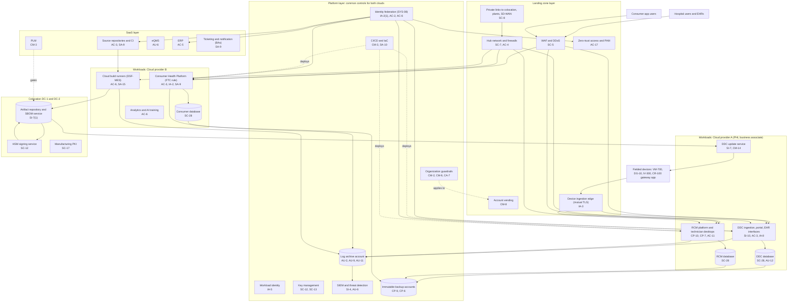

# Cloud Architecture and Control Placement: Cris Santos Company | Manufacturing | Enterprise

**Organization:** Cris Santos Company, Inc. (publicly traded connected medical device manufacturer) | **Tier:** Enterprise | **Provider:** Multi-cloud, vendor-agnostic: two public cloud providers (called Cloud provider A and Cloud provider B), two colocation data centers (DC-1 Florida, DC-2 Texas), and SaaS (see section 4)
**Owner:** Director of Cloud Platform Engineering, with the CISO and the VP Product Security | **Date:** 2026-08-31 | **Related:** DSF-MES SSP (P02), enterprise BIA (P05)

## 1. Architecture in layers
The estate is organized in four cloud layers plus colocation. Each lower layer provides **common controls** that the layers above inherit, so a workload team configures only what is specific to its system.

| Layer | What it is | Examples | Who runs it |
|---|---|---|---|
| **Platform** | Organization-wide services in both clouds | Organization guardrails, identity federation, workload identity, key management, log archive, SIEM feeds, vulnerability and posture management, immutable backup accounts, CI/CD and infrastructure as code | Cloud Platform Engineering; Security Operations; Identity team |
| **Landing zone** | The standard account pattern every workload lands in | Account vending with mandatory tags, hub-and-spoke network with cloud firewalls, WAF and DDoS protection, the device ingestion edge (mutual TLS), private links to colocation and SD-WAN, zero-trust access and PAM, private DNS | Cloud Platform Engineering; Network Engineering |
| **Workload** | Systems built or run by the company | Cloud A: Device Data Cloud (SYS-01, including the update service) and RCM platform (SYS-02). Cloud B: Consumer Health Platform (SYS-03), cloud build runners for DSF-MES, analytics and AI training environment | Application teams (for example, the Vice President, Digital Health for the DDC) |
| **SaaS** | Vendor-operated applications | Source repositories and CI, PLM, eQMS, ERP, productivity suite, support ticketing, notification service | Vendors, with the company's configuration and oversight |
| **Colocation** | Company equipment in DC-1 and DC-2 | HSM signing service, build cluster, artifact repository, manufacturing PKI, network core | Build and Release Engineering; Network Engineering |

**Why firmware signing stays out of the cloud.** Signing keys live in company-owned HSMs at DC-1 and DC-2, not in either cloud's key service. A compromise of a cloud account, including a cloud build runner, therefore cannot use a signing key directly: every signing request goes through the signing portal with two approvers (P02 AC-5, AU-10).

## 2. Diagram

## 3. Responsibility by service model
Sources: SRC-AWS-SRM, SRC-AZURE-SRM, and SRC-GCP-SRM in `00_universal-framework/sources/source-register.csv`. The three published models agree on the split used here, so the design does not depend on which two providers the company uses.

| Service model | Provider | Company (customer) | Shared |
|---|---|---|---|
| IaaS (network hub, some DDC services) | Facilities, hosts, hypervisor, physical network | Guest OS, applications, identities, data, network policy | Encryption (provider service, customer keys), logging |
| PaaS (managed databases, containers, runners) | Also the platform runtime and its patching | Data, access, configuration, keys, application code, workload credentials | Backups, availability configuration |
| SaaS (repositories, PLM, eQMS, ERP, ticketing) | Also the application | Users, roles, data, oversight of the vendor | Audit review (complementary user entity controls) |
| Colocation | Building, power, cooling, perimeter | Racks, HSMs, servers, cage access lists | None |

Both cloud providers and the ticketing and notification vendors have signed subcontractor BAAs for the business associate services (45 CFR 164.308(b)(1), 164.314(a)(2)(iii)). Cloud provider B hosts consumer data under a data processing agreement; the FTC rule, not HIPAA, governs that data.

## 4. Service categories and provider equivalents
| Service category | AWS | Microsoft Azure | Google Cloud |
|---|---|---|---|
| Organization guardrails | AWS Organizations service control policies | Azure Policy with management groups | Organization Policy Service |
| Account vending | AWS Control Tower account factory | Azure landing zone subscription vending | Resource Manager project creation |
| Workload identity federation | IAM roles for service accounts | Workload identity federation | Workload Identity Federation |
| Key management | AWS KMS | Azure Key Vault | Cloud KMS |
| Audit logging | AWS CloudTrail | Azure Monitor activity log | Cloud Audit Logs |
| Threat detection and posture | Amazon GuardDuty; AWS Security Hub | Microsoft Defender for Cloud | Security Command Center |
| Device connectivity with mutual TLS | AWS IoT Core | Azure IoT Hub | Partner IoT platforms |
| Managed relational database | Amazon RDS | Azure SQL Database | Cloud SQL |
| Managed containers | Amazon EKS | Azure Kubernetes Service | Google Kubernetes Engine |
| Web application firewall | AWS WAF | Azure Web Application Firewall | Cloud Armor |
| Backup service | AWS Backup | Azure Backup | Backup and DR Service |

This table is for reading provider documentation only. The architecture, control map, and SSP describe service categories.

## 5. Common controls
`cloud-control-map.csv` has **61 rows** across 39 components: Platform 21, Landing zone 8, Workload 21, SaaS 8, Colocation 3. Responsibility: Customer 42, Shared 13, Provider 6.

**29 rows are published as common controls** (`common_control` = Yes) in the enterprise common control catalog. They map to the common control providers in the DSF-MES SSP (P02 section 10.3): identity (CCP-02), landing zones (CCP-03), security operations (CCP-04), network (CCP-05), and facilities and colocation (CCP-07), plus the HSM signing service that every product line uses. A workload inherits them by being deployed through account vending, which applies the guardrails, logging, network, key, and backup policies automatically.

**Rules for inheriting:**
1. A workload may claim a common control only if its account was created by account vending and passes the posture baseline.
2. Customer-side identity, data protection, and logging stay explicit at every layer: even a SaaS application has Customer rows for access (AC-3, AU-6) because those are always the company's responsibility.
3. SaaS rows cite the vendor's SOC 2 report, reviewed by the third-party risk team (P09 evidence map).
4. No workload may hold firmware signing material. Signing is a service call to the HSM signing service with two approvers.

## 6. Validation against the DSF-MES SSP (P02)
Most of DSF-MES sits in colocation and SaaS. Its cloud and SaaS parts appear here with controls from each required family, directly or inherited:
| DSF-MES component | AC | AU | CM | IA | SC | SI or SA |
|---|---|---|---|---|---|---|
| Cloud build runners (Cloud provider B) | AC-6 | AU-2, AU-9 (inherited) | CM-2, CM-6 (inherited) | IA-5 (inherited; gap POAM-003) | SC-7 (inherited) | SA-15 (gap POAM-004) |
| Source repositories and CI (SaaS) | AC-3 | AU-2 (log export) | CM-3 (PLM gate) | IA-2(1) (inherited) | SC-8 (vendor) | SA-9 |
| HSM signing service (colocation) | AC-5 (P02) | AU-10 (P02) | CM-5(1) (P02) | IA-2(1) (inherited) | SC-12 | SI-7(15) (P02) |
| DDC update service (interconnected system) | AC-3 | AU-12 | CM-14 | IA-3 (inherited) | SC-8 | SI-7 |

## 7. Findings from the mapping
1. **Cloud build runners hold long-lived artifact tokens.** Runners are ephemeral, but the token they receive can write to the artifact repository for 90 days. Fix: move runners to short-lived workload identity, as deployment pipelines already use (POAM-003).
2. **Legacy devices weaken the ingestion edge.** IV-300 first-generation modules authenticate with per-hospital pre-shared keys and negotiate TLS 1.0 to the drug library endpoint. The edge isolates them on a separate listener with rate limits until the modules are replaced (P03 G-032; POAM-023).
3. **RCM recovery is a workload responsibility.** The platform layer restores the database on time, but technician desktops and call routing were rebuilt by hand in the 2026-04-18 test (POAM-026).
4. **Consumer app privacy depends on the workload team.** No platform control can stop an in-app analytics kit from sending health-related events; that is a release review and contract control (POAM-021).
5. **Two clouds, one control set.** Guardrails, logging, and key policies are written once as code and applied to both clouds. Differences are limited to service names (section 4).
6. **Signing stays independent of the clouds.** Keeping HSMs in colocation means a cloud compromise and a signing compromise require two separate failures.
