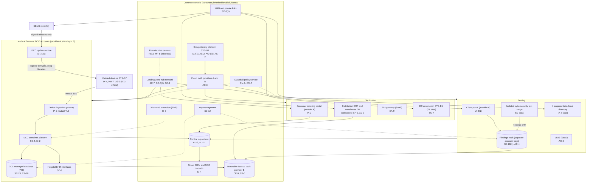
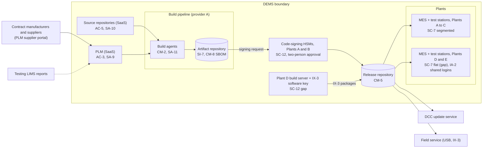

# Cloud Architecture and Control Placement: Cris Santos Company Holdings | Manufacturing | Multi-Sector

**Organization:** Cris Santos Company Holdings, Inc. | **Tier:** Multi-Sector | **Providers:** two public cloud providers, called provider A and provider B (vendor-agnostic; see section 5)
**Scope:** the shared corporate cloud platform (SYS-G3 landing zones, WAN, and colocation data center) plus the division workloads that run on it or connect to it. The SSP system (P02) is the Device Engineering and Manufacturing System (DEMS).

## 1. Design in one paragraph
Corporate runs one **landing zone** per provider: identity federation from SYS-G1, a hub network, guardrail policies, a central log archive, key management, EDR, and an immutable backup vault in provider B. Divisions get their own **accounts** inside the landing zone and inherit these guardrails. Provider A hosts the DEMS build pipeline and release repository, the Device Connectivity Cloud (DCC), the Distribution customer ordering portal, and the Testing client portal and findings vault. Provider B hosts the DCC warm standby and the backup vault. Much of the estate is **not** in the cloud: the code-signing HSMs and the Plant D build server, MES and test stations at 5 plants, the distribution ERP in the group colocation data center, automation at 24 distribution centers, and the isolated test range at the laboratories. The WAN links all of them. PLM, source hosting, the eQMS, the LIMS, and the EDI network are SaaS.

## 2. Diagrams
### 2.1 Group landing zone and division workloads

### 2.2 DEMS (SSP boundary)

**Target state (POAM-003, POAM-005, POAM-006, due 2027-03-31):** IX-3 signing moves into the HSM service (or IX-3 moves to a new key through a planned field transition), Plants D and E get the same production zones as Plants A to C, and every test station uses individual operator sign-in.

## 3. Common versus division-specific controls
`cloud-control-map.csv` has 50 rows across 35 components. The `control_scope` column shows who owns each placement:

| Scope | Rows | What it means |
|---|---|---|
| Common (group) | 20 | Provided once by corporate (SYS-G1, SYS-G2, SYS-G3) and inherited by every division account and site. Listed in the P02 common control catalog |
| SSP system (DEMS, Medical Devices) | 11 | Controls of the SSP system documented in P02 |
| Division-specific (Medical Devices, DCC) | 8 | Device ingestion, tenant separation, PHI database, update service, EHR interfaces |
| Division-specific (Distribution) | 5 | ERP in the colocation data center, federal order data, ordering portal, EDI, distribution center automation |
| Division-specific (Testing) | 6 | Client portal, findings vault, LIMS, test range, acquired laboratories |

| Responsibility | Rows |
|---|---|
| Customer (the group or a division) | 39 |
| Shared (provider and group) | 7 |
| Provider | 4 |

**Rule of thumb.** Identity, network guardrails, logging, keys, backups, and EDR are **common**. A division cannot opt out of them, only request an exception through POL-01. What each division builds on top is **division-specific**, because it depends on that division's regulators and customers: FDA and hospital BAAs for the DCC, federal contract clauses for Distribution, and client confidentiality for Testing.

## 4. Layers
| Layer | Common components | Division components | Key controls | Responsibility |
|---|---|---|---|---|
| Identity | SYS-G1, cloud IAM | Device certificates (DCC), ordering portal users, Testing client users, acquired laboratory directory | AC-2, AC-3, AC-6(5), IA-2, IA-2(1), IA-3 | Customer (configuration); vendor (service) |
| Network | Hub network, WAN, private links | Plant production zones, distribution center automation networks, isolated test range | SC-7, SC-7(5), SC-7(21), SC-8, SC-8(1) | Customer; provider backbone shared |
| Compute | EDR, guardrails | Build agents, DCC containers, ERP servers in colocation | CM-2, CM-6, CM-7, SA-11, SI-2, SI-3, SC-4 | Customer (images, code, patching); provider (managed control planes) |
| Data | Keys, backup vault | Signing keys (HSMs and the Plant D software key), DCC PHI database, findings vault, federal order data | SC-12, SC-28, SC-28(1), CP-9, CP-10, SI-7, AC-4 | Shared: provider encrypts; group owns keys, zoning, and retention; division owns signing keys |
| Logging and monitoring | Log archive, SIEM | DCC application logs; MES logs (not yet from Plants D and E) | AU-2, AU-9, AU-11, SI-4 | Shared: providers generate platform logs; group retains and reviews |
| SaaS dependencies | Identity and SIEM vendors | PLM, source hosting, eQMS, LIMS, EDI network | SA-9, AC-3, AC-5 | Provider for the service; customer for use, roles, and oversight |
| Physical | Provider data centers | Plants, distribution centers, laboratories (group-managed, outside cloud scope) | PE-3, MP-6 | Provider for cloud; group facilities for sites |

## 5. Service categories and provider equivalents
The design does not depend on a provider. This table gives each provider's name for each service category, for reading its shared responsibility documentation.

| Service category | AWS | Microsoft Azure | Google Cloud |
|---|---|---|---|
| Account structure and guardrails | AWS Organizations with service control policies | Management groups with Azure Policy | Resource hierarchy with Organization Policy |
| Managed containers (DCC, build agents) | Amazon EKS | Azure Kubernetes Service | Google Kubernetes Engine |
| Managed relational database (DCC) | Amazon RDS / Aurora | Azure Database / Azure SQL | Cloud SQL / AlloyDB |
| Object storage (artifacts, findings vault) | Amazon S3 | Azure Blob Storage | Cloud Storage |
| Key management | AWS KMS | Azure Key Vault | Cloud KMS |
| Audit logging | AWS CloudTrail | Azure Monitor activity log | Cloud Audit Logs |
| Backup with immutability | AWS Backup (vault lock) | Azure Backup (immutable vault) | Backup and DR Service |
| Private connectivity | AWS Direct Connect / PrivateLink | Azure ExpressRoute / Private Link | Cloud Interconnect / Private Service Connect |

Shared responsibility sources: SRC-AWS-SRM, SRC-AZURE-SRM, SRC-GCP-SRM in `00_universal-framework/sources/source-register.csv`. All three agree on the split used here: for IaaS the provider owns facilities, hosts, and virtualization; for PaaS the provider also owns the runtime; for SaaS the provider owns the application. The customer always keeps identities, access decisions, data classification, and data. On-premises components (HSMs, plants, colocation, distribution centers, laboratories) are fully the group's responsibility.

## 6. Findings from the mapping
1. **The weakest link in the release chain is not in the cloud.** The cloud pipeline, HSMs, and update service are sound (SI-7, SC-12, SI-7(15)). The IX-3 software key on the Plant D build server bypasses all of them (SC-12; P01 MD-003; POAM-003). An attacker who took that key could sign firmware that about 42,000 IX-3 pumps would accept.
2. **Plants D and E are outside the common network design** (SC-7). They were connected to the WAN after the 2024 acquisition without the production zones used at Plants A to C (POAM-005).
3. **The Testing information barrier holds at the network layer but not the application layer** (AC-4). The findings vault has its own account and keys, and no route to Medical Devices accounts, but a collaboration space shared with 212 Medical Devices engineers lets data cross the barrier by hand (POAM-010).
4. **Federal contract information has no defined home** in Distribution (AC-3). The ERP restricts federal orders to one role, but copies sit in email and file shares, so the scope of a FAR 52.204-21 self-assessment cannot yet be drawn (P03; POAM-021).
5. **Common controls are strong and reused.** One identity platform, one SIEM, one backup design, one key service. This lets group internal audit assess them once (P07). The weak links are the sites that are not yet on them: Plants D and E, the 4 acquired laboratories, and distribution center automation logs (POAM-002, POAM-015).
