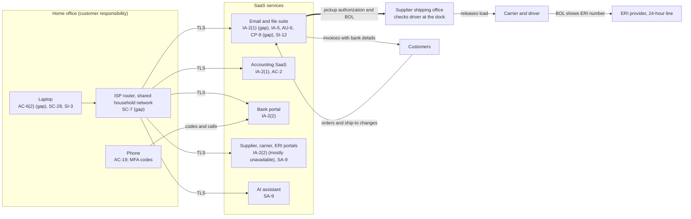

# SaaS Architecture and Control Placement: Cris Santos Company | Chemical | Sole Proprietorship

**Organization:** Cris Santos Company (specialty chemical distributor, broker) | **Tier:** Sole Proprietorship | **Provider:** SaaS only (no IaaS or PaaS)
**System:** Brokerage Core SaaS Stack (BCSS), as defined in the system profile (P02) | **Mapped:** 2026-09-09, adopted 2026-10-05

## 1. Diagram
Control IDs on each node are the ones in `cloud-control-map.csv`. The thick path is the one an attacker needs to divert a load: the email account to the supplier's shipping office.

## 2. Layers
| Layer | Components | Key controls | Responsibility |
|---|---|---|---|
| Identity | Email, accounting, bank, and portal accounts | IA-2(1), IA-2(2), IA-5, AC-2 | Customer configures; vendor provides MFA where offered |
| Data | Mail and files, workbook, BOL archive, driver data, accounting records | CP-9, SI-12, SC-28 | Provider protects its platform; customer decides retention, backup, and what goes into prompts |
| Endpoints | Laptop, phone | AC-6(2), SC-28, SI-3, AC-19 | Customer |
| Network | ISP router and household Wi-Fi | SC-7 | Customer (ISP supplies the router) |
| Logging | Email sign-in history and forwarding rules; bank alerts | AU-2 (provider), AU-6 (customer) | Shared: provider records, customer reviews |
| SaaS applications and hosting | All SaaS platforms, ERI provider service | Inherited (AU-2, SI-8, SC-28, PE family) | Provider |

## 3. Shared responsibility for SaaS
All three major cloud providers' shared responsibility models (SRC-AWS-SRM, SRC-AZURE-SRM, SRC-GCP-SRM) agree on the SaaS split: the provider runs the application, platform, and facilities; **the customer always keeps its identities, its data, and its devices.** That is why 14 of the 17 rows in the control map are the owner's alone, 2 are shared, and only 1 is the provider's. No IaaS equivalents table is needed, because the business runs no infrastructure.

One point is specific to this business: **SaaS shared responsibility stops at the supplier's dock.** No email or portal vendor can confirm that a pickup authorization is genuine. Only a business process can: the owner's call-back to a known number and the supplier's check of the driver against the pickup number (HSP-01 sections 4.2 and 4.3).

## 4. Findings from the mapping
1. **The account that can release hazmat has the weakest login.** Email is password-only, and the password is reused on a carrier portal (P01 R-001, R-002). The accounting SaaS, which can only bill, has MFA.
2. **No copy of the records the HMR requires.** BOL copies (two years, 172.201(e)) and registration records (three years, 107.620(a)) exist only inside the email and file suite. Provider resilience does not protect against account takeover or deletion (R-007).
3. **The ERI provider is a SaaS dependency with a data feed.** It can meet 172.604 only for products the owner has registered. Ferric chloride was missing until 2026-09-14 (R-006).
4. **Most partner portals offer no MFA.** Unique passwords are the only control, so they must not hold payment authority or pickup release authority without a phone confirmation.
5. **The AI assistant's data settings were never checked.** This mapping flagged them on 2026-09-09; the P10 assessment found the model-improvement setting on and the owner turned it off on 2026-09-18 (R-012).
