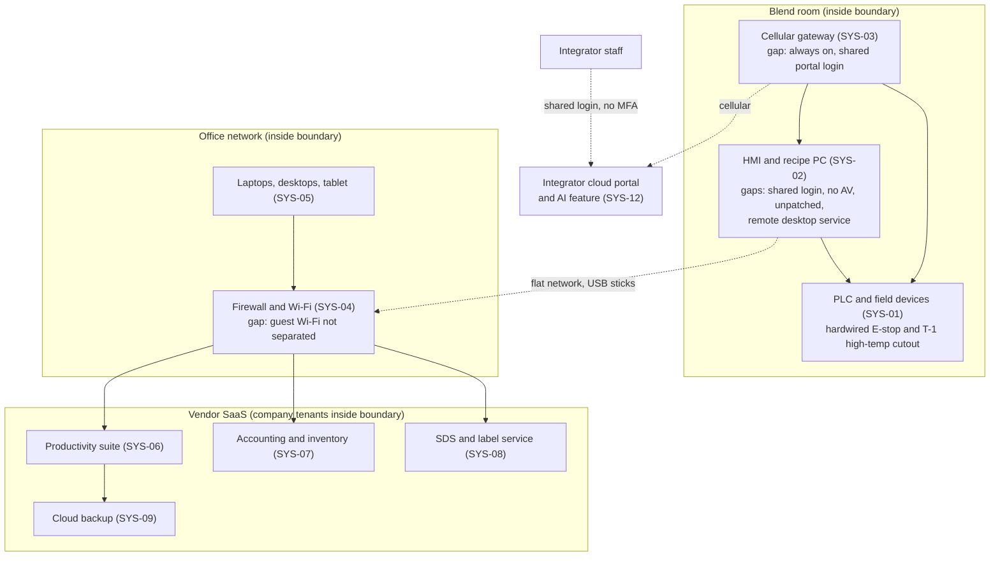

# System Security Plan: Blending and Business Platform (BBP)

**Organization:** Cris Santos Company, LLC (specialty chemical maker) | **Tier:** Micro | **Vertical:** Chemical
**Outline:** NIST SP 800-18 Rev. 2, System Security Plan Outline Example (June 2026), with OT guidance from NIST SP 800-82 Rev. 3 | **Version:** 1.0, 2026-08-31

## 1. System Name and Identifier
Blending and Business Platform (**BBP**), identifier CSC-SYS-001.

## 2. System Overview
The BBP supports every function of the company's single Florida unit: batch blending in two mix tanks, packaging and labeling, order entry and invoicing, hazmat shipping, quality control, and formulation and SDS management. It serves 7 employees and about 140 business customers (P05).

The company owns very little infrastructure. A managed service provider (MSP) runs the office network, computers, and backup. A control system integrator supports the batch control system remotely. Most business functions run in vendor SaaS. This plan therefore says, for each control, what the company does itself, what the MSP or integrator does for it, and what it inherits from a SaaS vendor.

**Major components:**
- **SYS-01:** batch control PLC and field devices for T-1 (1,000 gal, heated) and T-2 (500 gal): load cells, 4 dosing pumps fed from connected totes (including 35% hydrogen peroxide and 50% sodium hydroxide), mixers, valves, and the hot-water skid. A hardwired emergency stop and a T-1 high-temperature switch act independently of the PLC
- **SYS-02:** HMI and recipe PC (85 recipes and batch records)
- **SYS-03:** the integrator's cellular remote access gateway and the company's settings in the integrator's cloud portal
- **SYS-04:** office network: firewall, office Wi-Fi, guest Wi-Fi (MSP-managed)
- **SYS-05:** 4 laptops, 2 desktops, 1 warehouse tablet (MSP-managed)
- **SYS-06:** productivity suite (email and the shared drive, including the formulations folder)
- **SYS-07:** cloud accounting and inventory service (orders, lots, invoices, bills of lading)
- **SYS-08:** SDS and label authoring service
- **SYS-09:** cloud backup of the productivity suite (operated by the MSP)

## 3. Laws, Regulations, and Policies Affecting the System
| ID | Requirement | Citation | How it applies |
|---|---|---|---|
| C-CHEMICAL-R01 | CFATS RBPS 8 (Cyber) | 6 CFR 27.230(a)(8) | **Voluntary benchmark.** CFATS statutory authority terminated in July 2023 and has not been reauthorized (checked 2026-10-05). The company was screened in 2009 and never tiered, so RBPS did not bind it even before the lapse. It is used as the benchmark in P03 |
| (none) | DOT Hazardous Materials Regulations, offeror duties | 49 CFR 107.601(a)(6); 172.201(e); 172.604; 172.704 | **Binding.** Shipping papers are produced in SYS-07 and kept 2 years; the emergency response number depends on the ERI provider holding current SDSs from SYS-08; hazmat employee training includes security awareness |
| (none) | CERCLA and EPCRA release reporting | 40 CFR 302.6; 40 CFR 355.30-355.43 | **Binding.** Sodium hypochlorite RQ 100 lb; sodium hydroxide 1,000 lb; phosphoric acid 5,000 lb (40 CFR 302.4). The call list must work when the office network is down |
| (none) | OT benchmark | NIST CSF 2.0 with NIST SP 800-82 Rev. 3 | **Voluntary.** Tailoring in section 6 follows SP 800-82 Rev. 3 |
| C-CHEMICAL-R03 | CIRCIA (proposed 6 CFR Part 226) | 89 FR 23644 (2024-04-04) | **Not in effect.** Tracked only (P03) |
| State | Florida Information Protection Act (employee personal information) | Fla. Stat. 501.171 | Applies to the 7 employees' data in SYS-06 and the payroll service |
| Internal | Security policies POL-02, POL-03, POL-04 | P06 | All apply to the BBP, including the batch control system |

Not applicable:
- **C-CHEMICAL-R02**, the USCG MTSA cybersecurity rule (33 CFR Part 101 Subpart F), applies only to facilities required to have a security plan under 33 CFR Part 105 (101.605(a)). The site has no marine transfer.
- **EPA RMP** (40 CFR Part 68) and **OSHA PSM** (29 CFR 1910.119): no chemical is held above a threshold quantity or at a listed concentration (`../00_company-facts.md`, threshold math).
- **DOT transportation security plan** (49 CFR 172.800): no shipment is a large bulk quantity or an any-quantity material.

## 4. System Status
### 4.1 System Security Plan Approval
Approved by the Owner and President on 2026-08-31.

### 4.2 System Authorization Decision
The company is not a federal agency, so there is no formal authorization. The equivalent internal decision: on 2026-08-31 the Owner accepted continued operation of the BBP on two **conditions** that take effect 2026-09-01:
- The integrator's cellular gateway stays powered off except during a session the Operations Manager opens and watches, until named portal accounts with MFA are in place (POAM-001, due 2026-10-31).
- No recipe or alarm limit change is made without the Owner's written approval on the batch ticket, until named HMI logins and the change log are in place (POAM-009).

The three High risks in P01 (R-001, R-002, R-005) must be treated by 2026-12-31.

### 4.3 System Operational Status
Operational. Planned changes: a separate network segment for the HMI PC (R-002), an offline backup of the PLC program, HMI project, and recipes with a restore test (R-005), and replacement of the HMI PC with a supported model at the 2027 year-end shutdown.

## 5. Role Identification and Responsible Personnel
| Role | Title | Responsibility |
|---|---|---|
| System owner and risk acceptor | Owner and President | Overall accountability; accepts Moderate and higher risk; approves this plan, policies, and spending |
| Security Coordinator | Office Manager | Day-to-day security: accounts, MSP liaison, vendor files, training records, incident log; maintains this plan and the risk register |
| Batch control system owner | Operations Manager | PLC, HMI, gateway, and recipes; opens and watches integrator sessions; process safety and hazmat shipping |
| IT operations | MSP | Office network, computers, patching, antivirus, backup (contract) |
| OT support | Control system integrator | PLC program, HMI project, remote support (service agreement) |
| Independent assessor | OT-experienced security consultant | Yearly control assessment (P07) |

**Role overlap.** The Office Manager runs and checks account controls, and the Operations Manager changes recipes and runs the batches. The Owner's monthly review of the account list and recipe change log, the MSP's monthly report, and the independent assessment are the compensating checks (`../00_company-facts.md` section 2).

## 6. System Information Types and System Categorization
NIST SP 800-60 Vol. 2 Rev. 1 has no information type for industrial process control. The process control type below is organization-defined and was rated against the FIPS 199 impact definitions, following SP 800-82 Rev. 3 (sec. 4.3.2, Categorize). The other types were selected from SP 800-60.

| Information type | Confidentiality | Integrity | Availability | Rationale |
|---|---|---|---|---|
| Process control and recipes (setpoints, alarm limits, PLC logic, 85 recipes) | Moderate | Moderate | Moderate | Recipes are trade secrets. An altered dose or alarm limit could cause an exothermic reaction or chemical burns in the blend room (see below). Loss stops blending, but finished goods cover about 3 days (P05 BP-01 MTD 48 h) |
| Inventory control and shipping records (orders, lots, bills of lading) | Low | Moderate | Moderate | Wrong hazmat descriptions on shipping papers harm responders and break DOT rules; shipping stops without them (P05 BP-04 MTD 24 h) |
| Human resources management (employee data) | Moderate | Low | Low | Payroll and HR files for 7 employees |
| **BBP category (high-water mark)** | **Moderate** | **Moderate** | **Moderate** | |

**Why process control integrity is Moderate, not High.** FIPS 199 rates integrity High when a loss could have a severe or catastrophic effect, such as loss of life or serious life-threatening injury. The consultant, integrator, and Operations Manager worked through the worst credible manipulated batch on 2026-07-15. Its outcome is limited by the plant's inherent design, not by any control that an attacker could switch off:
- only one 275-gal tote of 35% hydrogen peroxide is connected at a time, through a small dosing pump;
- both tanks have open atmospheric vents;
- the blend room has two direct exits to the outside;
- no chemical is held above an RMP threshold, and the nearest public receptor is across a 4-lane road.

The judgment is serious injury to people in the blend room, not loss of life or harm beyond the site. This is a judgment, and it is recorded so it can be challenged. **Re-categorize as High** if the company connects more than one peroxide tote, buys peroxide at 52% or higher, adds heated blending of flammable products, or a future review finds a credible life-threatening scenario.

**Baseline:** the NIST SP 800-53B Moderate baseline, tailored for a 7-person company with OT per SP 800-82 Rev. 3 (sec. 4.3.3, Select). The plan documents **44 controls** in `control-implementation.csv`: the controls that carry the plant's main risks, the RBPS 8 benchmark, and basic cyber hygiene. Tailoring decisions:
- **Safety over lockout.** AC-7 and AC-11 are tailored on the HMI so an operator is never locked out during a batch. The staffed blend room with keypad entry is the compensating control.
- **Fail safe without the PLC.** The hardwired emergency stop and high-temperature cutout are outside the PLC on purpose. They are not counted as cyber controls, but they bound the consequence.
- **Inherited or tailored out.** Other Moderate-baseline controls are inherited from the SaaS vendors (physical, platform, and application controls), with the accounting vendor's SOC 2 report as the main evidence (P09), or tailored out because they assume dedicated IT staff or federal program management.

## 7. Authorization Boundary Description
**Inside the boundary:**
- the PLC, field devices, HMI and recipe PC, and the cellular gateway (SYS-01 to SYS-03), including the company's account and settings in the integrator's portal;
- the office network, 7 endpoints, and the 4 SaaS services with their company tenants and settings (SYS-04 to SYS-08);
- the company's cloud backup subscription (SYS-09).

**Outside, interconnected:** the integrator's own network and portal platform, the MSP's remote management platform, the payroll service (SYS-10), the building alarm and video service (SYS-11), the AI batch-optimization feature (SYS-12, assessed in P10), the ERI provider, and the LTL carriers.

Dotted lines are the unmanaged paths found in 2026 (gaps 1, 2, 13, and 15 in `../00_company-facts.md`). **Target design (2026-12-31):** the HMI PC on its own firewall segment with only printing allowed to the office; the gateway powered on only for approved sessions with named MFA accounts; recipe files moved through one scanned USB stick until an approved file path exists.

## 8. Information Exchanges Summary
| Connected system or party | Direction | Data | Agreement |
|---|---|---|---|
| Integrator cloud portal (through SYS-03) | Bidirectional | Process data, remote sessions, AI recommendations | Service agreement with **no security terms** (gap, SA-9) |
| ERI provider | Outbound | Current SDSs for shipped products | ERI contract; SDS updates sent by email (gap: no confirmation of receipt) |
| LTL carriers | Outbound | Shipping papers with hazmat descriptions and the ERI number | Carrier terms |
| Private-label distributor | Bidirectional | Formulation summaries, certificates, questionnaire answers | Supply agreement; **open shared link** to the formulations folder (gap, AC-3) |
| MSP remote management platform | Inbound administrative access | Office computer management | MSP contract (no security terms) |
| Payroll service (SYS-10) | Outbound | Hours and pay data | Vendor terms |

## 9. System Component Inventory
| Component | Type | Location or provider | Owner |
|---|---|---|---|
| PLC, load cells, dosing pumps, mixers, hot-water skid (SYS-01) | OT controller and field devices | Blend room control panel | Operations Manager |
| HMI and recipe PC (SYS-02) | OT workstation | Blend room | Operations Manager |
| Cellular gateway and portal settings (SYS-03) | Remote access device and SaaS account | Control panel; integrator portal | Operations Manager (integrator operates) |
| Firewall, office Wi-Fi, guest Wi-Fi (SYS-04) | Network | Office closet | Office Manager (MSP operates) |
| 4 laptops, 2 desktops, 1 tablet (SYS-05) | Endpoint | Office, QC bench, warehouse | Office Manager (MSP operates) |
| Productivity suite tenant (SYS-06) | SaaS | Productivity suite vendor | Office Manager |
| Accounting and inventory tenant (SYS-07) | SaaS | Accounting vendor | Office Manager |
| SDS and label service account (SYS-08) | SaaS | SDS service vendor | Owner and President |
| Cloud backup subscription (SYS-09) | SaaS | Backup vendor (MSP resells) | Office Manager (MSP operates) |

The full inventory with versions, serial numbers, and firmware is due 2026-10-31 (CM-8).

## 10. Control Implementation Details
### 10.1 Control implementation status
See `control-implementation.csv`. Summary of 44 controls:
- Implemented: 6
- Partially implemented: 22
- Planned: 16
- Not applicable: 0

By responsibility: 22 system-specific (the company), 21 hybrid (the company with the MSP, the integrator, or a SaaS vendor), 1 common/inherited (fully provided by the MSP).

### 10.2 Inherited, MSP-provided, and integrator-provided controls
| Provider | What the company relies on | Evidence | What the company must still do |
|---|---|---|---|
| Accounting and inventory vendor | Platform security, encryption, backups (CP-9), lockout (AC-7), audit logs (AU-2) | SOC 2 Type 2 report reviewed 2026-08-19 (P09) | Complementary user entity controls: user provisioning and removal, MFA for all users, review of user access |
| Productivity suite vendor | Platform security, encryption at rest and in transit, lockout (AC-7), audit logging (AU-2) | Vendor documentation | Account management, sharing settings, log review |
| SDS and label service vendor | Hosting, backups, encryption (SC-28) | Vendor documentation only | Account management; send SDS updates to the ERI provider |
| MSP | Patching (SI-2), antivirus (SI-3), firewall and Wi-Fi (SC-7, AC-18), laptop encryption (SC-28), backup operation (CP-9), device lock (AC-11) | Monthly MSP report; P07 evidence requests | Oversight: approve exceptions, review reports monthly, add security terms at renewal (P01 R-016) |
| Control system integrator | PLC program and HMI project custody, remote support (MA-4), advisories for the PLC and gateway (RA-5, planned) | None today | Approve and watch every session (AC-17); require named accounts with MFA, current backups, and notice of security incidents in the agreement (P01 R-007) |

**Inherited does not mean done.** The accounting vendor's SOC 2 report assumes the customer enforces MFA and removes departed users. Both were open gaps at the company during fieldwork (IA-2(1), PS-4).

### 10.3 Control assessment status
Assessed 2026-08-10 to 2026-08-12 by an independent consultant. See P07 `assessment-results.csv` and `poam.csv`.

## 11. Digital Identity Acceptance Statement
Workforce users sign in to the productivity suite with a password and a phone authenticator app. MFA is being extended to the accounting service for all users, the integrator portal, the firewall management login, and the backup console (P07 POAM-002). The HMI uses local logins; named logins replace the shared operator login by 2026-11-30, and the HMI is reachable only from the blend room and approved integrator sessions. This is appropriate for a Moderate system once the planned changes are in place.

## 12. Referenced Artifacts
Scenario facts (`../00_company-facts.md`), BIA (P05), cloud control map (P04), risk register (P01), gap analysis (P03), policies (P06), assessment and POA&M (P07), incident response runbook (P08), SOC 2 readiness and accounting vendor report review (P09), AI assessment (P10).

## 13. Acronym List and Glossary
- **BBP:** Blending and Business Platform
- **ERI provider:** emergency response information provider (49 CFR 172.604(b)(2))
- **HMI:** human-machine interface
- **LTL:** less-than-truckload carrier
- **MFA:** multi-factor authentication
- **MSP:** managed service provider
- **PLC:** programmable logic controller
- **POA&M:** plan of action and milestones
- **RQ:** reportable quantity (40 CFR 302.4)
- **SDS:** safety data sheet

## 14. System Security Plan Review and Change Records
| Version | Date | Change | Author |
|---|---|---|---|
| 1.0 | 2026-08-31 | Initial plan | Office Manager (Security Coordinator) with the Operations Manager |
