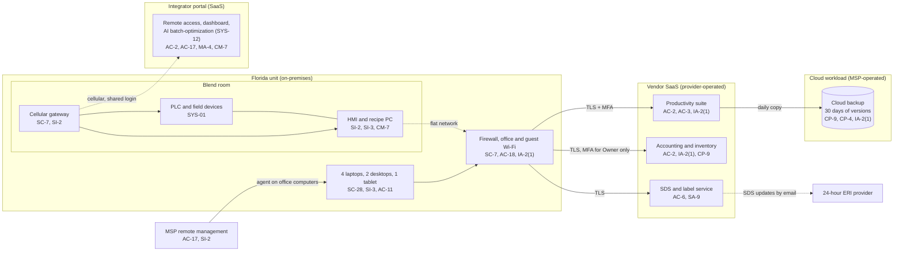

# Cloud Architecture and Control Placement: Cris Santos Company | Chemical | Micro

**Organization:** Cris Santos Company, LLC (specialty chemical maker) | **Tier:** Micro | **Provider:** Vendor-agnostic SaaS (see section 3)
**System:** Blending and Business Platform (BBP), as defined in the SSP (P02) | **Prepared:** 2026-07-24 by the Office Manager with the MSP lead technician and the control system integrator | **Approved:** Owner and President, 2026-08-31

## 1. Diagram
The company runs no servers and no IaaS tenant. Its cloud is four SaaS services, one cloud workload that the MSP operates for it (the cloud backup, SYS-09), and one SaaS portal that reaches into the plant: the control system integrator's remote access and monitoring portal (SYS-03). That last one is the reason this mapping matters more here than in an office business. It is the only cloud service with a path to equipment that doses hydrogen peroxide.

## 2. Layers and who is responsible
| Layer | Components | Key controls | Customer (company) | MSP or integrator (on the company's behalf) | Provider (SaaS vendor) |
|---|---|---|---|---|---|
| Identity | Suite, accounting, SDS, portal, and backup accounts; firewall login; HMI logins | AC-2, IA-2(1), IA-5 | Decides who gets access; enforces MFA settings; removes leavers | MSP creates suite and device accounts and holds the backup and firewall logins; integrator holds portal access | Runs the sign-in and MFA service |
| Network | Firewall, Wi-Fi, cellular gateway | SC-7, AC-18 | Approves changes and every gateway session | MSP configures the firewall and Wi-Fi; integrator owns the gateway | Not applicable |
| Endpoints and OT | Office computers, HMI PC, PLC | SC-28, SI-2, SI-3, CM-7 | Keeps the inventory; decides HMI hardening with the integrator | MSP patches office computers; integrator supports the HMI and PLC | Not applicable |
| SaaS applications | Suite, accounting, SDS service, portal | AC-3, AC-6, AU-2, CM-7 | Users, roles, sharing, the AI write-back setting | Integrator configures the portal | Application, platform, data centers |
| Data | Formulations, recipes, shipping papers, SDSs, backup copies | CP-9, CP-4, SC-28 | Decides retention and restore tests; keeps recipe exports | MSP operates the backup | Encrypts and backs up its own platform |
| Logging | Suite, accounting, and portal logs; HMI audit trail | AU-2, AU-6 | **Reviews logs monthly (gap today)**; turns on the HMI audit trail | Integrator enables the HMI audit trail | Generates and stores SaaS logs |
| Vendor governance | Contracts, SOC 2 review, ERI provider | SA-9 | Adds security terms; reviews SOC 2 reports | Not applicable | Provides SOC 2 reports and terms |

**Neither the MSP nor the integrator is a cloud provider in the shared responsibility sense.** Both perform customer-side duties for the company. Anything marked "Customer (performed by MSP)" or "Customer (performed by integrator)" in `cloud-control-map.csv` remains the company's responsibility. The company must direct the work, receive evidence, and check it (SA-9).

**The MSP contract does not cover the batch control system.** The MSP treats the HMI PC as the integrator's machine, and the integrator treats it as the customer's. Nobody patches it or runs antivirus on it. Fixing this gap means naming one owner for each HMI control in both contracts (P01 R-016 and R-007).

## 3. Service categories and provider equivalents
The design is vendor-agnostic. The SaaS split is the same in all three major cloud providers' models: the provider runs the application, platform, and infrastructure, and the customer keeps identities, access, data, and devices (SRC-AWS-SRM, SRC-AZURE-SRM, SRC-GCP-SRM in `00_universal-framework/sources/source-register.csv`). For the company's vendors, a SOC 2 report or the vendor's security documentation is the evidence of the provider side.

| Service category used | What it is here | Equivalent category in the large cloud providers (for reading their documentation) |
|---|---|---|
| Productivity suite | Email, calendar, file storage | Productivity and collaboration SaaS |
| Line-of-business SaaS | Accounting and inventory; SDS and label authoring | Industry SaaS built on any provider |
| SaaS-to-SaaS backup | Daily copy of the productivity suite | Backup service or third-party SaaS backup |
| Industrial remote access and monitoring portal | Integrator's portal with a cellular gateway, dashboard, and AI feature | IoT and OT remote access services (device gateway plus cloud portal) |
| Remote monitoring and management | MSP device management | Device management SaaS |

## 4. Findings from the mapping
1. **The integrator portal is the riskiest cloud service (AC-2, IA-2(1), AC-17).** One shared login without MFA can open a session to the PLC and HMI at any time over a cellular path that the office firewall never sees. The portal supports MFA and named accounts; neither is used. Fix: named accounts with MFA by 2026-10-31, and the gateway powered off except for approved sessions from 2026-09-01. Tracked as P01 R-001 and P07 POAM-001 and POAM-002.
2. **The AI feature has a write path behind the same login (CM-7).** Write-back is off, but any portal user can switch it on. Fix: lock the setting so only a named company administrator can change it, as a condition of the P10 decision.
3. **Sync is not backup, and the plant is not backed up at all (CP-9, CP-4).** The cloud backup copies the suite with 30 days of versions and has never been restored. The HMI project, PLC program, and recipes are not in it. Fix: add a weekly recipe and HMI export, keep 90 days of immutable versions, and run the first restore test by 2026-09-30 (R-005, R-018; POAM-004 and POAM-005).
4. **MSP-held administrator logins have no MFA (IA-2(1)).** The backup console and the firewall management login use passwords only. Fix: MFA on both by 2026-09-30 (POAM-002).
5. **The ERI path is a manual email (SA-9).** The DOT emergency number only works if the ERI provider holds current SDS information before product ships (49 CFR 172.604(b)(2)). Today SDS updates go by email with no confirmation. Fix: the ERI provider confirms receipt of each update, and the QC Technician checks the provider's list each quarter (R-012).
