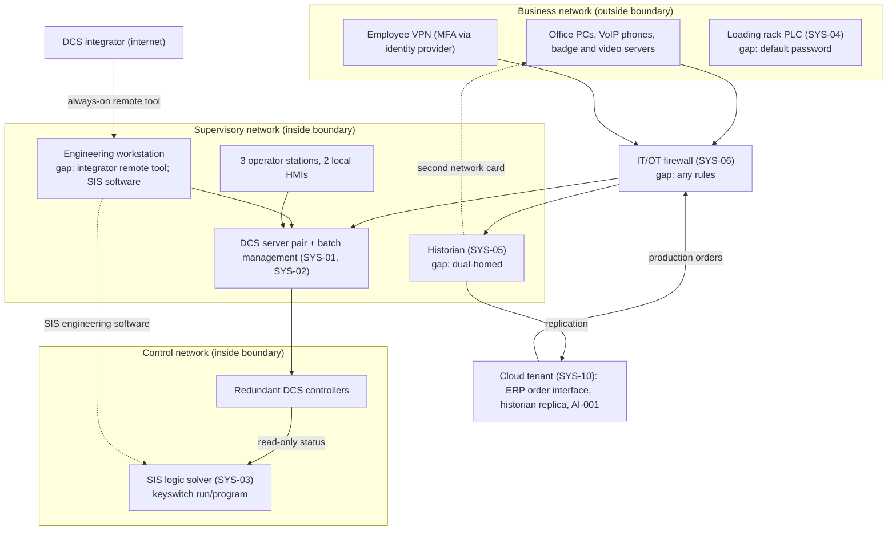

# System Security Plan: Process Control and Batch Management System (PCBMS)

**Organization:** Cris Santos Company, LLC (specialty chemical formulator and packager) | **Tier:** Small | **Vertical:** Chemical
**Outline:** NIST SP 800-18 Rev. 2, System Security Plan Outline Example (June 2026), with OT guidance from NIST SP 800-82 Rev. 3 | **Version:** 1.0, 2026-09-04

## 1. System Name and Identifier
Process Control and Batch Management System (**PCBMS**), identifier CSC-SYS-OT-001.

## 2. System Overview
The PCBMS runs the bulk tank farm, the aqueous ammonia process, and the eight jacketed blend tanks in Blend Hall A at the company's Florida plant. It executes about 35 batches a day from about 420 master recipes and holds the safety functions that keep the ammonia and hydrogen peroxide tanks in a safe state. Blend Hall A produces about 80% of plant volume (P05 BP-01).

**Users:** 64 blend operators and 3 Shift Supervisors (HMIs), the Controls Engineer and 2 instrument and electrical (I&E) technicians (engineering and maintenance), the Process Engineer (recipes), and the contracted DCS integrator (remote and on-site support).

**Major components:**
- **SYS-01:** distributed control system (DCS): redundant controllers, a redundant server pair, 3 operator stations, and 1 engineering workstation (EWS)
- **SYS-02:** batch management system on the DCS server pair (master recipes and batch execution)
- **SYS-03:** safety instrumented system (SIS) with its own logic solver: ammonia tank high-level and high-pressure trips, the remote isolation valve, ammonia gas detection, and the hydrogen peroxide tank high-temperature trip
- **SYS-05:** process historian (dual-homed today; see section 7)
- **SYS-06:** OT network (control and supervisory networks) and the IT/OT firewall
- **SYS-07:** remote access paths into OT (employee VPN; the integrator's remote desktop tool)
- **SYS-13 (OT part):** 16 OT workstations

**Why this system is High for integrity.** A changed setpoint, alarm limit, or recipe can overfill the ammonia tank, mix incompatible chemicals, or release ammonia. The aqueous ammonia process is covered by the EPA Risk Management Program (Program 2), and its worst-case release reaches public receptors (`../00_company-facts.md` section 1).

## 3. Laws, Regulations, and Policies Affecting the System
| ID | Requirement | Citation | How it applies |
|---|---|---|---|
| C-CHEMICAL-R01 | CFATS RBPS 8 (Cyber) | 6 CFR 27.230(a)(8) | **Voluntary benchmark.** CFATS statutory authority expired on July 28, 2023, and has not been reauthorized as of 2026-09-26; CISA states it cannot enforce CFATS. The plant keeps its legacy measures and gaps against RBPS 8 (P03) |
| (none) | EPA Risk Management Program, Program 2 | 40 CFR Part 68 (68.48, 68.50, 68.52, 68.54, 68.56, 68.60, 68.90-68.96) | **Binding.** The PCBMS implements the safe operating limits, alarms, interlocks, and emergency shutdown the RMP relies on |
| (none) | CERCLA and EPCRA release reporting | 40 CFR 302.6; 40 CFR 355.40-355.43 | **Binding.** Ammonia RQ is 100 lb (40 CFR 302.4; also an EPCRA extremely hazardous substance) |
| (none) | OT benchmark | NIST CSF 2.0 with NIST SP 800-82 Rev. 3 | **Voluntary.** The control baseline in section 6 follows SP 800-82 Rev. 3 tailoring guidance |
| C-CHEMICAL-R03 | CIRCIA (proposed 6 CFR Part 226) | 89 FR 23644 (2024-04-04) | **Not in effect.** Tracked only (P03) |
| Internal | Security policies POL-01 to POL-05 | P06 | All apply to OT |

Not applicable:
- **C-CHEMICAL-R02**, the USCG MTSA cybersecurity rule (33 CFR Part 101 Subpart F), applies only to facilities required to have a security plan under 33 CFR Part 105 (101.605(a)). The plant has no marine transfer.
- **OSHA PSM** (29 CFR 1910.119): no chemical at the plant is at a listed concentration and threshold (`../00_company-facts.md`, threshold math).

## 4. System Status
### 4.1 System Security Plan Approval
Approved by the VP Operations (system security executive) and the Plant Manager (system owner) on 2026-09-04.
### 4.2 System Authorization Decision
The company is not a federal agency, so there is no formal authorization. The equivalent internal decision:
- The VP Operations accepted continued operation of the PCBMS on 2026-09-04, subject to the P07 POA&M.
- The CEO approved the treatment plans for the four High risks in P01 (R-001, R-002, R-006, R-007) on 2026-09-04. The Plant Manager, as the RMP qualified person, confirmed that the interim measures are adequate for the toxic release scenario.
- **Conditions:** the SIS keyswitch is checked in run each shift, and the integrator's remote tool stays disabled except during a call-in session supervised by the Controls Engineer, until the remote access gateway is live (POAM-001, due 2026-11-30).
### 4.3 System Operational Status
Operational. Major modifications planned: the OT DMZ and firewall redesign (due 2027-01-31) and the DCS upgrade at the 2027 turnaround, which will be handled as an RMP major change.

## 5. Role Identification and Responsible Personnel
| Role | Title | Responsibility |
|---|---|---|
| System owner | Plant Manager | Overall accountability; RMP qualified person (40 CFR 68.15(b)) |
| Risk acceptor (authorizing official equivalent) | VP Operations (Moderate); CEO (High and Very High) | Accept residual risk per POL-01 |
| Security officer (IT and OT) | IT Manager | Day-to-day security program, remote access, firewall, monitoring |
| OT implementation lead | Controls Engineer | DCS, SIS, and OT network configuration; approves control system changes |
| Process safety lead | EHS Manager | RMP compliance, release reporting, physical security |
| Recipe owner | Process Engineer | Master recipes; MOC coordinator |
| External support | DCS integrator (contracted) | Remote and on-site support under supervision |

## 6. System Information Types and System Categorization
NIST SP 800-60 Vol. 2 Rev. 1 has no information type for industrial process control. These organization-defined types were rated against the FIPS 199 impact definitions, following SP 800-82 Rev. 3 (sec. 4.3.2, Categorize).

| Information type | Confidentiality | Integrity | Availability | Rationale |
|---|---|---|---|---|
| Process control and safety logic (setpoints, alarm limits, interlocks, SIS logic) | Low | **High** | Moderate | Unauthorized change could cause a toxic release that reaches the public (catastrophic). Loss of the DCS is serious but the independent SIS holds the tanks safe (P05 BP-01 MTD 24 h) |
| Master recipes and formulations | Moderate | **High** | Moderate | Trade secrets; an altered recipe can create an incompatible mixture; recipes are needed to restart (P05 BP-04 MTD 48 h) |
| Process history (historian data) | Low | Moderate | Low | Used for reports and AI-001; not needed to run the process |
| Safety instrumented functions (runtime) | Low | **High** | **High** | Loss of the SIS removes the last automated safeguard; the tanks must be isolated within one shift (P05 BP-02 MTD 8 h) |
| **PCBMS category (high-water mark)** | **Moderate** | **High** | **High** | |

**Baseline:** the NIST SP 800-53B High baseline, tailored for a 162-person plant with OT per SP 800-82 Rev. 3 (sec. 4.3.3, Select). The plan documents **68 controls** in `control-implementation.csv`: the controls that address the plant's OT risks, the RBPS 8 benchmark, and the RMP elements the PCBMS supports. Tailoring decisions:
- **Safety over lockout.** AC-7 and AC-11 are tailored on operator HMIs so an operator is never locked out during an upset. The staffed, badge-controlled control room is the compensating control.
- **Fail safe.** SC-24 is met by the SIS design.
- **Not documented at this tier.** Other High-baseline controls are either inherited from the cloud and SaaS providers for the interfaces in section 8 (P04, P09) or recorded as out of scope because they apply only to federal systems (for example, PM-series controls beyond PM-2 and PM-9).

## 7. Authorization Boundary Description
**Inside the boundary:**
- the DCS (SYS-01) and batch management system (SYS-02)
- the SIS (SYS-03)
- the historian (SYS-05)
- the control and supervisory networks and the IT/OT firewall (SYS-06)
- the remote access paths into OT (SYS-07)
- the 16 OT workstations (SYS-13)

**Outside, interconnected:**
- the ERP order interface and the historian replica in the cloud tenant (SYS-10)
- the loading rack and packaging PLCs (SYS-04)
- the identity provider (SYS-11), for VPN authentication only
- the DCS integrator's own network
- the business network

Dotted lines are the unmanaged paths found in 2026 (gaps 2, 3, and 15). **Target design (2027-01-31):** an OT DMZ between the firewall and the supervisory network holds the remote access gateway, a historian replica, and the order interface relay. No direct business-to-control traffic. The historian's second network card is removed.

**Connection register (summary).** This register was built during fieldwork; the full version with ports and owners is due 2026-11-30 (CA-9).

| Connection | From | To | Status |
|---|---|---|---|
| C-1 | Business network (employee VPN users) | DCS servers | Allowed; too broad |
| C-2 | Historian | Business network (second network card) | **To be removed** |
| C-3 | DCS integrator (internet) | EWS (remote desktop tool) | **To be replaced by the gateway** |
| C-4 | Cloud order interface | Batch management system (order import) | Allowed; needs a relay in the DMZ |
| C-5 | Historian | Cloud historian replica | Allowed; to become one-way |
| C-6 | DCS controllers | SIS | Read-only status; keep |
| C-7 | EWS | SIS (engineering software) | **To be removed** |

## 8. Information Exchanges Summary
| Connected system / party | Direction | Data | Agreement |
|---|---|---|---|
| ERP order interface (SYS-08 through SYS-10) | Inbound to the batch management system | Production orders, batch sizes | None (gap, CA-3) |
| Historian replica (SYS-10) | Outbound | Process data for reports and AI-001 | Internal; one-way design planned |
| AI-001 process-optimization model (SYS-16) | Outbound data; recommendations shown on a control room dashboard | Advisory setpoint suggestions | Internal (P10). **No write path to the DCS**; operators enter any accepted change by hand |
| DCS integrator | Bidirectional (remote session) | Configuration, logic, diagnostics | Service agreement with no security clauses (gap, SA-9) |
| DCS vendor | Inbound (media) | Software updates and patches | Support contract; no hash verification (gap, SR-11) |
| County fire rescue, LEPC, SERC, National Response Center | Outbound (phone) | Release notifications | Emergency action plan; RMP coordination (68.93) |

## 9. System Component Inventory
This is the starting inventory. A full inventory with firmware versions is due 2026-12-31 (CM-8).

| Component | Type | Location | Owner |
|---|---|---|---|
| DCS controllers (redundant pair) | Controller | Blend Hall A control cabinet | Controls Engineer |
| DCS server pair with batch management | Server | Control room server rack | Controls Engineer |
| Operator stations (3) | OT workstation | Control room | Controls Engineer |
| Engineering workstation (1) | OT workstation | Engineering office (to move to the control room) | Controls Engineer |
| Blend Hall A local HMIs (2) | OT workstation | Blend Hall A | Controls Engineer |
| Packaging line HMIs (4) and loading rack HMI (1) | OT workstation | Packaging hall; rack | Controls Engineer |
| Historian client PCs (5) | OT workstation | Lab, maintenance, engineering, shift office, Plant Manager | IT Manager |
| SIS logic solver, gas detectors, isolation valve | Safety system | Tank farm and control room | Controls Engineer |
| Process historian | Server (dual-homed) | Server room | IT Manager |
| IT/OT firewall | Network | Server room | IT Manager |
| Control and supervisory network switches (6) | Network | Control room, Blend Hall A, tank farm | Controls Engineer |
| UPS units for the DCS, SIS, and control room | Power | Control room | Controls Engineer |

## 10. Control Implementation Details
### 10.1 Control implementation status
See `control-implementation.csv`. Summary of 68 controls:
- Implemented: 13
- Partially implemented: 34
- Planned: 21
- Not applicable: 0

### 10.2 Control assessment status
22 of these controls were assessed on 2026-08-10 to 2026-08-14 (OT testing 2026-08-12). See P07 `assessment-results.csv` and `poam.csv` (22 POA&M items).

## 11. Digital Identity Acceptance Statement
- **Remote access (employees and the integrator):** authenticator assurance level 2 (AAL2) in NIST SP 800-63B terms at minimum, through the identity provider, with phishing-resistant authenticators for any session that can change DCS or SIS configuration. Remote sessions also need per-session approval by the Shift Supervisor. Remote access is the most likely path to a toxic release scenario (P01 R-001), which is why the bar is higher than for office systems.
- **Local HMI access:** unique operator accounts with a password, or a badge tap where the DCS vendor supports it. MFA at the HMI is not required, because operators must act within seconds during an upset. Physical access to the badge-controlled, staffed control room is the second factor in practice.
- **Engineering access (EWS, SIS):** unique named accounts plus physical presence. The SIS also requires the keyswitch in program, under two-person verification.

## 12. Referenced Artifacts
- Scenario facts (`../00_company-facts.md`)
- Risk register (P01)
- Gap analysis (P03)
- Cloud control map (P04)
- BIA (P05)
- Policies (P06)
- Assessment and POA&M (P07)
- OT incident response runbook (P08)
- SOC 2 self-benchmark and ERP vendor review (P09)
- AI-001 assessment (P10)
- RMP safety information, hazard review (2024), and operating procedures (EHS Manager)

## 13. Acronym List and Glossary
- **CVI:** Chemical-terrorism Vulnerability Information (legacy CFATS)
- **DCS:** distributed control system
- **DMZ:** demilitarized zone (a network zone between IT and OT)
- **EWS:** engineering workstation
- **HMI:** human-machine interface
- **I&E:** instrument and electrical
- **KEV:** CISA Known Exploited Vulnerabilities catalog
- **MOC:** management of change
- **OT:** operational technology
- **PCBMS:** Process Control and Batch Management System
- **RBPS:** risk-based performance standard (CFATS)
- **RMP:** EPA Risk Management Program (40 CFR Part 68)
- **SIS:** safety instrumented system

## 14. System Security Plan Review and Change Records
| Version | Date | Change | Author |
|---|---|---|---|
| 0.9 | 2026-08-21 | Draft after P07 testing (SIS keyswitch finding added) | IT Manager with the Controls Engineer |
| 1.0 | 2026-09-04 | Approved | IT Manager |

Next review: at the OT DMZ cutover (2027-01) and before the 2027 DCS upgrade, or annually by 2027-09-04.
